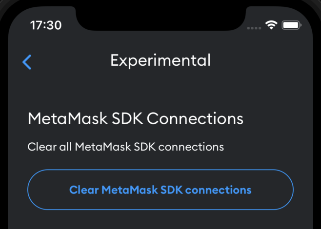

# MetaMask SDK

If you're developing a web application that users can access via a desktop or mobile browser, you
can [use MetaMask SDK](../how-to/use-sdk) to guide users to easily connect with MetaMask.

If the user is on a desktop browser and doesn't have the MetaMask extension installed, a popup
appears that prompts users to either install the MetaMask extension or to connect with MetaMask
Mobile via a QR code.

If on a mobile browser, the SDK automatically deeplinks into MetaMask Mobile (or prompt users to
install if they don't already have it) and once users accept the connection, they are
automatically redirected back to your web app.
This happens for all actions that need user approval.

## Connections

When connecting with MetaMask Mobile wallet, it's important to understand when connections get
paused, resumed and cleared.

#### Paused connections

Connections get paused after the MetaMask Mobile app is in background (minimized) for 20 seconds.
This is to accomodate OS restrictions, and it means that all traffic into MetaMask Mobile gets
paused and the SDK won't produce any response unless the MetaMask Mobile app is opened again.
The SDK automatically deeplinks into MetaMask Mobile so connections should be resumed automatically.
If MetaMask Mobile is in pause mode and the user completely closes the app, the connection is
maintained in paused mode until it's opened again.

For this reason, polling data from the wallet may not work for long periods of time.

#### Cleared connections

Connections get cleared if the dapp is closed or refreshed (in the case of a browser) as MetaMask
doesn't persist connections on the dapp side.
This is for simplicity and for security purposes.
We believe that creating a connection should be very easy so there's no need to persist, but this
may change in the future.

If the MetaMask Mobile app is completely closed without entering pause mode first, MetaMask infers
that the user isn't using the wallet and closes the connection.

#### Close connections manually

To close connections manually from the MetaMask Mobile app, go into **Settings > Experimental**.

## Communication layer

The security layer is handled using elliptic curve integrated encryption scheme (ECIES).
ECIES is a hybrid encryption scheme that combines the benefits of both symmetric and asymmetric encryption.
It's a secure method of exchanging encrypted messages between two parties.

In ECIES, the sender (for example, the dapp) generates a shared secret using the recipient's
(for example, MetaMask Mobile) public key and their own private key.
The shared secret is used to encrypt the message using a symmetric cipher (the SDK used `AES-256-GCM`).
The encrypted message is then combined with a message authentication code (`MAC`) and sent to the recipient.

MetaMask Mobile uses its private key and the dapp's public key to recreate the shared secret and
decrypt the message.
The MAC is used to verify the authenticity of the message.

One of the main benefits of ECIES is that it allows the sender and recipient to exchange messages
without having to exchange a shared secret beforehand.
It also provides security against eavesdropping and tampering, as the shared secret is derived from
the sender's and recipient's private keys, which are both kept secret.

