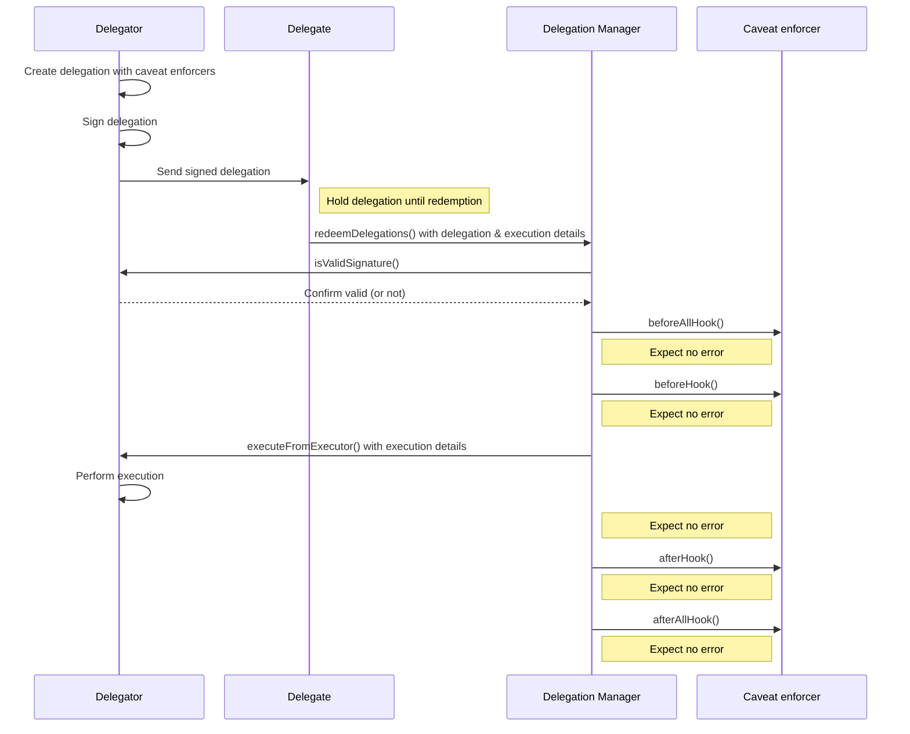

import Tabs from "@theme/Tabs"; 
import TabItem from "@theme/TabItem";

# Delegation

*Delegation* is the ability for a [MetaMask smart account](../smart-accounts.md) to grant permission to another smart account
or externally owned account (EOA) to perform specific executions on its behalf, under defined rules and restrictions.
The account that grants the permission is called the *delegator account*, while the account that receives the permission
is called the *delegate account*.

The MetaMask Delegation Toolkit follows the [ERC-7710](https://eips.ethereum.org/EIPS/eip-7710) standard for smart contract delegation.
In addition, users can use [caveat enforcers](caveat-enforcers.md) to apply rules and restrictions to delegations.
For example: Alice delegates the ability to spend her USDC to Bob, limiting the amount to 100 USDC.

## Delegation lifecycle

The delegation lifecycle is as follows:

1. **Delegation creation** - A delegation is initialized, and the delegator account signs it.

2. **Caveat enforcement** - The caveats applied to the delegation specify conditions under which
   the delegation can be redeemed.

3. **Delegation storage** - The delegation can be stored, enabling retrieval for future redemption.

4. **Delegation redemption** - The delegate (the account being granted the permission) redeems the delegation via the Delegation Manager,
   which verifies that the delegated authority is valid in order to perform the execution.

See [how to perform executions on a user's behalf](../../guides/delegation/execute-on-users-behalf.md) to get started with the delegation lifecycle.

## Delegation types

There are multiple types of delegations you can create:

- A **root delegation** is a delegation that doesn't derive its authority from another delegation.
  It is when a delegator delegates its own authority away, as opposed to a redelegation.
  Use [`createDelegation`](../../reference/api/delegation.md#createdelegation) to create a root delegation.

- An **open root delegation** is a root delegation that doesn't specify a delegate.
  This means that any account can redeem the delegation.
  You must create open root delegations carefully, to ensure that they are not misused.
  Use [`createOpenDelegation`](../../reference/api/delegation.md#createopendelegation) to create a root delegation.

- A delegate can **redelegate** permissions that have been granted to them, creating a chain of delegations across trusted parties.
  Use [`createDelegation`](../../reference/api/delegation.md#createdelegation) to create a redelegation.

- An **open redelegation** is a redelegation that doesn't specify a delegate.
  This means that any account can redeem the redelegation.
  As with open root delegations, you must create open redelegations carefully, to ensure that they are not misused.
  Use [`createOpenDelegation`](../../reference/api/delegation.md#createopendelegation) to create an open redelegation.

## Delegation Framework

The MetaMask Delegation Toolkit includes the Delegation Framework, which is a
[set of comprehensively audited smart contracts](https://github.com/MetaMask/delegation-framework) that
collectively handle delegator account creation, the delegation lifecycle,
and caveat enforcement.
It consists of the following components:

- **Delegator Core** - Delegator Core contains the logic for the ERC-4337 compliant delegator accounts.
  It defines the interface needed for the Delegation Manager to invoke executions on behalf of the accounts.

- **Delegator account implementations** - Delegator accounts are smart accounts, and there are [multiple smart account implementations](../smart-accounts.md#smart-account-implementation-types),
  with differing signature schemes used to manage the underlying account.

- **Delegation Manager** - The Delegation Manager validates delegations and triggers executions
  on behalf of the delegator, ensuring tasks are executed accurately and securely.

  When you redeem a delegation using [`redeemDelegations`](../../reference/api/delegation.md#redeemdelegations), the Delegation Manager performs the following steps.
  It processes a single step for all redemptions before proceeding to the next one:
  
  1. Validates the input data by ensuring the lengths of `delegations`, `modes`, and
     `executions` match.
	2. Decodes and validates the delegation, checking that the caller is the delegate
     and that there are no empty signatures.
	3. Verifies delegation signatures, ensuring validity using ECDSA (for EOAs) or
     `isValidSignature` (for contracts).
	4. Validates the delegation chain's authority and ensures delegations are not disabled.
	5. Executes the `beforeHook` for each [caveat](caveat-enforcers.md) in the delegation, passing relevant data (`terms`,
     `arguments`, `mode`, `execution` `calldata`, and `delegationHash`) to the caveat enforcer.
	6. Calls `executeFromExecutor` to perform the delegation's execution, either by the delegator or
     the caller for self-authorized executions.
	7. Executes the `afterHook` for each caveat, similar to the `beforeHook`, passing required data
     to enforce post-execution conditions.
	8. Emits `RedeemedDelegation` events for each delegation that was successfully redeemed.

- **Caveat enforcers** - [Caveat enforcers](caveat-enforcers.md) manage rules and restrictions for delegations,
  providing fine-tuned control over delegated executions.

## Delegation flow

This diagram illustrates how a delegation is created and subsequently redeemed on the Delegation Manager.
The Delegation Manager is responsible for validating the signature of the delegation and the caveat enforcers.
If everything is correct, it allows a delegate to execute an action on behalf of the delegator.

Learn more about the caveat enforcer hooks in the [Caveat enforcers](caveat-enforcers.md) section.

## Execution modes

When redeeming a delegation using [`redeemDelegations`](../../reference/api/delegation.md#redeemdelegations), you must pass an execution mode for each delegation chain you pass to the method.
The Delegation Toolkit supports several execution modes based on [ERC-7579](https://erc7579.com/): `SINGLE_DEFAULT_MODE`, `SINGLE_TRY_MODE`, `BATCH_DEFAULT_MODE`, and `BATCH_TRY_MODE`.

### `SINGLE` execution modes

In `SINGLE` execution modes, only a single delegation chain and a single execution can be provided. This mode processes delegations sequentially:

1. For each delegation in the chain, all caveats' `before` hooks are called.
2. The single redeemed action is executed.
3. For each delegation in the chain, all caveats' `after` hooks are called.

### `BATCH` execution modes

In `BATCH` execution modes, multiple delegation chains and multiple executions can be provided. This mode executes delegations in an interleaved way:

1. For each chain in the batch, and each delegation in the chain, all caveats' `before` hooks are called.
2. Each redeemed action is executed.
3. For each chain in the batch, and each delegation in the chain, all caveats' `after` hooks are called.

`BATCH` mode allows for powerful use cases, but the Delegation Framework currently does not include any `BATCH` compatible caveat enforcers.

### `DEFAULT` modes

In `DEFAULT` modes, if a revert occurs during redemption, the entire user operation reverts at that point.

### `TRY` modes

In `TRY` modes, if a revert occurs during redemption, execution of the user operation continues.
