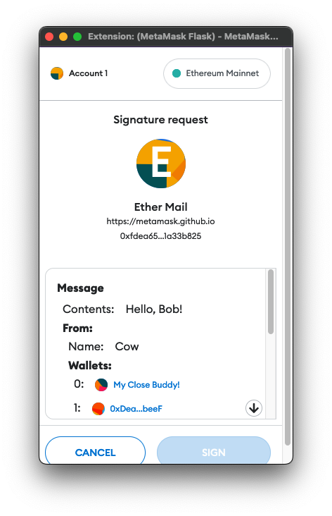

# Signing Data

MetaMask lets you request cryptographic signatures from users in a number of ways.

- [eth_signTypedData_v4](#signtypeddata-v4) for the most readable signatures that are also efficient to process on chain.
- [personal_sign](#personal-sign) for the easiest way to get a human readable signature of data that does not need to be efficiently processed on-chain.
- `eth_sign` (Not recommended) If you need to perform low-level signatures and don't mind having the user presented with high security friction, because the proposal is not readable.

| Signing Methods        | Human readable | Efficient to process on-chain | Easy to use |
| ---------------------- | -------------- | ----------------------------- | ----------- |
| `eth_signTypedData_v4` | ✅             | ✅                            | ❌          |
| `personal_sign`        | ✅             | ❌                            | ✅          |
| `eth_sign`             | ❌             | ❓                            | ❌          |

## SignTypedData V4

This is currently the most readable signature method that is also efficient to process on-chain. It follows the [EIP-712](https://eips.ethereum.org/EIPS/eip-712) standard to allow requesting the user sign a struct that can be verified on-chain. It produces confirmations that render the structure of a given struct, and tries to render that information as usefully as possible to the user (like displaying known account names in place of addresses).



A SignTypedData payload uses a standard format of encoding structs which is recursive, but has a different format for the top-level struct that is signed, which includes some `domain` metadata about the verifying contract to provide replay-protection of these signatures between different contract instances.

The top level SignTypedData object is the concatenation of:

- A `domain` struct, which can include the contract's address, chainId, a version, and a name, for cross-contract replay protection.
- The top level struct hash to sign.

The format of an EIP-712 struct hash is the hash of the concatenation of:

- A typestring, derived from the struct definition itself, defined in `encodeType` of the spec.
- Each field of the struct, in the order defined by `encodeType` (alphabetical). Fields under 32 bytes are included in full, and fields over 32 bytes are hashed.

Internally, MetaMask uses the [eth-sig-util](https://github.com/MetaMask/eth-sig-util) module to perform signatures and validation of EIP-712 code in JavaScript, so we recommend using it to generate and validate your own signatures.

You can use [eip712-codegen](https://github.com/danfinlay/eip712-codegen#readme) to generate most of the Solidity required to verify these signatures on-chain. It currently does not generate the top-level struct verification code (with the `domain`), though. That part will need to be written manually. You can see an example implementation [here](https://github.com/delegatable/delegatable-sol/blob/fb34bb259890417285f7185bc6500fb0ab8bf86f/contracts/Delegatable.sol#L80).

::: warning Safety First!
Since the top level struct type's name and the `domain.name` are presented to the user prominently in the confirmation, consider the names of your contract, the top level struct name, and the struct keys to be user-facing security interface. Will these labels catch the user's eye and keep them safe when a new website claiming to be an NFT giveaway presents it to them? It's up to you to make sure your contract is as readable as possible to the user.
:::

### Parameters

- `domain`: The domain is an options object with a number of optional fields that are used to ensure that signatures intended for your contract cannot be replayed on other contracts. You can opt out of these safety measures if you want your signatures to work across chains or contracts, for example.
- `domain.name`: A human-readable name that will be shown to the user as the requesting contract. You should make it something familiar so the user would recognize it if a phishing site later requested a signature for your domain.
- `domain.chainId`: The chain that these signatures should be valid on, if only one.
- `domain.verifyingContract`: The address of the contract that will verify this contract, to ensure this signature is not also meaningful in unintended ways on other contracts. You can also provide a URL here.
- `domain.version`: A number you can add as an extra level of replay protection. Probably totally overkill since you should be providing `verifyingContract` already.
- `primaryType`: The name of the type of the struct that you are requesting the user sign.
- `types`: An object representing all of the solidity types that will be involved in signing the intended message.
- `message`: An object representing the contents of the struct you are proposing the user sign.

Here are the parameter typescript definitions as defined in [eth-sig-util](https://github.com/MetaMask/eth-sig-util/blob/main/src/sign-typed-data.ts):

```typescript
interface MessageTypeProperty {
  name: string;
  type: string;
}

interface MessageTypes {
  [additionalProperties: string]: MessageTypeProperty[];
}

interface TypedMessage<T extends MessageTypes> {
  types: T;
  primaryType: keyof T;
  domain: {
    name?: string;
    version?: string;
    chainId?: number;
    verifyingContract?: string;
    salt?: ArrayBuffer;
  };
  message: Record<string, unknown>;
}
```

### Example

Below is an example of signing typed data with MetaMask. Live example [here](https://metamask.github.io/test-dapp/#signTypedDataV4)

:::: tabs :options="{ useUrlFragment: false }"

::: tab HTML

```html
<div>
  <h3>Sign Typed Data V4</h3>
  <button type="button" id="signTypedDataV4Button">sign typed data v4</button>
</div>
```

:::

::: tab JavaScript

```javascript
signTypedDataV4Button.addEventListener('click', async function (event) {
  event.preventDefault();

  const msgParams = JSON.stringify({
    domain: {
      // Defining the chain aka Rinkeby testnet or Ethereum Main Net
      chainId: 1,
      // Give a user friendly name to the specific contract you are signing for.
      name: 'Ether Mail',
      // If name isn't enough add verifying contract to make sure you are establishing contracts with the proper entity
      verifyingContract: '0xCcCCccccCCCCcCCCCCCcCcCccCcCCCcCcccccccC',
      // Just let's you know the latest version. Definitely make sure the field name is correct.
      version: '1',
    },

    // Defining the message signing data content.
    message: {
      /*
       - Anything you want. Just a JSON Blob that encodes the data you want to send
       - No required fields
       - This is DApp Specific
       - Be as explicit as possible when building out the message schema.
      */
      contents: 'Hello, Bob!',
      attachedMoneyInEth: 4.2,
      from: {
        name: 'Cow',
        wallets: [
          '0xCD2a3d9F938E13CD947Ec05AbC7FE734Df8DD826',
          '0xDeaDbeefdEAdbeefdEadbEEFdeadbeEFdEaDbeeF',
        ],
      },
      to: [
        {
          name: 'Bob',
          wallets: [
            '0xbBbBBBBbbBBBbbbBbbBbbbbBBbBbbbbBbBbbBBbB',
            '0xB0BdaBea57B0BDABeA57b0bdABEA57b0BDabEa57',
            '0xB0B0b0b0b0b0B000000000000000000000000000',
          ],
        },
      ],
    },
    // Refers to the keys of the *types* object below.
    primaryType: 'Mail',
    types: {
      // TODO: Clarify if EIP712Domain refers to the domain the contract is hosted on
      EIP712Domain: [
        { name: 'name', type: 'string' },
        { name: 'version', type: 'string' },
        { name: 'chainId', type: 'uint256' },
        { name: 'verifyingContract', type: 'address' },
      ],
      // Not an EIP712Domain definition
      Group: [
        { name: 'name', type: 'string' },
        { name: 'members', type: 'Person[]' },
      ],
      // Refer to PrimaryType
      Mail: [
        { name: 'from', type: 'Person' },
        { name: 'to', type: 'Person[]' },
        { name: 'contents', type: 'string' },
      ],
      // Not an EIP712Domain definition
      Person: [
        { name: 'name', type: 'string' },
        { name: 'wallets', type: 'address[]' },
      ],
    },
  });

  var from = await web3.eth.getAccounts();

  var params = [from[0], msgParams];
  var method = 'eth_signTypedData_v4';

  web3.currentProvider.sendAsync(
    {
      method,
      params,
      from: from[0],
    },
    function (err, result) {
      if (err) return console.dir(err);
      if (result.error) {
        alert(result.error.message);
      }
      if (result.error) return console.error('ERROR', result);
      console.log('TYPED SIGNED:' + JSON.stringify(result.result));

      const recovered = sigUtil.recoverTypedSignature_v4({
        data: JSON.parse(msgParams),
        sig: result.result,
      });

      if (
        ethUtil.toChecksumAddress(recovered) === ethUtil.toChecksumAddress(from)
      ) {
        alert('Successfully recovered signer as ' + from);
      } else {
        alert(
          'Failed to verify signer when comparing ' + result + ' to ' + from
        );
      }
    }
  );
});
```

:::

::::

::: tip What Kind of Data Can it Sign?
V4 of this method includes some improvements that are not available in older iterations of the method, so those methods are not recommended here.

- V1 only allowed the signing of an array of primitive fields.
- V2 was some minor improvements, and is not available on MetaMask.
- V3 introduced signing structs.

V4 added the ability to sign Arrays as well. So with V4, you're able to sign structs which contain any solidity primitive field, including arrays, and arrays of structs, although these structs are limited to the same constraints of other Solidity structs, including the inability to have circular types. If you have the need for circular types, you should probably make a linked list instead.
:::

### personal_sign

The personal sign method is a way to present the user with some human readable text for them to sign. It's often used for signature challenges that are authenticated on a web server, as with [Sign in with Ethereum (SiWE)](https://login.xyz/).


Some other signers have implemented this same method as `eth_sign` because the geth client changed the behavior of their `eth_sign` method, but because of our need to continue supporting existing applications, we support the original behavior. You may need to check with the signers you support to see what method they use for a given implementation.

::: warning Keeping users safe
This method is all about user readability, but the safety of your system relies on you using it responsibly!

- Don't use this method to display binary data, or the user will not be able to understand what they're agreeing to.
- If using this as a signature challenge, think about what would prevent a phisher from reusing the same challenge and impersonating your site: Add text referring to your domain, or the current time, so the user can easily verify if this challenge is legitimate.
  :::

For historical reasons, the message to sign must be submitted to the method in hex-encoded UTF-8. Here is an exmample of generating that code using a node.js style `Buffer` shim in the browser, as used in our [example dapp](https://metamask.github.io/test-dapp/#personalSign).

### Example

:::: tabs :options="{ useUrlFragment: false }"

::: tab HTML

```html
<div>
  <h3>Personal Sign</h3>
  <button type="button" id="personalSignButton">personal_sign</button>
</div>
```

:::

::: tab JavaScript

```javascript
personalSignButton.addEventListener('click', async function (event) {
  event.preventDefault();
  const exampleMessage = 'Example `personal_sign` message.';
  try {
    const from = accounts[0];
    const msg = `0x${Buffer.from(exampleMessage, 'utf8').toString('hex')}`;
    const sign = await ethereum.request({
      method: 'personal_sign',
      params: [msg, from, 'Example password'],
    });
    personalSignResult.innerHTML = sign;
    personalSignVerify.disabled = false;
  } catch (err) {
    console.error(err);
    personalSign.innerHTML = `Error: ${err.message}`;
  }
});
```

:::

::::

The requested text is prepended with `\x19Ethereum Signed Message:\n<length of message>` before being hashed and signed. You can try the method out in [our interactive API playground](https://metamask.github.io/api-playground/api-documentation/#personal_sign).

## Signing Data with MetaMask

If you’d like to jump to some working signature examples, [you can visit this repository](https://github.com/MetaMask/test-dapp).

If you’d like to read our JavaScript implementations of these methods, they are all available in the npm package [eth-sig-util](https://github.com/MetaMask/eth-sig-util).

Note that MetaMask supports signing transactions with Trezor and Ledger hardware wallets. These hardware wallets currently only support signing data using the `personal_sign` method. If you have trouble logging in to a website or dapp when using a Ledger or Trezor, the site may be requesting you sign data via an unsupported method, in which case we recommend using your standard MetaMask account.

## A Brief History

There are currently six signing methods in MetaMask, and you might wonder the history of these methods. Studying the history of these methods yields some guiding lessons for the emergence of decentralized standards. Our current five methods are:

- `eth_sign`
- `personal_sign`
- `signTypedData` (currently identical to `signTypedData_v1`)
- `signTypedData_v1`
- `signTypedData_v3`
- `signTypedData_v4`

There are likely to be many more over time. When MetaMask first started, the Provider API wasn’t designed to be exposed to untrusted websites, and so some considerations weren’t taken as seriously as they were later.

In particular, the method `eth_sign` is an open-ended signing method that allows signing an arbitrary hash, which means it can be used to sign transactions, or any other data, making it a dangerous phishing risk.

For this reason, we make this method show the most frightening possible message to the user, and generally discourage using this method in production. However, some applications (usually admin panels internal to teams) use this method for the sake of its ease of use, and so we have continued to support it for the sake of not breaking the workflows of active projects.

Eventually, the `personal_sign` [spec](https://github.com/ethereum/go-ethereum/pull/2940) was proposed, which added a prefix to the data so it could not impersonate transactions. We also made this method able to display human readable text when UTF-8 encoded, making it a popular choice for site logins.

However, the text-prefix made those signatures expensive to verify on-chain, and so with the help of the [0xProtocol](https://0x.org/) team and [SpankChain](https://spankchain.com/), the [EIP-712](https://eips.ethereum.org/EIPS/eip-712) spec was written.

The strange part of EIP-712, and this decentralized standards ecosystem, is that the proposal changed several times while retaining the same EIP. This means what we initially implemented as `signTypedData` was the earliest proposed version, while other groups implemented later versions under the same method name.

To avoid compatibility issues between clients, we recommend using the hard-versioned method names `signTypedData_v1` and `signTypedData_v3`. The missing `v2` represents an intermediary design that was implemented by the Cipher browser, so that we have room to implement it if there is ever enough developer demand for it.

In the future, it may help to have method names include a hash of their exact proposal, since in a decentralized ecosystem, there is no absolute source of truth of what a given name should map to. Instead, we are forced to invent new patterns of collaboration, where we can drive forward and innovate, while simultaneously avoiding creating a brittle ecosystem by changing our meanings out from under the words.

I hope this has been a useful introduction to the history of our signing methods!

## Sign Typed Data v1

This early version of the spec lacked some later security improvements, and should generally be neglected in favor of [signTypedData_v3](#sign-typed-data-v3).

Also known as `signTypedData`, originally premiered October 2017 in [this blog post](https://medium.com/metamask/scaling-web3-with-signtypeddata-91d6efc8b290), this method was the original state-channel-centric signing method.

The `signTypedData` family has a few major design considerations:

- Cheap to verify on chain
- Still somewhat human readable
- Hard to phish signatures

If on-chain verifiability cost is a high priority for you, you might want to consider it.

## Sign Typed Data v3

The method `signTypedData_v3` is a highly used version of the [EIP-712 spec](https://eips.ethereum.org/EIPS/eip-712).

This does not mean it is perfect. Most recently, we released `v4`, but we intend to protect this namespace and keep it compatible going forwards.

We have a [great introductory blog post to this method here](https://medium.com/metamask/eip712-is-coming-what-to-expect-and-how-to-use-it-bb92fd1a7a26).

Hopefully soon we will also have good examples for parsing method input into structs for verification on-chain (great contribution opportunity!)
