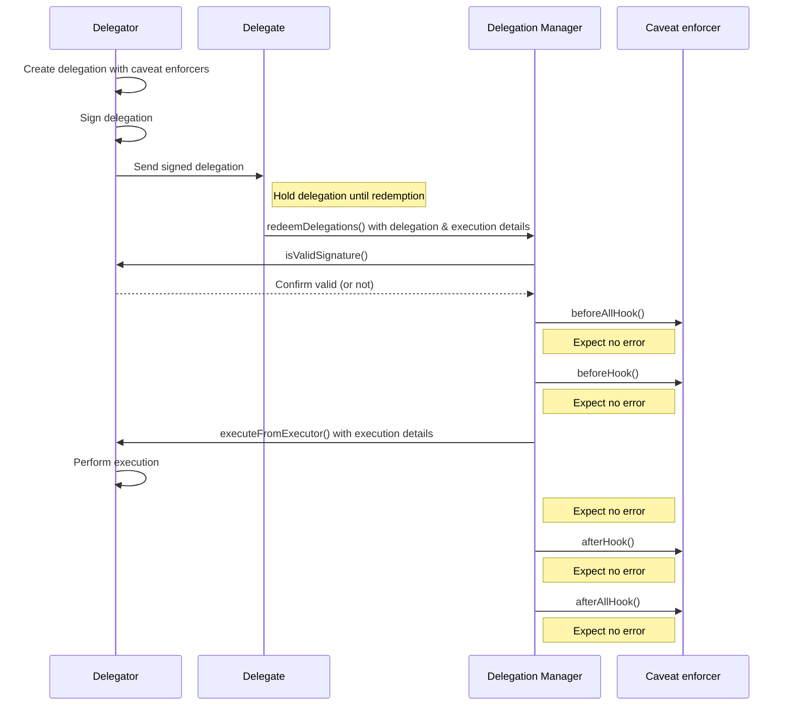

# Delegation

*Delegation* is the ability for a [delegator account](delegator-accounts.md) to grant permission to another smart contract account (SCA)
or externally owned account (EOA) to perform specific executions on the delegator's behalf, under defined rules and restrictions.

The MetaMask Delegation Toolkit includes the following delegation features:

- **Caveats** - Users can use [caveat enforcers](caveat-enforcers.md) to apply rules and restrictions to delegations.
  For example: Alice delegates the ability to spend her USDC to Bob, limiting the amount to 100 USDC.

- **Chain of delegations** - Users can redelegate permissions that have been delegated to them, creating a chain of delegations across trusted parties.

Delegations are created using the `Delegation` type, which is specified as follows:

```typescript
export type Delegation = {
  delegate: Hex;     // The address to which the delegation is being granted.
  delegator: Hex;    // The address that is granting the delegation.
  authority: Hex;    // Hash of the parent delegation, or the constant ROOT_AUTHORITY.
  caveats: Caveat[]; // Caveats that restrict the authority being granted.
  salt: Hex;         // Used to avoid hash collisions between identical delegations.
  signature: Hex;    // Signature from the delegator account.
};
```

## Delegation lifecycle

The delegation lifecycle is as follows:

1. **Delegation creation** - A delegation is initialized, and the delegator account signs it.

2. **Caveat enforcement** - The caveats applied to the delegation specify conditions under which
   the delegation can be redeemed.

3. **Delegation storage** - The delegation can be stored, enabling retrieval for future redemption.

    :::note
    [Storing and retrieving delegations](../experimental/store-retrieve-delegations.md) using the toolkit's
    `DelegationStorageClient` is an experimental feature.
    :::

4. **Delegation redemption** - The delegate (the account being granted the permission) redeems the
   delegation through an [ERC-4337 user operation](delegator-accounts.md#account-abstraction-erc-4337),
   which verifies that the delegated authority is valid in order to perform the execution.

See [how to create a delegation](../how-to/create-delegation/index.md) to get started with the
delegation lifecycle.

## Delegation Framework

The MetaMask Delegation Toolkit includes the Delegation Framework, which is a
[set of comprehensively audited smart contracts](https://github.com/MetaMask/delegation-framework) that
collectively handle delegator account creation, the delegation lifecycle,
and caveat enforcement.
It consists of the following components:

- **Delegator Core** - Delegator Core contains the logic for the ERC-4337 compliant delegator accounts.
  It defines the interface needed for the Delegation Manager to invoke executions on behalf of the accounts.

- **Delegator account implementations** - There are [multiple delegator account implementations](delegator-accounts.md#account-types),
  with the main difference being the signature scheme used to manage the underlying account.

- **Delegation Manager** - The Delegation Manager validates delegations and triggers executions
  on behalf of the delegator, ensuring tasks are executed accurately and securely.

  When a delegation is redeemed, the Delegation Manager performs the following steps.
  It processes a single step for all redemptions before proceeding to the next one:
  
  1. Validates the input data by ensuring the lengths of `permissionContexts`, `modes`, and
     `executionCallDatas` match, or throws `BatchDataLengthMismatch`.
	2. Decodes and validates the delegation, checking that the caller (`msg.sender`) is the delegate
     and that there are no empty signatures, or throws `InvalidDelegate`.
	3. Verifies delegation signatures, ensuring validity using `ECDSA` (for EOAs) or
     `isValidSignature` (for contracts), or throws `InvalidSignature`.
	4. Validates the delegation chain's authority and ensures delegations are not disabled.
	5. Executes the `beforeHook` for each `caveat` in the delegation, passing relevant data (`terms`,
     `arguments`, `mode`, `execution` `calldata`, and `delegationHash`) to the caveat enforcer.
	6. Calls `executeFromExecutor` to perform the delegation's execution, either by the delegator or
     the caller for self-authorized executions.
	7. Executes the `afterHook` for each `caveat`, similar to the `beforeHook`, passing required data
     to enforce post-execution conditions.
	8. Emits `RedeemedDelegation` events for each delegation that was successfully redeemed.

- **Caveat enforcers** - [Caveat enforcers](caveat-enforcers.md) manage rules and restrictions for delegations,
  providing fine-tuned control over delegated executions.

## Delegation redemption flow

This diagram illustrates how a delegation is created and subsequently redeemed on the Delegation Manager.
The Delegation Manager is responsible for validating the signature of the delegation and the caveat enforcers.
If everything is correct, it allows a delegate to execute an action on behalf of the delegator.

Learn more about the caveat enforcer hooks in the [Caveat enforcers](caveat-enforcers.md) section.


