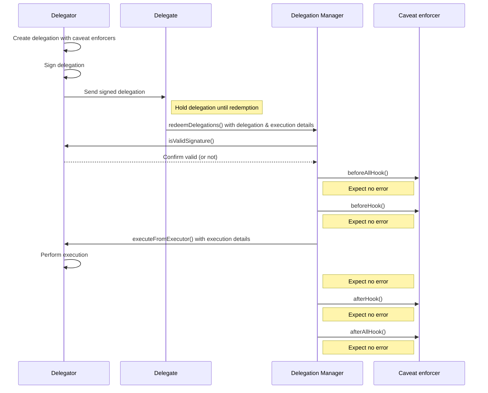

# Delegation

Delegation is the ability for a [MetaMask smart account](../smart-accounts.md) to grant permission to another smart contract
or externally owned account (EOA) to perform specific executions on its behalf.
The account that grants the permission is called the delegator account, while the account that receives the permission
is called the delegate account.

The Smart Accounts Kit follows the [ERC-7710](https://eips.ethereum.org/EIPS/eip-7710) standard for smart contract delegation.
In addition, users can use [delegation scopes](delegation-scopes.md) and [caveat enforcers](caveat-enforcers.md) to apply rules and restrictions to delegations.
For example, Alice delegates the ability to spend her USDC to Bob, limiting the amount to 100 USDC.

## Delegation types

You can create the following delegation types:

### Root delegation

A root delegation is when a delegator delegates their own authority away, as opposed to *redelegating* permissions 
they received from a previous delegation. In a chain of delegations, the first delegation is the root delegation.
For example, Alice delegates the ability to spend her USDC to Bob, limiting the amount to 100 USDC. 

Use [`createDelegation`](../../reference/delegation/index.md#createdelegation) to create a root delegation.

### Open root delegation

An open root delegation is a root delegation that doesn't specify a delegate. This means that any account can
redeem the delegation. For example, Alice delegates the ability to spend 100 of her USDC to anyone.

You must create open root delegations carefully, to ensure that they are not misused. 
Use [`createOpenDelegation`](../../reference/delegation/index.md#createopendelegation) to create an open root delegation.

### Redelegation

A delegate can redelegate permissions that have been granted to them, creating a chain of delegations across trusted parties.
For example, Alice delegates the ability to spend 100 of her USDC to Bob. Bob redelegates the ability to spend
50 of Alice's 100 USDC to Carol.

See [how to create a redelegation](../../guides/delegation/create-redelegation.md) guide to learn more.

### Open redelegation

An open redelegation is a redelegation that doesn't specify a delegate. This means that any account can redeem
the redelegation. For example, Alice delegates the ability to spend 100 of her USDC to Bob. Bob redelegates 
the ability to spend 50 of Alice's 100 USDC to anyone.

As with open root delegations, you must create open redelegations carefully, to ensure that they are not misused.
Use [`createOpenDelegation`](../../reference/delegation/index.md#createopendelegation) to create an open redelegation.

## Attenuating authority

When creating chains of delegations via redelegations, it's important to understand how authority flows and can be restricted.
- Each delegation in the chain inherits all restrictions from its parent delegation.
- New caveats can add further restrictions, but can't remove existing ones.

This means that a delegate can only redelegate with equal or lesser authority than they received.

## Delegation flow

The delegation flow consists of the following steps:

### Step 1. Create a delegation

The delegator creates a delegation, configuring a [scope](delegation-scopes.md) and 
optional [caveats](caveat-enforcers.md) that define the conditions under which the delegation can be redeemed.

### Step 2. Sign the delegation

The delegator signs the delegation, producing a verifiable signature that the [Delegation Manager](delegation-manager.md) can later validate.

### Step 3. Send the signed delegation

The delegator sends the signed delegation to the delegate. A dapp can store the delegation in the storage solution 
of their choice (such as a local database, Filecoin, or other databases), enabling retrieval for future redemption.

### Step 4. Redeem the delegation

The delegate submits the signed delegation to the Delegation Manager by calling `redeemDelegations()` with the
delegation and execution details.

### Step 5. Validate the delegation

The Delegation Manager validates the input data by ensuring the lengths of `delegations`, `modes`, and
`executions` match. It also verifies delegation signatures, ensuring validity using ECDSA (for EOAs) or
`isValidSignature` (for contracts).

### Step 6. Execute `beforeHook`

If the signature validation passes, the Delegation Manager executes the `beforeHook` for each [caveat](caveat-enforcers.md) 
in the delegation, passing relevant data (`terms`, `arguments`, `mode`, `execution` `calldata`, and `delegationHash`) to
the caveat enforcer.

### Step 7. Perform execution

If `beforeHook` validation passes, the Delegation Manager calls `executeFromExecutor` to perform the delegation's 
execution, either by the delegator or the caller for self-authorized executions.

### Step 8. Execute `afterHook`

The Delegation Manager runs each caveat enforcer's `afterHook` and `afterAllHook` to verify post-execution conditions.

See [how to perform executions on a smart account's behalf](../../guides/delegation/execute-on-smart-accounts-behalf.md) for a step-by-step guide.

## Delegation Framework

The Smart Accounts Kit includes the Delegation Framework, a
[set of comprehensively audited smart contracts](https://github.com/MetaMask/delegation-framework) that
collectively handle smart account creation, the delegation lifecycle, and caveat enforcement.

It consists of the following components:

| Component | Description |
|---|---|
| [Delegation Manager](delegation-manager.md) | Validates delegations and triggers executions on behalf of the delegator, ensuring tasks are executed accurately and securely. |
| [Caveat enforcers](caveat-enforcers.md) | Manage rules and restrictions for delegations, providing fine-tuned control over delegated executions. |