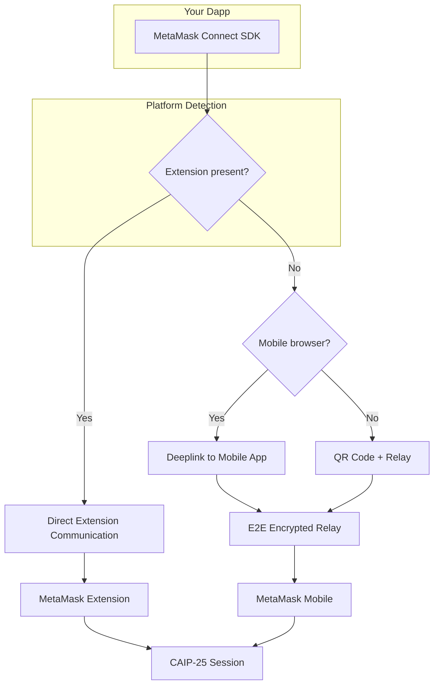

# About MetaMask Connect

## Supported platforms

With MetaMask Connect, you can connect your dapp to MetaMask in the following ways:

- **Desktop web dapps** — Automatically connect to the MetaMask extension, or connect to the MetaMask mobile app using a QR code.
- **Mobile dapps** — MetaMask Connect generates a deeplink that takes users directly to the MetaMask mobile app.

The following table expands on the supported connection methods:

| Dapp location | User wallet location | Connection method | MetaMask Connect | Other SDKs |
|---------------|---------------------|-------------------|------------------|------------|
| Desktop web | Wallet browser extension | Automatic connection via browser extension | Supported | Supported |
| Desktop web | Wallet mobile app | QR code scan with wallet mobile app | Supported | Limited |
| Mobile browser | Wallet mobile app | Deeplink directly to wallet mobile app | Supported | Limited |
| Mobile dapp | Wallet mobile app | Deeplink directly to wallet mobile app | Supported | Limited |

:::tip
For a better user experience on mobile, it's important to use reliable RPC providers instead of public nodes.
We recommend using services like [MetaMask Developer](https://developer.metamask.io/) to ensure better reliability and performance.
:::

## How connections work under the hood

You don't need to manage any of this — it's handled automatically:

1. **Platform detection** — SDK checks if MetaMask Extension is present, what browser you're in, whether you're on mobile, etc.
2. **Transport selection** — Extension present? Direct messaging. Not present? Relay connection via QR code or deeplink.
3. **Session creation** — CAIP-25 session established with the requested scopes (chains + methods).
4. **E2E encryption** — Relay connections are end-to-end encrypted (ECIES). The relay server never sees message content.
5. **Session persistence** — Session survives reloads. User doesn't need to re-approve on page refresh.

## Which integration option should I choose?

| | Ecosystem Clients (Option A) | Multichain Client (Option B) |
|---|---|---|
| **Integration effort** | Low — drop-in replacement for existing provider code | Medium — requires adapting to scope-based API |
| **EVM support** | EIP-1193 provider, works with ethers/viem/web3.js | Via `wallet_invokeMethod` with `eip155:*` scopes |
| **Solana support** | Wallet Standard, works with Solana wallet adapter | Via `wallet_invokeMethod` with `solana:*` scopes |
| **Cross-chain UX** | Separate connect flows per ecosystem | Single connect prompt for all ecosystems |
| **Session management** | Handled automatically per-client | Full control over unified session |
| **Best for** | Existing dapps wanting MetaMask Connect benefits with minimal code changes | New or multichain-native dapps wanting the best possible cross-chain UX |

You can also **start with Option A and migrate to Option B** incrementally.
The ecosystem clients are wrappers around the multichain client — they use the same transport, session, and relay infrastructure under the hood.

## Wallet connector library integrations

MetaMask Connect integrates with major wallet connector libraries so that dapps using these tools can get MetaMask Connect support with minimal effort:

| Library | Status | Documentation |
|---------|--------|---------------|
| **Wagmi / RainbowKit** | Supported | [Wagmi quickstart](/sdk/evm/connect/quickstart/wagmi), [RainbowKit quickstart](/sdk/evm/connect/quickstart/rainbowkit) |
| **ConnectKit** | Supported | [ConnectKit quickstart](/sdk/evm/connect/quickstart/connectkit) |
| **Dynamic** | Supported | [Dynamic quickstart](/sdk/evm/connect/quickstart/dynamic) |
| **Web3Auth** | Supported | [Web3Auth quickstart](/sdk/evm/connect/quickstart/web3auth) |
| **Web3-Onboard** | Supported | [Web3-Onboard](https://web3onboard.thirdweb.com/) |

If your dapp already uses one of these libraries, adopting MetaMask Connect should be as simple as updating a dependency or adding a connector — no changes to your application code.

## Architecture

The following diagram illustrates how MetaMask Connect handles connections across different platforms:

