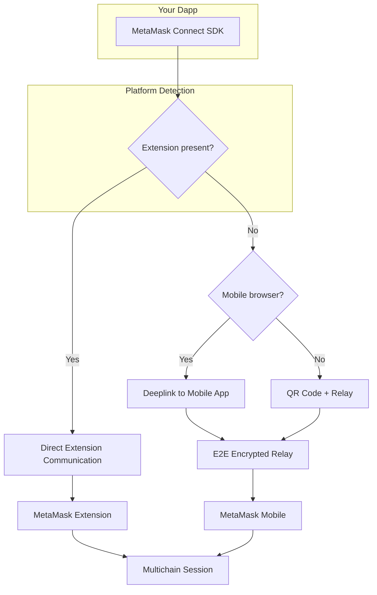

# About MetaMask Connect

MetaMask Connect handles the complexity of connecting your dapp to MetaMask across every platform, so you can focus on building your application.

## Supported platforms

Your dapp can reach users on desktop and mobile with a single integration:

- **Desktop web dapps** — Automatically connect to the MetaMask extension, or connect to MetaMask Mobile using a QR code when the extension isn't installed.
- **Mobile dapps** — MetaMask Connect generates a deeplink that takes users directly to MetaMask Mobile.

Here's how each connection method compares:

| Dapp location  | User wallet location     | Connection method                          | MetaMask Connect | Other SDKs |
| -------------- | ------------------------ | ------------------------------------------ | ---------------- | ---------- |
| Desktop web    | Wallet browser extension | Automatic connection via browser extension | Supported        | Supported  |
| Desktop web    | Wallet mobile app        | QR code scan with wallet mobile app        | Supported        | Limited    |
| Mobile browser | Wallet mobile app        | Deeplink directly to wallet mobile app     | Supported        | Limited    |
| Mobile dapp    | Wallet mobile app        | Deeplink directly to wallet mobile app     | Supported        | Limited    |

:::tip
For a better user experience on mobile, it's important to use reliable RPC providers instead of public nodes.
We recommend using services like [Infura](https://developer.metamask.io/) to ensure better reliability and performance.
:::

## How connections work under the hood

You don't need to manage any of this — it's all handled automatically. Here's what happens when a user connects:

1. **Platform detection** — The SDK checks if the MetaMask extension is present, what browser the user is in, and whether they're on mobile.
2. **Transport selection** — If the extension is available, the SDK communicates with it directly. Otherwise, it sets up a relay connection via QR code or deeplink.
3. **Session creation** — A [CAIP-25](https://github.com/ChainAgnostic/CAIPs/blob/main/CAIPs/caip-25.md) session is established for the requested chains and methods.
4. **End-to-end encryption** — Relay connections are encrypted end-to-end, so the relay server never sees message content.
5. **Session persistence** — The session survives page reloads and new tabs. Users don't need to re-approve on every visit.

## Which integration option should I choose?

|                        | Ecosystem clients (Option A - EVM and Solana)                                                                                                                                                                                             | Multichain client (Option B)                                              |
| ---------------------- | ----------------------------------------------------------------------------------------------------------------------------------------------------------------------------------------------------------------------------------------- | ------------------------------------------------------------------------- |
| **Integration effort** | Low — drop-in replacement for existing provider code                                                                                                                                                                                      | Medium — requires adapting to the scope-based Multichain API              |
| **EVM support**        | Standard [EIP-1193](https://eips.ethereum.org/EIPS/eip-1193) provider, works with ethers/viem/web3.js                                                                                                                                     | Via `wallet_invokeMethod` with EVM scopes                                 |
| **Solana support**     | [Wallet Standard](https://github.com/wallet-standard/wallet-standard) compatible, works with Solana wallet adapter. Also available as a [connector in Framework Kit](https://www.framework-kit.com/docs/api-reference#wallet-connectors). | Via `wallet_invokeMethod` with Solana scopes                              |
| **Cross-chain UX**     | Separate connect flows per ecosystem                                                                                                                                                                                                      | Single connect prompt for all ecosystems                                  |
| **Session management** | Handled automatically per-client                                                                                                                                                                                                          | Full control over unified session                                         |
| **Best for**           | Existing dapps that want MetaMask Connect benefits with minimal code changes                                                                                                                                                              | New or multichain-native dapps that want the best possible cross-chain UX |

Also **start with Option A and migrate to Option B** over time.
The ecosystem clients are built on the multichain client, so they share the same transport and session infrastructure under the hood.

## Wallet connector library integrations

If your dapp already uses a wallet connector library, adopting MetaMask Connect is straightforward.
MetaMask Connect integrates with the most popular options:

| Library                | Status    | Documentation                                                                                                          |
| ---------------------- | --------- | ---------------------------------------------------------------------------------------------------------------------- |
| **Wagmi / RainbowKit** | Supported | [Wagmi quickstart](/sdk/evm/connect/quickstart/wagmi), [RainbowKit quickstart](/sdk/evm/connect/quickstart/rainbowkit) |
| **Web3Auth**           | Supported | [Web3Auth quickstart](/sdk/evm/connect/quickstart/web3auth)                                                            |
| **Dynamic**            | Supported | [Dynamic quickstart](/sdk/evm/connect/quickstart/dynamic)                                                              |
| **ConnectKit**         | Supported | [ConnectKit quickstart](/sdk/evm/connect/quickstart/connectkit)                                                        |

In most cases, adopting MetaMask Connect is as simple as updating a dependency or adding a connector — no changes to your application code.

## Architecture

The following diagram shows how MetaMask Connect routes connections depending on the user's platform:

