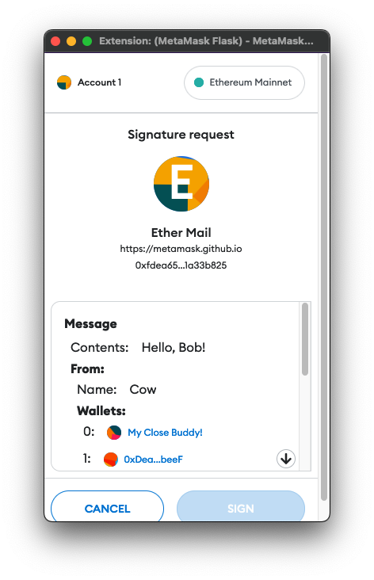
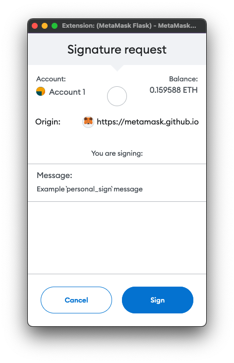

import Tabs from '@theme/Tabs';
import TabItem from '@theme/TabItem';

# Sign data

You can use the following RPC methods to request cryptographic signatures from users:

- [`eth_signTypedData_v4`](#use-eth_signtypeddata_v4) - Use this method to request the most human-readable
  signatures that are efficient to process onchain.
  We recommend this for most use cases.
- [`personal_sign`](#use-personal_sign) - Use this method for the easiest way to request human-readable
  signatures that don't need to be efficiently processed onchain.

:::caution
`eth_sign` is deprecated.
See [MIP-3](https://github.com/MetaMask/metamask-improvement-proposals/blob/main/MIPs/mip-3.md) for more information about this deprecation.
:::

:::note
MetaMask supports signing transactions using Trezor and Ledger hardware wallets.
These wallets only support signing data using `personal_sign`.
If you can't log in to a dapp when using a Ledger or Trezor, the dapp might be requesting you to
sign data using an unsupported method, in which case we recommend using your standard MetaMask account.
:::

## Use `eth_signTypedData_v4`

[`eth_signTypedData_v4`](../../reference/json-rpc-api/index.md)
provides the most human-readable signatures that are efficient to process onchain.
It follows the [EIP-712](https://eips.ethereum.org/EIPS/eip-712) specification to allow users to sign
typed structured data that can be verified onchain.
It renders the structured data in a useful way (for example, displaying known
account names in place of addresses).

<p align="center">



</p>

An `eth_signTypedData_v4` payload uses a standard format of encoding structs, but has a different
format for the top-level struct that is signed, which includes some metadata about the verifying
contract to provide replay protection of these signatures between different contract instances.

We recommend using [`eth-sig-util`](https://github.com/MetaMask/eth-sig-util) to generate and
validate signatures.
You can use [`eip712-codegen`](https://github.com/danfinlay/eip712-codegen#readme) to generate most
of the Solidity required to verify these signatures onchain.
It currently doesn't generate the top-level struct verification code, so you must write that part manually.
See
[this example implementation](https://github.com/delegatable/delegatable-sol/blob/fb34bb259890417285f7185bc6500fb0ab8bf86f/contracts/Delegatable.sol#L80).

:::caution
Since the top-level struct type's name and the `domain.name` are presented to the user prominently
in the confirmation, consider your contract name, the top-level struct name, and the struct keys to
be a user-facing security interface.
Ensure your contract is as readable as possible to the user.
:::

### Example

The following is an example of using `eth_signTypedData_v4` with MetaMask:

<Tabs defaultValue="viem" values={[
{ label: "viem", value: "viem" },
{ label: "web3.js", value: "web3" },
{ label: "ethers.js", value: "ethers" },
{ label: "Ethereum API", value: "eth_api" },
]}>
<TabItem value="eth_api">

```javascript
import { createEVMClient } from '@metamask/connect-evm'

const evmClient = createEVMClient({
  dapp: {
    name: 'Metamask Connect EVM Example',
    url: window.location.href,
    iconUrl: 'https://mydapp.com/icon.png', // Optional
  },
  api: {
    supportedNetworks: {
      'eip155:1': 'https://mainnet.infura.io/v3/YOUR_INFURA_API_KEY',
      'eip155:11155111': 'https://sepolia.infura.io/v3/YOUR_INFURA_API_KEY',
    },
  },
})
const provider = evmClient.getProvider()

async function signTypedDataV4() {
  // Get current account
  const accounts = await provider.request({
    method: 'eth_requestAccounts',
  })

  const message = {
    domain: {
      // This defines the network, in this case, Mainnet.
      chainId: 1,
      // Give a user-friendly name to the specific contract you're signing for.
      name: 'Ether Mail',
      // Add a verifying contract to make sure you're establishing contracts with the proper entity.
      verifyingContract: '0xCcCCccccCCCCcCCCCCCcCcCccCcCCCcCcccccccC',
      // This identifies the latest version.
      version: '1',
    },

    // This defines the message you're proposing the user to sign, is dapp-specific, and contains
    // anything you want. There are no required fields. Be as explicit as possible when building out
    // the message schema.
    message: {
      contents: 'Hello, Bob!',
      attachedMoneyInEth: 4.2,
      from: {
        name: 'Cow',
        wallets: [
          '0xCD2a3d9F938E13CD947Ec05AbC7FE734Df8DD826',
          '0xDeaDbeefdEAdbeefdEadbEEFdeadbeEFdEaDbeeF',
        ],
      },
      to: [
        {
          name: 'Bob',
          wallets: [
            '0xbBbBBBBbbBBBbbbBbbBbbbbBBbBbbbbBbBbbBBbB',
            '0xB0BdaBea57B0BDABeA57b0bdABEA57b0BDabEa57',
            '0xB0B0b0b0b0b0B000000000000000000000000000',
          ],
        },
      ],
    },
    // This refers to the keys of the following types object.
    primaryType: 'Mail',
    types: {
      // This refers to the domain the contract is hosted on.
      EIP712Domain: [
        { name: 'name', type: 'string' },
        { name: 'version', type: 'string' },
        { name: 'chainId', type: 'uint256' },
        { name: 'verifyingContract', type: 'address' },
      ],
      // Not an EIP712Domain definition.
      Group: [
        { name: 'name', type: 'string' },
        { name: 'members', type: 'Person[]' },
      ],
      // Refer to primaryType.
      Mail: [
        { name: 'from', type: 'Person' },
        { name: 'to', type: 'Person[]' },
        { name: 'contents', type: 'string' },
      ],
      // Not an EIP712Domain definition.
      Person: [
        { name: 'name', type: 'string' },
        { name: 'wallets', type: 'address[]' },
      ],
    },
  }

  const signature = await provider.request({
    method: 'eth_signTypedData_v4',
    params: [accounts[0], JSON.stringify(message)],
  })

  return signature
}
```

</TabItem>
<TabItem value="viem">

```tsx
import { MetaMaskSDK } from '@metamask/sdk'
import { createPublicClient, createWalletClient, custom } from 'viem'
import { mainnet } from 'viem/chains'

// Initialize SDK
const MMSDK = new MetaMaskSDK()
const provider = MMSDK.getProvider()

const walletClient = createWalletClient({ chain: mainnet, transport: custom(provider) })

const address = await walletClient.getAddresses()

const signature = await walletClient.signTypedData({
  account: address[0],
  domain: {
    // This defines the network, in this case, Mainnet.
    chainId: 1,
    // Give a user-friendly name to the specific contract you're signing for.
    name: 'Ether Mail',
    // Add a verifying contract to make sure you're establishing contracts with the proper entity.
    verifyingContract: '0xCcCCccccCCCCcCCCCCCcCcCccCcCCCcCcccccccC',
    // This identifies the latest version.
    version: '1',
  },

  // This defines the message you're proposing the user to sign, is dapp-specific, and contains
  // anything you want. There are no required fields. Be as explicit as possible when building out
  // the message schema.
  message: {
    contents: 'Hello, Bob!',
    attachedMoneyInEth: 4.2,
    from: {
      name: 'Cow',
      wallets: [
        '0xCD2a3d9F938E13CD947Ec05AbC7FE734Df8DD826',
        '0xDeaDbeefdEAdbeefdEadbEEFdeadbeEFdEaDbeeF',
      ],
    },
    to: [
      {
        name: 'Bob',
        wallets: [
          '0xbBbBBBBbbBBBbbbBbbBbbbbBBbBbbbbBbBbbBBbB',
          '0xB0BdaBea57B0BDABeA57b0bdABEA57b0BDabEa57',
          '0xB0B0b0b0b0b0B000000000000000000000000000',
        ],
      },
    ],
  },
  // This refers to the keys of the following types object.
  primaryType: 'Mail',
  types: {
    // This refers to the domain the contract is hosted on.
    EIP712Domain: [
      { name: 'name', type: 'string' },
      { name: 'version', type: 'string' },
      { name: 'chainId', type: 'uint256' },
      { name: 'verifyingContract', type: 'address' },
    ],
    // Not an EIP712Domain definition.
    Group: [
      { name: 'name', type: 'string' },
      { name: 'members', type: 'Person[]' },
    ],
    // Refer to primaryType.
    Mail: [
      { name: 'from', type: 'Person' },
      { name: 'to', type: 'Person[]' },
      { name: 'contents', type: 'string' },
    ],
    // Not an EIP712Domain definition.
    Person: [
      { name: 'name', type: 'string' },
      { name: 'wallets', type: 'address[]' },
    ],
  },
})
```

</TabItem>
<TabItem value="ethers">

```tsx
import { MetaMaskSDK } from '@metamask/sdk'
import { ethers } from 'ethers'
import { BrowserProvider, parseUnits } from 'ethers'

// Initialize SDK
const MMSDK = new MetaMaskSDK()
const provider = MMSDK.getProvider()

const ethersProvider = new ethers.BrowserProvider(provider)
const signer = await ethersProvider.getSigner()

const fromAddress = await signer.getAddress()

const message = {
  domain: {
    // This defines the network, in this case, Mainnet.
    chainId: 1,
    // Give a user-friendly name to the specific contract you're signing for.
    name: 'Ether Mail',
    // Add a verifying contract to make sure you're establishing contracts with the proper entity.
    verifyingContract: '0xCcCCccccCCCCcCCCCCCcCcCccCcCCCcCcccccccC',
    // This identifies the latest version.
    version: '1',
  },

  // This defines the message you're proposing the user to sign, is dapp-specific, and contains
  // anything you want. There are no required fields. Be as explicit as possible when building out
  // the message schema.
  message: {
    contents: 'Hello, Bob!',
    attachedMoneyInEth: 4.2,
    from: {
      name: 'Cow',
      wallets: [
        '0xCD2a3d9F938E13CD947Ec05AbC7FE734Df8DD826',
        '0xDeaDbeefdEAdbeefdEadbEEFdeadbeEFdEaDbeeF',
      ],
    },
    to: [
      {
        name: 'Bob',
        wallets: [
          '0xbBbBBBBbbBBBbbbBbbBbbbbBBbBbbbbBbBbbBBbB',
          '0xB0BdaBea57B0BDABeA57b0bdABEA57b0BDabEa57',
          '0xB0B0b0b0b0b0B000000000000000000000000000',
        ],
      },
    ],
  },
  // This refers to the keys of the following types object.
  primaryType: 'Mail',
  types: {
    // This refers to the domain the contract is hosted on.
    EIP712Domain: [
      { name: 'name', type: 'string' },
      { name: 'version', type: 'string' },
      { name: 'chainId', type: 'uint256' },
      { name: 'verifyingContract', type: 'address' },
    ],
    // Not an EIP712Domain definition.
    Group: [
      { name: 'name', type: 'string' },
      { name: 'members', type: 'Person[]' },
    ],
    // Refer to primaryType.
    Mail: [
      { name: 'from', type: 'Person' },
      { name: 'to', type: 'Person[]' },
      { name: 'contents', type: 'string' },
    ],
    // Not an EIP712Domain definition.
    Person: [
      { name: 'name', type: 'string' },
      { name: 'wallets', type: 'address[]' },
    ],
  },
}

const params = [fromAddress, JSON.stringify(message)]
const method = 'eth_signTypedData_v4'

const signature = await signer.provider.send(method, params)
```

</TabItem>
<TabItem value="web3">

```tsx
import { MetaMaskSDK } from '@metamask/sdk'
import { Web3 } from 'web3'

// Initialize SDK
const MMSDK = new MetaMaskSDK()
const provider = MMSDK.getProvider()

const web3 = new Web3(provider)

// Get user's Ethereum public address
const fromAddress = (await web3.eth.getAccounts())[0]

const message = {
  domain: {
    // This defines the network, in this case, Mainnet.
    chainId: 1,
    // Give a user-friendly name to the specific contract you're signing for.
    name: 'Ether Mail',
    // Add a verifying contract to make sure you're establishing contracts with the proper entity.
    verifyingContract: '0xCcCCccccCCCCcCCCCCCcCcCccCcCCCcCcccccccC',
    // This identifies the latest version.
    version: '1',
  },

  // This defines the message you're proposing the user to sign, is dapp-specific, and contains
  // anything you want. There are no required fields. Be as explicit as possible when building out
  // the message schema.
  message: {
    contents: 'Hello, Bob!',
    attachedMoneyInEth: 4.2,
    from: {
      name: 'Cow',
      wallets: [
        '0xCD2a3d9F938E13CD947Ec05AbC7FE734Df8DD826',
        '0xDeaDbeefdEAdbeefdEadbEEFdeadbeEFdEaDbeeF',
      ],
    },
    to: [
      {
        name: 'Bob',
        wallets: [
          '0xbBbBBBBbbBBBbbbBbbBbbbbBBbBbbbbBbBbbBBbB',
          '0xB0BdaBea57B0BDABeA57b0bdABEA57b0BDabEa57',
          '0xB0B0b0b0b0b0B000000000000000000000000000',
        ],
      },
    ],
  },
  // This refers to the keys of the following types object.
  primaryType: 'Mail',
  types: {
    // This refers to the domain the contract is hosted on.
    EIP712Domain: [
      { name: 'name', type: 'string' },
      { name: 'version', type: 'string' },
      { name: 'chainId', type: 'uint256' },
      { name: 'verifyingContract', type: 'address' },
    ],
    // Not an EIP712Domain definition.
    Group: [
      { name: 'name', type: 'string' },
      { name: 'members', type: 'Person[]' },
    ],
    // Refer to primaryType.
    Mail: [
      { name: 'from', type: 'Person' },
      { name: 'to', type: 'Person[]' },
      { name: 'contents', type: 'string' },
    ],
    // Not an EIP712Domain definition.
    Person: [
      { name: 'name', type: 'string' },
      { name: 'wallets', type: 'address[]' },
    ],
  },
}

const params = [fromAddress, JSON.stringify(message)]
const method = 'eth_signTypedData_v4'

const signature = await web3.eth.sendAsync(method, params)
```

</TabItem>
</Tabs>

## Use `personal_sign`

[`personal_sign`](../../reference/json-rpc-api/index.md) is the
easiest way to request human-readable signatures that don't need to be efficiently processed onchain.
It's often used for signature challenges that are authenticated on a web server, such as
[Sign-In with Ethereum](siwe.md).

<p align="center">



</p>

:::caution important

- Don't use this method to display binary data, because the user wouldn't be able to understand what
  they're agreeing to.
- If using this method for a signature challenge, think about what would prevent a phisher from
  reusing the same challenge and impersonating your site.
  Add text referring to your domain, or the current time, so the user can easily verify if this
  challenge is legitimate.
  :::

### Example

The following is an example of using `personal_sign` with MetaMask:

<Tabs defaultValue="viem" values={[
{ label: "viem", value: "viem" },
{ label: "web3.js", value: "web3" },
{ label: "ethers.js", value: "ethers" },
{ label: "Ethereum API", value: "eth_api" },
]}>
<TabItem value="eth_api">

```javascript
import { createEVMClient } from '@metamask/connect-evm'

const evmClient = createEVMClient({
  dapp: {
    name: 'Metamask Connect EVM Example',
    url: window.location.href,
    iconUrl: 'https://mydapp.com/icon.png', // Optional
  },
  api: {
    supportedNetworks: {
      'eip155:1': 'https://mainnet.infura.io/v3/YOUR_INFURA_API_KEY',
      'eip155:11155111': 'https://sepolia.infura.io/v3/YOUR_INFURA_API_KEY',
    },
  },
})
const provider = evmClient.getProvider()

async function signTypedDataV4() {
  // Get current account
  const accounts = await provider.request({
    method: 'eth_requestAccounts',
  })

  const exampleMessage = 'Example `personal_sign` message.'
  const message = `0x${Buffer.from(exampleMessage, 'utf8').toString('hex')}`

  const signature = await provider.request({
    method: 'personal_sign',
    params: [message, accounts[0]],
  })

  return signature
}
```

</TabItem>
<TabItem value="viem">

```tsx
import { MetaMaskSDK } from '@metamask/sdk'
import { createPublicClient, createWalletClient, custom } from 'viem'
import { mainnet } from 'viem/chains'

// Initialize SDK
const MMSDK = new MetaMaskSDK()
const provider = MMSDK.getProvider()

const walletClient = createWalletClient({ chain: mainnet, transport: custom(provider) })

const address = await walletClient.getAddresses()

const originalMessage = 'Example `personal_sign` message.'

const signature = await walletClient.signMessage({
  account: address[0],
  message: originalMessage,
})
```

</TabItem>
<TabItem value="ethers">

```tsx
import { MetaMaskSDK } from '@metamask/sdk'
import { ethers } from 'ethers'
import { BrowserProvider, parseUnits } from 'ethers'

// Initialize SDK
const MMSDK = new MetaMaskSDK()
const provider = MMSDK.getProvider()

const ethersProvider = new ethers.BrowserProvider(provider)
const signer = await ethersProvider.getSigner()

const exampleMessage = 'Example `personal_sign` message.'

const signature = await signer.signMessage(exampleMessage)
```

</TabItem>
<TabItem value="web3">

```tsx
import { MetaMaskSDK } from '@metamask/sdk'
import { Web3 } from 'web3'

// Initialize SDK
const MMSDK = new MetaMaskSDK()
const provider = MMSDK.getProvider()

const web3 = new Web3(provider)

// Get user's Ethereum public address
const fromAddress = (await web3.eth.getAccounts())[0]

const exampleMessage = 'Example `personal_sign` message.'

const signature = await web3.eth.sign(fromAddress, exampleMessage)
```

</TabItem>
</Tabs>

`personal_sign` prepends the message with `\x19Ethereum Signed Message:\n<length of message>` before
hashing and signing it.
