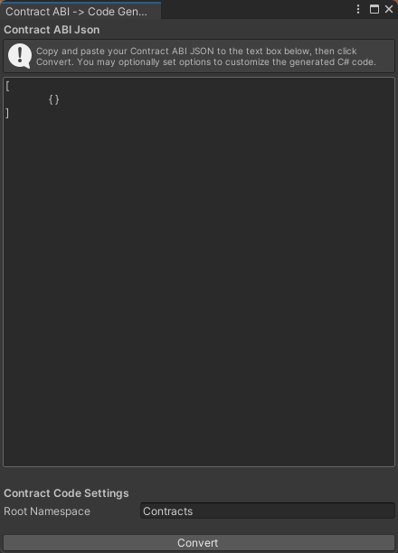
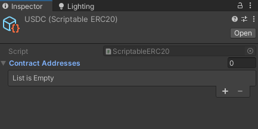

# Interact with smart contracts in Unity

You can interact with smart contracts from your Unity game with MetaMask SDK installed.

## Prerequisites

- [MetaMask SDK set up](../index.md) in your Unity game
- A [contract ABI](../../../../../concepts/smart-contracts.md#contract-abi) JSON file or
  [Hardhat artifact](https://hardhat.org/hardhat-runner/docs/advanced/artifacts#compilation-artifacts)
  JSON file

## Generate contract code

You can use the MetaMask Unity contract code generator to generate
[contract interface](contract-interface.md) files.
The code generator automatically generates backed types for all contract interfaces to be used by
the [contract factory](contract-factory.md#backed-type-contract-factory).

In your Unity editor, go to **Tools > MetaMask > Contract ABI Converter**.
A new dialog box opens:

<p align="center">



</p>

Paste your contract ABI JSON file or Hardhat artifact JSON file.
If you plan to deploy your contract, you must provide a Hardhat artifact, since this
has the required [contract bytecode](../../../../../concepts/smart-contracts.md#contract-bytecode) needed for deployment.

You can also specify the `Root Namespace` for the generated contract code, with the default value being `Contracts`. Ensure that you include `using Contracts`; at the beginning of your scripts before using the generated code.

Select **Convert**, which opens a save dialog box. Then, select a folder to save the generated code files to, somewhere inside the `Assets` folder.

## Use the contract

After generating the contract code, you can use the contract using the
`Contract.Attach<T>(...)` function.

This function takes a type `T` which must be the interface type of the contract to use.
This function returns that type `T`.

You must provide the `address` string the contract should be loaded from, and the
[provider](contract-provider.md) to use to interact with the contract.
Usually, the provider is `MetaMaskUnity.Instance.Wallet`.

The following is an example of using a contract:

```csharp
public async void Start()
{
  var metaMask = MetaMaskUnity.Instance.Wallet;
  var address = "0xA0b86991c6218b36c1d19D4a2e9Eb0cE3606eB48";

  ERC20 usdc = Contract.Attach<ERC20>(address, metaMask);
}
```

Once you have an instance of your contract interface of type `T` (in this example, `ERC20`), you may
invoke any function inside the interface type.
For example:

```csharp
public async void Start()
{
  // Setup...

  var balance = await usdc.BalanceOf(metaMask.SelectedAddress);
  Debug.Log(balance);
}
```

### Use contract templates

The MetaMask Unity SDK offers several contract templates that you can create and manage inside the
Unity editor.
These templates are scriptable objects, so you can configure them once inside the editor and use
them throughout your scripts.
These templates automatically perform the `Contract.Attach` function for you and automatically
switch contract addresses when the network changes.

You can create a new template by going to **Assets > Create > MetaMask > Contract Templates** and
selecting one of the following:

- **ERC20**
- **ERC721**
- **ERC1155**

Before using the contract template, configure the contract address to use for each chain:

<p align="center">



</p>

Select **+** to add a new address/chain pair.
When adding a new address, if you don't see your desired blockchain listed, you can modify the
`ScriptableContract.ChainId` enum to include your chain and chain ID.

<p align="center">


</p>

Once configured, you can use this scriptable object as a variable inside your scripts.
The contract template has the same interface and usage as if you used `Contract.Attach`, but the
setup and network switching is done for you.

## Advanced topics

To learn more about and customize your contract interactions using the Unity SDK, see the following topics:

- [Contract interface](contract-interface.md)
- [Contract factory](contract-factory.md)
- [Contract proxy class](contract-proxy-class.md)
- [Contract provider](contract-provider.md)
