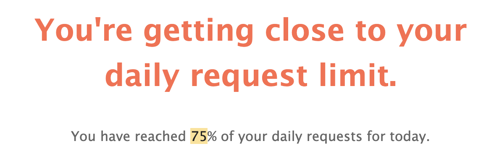

# Avoid rate limiting

Infura applies rate limiting account-wide after exceeding the daily request limit or the number of requests per second.

For rate limiting designed to protect our service in the event of an attack, Infura uses a combination of:

- Source IP address.
- JSON-RPC method.
- API key.

Infura is constantly adjusting rate limits based on overall usage and possible abuse.

Typically only aggressive use should experience rate limiting.

Customers running into rate limits are encouraged to [contact us](https://www.infura.io/contact). We'll work with you to determine how best to avoid rate limits.

:::info

Requests for archive data are more expensive and are therefore subject to different rate limits. [Find out more](../concepts/archive-data.md#rate-limits).

:::

### Notice rate limiting behavior?

When you're rate limited, your JSON-RPC responses have HTTP status code `429.`

They also contain a JSON-RPC error response with the reason for the rate limit. For example, if you use all the allowed daily requests:

```json
{
  "jsonrpc": "2.0",
  "id": 1,
  "error": {
    "code": -32005,
    "message": "daily request count exceeded, request rate limited"
  }
}
```

Or if you submit a higher number of requests per second than the maximum allowed limit:

```json
{
  "jsonrpc": "2.0",
  "id": 1,
  "error": {
    "code": -32005,
    "message": "project ID request rate exceeded",
    "data": {
      "see": "https://infura.io/docs/ethereum/jsonrpc/ratelimits",
      "current_rps": 13.333,
      "allowed_rps": 10.0,
      "backoff_seconds": 30.0
    }
  }
}
```

The `data` array contains three fields related to rate limits:

- `current_rps` - The current rate per second determined by Infura.
- `allowed_rps` - The current _allowed_ rate which you should stay under.
- `backoff_seconds` - The suggested amount of time to wait before sending more requests.

:::info

The value for `allowed_rps` changes depending on overall network conditions; therefore consider the value for `current_rps` valid and up-to-date.

:::

### Tips to avoid rate limiting

We recommend pausing JSON-RPC activity for the time value in `backoff_seconds`.

If you're consistently rate limited, consider these workarounds:

- **Cache Ethereum data locally.** Barring rare deep reorganizations of the chain, blocks more than a couple of blocks below the head of the chain can be cached indefinitely. Ask for the data once then keep it locally.
- **Limit RPCs at dapp startup.** Likewise, limit the number of RPCs your dapp calls immediately at startup. Only request data as the user accesses that portion of the dapp, and cache anything from older blocks for next time.
- **Don't poll Infura in a tight loop.** New blocks come roughly every 15 seconds, so requesting new data at a faster rate usually doesn't make sense. Consider using `eth_subscribe` to be notified when new blocks are available.

You can have Infura notify you when you're near your daily limit by selecting **Email Notifications** the **Accounts** tab
of the Infura **Settings**. Infura sends emails when your daily requests reach 75%, 85%, and 100% of the allowed limit.

**Example email**:


