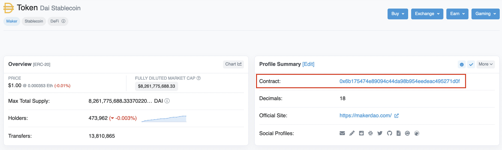

import Tabs from "@theme/Tabs";
import TabItem from "@theme/TabItem";

# Retrieve the balance of an ERC-20 token

In this tutorial, using Web3.js, you'll retrieve the balance of an [ERC-20 token](../../how-to/interact-with-erc-20-tokens.md) in an account, using the account address and the token contract.

## Prerequisites

- An [Ethereum project](../../get-started/infura.md) on Infura
- [Node.js installed](https://nodejs.org/en/download/)

## Steps

### 1. Create a project directory

Create a new directory for your project. This can be done from the command line:

```bash
mkdir retrieveBalance
```

Change into the new directory:

```bash
cd retrieveBalance
```

### 2. Install required packages

Install the `web3` package in the project directory:

```bash
npm install web3
```

### 3. Set up the script

Create a file called `retrieveBalance.js`. At the top of file, add the following lines to import the web3.js library and connect to the Infura HTTPS endpoint:

```javascript
const { Web3 } = require("web3")
const web3 = new Web3(
  new Web3.providers.HttpProvider("https://mainnet.infura.io/v3/<YOUR_API_KEY>")
)
```

Make sure to replace `<YOUR_API_KEY>` with your Infura API key.

### 4. Set the ABI

You'll only use the `balanceOf` method, so you don’t need the entire ABI for ERC-20 smart contracts. In the `retrieveBalance.js` file, define the ABI for the `balanceOf` method by adding the following to the script:

```javascript
const balanceOfABI = [
  {
    constant: true,
    inputs: [
      {
        name: "_owner",
        type: "address",
      },
    ],
    name: "balanceOf",
    outputs: [
      {
        name: "balance",
        type: "uint256",
      },
    ],
    payable: false,
    stateMutability: "view",
    type: "function",
  },
]
```

### 5. Select a token address

To retrieve the balance of a token, you need the contract address of the token. You can find this in the tokens section of a block explorer such as [Etherscan](https://etherscan.io/).

This example uses a DAI token contract. However, you can use any ERC-20 token contract address. Copy the token contract address you wish to use.



### 6. Request the token balance

Define the addresses to use in the `retrieveBalance.js` script:

```javascript
const tokenContract = "0x6b175474e89094c44da98b954eedeac495271d0f"
const tokenHolder = "0xf326e4de8f66a0bdc0970b79e0924e33c79f1915"
```

Define `contract` using `web3.eth.Contract()`, passing the `balanceOfABI` and the token contract address `tokenContract` as parameters:

```javascript
const contract = new web3.eth.Contract(balanceOfABI, tokenContract)
```

Next, call `methods.balanceOf()` on the `contract` and pass the `tokenHolder` address. This call sends a request to your Infura endpoint to request the token balance in the `tokenHolder` account address.

Create the below `async` function `getTokenBalance` that accomplishes this by interacting with the `tokenContract`.

```javascript
async function getTokenBalance() {
  const result = await.contract.methods.balanceOf(tokenHolder).call();
  console.log(result)
}

getTokenBalance();
```

### 7. Convert the token units

By default, calling `balanceOf` returns the balance value in `wei`, which is the smallest unit in Ethereum, equal to 0.000000000000000001 Ether (10<sup>-18</sup>).

Use `web3.utils.fromWei(result, "ether")` to get the actual number of DAI tokens, by adding the following line to the `async` function:

```javascript
const formattedResult = web3.utils.fromWei(result, "ether")
```

Also, update your `console.log(format)`:

```javascript
console.log(formattedResult)
```

### 8. Run the script

#### Complete code

Here is the complete code for `retrieveBalance.js`. Before running it make sure you replace `<YOUR_API_KEY>` with your Infura API key.

```javascript
const { Web3 } = require("web3")
const web3 = new Web3(
  new Web3.providers.HttpProvider("https://mainnet.infura.io/v3/<YOUR_API_KEY>")
)

const balanceOfABI = [
  {
    constant: true,
    inputs: [
      {
        name: "_owner",
        type: "address",
      },
    ],
    name: "balanceOf",
    outputs: [
      {
        name: "balance",
        type: "uint256",
      },
    ],
    payable: false,
    stateMutability: "view",
    type: "function",
  },
]

// DAI token contract
const tokenContract = "0x6B175474E89094C44Da98b954EedeAC495271d0F"
// A DAI token holder
const tokenHolder = "0x075e72a5eDf65F0A5f44699c7654C1a76941Ddc8"
const contract = new web3.eth.Contract(balanceOfABI, tokenContract)

async function getTokenBalance() {
  const result = await contract.methods.balanceOf(tokenHolder).call()
  const formattedResult = web3.utils.fromWei(result, "ether")
  console.log(formattedResult)
}

getTokenBalance()
```

Run the script using the following command:

<Tabs>
  <TabItem value="Command" label="Command" default>

```bash
node retrieveBalance.js
```

  </TabItem>
  <TabItem value="Example" label="Example" >

# Example output

```bash
278916727.186877714909963561
```

  </TabItem>
</Tabs>
