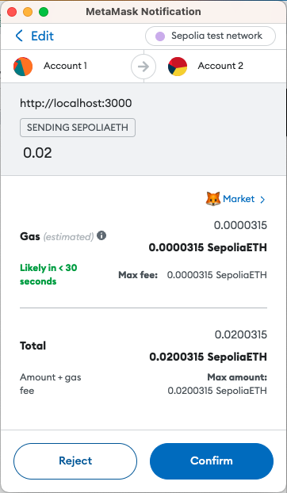
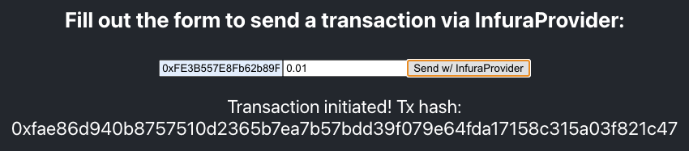

# Use ethers.js InfuraProvider or Web3Provider

In this tutorial, we'll create a simple React app to show the differences between using the ethers.js library's `InfuraProvider` and `Web3Provider` methods to send a transaction.

The key difference we'll highlight is that with Web3Provider you can load the private key from a Web3 wallet (MetaMask in this example), while InfuraProvider needs a wallet created locally with a stored private key.

This tutorial uses the Sepolia testnet.

## Prerequisites

- Install [MetaMask](https://metamask.io) and create an Ethereum account for testing purposes.
- Load Sepolia ETH into your wallet from the [Infura faucet](https://www.infura.io/faucet).
- [Node.js and NPM installed](https://nodejs.org/en/download/).

You can run the following to confirm that Node and NPM are installed:

```bash
node -v && npm -v
```

:::info

This tutorial was tested using ethers v5.7.2 and Node.js v16.17.0.

:::

## Steps

### 1. Create the React app

In the terminal, run the following command to create an app called my-app:

```bash
npx create-react-app my-app
```

Change into the project directory:

```bash
cd my-app
```

### 2. Install ethers.js

Install `ethers.js` in the project directory.

```
npm install --save ethers
```

### 3. Create the environment variables

Create a `.env` file in your project directory to store the project and Ethereum account details.

```
REACT_APP_API_KEY="<<YOUR-API-KEY>>"
REACT_APP_PRIVATE_KEY="<Private-Key>"
```

Ensure you replace the following values in the `.env` file:

- `<<YOUR-API-KEY>>` with the API key of the Ethereum project.
- `<Private-Key>` with the [private key of your Ethereum account](https://metamask.zendesk.com/hc/en-us/articles/360015289632-How-to-Export-an-Account-Private-Key).

:::danger

Never disclose your private key. Anyone with your private keys can steal any assets held in your account.

:::

### 4. Build the app

:::info

You can [copy the complete code sample from the final section](use-ethers.js-infuraprovider-or-web3provider.md#complete-code-sample).

:::

#### Import dependencies and create providers

Import the required dependencies and create the providers for communicating with the blockchain.

In the `src` directory open the `App.js` file. Remove the existing code and add the following code:

```javascript title="App.js"
import React, { useState } from "react"
import "./App.css"

function App() {
  const ethers = require("ethers")
  const API_KEY = process.env.REACT_APP_API_KEY
  const PRIVATE_KEY = process.env.REACT_APP_PRIVATE_KEY
  const provider_Metamask = new ethers.providers.Web3Provider(window.ethereum)
  const infuraProvider = new ethers.providers.InfuraProvider("sepolia", API_KEY)
}
export default App
```

#### Maintain the app state

Next, use the `useState` hook function to maintain the state of the app. Add the following code below the `const` declarations (inside the `App()` declaration):

```javascript title="App.js"
// Use the useState hook function to add state variables to a functional component.
const [blockNumber, setBlockNumber] = useState(null)
const [txSent, setTxSent] = useState(null)
const [txSentInfura, setTxSentInfura] = useState(null)
```

#### Create the app frontend

Next, create the app front-end that includes two forms for sending the transactions, and buttons for each provider to fetch the latest block number.

```javascript title="App.js"
// Configure the app frontend
return (
  <div className="App">
    <header className="App-header">
      <h3> Press one of the buttons to find out the latest block number: </h3>
      <div>
        <button onClick={handleButton1}>InfuraProvider</button>
        <button onClick={handleButton2}>Web3Provider</button>
        <p>{blockNumber}</p>
      </div>
      <h3> Fill out the form to send a transaction via Web3Provider: </h3>
      <div>
        <form onSubmit={handleSubmitWeb3}>
          <input type="text" name="address" placeholder="Recipient Address" />
          <input type="text" name="amount" placeholder="Amount (ETH)" />
          <input type="submit" value="Send w/ Web3Provider" />
        </form>
        <p>{txSent}</p>
      </div>
      <h3> Fill out the form to send a transaction via InfuraProvider: </h3>
      <div>
        <form onSubmit={handleSubmitInfura}>
          <input type="text" name="address" placeholder="Recipient Address" />
          <input type="text" name="amount" placeholder="Amount (ETH)" />
          <input type="submit" value="Send w/ InfuraProvider" />
        </form>
        <p>{txSentInfura}</p>
      </div>
    </header>
  </div>
)
```

#### Retrieve the latest block number

Create the code to retrieve the latest block number. Add the following code above the `return` statement.

```javascript
// Get the latest block using the InfuraProvider or wallet
const handleButton1 = async () => {
  const latest_block = await infuraProvider.getBlockNumber("latest")
  setBlockNumber(latest_block)
}

const handleButton2 = async () => {
  const latest_block = await provider_Metamask.getBlockNumber("latest")
  setBlockNumber(latest_block)
}
```

#### Send the transaction

To send the transaction, you need the target address and the amount to send. Add the following code below the code that retrieves the latest block number.

```javascript
// Handle the form submissions to send the transactions
const handleSubmitWeb3 = async (e) => {
  e.preventDefault()
  const data = new FormData(e.target)
  const address = data.get("address")
  const amount = data.get("amount")
  sendTransaction(address, amount)
}

const handleSubmitInfura = async (e) => {
  e.preventDefault()
  const data = new FormData(e.target)
  const address = data.get("address")
  const amount = data.get("amount")
  const signer = new ethers.Wallet(PRIVATE_KEY, infuraProvider)
  sendTransaction(address, amount, signer)
}
```

Next, create the `sendTransaction()` function that sends the transaction. Place the following code below the two `handleSubmit` methods.

```javascript
  // Send the transaction using either the Web3Provider or InfuraProvider
  const sendTransaction = async (address, amount, signer=null) => {
    if (signer==null){ // Web3 Provider
      if (!window.ethereum)
        console.error("No wallet found!");
      else {
        await window.ethereum.send("eth_requestAccounts");
        const provider = new ethers.providers.Web3Provider(window.ethereum);
        const signer = provider.getSigner();
        const tx = await signer.sendTransaction({
          to: address,
          value: ethers.utils.parseEther(amount)
        });
        console.log("tx", tx);
        setTxSent("Transaction initiated! Tx hash: " + tx.hash);
      }
    }
    else // InfuraProvider
    {
      const tx = await signer.sendTransaction({
        to: address,
        value: ethers.utils.parseEther(amount)
      });
      console.log("tx", tx);
      setTxSentInfura("Transaction initiated! Tx hash: " + tx.hash);
    }
  }
```

### 5. Run the app

Run the app from the root of the directory:

```
npm start
```

:::warning

If you are using create-react-app version >=5 you may run into issues building, such as:

```
Module not found: Error: Can't resolve 'crypto' in 'C:\Users\Username\Projects\testProject\client\node_modules\eth-lib\lib'

BREAKING CHANGE: webpack < 5 used to include polyfills for node.js core modules by default.
This is no longer the case. Verify if you need this module and configure a polyfill for it.
```

This is because NodeJS polyfills are not included in the latest version of create-react-app.

[Follow these instructions to resolve the issue](https://github.com/ChainSafe/web3.js#web3-and-create-react-app).

:::

In the app, notice that when you try and send a transaction using Web3Provider, the app opens a MetaMask instance to transfer your funds.



If you transfer funds using the InfuraProvider, then the funds are transferred directly from your app.



## Complete code sample

The complete code sample looks like this:

```javascript
import React, { useState } from "react"
import "./App.css"

function App() {
  const ethers = require("ethers")
  const API_KEY = process.env.REACT_APP_API_KEY
  const PRIVATE_KEY = process.env.REACT_APP_PRIVATE_KEY
  const provider_Metamask = new ethers.providers.Web3Provider(window.ethereum)
  const infuraProvider = new ethers.providers.InfuraProvider("goerli", API_KEY)

  // Use the useState hook function to add state variables to a functional component.
  const [blockNumber, setBlockNumber] = useState(null)
  const [txSent, setTxSent] = useState(null)
  const [txSentInfura, setTxSentInfura] = useState(null)

  // Get the latest block using the InfuraProvider or wallet
  const handleButton1 = async () => {
    const latest_block = await infuraProvider.getBlockNumber("latest")
    setBlockNumber(latest_block)
  }

  const handleButton2 = async () => {
    const latest_block = await provider_Metamask.getBlockNumber("latest")
    setBlockNumber(latest_block)
  }

  // Handle the form submissions to send the transactions
  const handleSubmitWeb3 = async (e) => {
    e.preventDefault()
    const data = new FormData(e.target)
    const address = data.get("address")
    const amount = data.get("amount")
    sendTransaction(address, amount)
  }

  const handleSubmitInfura = async (e) => {
    e.preventDefault()
    const data = new FormData(e.target)
    const address = data.get("address")
    const amount = data.get("amount")
    const signer = new ethers.Wallet(PRIVATE_KEY, infuraProvider)
    sendTransaction(address, amount, signer)
  }

  // Send the transaction using either the Web3Provider or InfuraProvider
  const sendTransaction = async (address, amount, signer = null) => {
    if (signer == null) {
      // Web3 Provider
      if (!window.ethereum) console.error("No wallet found!")
      else {
        await window.ethereum.send("eth_requestAccounts")
        const provider = new ethers.providers.Web3Provider(window.ethereum)
        const signer = provider.getSigner()
        const tx = await signer.sendTransaction({
          to: address,
          value: ethers.utils.parseEther(amount),
        })
        console.log("tx", tx)
        setTxSent("Transaction initiated! Tx hash: " + tx.hash)
      }
    } // InfuraProvider
    else {
      const tx = await signer.sendTransaction({
        to: address,
        value: ethers.utils.parseEther(amount),
      })
      console.log("tx", tx)
      setTxSentInfura("Transaction initiated! Tx hash: " + tx.hash)
    }
  }

  // Configure the app frontend
  return (
    <div className="App">
      <header className="App-header">
        <h3> Press one of the buttons to find out the latest block number: </h3>
        <div>
          <button onClick={handleButton1}>InfuraProvider</button>
          <button onClick={handleButton2}>Web3Provider</button>
          <p>{blockNumber}</p>
        </div>
        <h3> Fill out the form to send a transaction via Web3Provider: </h3>
        <div>
          <form onSubmit={handleSubmitWeb3}>
            <input type="text" name="address" placeholder="Recipient Address" />
            <input type="text" name="amount" placeholder="Amount (ETH)" />
            <input type="submit" value="Send w/ Web3Provider" />
          </form>
          <p>{txSent}</p>
        </div>
        <h3> Fill out the form to send a transaction via InfuraProvider: </h3>
        <div>
          <form onSubmit={handleSubmitInfura}>
            <input type="text" name="address" placeholder="Recipient Address" />
            <input type="text" name="amount" placeholder="Amount (ETH)" />
            <input type="submit" value="Send w/ InfuraProvider" />
          </form>
          <p>{txSentInfura}</p>
        </div>
      </header>
    </div>
  )
}

export default App
```
