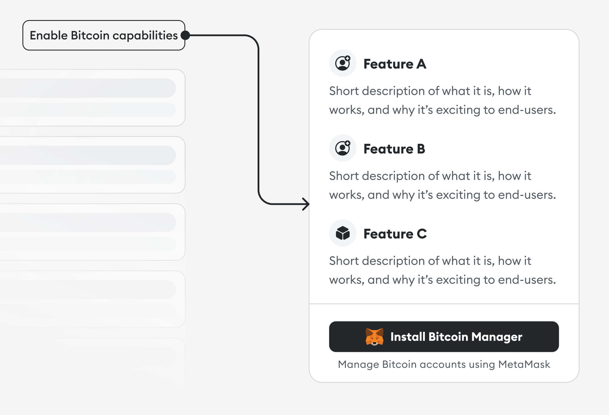
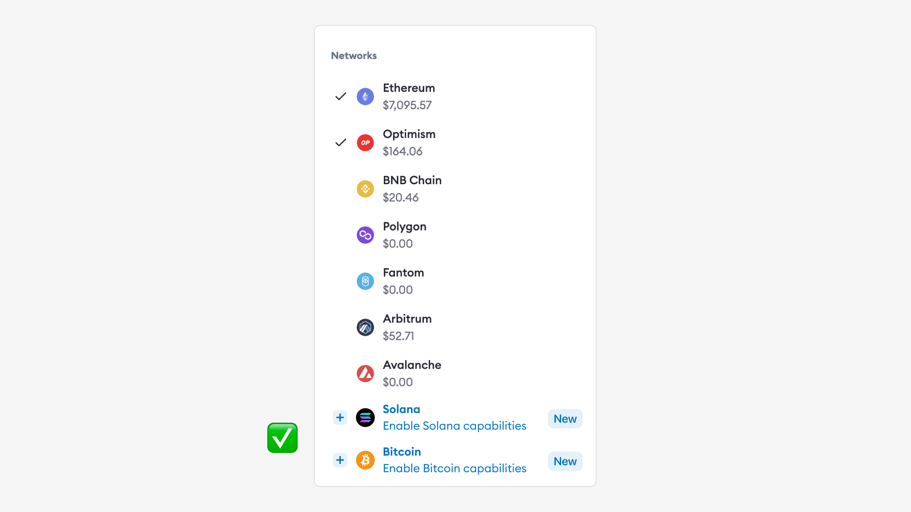
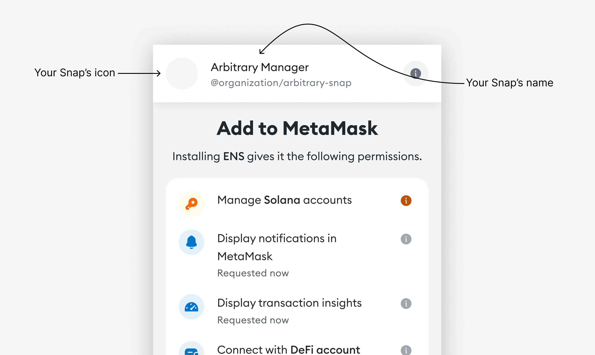
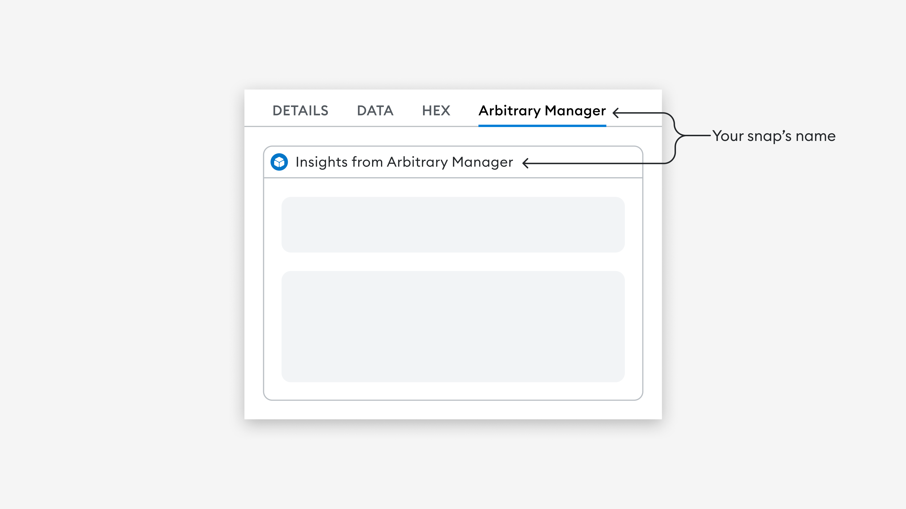

# Snaps design guidelines

This page outlines guiding principles for designers, developers, builders, and writers to create Snap installation flows that are accessible to all users. Use these guidelines when introducing your Snap within a dapp or website.

## Why this matters

The Snap installation process contains critical info about your Snap, including what it does, how it enhances your application, and why it’s beneficial for users. It's important to provide this information on your website or dapp to help users understand the purpose and benefits of the Snap before installing it. Without this information, users may drop out during installation or install the Snap without fully understanding its purpose.

## Guidelines at a glance

**Metadata must-haves**

- Keep your name to **21 characters or less** (including spaces).
- Never use “Snap” in your Snap’s name. Use the space for something more descriptive.
- Your avatar should fit in a **32px circular frame, SVG format**.
- Always aim for a short and simple copy.

**Before** asking for permission to install, provide users with **clear and concise information** about:

- _What_ the Snap does and _how_ it meets their needs.
- _How_ the Snap works.
- Any _security precautions_ they may need to know about.

Write in active voice and use sentence case. Avoid jargon—write in plain language that can be understood at a glance.

## Think like your users, write like a human

Consider whether the details that interest you as a developer are relevant to the user’s experience. Often, content can be drastically reduced by cutting jargon and run-on sentences. Read your content out loud to hear what stands out most in your messaging. If something is hard to say, it’s probably hard to read.

- **Be clear.**

  When labeling buttons or actions, use descriptive action verbs instead of vague phrases. _Install_ is more clear than _Complete_, for example.

- **Be concise.**

  Use short, simple words. Make every word earn its place on the screen.

- **Be consistent.**

  Identify synonyms and eliminate them. Each important object and action should have a single word to represent it. Inconsistency can blur the lines for users, creating uncertainty and confusion.

## Introducing your Snap

Use conversational language when explaining the Snap. If you need to use a technical term, briefly define it so everyone can understand. Avoid jargon whenever possible, and keep your words short and simple. Introduce your Snap in the context of your application to make it clear what the user gets if they install it.

:::note How to (not) describe what your Snap does

**Don'ts**

❌ _Allow the Snap to perform actions that run periodically at fixed times, dates, or intervals. This can be used to trigger time-sensitive interactions or notifications._

❌ _Allow this Snap to display notifications regarding your Ethereum Name Service expiration._

**Do's**

✅ _Let this Snap schedule and run recurring tasks or notifications._

✅ _Let this Snap notify you when your ENS is about to expire._

:::

### Details to include when introducing your Snap

This is your chance to share the benefits of your Snap with the intended user. If it isn’t clear what a user stands to gain from your Snap, chances are they won’t even install it. So don’t be afraid to think like a marketer and emphasize the benefits of your Snap.

Consider introducing your Snap on your website with a modal, tooltip, or card. This introduction can happen before or alongside the installation prompt, but should always be clear and descriptive.

#### Important details include:

- What your Snap does, why someone would use it, and how it works.
- Security precautions in plain, basic language that anyone can understand.
- Descriptions of the features that make your Snap appealing to the intended users.

:::tip Tip
Some studies estimate users read only 20-28% of the text on any screen, so write about your Snap with language that’s impactful, clear, and direct.
:::

## Embedded in existing flows

Introduce the Snap as a natural extension of existing elements on your screen, and suggest installation when the time is right. This can be a make or break moment for your Snap, so put yourself in the shoes of the intended user.

At what point does it make the most sense to prompt an install? Don’t ask the user to install your Snap before they do anything in the dapp or website, as they will probably decline. Instead, **wait to prompt installation** **until a point where the Snap is required**.

In the following example, a key management Snap is suggested in the context of a network picker screen.

## Making the most of your metadata

Your Snap’s avatar and name will be among the first things a user sees when deciding whether to install your Snap. These are also a key part of your identity, so it’s worth spending a bit of time on this step.

**Avatar**

Your Snap’s avatar should be suitable for a **32 px circular frame in SVG format**. Avoid using images with small details, as they won't be impactful in the allotted space. Aim for something bold, simple, and easily understood.

**Name**

Your Snap's name should be short and easy to remember. It should be **21 characters maximum**, **including spaces**, to ensure that it is easy to read and fits comfortably on small screens.

Using a descriptive name can help users understand how they will benefit from installing your Snap, and may increase the likelihood that they will install and use it. **Never** use the word **“Snap”** in your name — your name should be specific and memorable, and which will differentiate your Snap from others.

:::note How to (not) name your Snap

**Don'ts**

❌ _Solana Snap_

❌ _Snap for Filecoin_

❌ _Best manager for Bitcoin_

**Do's**

✅ _Solana Manager_

✅ _Bitcoin Helper_

✅ _Filecoin Wallet_

:::

## Upleveling your copy

At MetaMask, we use an in-depth style guide to inform our writing decisions. Here are a couple of ways to easily uplevel your own copy so it feels more at home in the MetaMask ecosystem.

### Capitalization

With few exceptions, use **sentence case as a default**. Sentence case is capitalizing only the first word of a line of copy. Not only is sentence case is more casual and conversational, but it’s also easier to scan than title case. Keep in mind, there are a handful of times that title case is the way to go.

### Active voice

Write your copy in active voice. There are certain situations where passive voice is the better option, but it’s more likely that active voice will suit your situation.

:::tip How to write in active voice
_Subject_ (person/thing acting) _verb_ (the action) _object_ (receives the action).
:::

:::note How to (not) write in active voice

❌ _The problem is being investigated_

✅ _We’re investigating the problem_

:::

