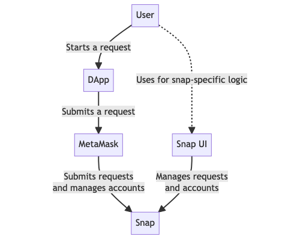
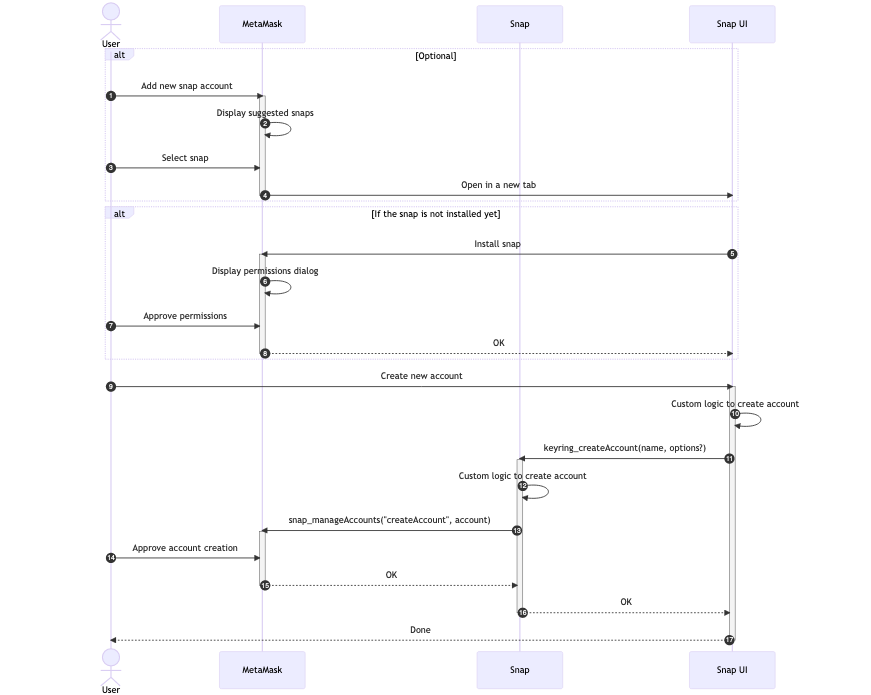
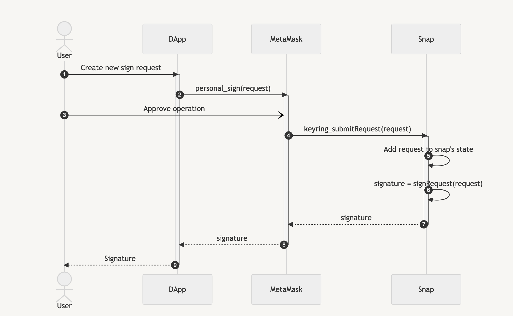
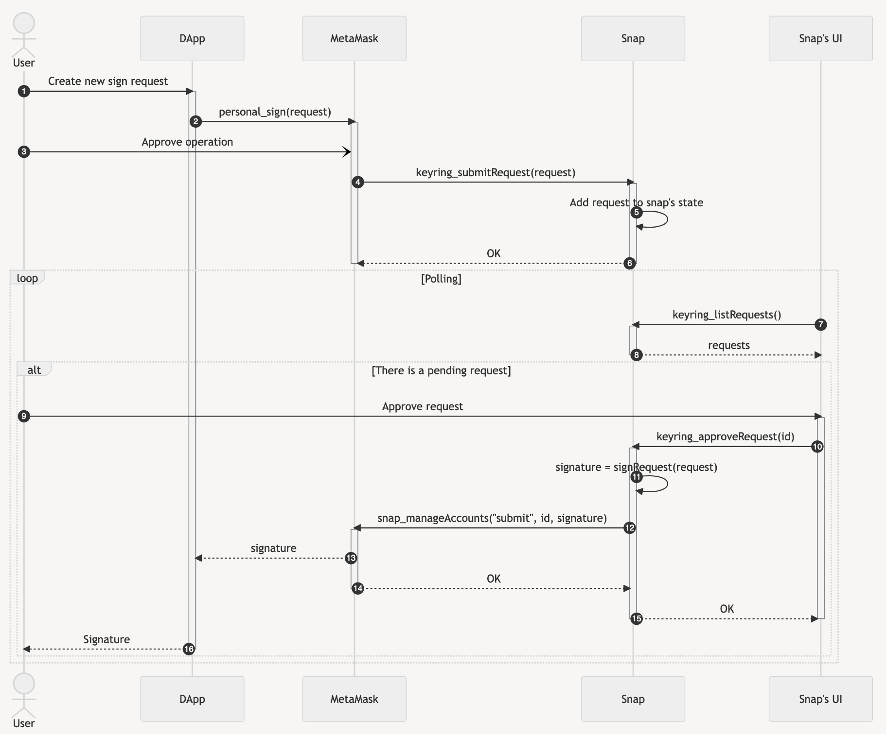

# About the Keyring API

:::flaskOnly
:::

:::tip API documentation
See the [Keyring API reference](../reference/keyring-api/index.md) for all the Keyring API methods.
:::

The Snaps Keyring API integrates custom EVM accounts inside MetaMask.
Previously, you needed a companion dapp to display custom EVM accounts, such multi-party computation
(MPC) accounts.
Now you can display these custom accounts alongside regular MetaMask accounts in the UI:

[Create a Keyring snap to integrate custom EVM accounts in MetaMask.](../tutorials/custom-evm-accounts.md)
Your dapp can then use the [`eth_requestAccounts`](/wallet/reference/eth_requestaccounts) MetaMask
JSON-RPC API method to connect to the custom accounts, and seamlessly interact with them using other
[JSON-RPC methods](/wallet/reference/eth_subscribe).

## Terminology

The following terminology is used across the Keyring API:

- **Blockchain account**: An object in a single blockchain, representing an account, with its
    balance, nonce, and other account details.
- **Request**: A request from a dapp to MetaMask.
- **Keyring account**: An account model that represents one or more blockchain accounts.
- **Keyring snap**: A snap that implements the Keyring API.
- **Keyring request**: A request from MetaMask to a Keyring snap. 
    MetaMask wraps the original request sent by the dapp and adds some metadata to it.

## Components diagram

The following diagram shows the components you encounter when interacting with accounts managed by a
Keyring snap:

- **User**: The user interacting with the snap, the dapp, and MetaMask.
- **Dapp**: The dapp requesting an action to be performed on an account.
- **MetaMask**: The wallet the dapp connects to.
  MetaMask routes requests to the Keyring snaps and lets the user perform some level of account management.
- **Snap**: A snap that implements the Keyring API to manage the user's accounts, and to handle
  requests that use these accounts.
- **Snap UI**: The snap's UI component that allows the user to interact with the snap to perform
  custom operations on accounts and requests.

## Keyring interface

The first step to create a Keyring snap is to implement the
[`Keyring`](../reference/keyring-api/03-Type%20Aliases/02-type-alias.Keyring.md) interface.
This interface describes all the methods necessary to make your custom EVM accounts work inside
MetaMask with your own logic.

The following sections describe the different flows that the `Keyring` interface handles.

### Snap account creation flow

The first interaction between users and the Keyring snap is the snap account creation process.
The flow looks like the following:

The MetaMask account selection modal has an option called **Add snap account**:

This option shows a list of Keyring snaps.
Each snap redirects the user to the companion dapp that contains all the UI to configure and manage the snap.

The dapp presents a custom UI allowing the user to configure their custom EVM account.
The dapp uses the [`createAccount`](../reference/keyring-api/02-Classes/04-class.KeyringSnapRpcClient.md#createaccount)
method of the `KeyringSnapRpcClient`, which calls the `Keyring` interface's method of the same name.
You can find an example of this in the [example Keyring snap companion dapp](https://github.com/MetaMask/snap-simple-keyring/blob/d3f7f0156c59059c995fea87f90a3d0ad3a4c135/packages/site/src/pages/index.tsx#L136).

The `createAccount` method of the `Keyring` interface creates the account based on the parameters passed
to the method.
The snap keeps track of the accounts that it creates using [`snap_manageState`](../reference/rpc-api.md#snap_managestate).
Once the snap has created an account, it notifies MetaMask using the
[`createAccount`](../reference/rpc-api.md#createaccount) sub-method of `snap_manageAccounts`.
You can find an example of this process in the
[example companion dapp](https://github.com/MetaMask/snap-simple-keyring/blob/d3f7f0156c59059c995fea87f90a3d0ad3a4c135/packages/snap/src/keyring.ts#L61).

Once the snap has created an account, that account can be used to sign messages and transactions.

### Synchronous signing flow

If the Keyring snap can sign transactions directly, it implements a simple synchronous signing flow.
If the snap needs a third party such as a hardware key or a second account's signature (for example,
in a threshold signature scheme), it implements an [asynchronous signing flow](#asynchronous-signing-flow).
The synchronous flow looks like the following:

See the [example Keyring snap companion dapp](https://github.com/MetaMask/snap-simple-keyring) for a
full example.

The flow starts when a dapp calls a [MetaMask JSON-RPC method](/wallet/reference/eth_subscribe), or
when the user initiates a new funds transfer from the MetaMask UI.
At that point, MetaMask detects that this interaction is requested for an account controlled by the
Keyring snap.

After the user approves the transaction in the UI, MetaMask calls the `submitRequest` method of the
`Keyring` interface.
`submitRequest` receives the original RPC request, and returns a
[`SubmitRequestResponse`](../reference/keyring-api/04-Variables/05-variable.SubmitRequestResponseStruct.md)
with `pending` set to `false`, and `result` set to the requested signature.

:::caution important
If the Keyring snap receives an
[`eth_sendTransaction`](/wallet/reference/eth_sendTransaction) request, it should treat it like an
[`eth_signTransaction`](https://ethereum.org/en/developers/docs/apis/json-rpc/#eth_signtransaction) request.
That is, the snap is responsible for providing the signature in the response, and MetaMask is
responsible for broadcasting the transaction.
:::

### Asynchronous signing flow

If the Keyring snap implements a complex scheme such as threshold signing, it implements an
asynchronous signing flow with more `Keyring` methods.
The asynchronous flow looks like the following:

The flow starts the same way as the [synchronous flow](#synchronous-signing-flow): a dapp or user
initiates a request to sign a transaction or arbitrary data.
After approval, the `submitRequest` method of the snap's `Keyring` interface is called.

Since the snap doesn't answer the request directly, it stores the pending request in its internal
state using [`snap_manageState`](../reference/rpc-api.md#snap_managestate).
This list of pending requests is returned when the `listRequests` or `getRequest` methods of the
`Keyring` interface are called.

After storing the pending request, the snap creates a pop-up using
[`snap_dialog`](../reference/rpc-api.md#snap_dialog) instructing the user to go to the companion
dapp's URL.

The dapp lists the snap's pending requests using an RPC call facilitated by the
[`listRequests`](../reference/keyring-api/02-Classes/04-class.KeyringSnapRpcClient.md#listrequests)
method of the `KeyringSnapRpcClient`.
The user can then act on those requests using whatever process applies to the snap.

Once the signing process completes, the companion dapp resolves the request using the
[`approveRequest`](../reference/keyring-api/02-Classes/04-class.KeyringSnapRpcClient.md#approverequest)
method of the `KeyringSnapRpcClient`, which calls the `Keyring` interface's method of the same name.
This method receives the request's ID and final result.

When `approveRequest` is called, it can resolve the pending request by using the
[`submitResponse`](../reference/rpc-api.md#submitresponse) sub-method of `snap_manageAccounts`.
