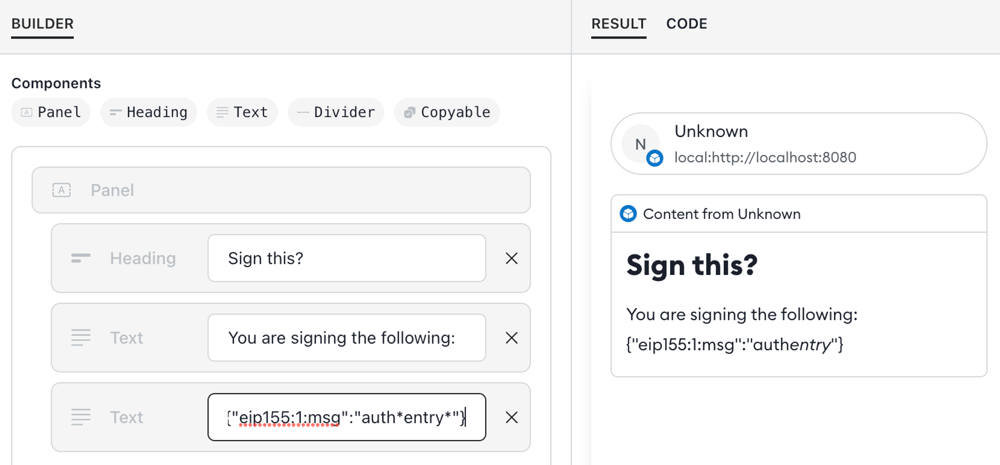
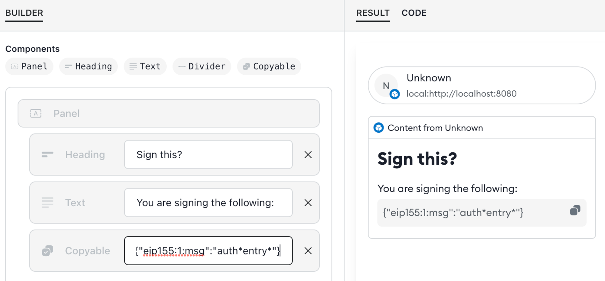

# Snaps security guidelines

This page presents essential security principles for builders to develop new Snaps for the MetaMask wallet that are secure and reliable. These guidelines, derived from early Snaps audits, serve as a dynamic handbook, updated as new security-related concepts emerge in the context of Snaps development. Utilize these principles when creating your Snap to ensure it will be safe for users.

## Permissions

_Guidelines related to the Snap [manifest file](../concepts/anatomy.md/#manifest-file) and its [permissions](../reference/permissions.md)._

- **Minimum Permissions:** Remember to always follow the principle of "least authority." When requesting or adding permissions in the Snap manifest, make sure to only add the minimum permissions needed by your Snap. Before publishing your Snap, check the permissions again and remove any unused permissions. You can validate your permissions using the [Snaps Simulator Manifest Validator](https://metamask.github.io/snaps/snaps-simulator/staging/#/manifest).
- **Minimum RPC access:** When adding the [`endowment:rpc`](../reference/permissions.md/#endowmentrpc) permission for Snaps or dapps, ask yourself if both are really necessary. For example, if permission is granted to communicate with Snaps, it means other Snaps will be able to call your Snap's sensitive RPC methods. 
- **Minimum network access:** Only add the [`endowment:network-access`](../reference/permissions.md/#endowmentnetwork-access) permission if it's absolutely necessary, such as when needing to communicate with a remote API that is part of your Snap's functionality. This is because users are rightly concerned about how much of their wallet usage is shared with remote servers. If this permission is needed, inform the user before communicating with remote servers and include a privacy policy in your Snap that explains how data is shared.

## Transactions

_Guidelines related to transactions and transaction signing._

- **Transaction Details**: When handling transactions, always present the user with a meaningful prompt displaying all transaction details such as the receiver address, chain ID, network, and amount. Always show the "origin" domain name and "network" to provide the user with a clear context of where the transaction will be used or broadcasted. The user should be aware of the website that originated the transaction request and the blockchain it will be sent to. The receiver address is also crucial to prevent the user from sending funds to the wrong destination.
- **Transparent Signing**: Always display the message to be signed by the user in the Snap confirmation flow. Do not rely on the requesting website for this, as it could choose not to display it and let the Snap silently sign the message.
- **Consentful Confirmations**: Before signing a transaction, always show the user a confirmation prompt with all the transaction details as mentioned above.

## Authorization

_Guidelines related to user notifications and authorizations._

- **Transparent State Changes**: The snap should always notify the user about important state changes. The user is then prompted and can decide whether to proceed with a particular action or not.
- **Consentful Network/Account Switching**: When the snap switches the Network or the Account, ensure that the user authorizes that action so they are aware of the context switching.
- **Ensure the User is in Control**: When modifying or reading internal state, display a confirmation dialog to inform the user of the request and allow them to approve or reject the action.
- **Consentful Transaction Signing**: Every time a transaction is about to be signed, prompt the user with the transaction details and provide an option to accept or reject the signature. If your Snap is designed to allow automatic transactions, prompt the user before enabling this and make sure they are aware of how it will work. You should also give the user a way to disable it. 
- **Consentful Account Management**: When deriving or generating keypairs, accounts, or smart contracts, inform the user and ask for their consent.
- **Protect User Keys**: Do not allow the Snap to return all the user wallet addresses to the dapp, even public keys. As per MetaMask behavior, only authorized/connected addresses are exposed to the dapp. Users should have the opportunity to choose/authorize only the address(es) they want to expose.
- **Limit Access to Sensitive Methods**: If you are building a Snap that has sensitive RPC methods, you probably want to have a dedicated dapp that is used as an "admin interface" to interact with your Snap's sensitive methods. There are two ways to do this: 
  
  1. You can restrict the `endowment:rpc` permission to specific URLs using the `allowedOrigins` caveat: 
    ```json
    {
      "initialPermissions": {
        "endowment:rpc": {
          "allowedOrigins": ["metamask.io", "consensys.io"]
        }
      }
    } 
    ```

    In this example, the RPC methods will only be callable by dapps hosted at `https://metamask.io` or `https://consensys.io` (and any subdomains). Calls from any other website, or any Snap, will be rejected.
  
  2. You can filter specific methods to specific URLs using the built-in [URL library](https://developer.mozilla.org/en-US/docs/Web/API/URL): 

    ```JavaScript
    const referrer = new URL(origin);

    if(referrer.protocol === "https:" && referrer.host.endsWith("metamask.io")) { 
      console.log("URL is valid"); 
    }
    else { 
      console.log("URL is NOT valid"); 
    }
    ```
    
    In this example, the RPC method can be restricted when the origin matches `https://metamask.io` or any subdomain. This check can be used on any RPC method that should not be callable by all websites.

    **Note**: you should avoid using regular expressions or string matching to filter URLs. The URL library provides a much more reliable interface for matching URLs. 

## Responsible Information Management

_Guidelines related to handling sensitive data in a Snap._

- **Logging:** Remove all logs to the JavaScript console that contain sensitive information, such as private keys. Furthermore, you should disable all logging before publishing your Snap.
- **Beware of Errors:** Be cautious about potential errors/exceptions that could write sensitive information to the console. Review parts of your code where errors/exceptions could be raised. In these cases, error stacks could be written to the console with sensitive information (e.g., a private key). This information could then be captured in data logs, or the user could be phished into copying that console error to be sent to a malicious actor.
- **Keep Private Keys Private:** Avoid retrieving the user's private key from the Snap unless absolutely necessary, such as to sign a transaction. If all you need is the user's public key, request it with the method: `snap_getBip32PublicKey`, instead of deriving it from the private key. Never return the private key in an RPC method to a dapp or another Snap. If you want to give users a way to view their private key, you should display it in a dialog rather than exposing it to a dapp.
- **Limit Exposure:** Avoid accidentally returning sensitive data from a method. In some cases, a developer may have a method that is supposed to return sensitive data only in specific cases, but due to a typo or bad logic, they end up returning the sensitive data incorrectly, causing potential data leaks. Even if a snap has a legitimate reason for allowing a user to export sensitive data such as a password or private key, the developer should still take extra measures to prevent that information from being revealed carelessly (similar to how MetaMask makes it hard to reveal an SRP and hard for an observer looking over a user’s shoulder to see it). _When in doubt, choose friction over convenience for sensitive data._

## Input Validation

_Validating RPC parameters and handling values._

- **User Input Validation**: Always validate and sanitize user inputs coming into the Snap-exposed RPC methods. Be vigilant about validation. Never assume that a parameter is safe to use. If not, and those values are used inside the logic of your Snap methods, a dapp or a user can exploit that logic in an unsafe way.
- **Obtain Values from MetaMask**: Always obtain values such as chainId or address from MetaMask instead of the dapp. This is because a dapp could display incorrect values, or a malicious one could phish the user by showing different values with the intention of tricking them into performing actions they wouldn't want to do (for example, signing a transaction for a network they didn't intend to broadcast the transaction to). Furthermore, if the dapp is providing values that do not match the values from MetaMask, you should warn the user in your confirmation flow.
- **Use `copyable` for Safe Disclosures**: When displaying arbitrary content, use [`copyable`](../how-to/use-custom-ui.md/#copyable) instead of `text`. A common use case for a snap dialog is to show a confirmation with some arbitrary content, such as for signing a message. One common pitfall when using dialogs is that the input may contain special characters that will render as Markdown and could mislead the user. For example: 

  

  The problem is that these special characters: \* and \_ may render Markdown formatting and thus what the user sees will not match the content. To avoid this, use `copyable` instead:

  

   `copyable` does not render Markdown and has the added benefit that the user can click to copy the content. Also, the formatting provides a visual delineator to separate arbitrary input or fields from user interface text.
- **Transaction Data Size Check**: Always check the size of a transaction data's function arguments. The encoded transaction data includes the function signature and its arguments. The ABI specification requires that all arguments, regardless of their types, must be 32 bytes in size. If an argument does not have 32 bytes in an ABI-encoded transaction data, the calling contract may behave differently depending on the contract compiler version. For instance, Solidity 0.5.0 treats these non-aligned arguments as invalid and reverts the function call. However, versions before Solidity 0.5.0 automatically append zeros at the end of the transaction data to ensure all arguments are 32-byte sized. An attacker could exploit this feature to bypass any security checks implemented in the corresponding contract function that reads those function arguments.

## Using Deprecated APIs or Methods

_List of deprecated methods to avoid._

- Don’t use `wallet_enable` or `wallet_invokeSnap` which was deprecated in favour of `wallet_requestSnaps`
- Don’t use `snap_confirm` which was deprecated in favour of `snap_dialog`
- Don’t use `snap_getBip44Entropy` with `coinType` 60 - this derivation path is reserved for MetaMask EOA accounts
- Don’t use `endowment:long-running` which was deprecated for our stable release but was still allowed in Flask

## Coding Best Practices

_Various coding security tips and warnings._

- **SES Compatibility**: Always use packages or libraries that are compatible with SES (Hardened JavaScript). If not, you may encounter errors that require [patching a specific dependency](../how-to/troubleshoot.md/#patch-dependencies) to fix.
- **Timers and Side-Channel Attacks**: Certain JavaScript features like timers (e.g., `Date.now`) can expose critical system information, making a user vulnerable to [side-channel attacks](https://www.rambus.com/blogs/side-channel-attacks/). _In the Snaps execution environment, the precision of these timers has been reduced to prevent this._ 
- **Unsafe Cryptographic Libraries**: Avoid using unsafe cryptographic libraries. `Math.random` is not sufficiently random for generating cryptographic hashes, which can expose a user to reverse engineering or brute-forcing keys in the future. Usage of `Math.random` is discouraged in Snaps for any critical random number generation. Insufficient hashing algorithms such as `md5` or `sha2` should also not be used. Use safe hashing algorithms such as `sha256`. Also, avoid using custom or unproven cryptography methods or libraries. **Developers should never roll their own cryptography** or use cryptographic methods that are insufficiently tested. Consider using [`snap_getEntropy`](../reference/rpc-api.md/#snap_getentropy) for entropy and consider using the built-in [Web Crypto API](https://developer.mozilla.org/en-US/docs/Web/API/Web_Crypto_API) or [Noble cryptography libraries](https://paulmillr.com/noble/). _When in doubt, choose audited, widely used libraries over obscure, untested implementations._

## Dependency Management

_Best practices for securing your supply chain._

- **Pin NPM Package Dependencies:** Pin all NPM package dependencies in the Snap's dependency tree to exact versions. If not done, a supply chain attack could be used to trick you into including a malicious version of that package instead of the original, legitimate one.
- **Secure Your Stack:** Your Snap's companion dapp and any remote servers are part of your security model. Consider using [LavaMoat](https://github.com/LavaMoat/LavaMoat) to secure relevant parts of your stack and follow security best practices for your website or server as well. 

## Publishing and Serving

_Guidelines for making your Snap available to users safely._

- **Snap Updates**: When serving a Snap from a particular website, make sure users are getting the latest version of your Snap. Do not allow any actions on that website before reconnecting it to MetaMask and loading a new or updated version of the Snap. This will prevent users from using outdated versions of the snap that may have potential bugs and security issues.
- **Snap Publication**: Ensure correct publication of the Snap. You only need to publish the `packages/snap` folder, not, for example, the entire GitHub repository for a project.
- **Other Wallet Extensions**: Be aware that if the user has other wallet extensions installed in the browser, a call to the MetaMask provider `window.ethereum` can be overridden by them. Instead of relying on `window.ethereum`, use EIP-6963 to access the MetaMask provider in a reliable way: [Connecting to Snaps with EIP-6963](https://github.com/MetaMask/snaps/discussions/2001). 

## General Rules

In general, when developing new Snaps, you should always put yourself in the user’s shoes and consider their perspective and how they use MetaMask. You should always prioritize their privacy and the security of their assets.

- Always inform the user about any action happening in the Snap through the Snap UI, especially for more sensitive actions. This allows the user to decide whether to proceed with a particular action or not. Avoid performing actions in the background, especially when dealing with Snap’s state, private keys, transaction signing, or a user's Personally Identifiable Information (PII). For instance, a Snap RPC method that exports a user’s private key without any feedback to the user (and a way for them to deny it) is a bad practice. A threat actor could exploit this to phish the user into exposing their private key without their knowledge.
- When signing transactions, always warn the user and display all details of the transaction in a clear and understandable format. This allows the user to decide whether to sign it or not and helps prevent scams related to wallet drainage.
- Always display the “Origin” domain of the dapp that initiated an action in the Snap. This clarifies to the user which dapp is requesting a particular action in the Snap.
- Protect user info and privacy by being careful about what you are sending to external servers. This includes user IPs, emails, and any PII that can uniquely identify the user. Include a privacy policy for maximum transparency.
- Only manipulate a user’s private key if strictly necessary, and especially avoid doing so when dealing with keypairs already managed by MetaMask itself.
- Always use the minimum necessary permissions. This ensures no unforeseen security issues will arise related to “unused” permissions.
- Always keep your Snap source code updated with the latest npm packages and always "pin" specific versions for those packages. This prevents possible security bugs that may arise in outdated versions of packages/libraries and defends against supply chain attacks. _You can quickly check the status of your dependencies by running `npm audit` in your Snap directory._

_Have a security best practice not listed here? Share it in our [discussion board](https://github.com/MetaMask/snaps/discussions)._