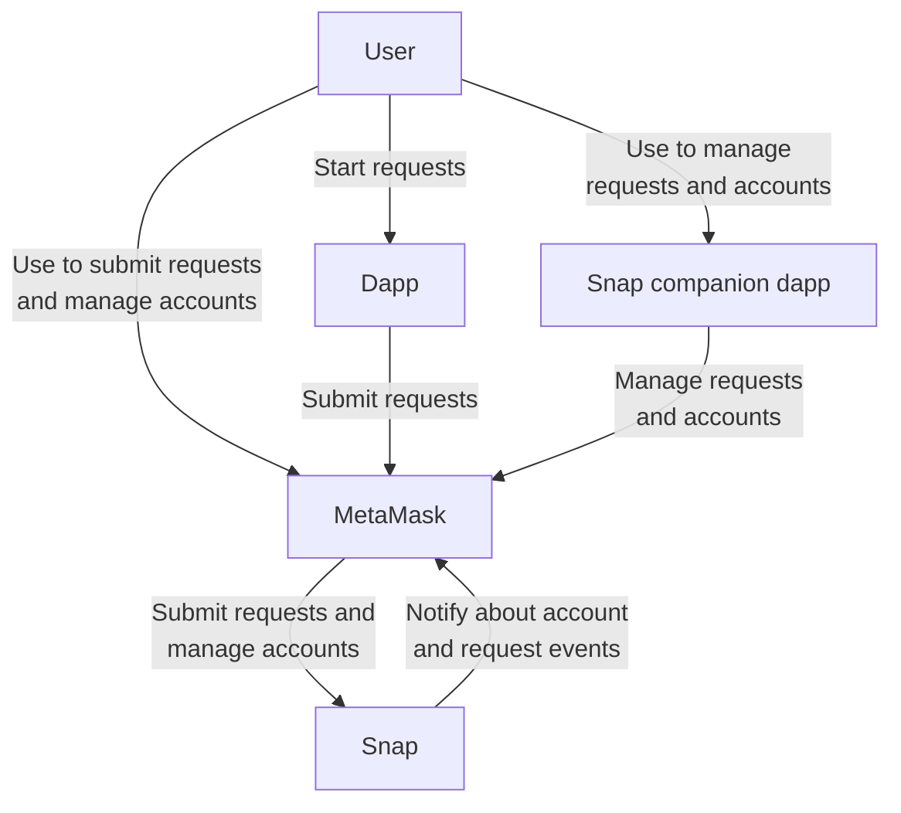
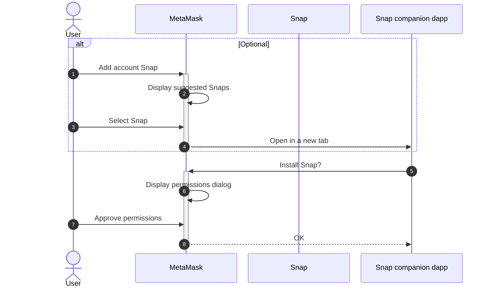
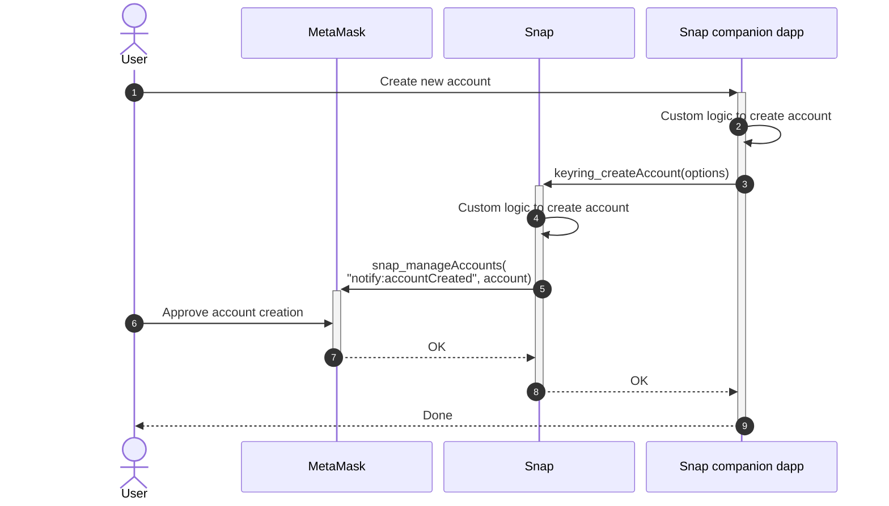
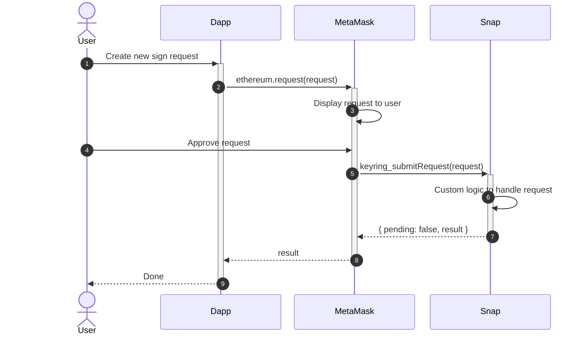
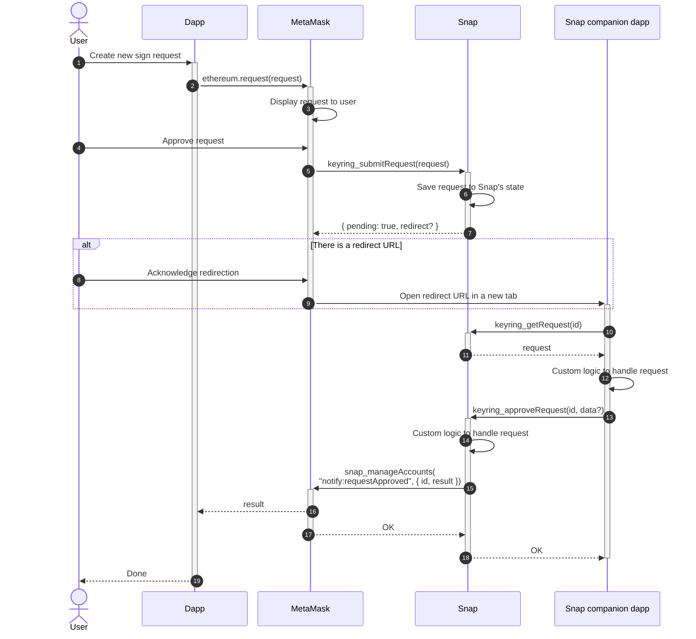
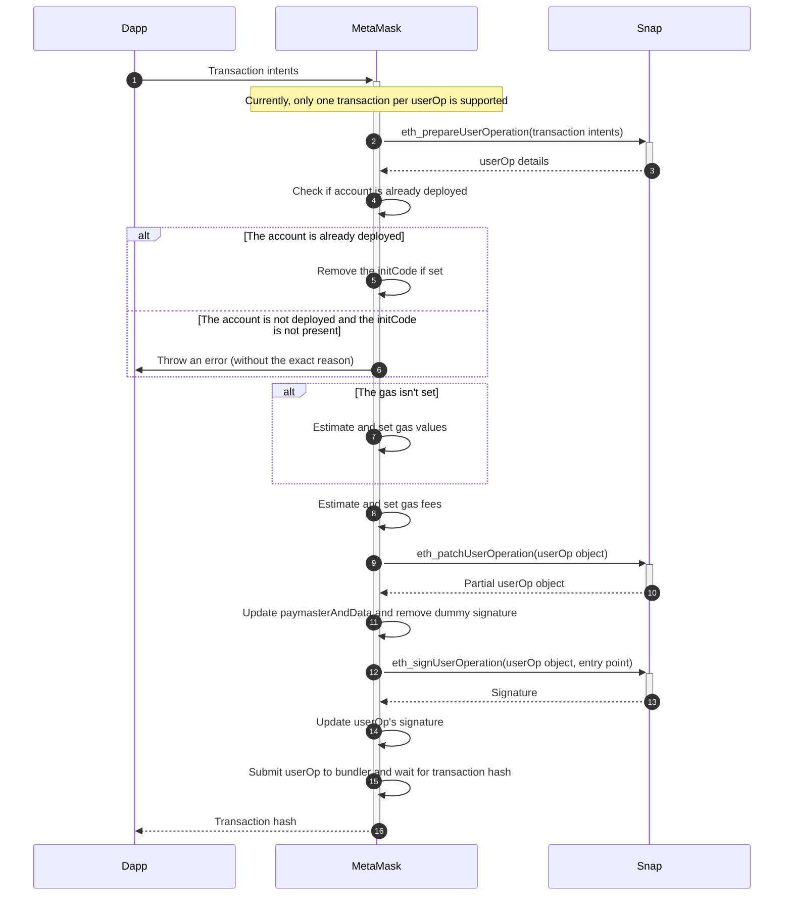

# Custom EVM accounts

The Keyring API integrates custom EVM accounts inside MetaMask.
You can use the Keyring API to display custom accounts, such as multi-party computation (MPC)
accounts and [ERC-4337 accounts](#account-abstraction-erc-4337), alongside regular MetaMask accounts
in the user interface:

To use the Keyring API, you first [implement the API in an account management Snap](create-account-snap.md)
(also known as an "account Snap").
You can then [call Keyring API methods from a companion dapp](create-companion-dapp.md)
to enable users to create and interact with the custom accounts.

:::tip see also

- [Create an account management Snap](create-account-snap.md)
- [Create an account management companion dapp](create-companion-dapp.md)
- [Account management Snap security guidelines](security.md)
- [Keyring API reference](../../reference/keyring-api/index.md)
  :::

## System context diagram

The following diagram shows the system context when interacting with accounts managed by an account
management Snap:

The diagram contains the following components:

- **User** - The user interacting with the dapp, the Snap companion dapp, and MetaMask.
- **Dapp** - The dapp requesting an action to be performed on an account.
- **MetaMask** - The wallet the dapp connects to.
  MetaMask routes requests to the account management Snap and lets the user perform some level of
  account management.
- **Snap** - The account management Snap that implements the Keyring API to manage the user's
  accounts and handle requests that use these accounts.
- **Snap companion dapp** - The Snap's user interface component that allows the user to interact with
  the Snap to manage accounts and requests.

## Account management Snap installation flow

The first process a user encounters when using an account management Snap is the Snap installation flow.
This process can be initiated through MetaMask's or the Snap companion dapp.
The flow looks like the following:

The MetaMask account selection modal has an option called **Add account Snap**.
This option shows a list of account management Snaps.
Each Snap redirects the user to the companion dapp that contains the user interface to configure and
manage the Snap.

## Custom account creation flow

Once the account management Snap is installed, the user can use the Snap companion dapp to create or
import custom accounts.
The flow looks like the following:

The companion dapp presents a user interface allowing the user to configure their custom account.
The dapp creates an account using [`keyring_createAccount`](../../reference/keyring-api/account-management/index.md#keyring_createaccount).

The Snap keeps track of the accounts that it creates using [`snap_manageState`](../../reference/snaps-api.md#snap_managestate).
Once the Snap has created an account, it notifies MetaMask using
[`snap_manageAccounts`](../../reference/snaps-api.md#snap_manageaccounts).

Once the Snap has created an account, that account can be used to sign messages and transactions.

## Transaction flows

The Keyring API supports two flows for handling requests: [synchronous](#synchronous-transaction-flow)
and [asynchronous](#asynchronous-transaction-flow).

In general, you should use the asynchronous flow when the request requires user interaction (for
example, using a hardware key or a threshold signature scheme) or when the request takes a long time
to complete.
You should use the synchronous flow for any other use case.

### Synchronous transaction flow

The synchronous flow looks like the following:

The flow starts when a user or dapp initiates a sign request.
At that point, MetaMask detects that this interaction is requested for an account controlled by the
account management Snap.

After the user approves the transaction in MetaMask, MetaMask calls
[`keyring_submitRequest`](../../reference/keyring-api/account-management/index.md#keyring_submitrequest),
which receives the original RPC request and returns a response with `pending` set to `false`, and
`result` set to the requested signature.

### Asynchronous transaction flow

The asynchronous flow looks like the following:

The flow starts the same way as the [synchronous flow](#synchronous-transaction-flow): a user or
dapp initiates a sign request.
After approval, MetaMask calls
[`keyring_submitRequest`](../../reference/keyring-api/account-management/index.md#keyring_submitrequest).

Since the Snap doesn't answer the request directly, it stores the pending request in its internal
state using [`snap_manageState`](../../reference/snaps-api.md#snap_managestate).
The Snap sends a `{ pending: true, redirect? }` response to indicate that the request will be
handled asynchronously.
This response can optionally contain a redirect URL that MetaMask will open in a new tab to allow
the user to interact with the Snap companion dapp.

The companion dapp gets the Snap's pending request using
[`keyring_getRequest`](../../reference/keyring-api/account-management/index.md#keyring_getrequest).
It resolves the request using
[`keyring_approveRequest`](../../reference/keyring-api/account-management/index.md#keyring_approverequest),
and the Snap resolves the request using [`snap_manageAccounts`](../../reference/snaps-api.md#snap_manageaccounts),
notifying MetaMask of the result.

## EOA methods

An account management Snap can implement the following methods to support dapp requests from
externally owned accounts (EOAs):

- [`personal_sign`](../../reference/keyring-api/chain-methods.md#personal_sign)
- [`eth_signTypedData_v4`](../../reference/keyring-api/chain-methods.md#eth_signtypeddata_v4)
- [`eth_signTransaction`](../../reference/keyring-api/chain-methods.md#eth_signtransaction)
- [Deprecated signing methods](/wallet/concepts/signing-methods/#deprecated-signing-methods)

## Account abstraction (ERC-4337)

:::flaskOnly
:::

Account abstraction, specified by [EIP-4337](https://eips.ethereum.org/EIPS/eip-4337), introduces
_user operations_ and enables users to manage smart contract accounts containing arbitrary
verification logic.
Users can use these ERC-4337 accounts instead of externally owned accounts as primary accounts.

An account management Snap can implement the following methods to support dapp requests from
ERC-4337 accounts:

- [`eth_prepareUserOperation`](../../reference/keyring-api/chain-methods.md#eth_prepareuseroperation)
- [`eth_patchUserOperation`](../../reference/keyring-api/chain-methods.md#eth_patchuseroperation)
- [`eth_signUserOperation`](../../reference/keyring-api/chain-methods.md#eth_signuseroperation)

The user operation signing flow in an ERC-4337 compatible account Snap looks like the following:

See the [ERC-4337 methods](../../reference/keyring-api/chain-methods.md#erc-4337-methods) for more
information about their parameters and response details.

## Examples

See the following example account management Snap implementations:

- [Simple Account Snap](https://github.com/MetaMask/snap-simple-keyring)
- [Simple Account Abstraction Snap](https://github.com/MetaMask/snap-account-abstraction-keyring/tree/main) (ERC-4337)
- [Biconomy Smart Account Snap](https://github.com/bcnmy/smart-account-keyring-template) (ERC-4337)
- [Silent Shard Snap](https://github.com/silence-laboratories/silent-shard-snap)
- [Safeheron MPC Snap](https://github.com/Safeheron/multi-mpc-snap-monorepo)
- [Capsule Keyring Snap](https://github.com/capsule-org/mm-snap-keyring)
