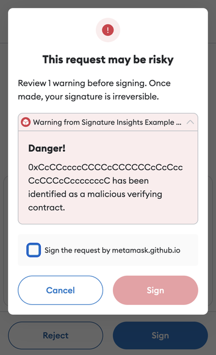

import Tabs from "@theme/Tabs";
import TabItem from "@theme/TabItem";

# Signature insights

:::flaskOnly
:::

You can provide signature insights before a user signs a message.
For example, you can warn the user about potentially dangerous signature requests.

## Steps

### 1. Request permission to display signature insights

Request the [`endowment:signature-insight`](../reference/permissions.md#endowmentsignature-insight)
permission by adding the following to your Snap's manifest file:

```json title="snap.manifest.json"
"initialPermissions": {
  "endowment:signature-insight": {}
}
```

If you need to receive the origin of the signature request, add `allowSignatureOrigin` to the
permission object, and set it to `true`:

```json title="snap.manifest.json"
"initialPermissions": {
  "endowment:signature-insight": {
    "allowSignatureOrigin": true
  }
}
```

### 2. Implement the `onSignature` entry point

Expose an [`onSignature`](../reference/entry-points.md#onsignature) entry point, which receives a
`signature` object.
The shape of this object depends on the chain and the signing method used.
This is why it's typed as `Record<string, unknown>`.

For Ethereum and Ethereum-compatible chains, the `signature` object can have one of the following
shapes, depending on the signing method used:

<Tabs>
<TabItem value="eth_sign">

```typescript
interface EthSignature {
  from: string
  data: string
  signatureMethod: "eth_sign"
}
```

</TabItem>
<TabItem value="personal_sign">

```typescript
interface PersonalSignature {
  from: string
  data: string
  signatureMethod: "personal_sign"
}
```

</TabItem>
<TabItem value="eth_signTypedData">

```typescript
interface SignTypedDataSignature {
  from: string
  data: Record<string, any>[]
  signatureMethod: "eth_signTypedData"
}
```

</TabItem>
<TabItem value="eth_signTypedData_v3">

```typescript
interface SignTypedDataV3Signature {
  from: string
  data: Record<string, any>
  signatureMethod: "eth_signTypedData_v3"
}
```

</TabItem>
<TabItem value="eth_signTypedData_v4">

```typescript
interface SignTypedDataV4Signature {
  from: string
  data: Record<string, any>
  signatureMethod: "eth_signTypedData_v4"
}
```

</TabItem>
</Tabs>

Your Snap should use `signatureMethod` as the source of truth to identify the signature scheme it is
providing insights for.

Once you've identified the signature object, your Snap can run any logic, including calling APIs.
Then, your Snap must either return `null` if it has no insights to provide, or an object with a
`content` property and an optional `severity` property as specified in the
[`onSignature`](../reference/entry-points.md#onsignature) entry point.

:::caution
Due to current MetaMask UI limitations, signature insights will only be displayed if your Snap's
logic deems the signature to be one that a user shouldn't sign, that is, if you return a severity
level of `SeverityLevel.Critical`.
:::

The following is an example implementation of `onSignature`:

```typescript title="index.ts"
import type { OnSignatureHandler, SeverityLevel } from "@metamask/snaps-sdk";
import { panel, heading, text } from "@metamask/snaps-sdk";

export const onSignature: OnSignatureHandler = async ({
  signature,
  signatureOrigin,
}) => {
  const insights = /* Get insights based on custom logic */;
  return {
    content: panel([
      heading("My Signature Insights"),
      text("Here are the insights:"),
      ...(insights.map((insight) => text(insight.value))),
    ]),
    severity: SeverityLevel.Critical,
  };
};
```

When your Snap returns a signature insight with a `severity` of `SeverityLevel.Critical`, the custom
UI displays in a modal after the user selects the **Sign** button.
For example:

<p align="center">



</p>

## Example

See the [`@metamask/signature-insights-example-snap`](https://github.com/MetaMask/snaps/tree/main/packages/examples/packages/signature-insights)
package for a full example of implementing signature insights.
