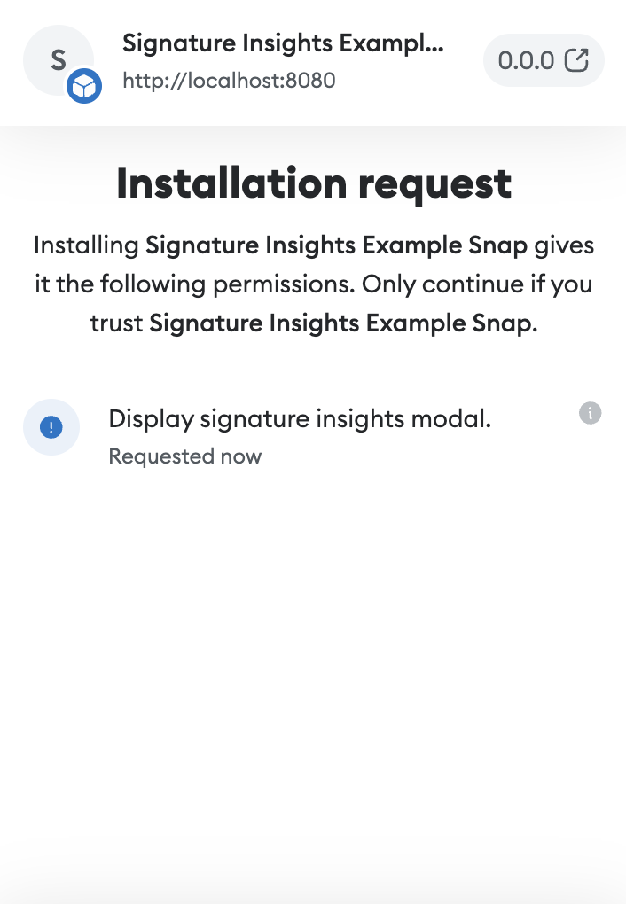

# Signature insights

:::flaskOnly
:::


Similarly to [providing transaction insights](../tutorials/transaction-insights.md), Snaps allows you to provide signature insights to your users.

## Steps

### 1. Request permission to display signature insights

To display signature insights to your users, you first need to add the [`endowment:signature-insight`](../reference/permissions.md#endowmentsignature-insight) permission to your Snap's manifest:

```json title="snap.manifest.json"
{
  "initialPermissions": {
    "endowment:signature-insight": {}
  }
}
```

Additionally, if you need to receive the origin of the signature request, you must add `allowSignatureOrigin` to the permission object, and set it to `true`:

```json title="snap.manifest.json"
{
  "initialPermissions": {
    "endowment:signature-insight": {
      "allowSignatureOrigin": true
    }
  }
}
```

When requesting the permission, this is how it will be displayed in the MetaMask UI when installing the Snap:



### 2. Implement `onSignature` and export it from `index.ts`

The next step is for your Snap to export an `onSignature` function. This function receives a `signature` object. The shape of this object depends on the chain, as well as on the signing method used. This is why it's typed as `Record<string, unknown>`.

For Ethereum and Ethereum-compatible chains, the `signature` object can have one of the following shapes, depending on the signging method used:

#### eth_sign

```typescript
interface EthSignature {
  from: string;
  data: string;
  signatureMethod: 'eth_sign';
}
```

#### personal_sign

```typescript
interface PersonalSignature {
  from: string;
  data: string;
  signatureMethod: 'personal_sign';
}
```

#### eth_signTypedData

```typescript
interface SignTypedDataSignature {
  from: string;
  data: Record<string, any>[];
  signatureMethod: 'eth_signTypedData';
}
```

#### eth_signTypedData_v3

```typescript
interface SignTypedDataV3Signature {
  from: string;
  data: Record<string, any>;
  signatureMethod: 'eth_signTypedData_v3';
}
```

#### eth_signTypedData_v4

```typescript
interface SignTypedDataV4Signature {
  from: string;
  data: Record<string, any>;
  signatureMethod: 'eth_signTypedData_v4';
}
```

Your Snap should use `signatureMethod` as the source of the truth to identify the signature scheme it is providing insights for.

Once you've identified the signature object, your Snap may run any logic it wants, including calling APIs. Then, your Snap must either return `null` if it has no insights to provide, or an object with a `content` property and an optional `severity` property.

The `content` object must be an instance of [Custom UI](./use-custom-ui.md). The `severity`, if provided, must be an instance of the `SeverityLevel` enum exported by the `@metamask/snaps-sdk` package. Currently the only severity level available is `SeverityLevel.Critical`.

:::caution
Due to current MetaMask UI limitations, signature insights will only be displayed if your Snap's logic deems the signature to be one that a user shouldn't sign, that is if you return a severity level of `SeverityLevel.Critical`.
:::

Here's an example implementation of `onSignature`:

```typescript
import { OnSignatureHandler, SeverityLevel } from '@metamask/snaps-types';
import { panel, heading, text } from '@metamask/snaps-ui';

export const onSignature: OnSignatureHandler = async ({
  signature,
  signatureOrigin,
}) => {
  const insights = /* Get insights based on custom logic */;
  return {
    content: panel([
      heading('My Signature Insights'),
      text('Here are the insights:'),
      ...(insights.map((insight) => text(insight.value)))
    ]),
    severity: SeverityLevel.Critical
  };
};
```

When your Snap returns a signature insight with a `severity` of `SeverityLevel.Critical`, the Custom UI will be displayed in a modal after the user presses the "Sign" button, like so:


## Reference

- [`endowment:signature-insight`](../reference/permissions.md#endowmentsignature-insight)
- [`onSignature` export](../reference/exports.md#onsignature)