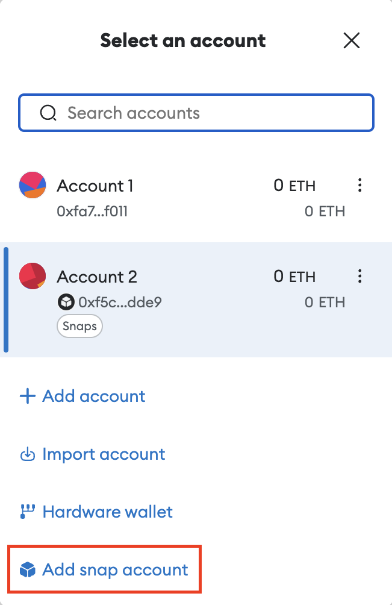

# Integrate custom EVM accounts in MetaMask

Using the [Snaps Keyring API](../concepts/keyring-api.md), you can integrate custom EVM accounts directly in MetaMask. These accounts will be displayed alongside MetaMask-controlled accounts in the UI:

Creating a keyring snap allows Dapps to connect to its accounts and submit requests like `personal_sign`, `eth_sendTransaction`, etc. as if these were regular, MetaMask-controlled accounts.

## Implementing a Keyring snap

The first step for creating a Keyring snap is to implement the [`Keyring` interface](../reference/keyring-api/modules.md#keyring). This interface describes all the methods necessary to make your custom EVM accounts work inside MetaMask with your own logic. The next sections will go over the methods of the `Keyring` interface by describing the different flows that it handles.

### Snap account creation flow

The first interaction between users and your Keyring snap will be the snap account creation process. The MetaMask account selection modal has an option called "Add snap account":

This option will show a list of keyring snaps, but will ultimately redirect the user to the companion Dapp for your Keyring snap. That is, a Dapp that contains all the UI to configure and manage the Keyring snap.

On that Dapp, you'll present a custom user interface allowing the user configure their custom EVM account. The Dapp will make use of the [`KeyringSnapRpcClient`'s `createAccount` method](../reference/keyring-api/classes/KeyringSnapRpcClient.md#createaccount), which will call your `Keyring` class' method of the same name. An example of this can be found in the [Simple keyring snap companion Dapp](https://github.com/MetaMask/snap-simple-keyring/blob/d3f7f0156c59059c995fea87f90a3d0ad3a4c135/packages/site/src/pages/index.tsx#L136).

In your `Keyring` class' `createAccount` method, your responsibility is to create the account based on the parameters that were passed to you. Your snap has to keep track of the accounts that it creates, which can be done using [`snap_manageState`](../reference/rpc-api.md#snap_managestate). Once your snap has created an account, it should notify MetaMask using the [`snap_manageAccounts` `createAccount` method](../reference/rpc-api.md#createaccount). An example of this process can be found in the [Simple keyring snap code](https://github.com/MetaMask/snap-simple-keyring/blob/d3f7f0156c59059c995fea87f90a3d0ad3a4c135/packages/snap/src/keyring.ts#L61).

Once your snap has created an account, that account can be used to sign messages and transactions. In the following sections we'll look at how this can be done.

### Synchronous signing flow

Your Keyring snap will implement the simple flow if it's able to sign transactions directly. This would be the case if the snap doesn't need a third-party such as a hardware key or a second account's signature, as would be the case for a threshold signature scheme. The flow would look like this:

For a full example of a simple keyring snap, see [`snap-simple-keyring` on GitHub](https://github.com/MetaMask/snap-simple-keyring).

The flow starts when a Dapp calls a method such as `personal_sign` or `eth_signTransaction`, or when the user initiates a new funds transfer from the MetaMask UI. At that point, MetaMask will detect that this interaction is requested for an account controlled by your Keyring snap.

After the user approves the transaction in the UI, MetaMask will call the `submitRequest` method of your `Keyring` class. `submitRequest` will receive the original RPC request, and will need to return a [`SubmitRequestResponse`](../reference/keyring-api/modules.md#submitrequestresponsestruct) with `pending` set to `false`, and `result` set to the requested signature.

:::caution
If your Keyring snap receives an `eth_sendTransaction` request, you must treat it like an `eth_signTransaction` request. That is, your snap is responsible for providing the signature in the response, and MetaMask is responsible for broadcasting the transaction.
:::

### Asynchronous signing flow

If your keyring snap implements a more complex scheme, e.g. threshold signing, then the flow will be more involved, and more `Keyring` methods will be used. The diagram below will help you visualize the flow:

The flow starts the same way: a request to sign a transaction or arbitrary data is initiated by a Dapp or by the user. After approval, your snap's `submitRequest` method is called. 

Since your snap won't answer the request directly, it should store the pending request in its internal state using [`snap_manageState`](../reference/rpc-api.md#snap_managestate). This list of pending requests should be returned when the `listRequests` or `getRequest` methods of your `Keyring` class are called.

After storing the pending request, your snap should direct the user to a "companion Dapp" – a Dapp that serves as UI for the snap – where the rest of the flow can continue. Your snap can do this by creating a pop-up using [`snap_dialog`](../reference/rpc-api.md#snap_dialog) instructing the user to go to the companion Dapp's URL.

The Dapp will list your snap's pending requests using an RPC call facilitated by the [`KeyringSnapRpcClient`'s `listRequests` method](../reference/keyring-api/classes/KeyringSnapRpcClient.md#listrequests). The user can then act on those requests using whatever process applies to the snap.

Once the signing process is completed, the companion Dapp will resolve the request using the [`KeyringSnapRpcClient`'s `approveRequest` method](../reference/keyring-api/classes/KeyringSnapRpcClient.md#approverequest), which will call the snap's `Keyring` method of the same name. This method receives the request's ID, as well as the final result.

When `approveRequest` gets called, it can resolve the pending request by using the [`snap_manageAccounts`' `submitResponse` method](../reference/rpc-api.md#submitresponse).
