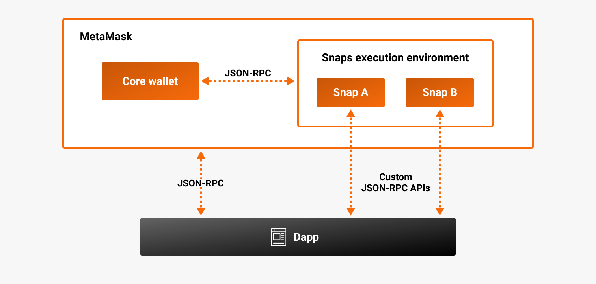
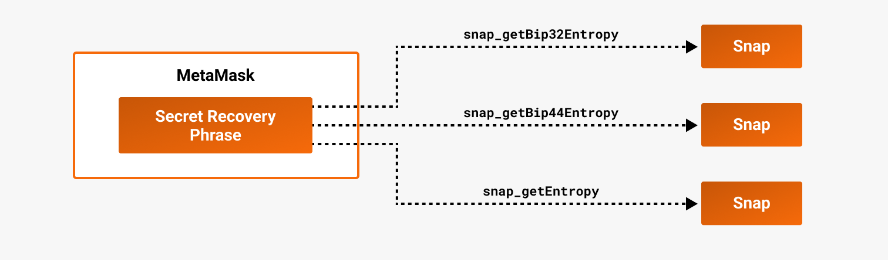

# About Snaps

MetaMask Snaps is an open source system that allows anyone to safely extend the functionality of
MetaMask, creating new web3 end user experiences.
For example, a Snap can add support for different blockchain networks, add custom account types, or
provide additional functionality using its own APIs.
This allows MetaMask to be used with a far more diverse set of protocols, dapps, and services.

The following diagram outlines the high-level architecture of the Snaps system:

The following diagram illustrates how Snaps can [derive non-EVM keys](../../features/non-evm-networks.md) using
[`snap_getBip32Entropy`](../../reference/snaps-api.md#snap_getbip32entropy),
[`snap_getBip44Entropy`](../../reference/snaps-api.md#snap_getbip44entropy), and
[`snap_getEntropy`](../../reference/snaps-api.md#snap_getentropy):

:::caution important
Snaps cannot access the user's Secret Recovery Phrase.
Snaps can only derive non-EVM keys using the provided methods.
Furthermore, any Snap that derives keys must undergo a security audit before it can be made
available to MetaMask users.
:::

## Technical overview

A Snap is a JavaScript program run in an isolated and secure [execution environment](execution-environment.md).

### Permissions

By default, a Snap has no capabilities.
It must [request permissions](../../how-to/request-permissions.md) for various capabilities to be
granted by the user at installation, such as accessing the network, storing data in MetaMask, or
displaying dialogs.
Data stored by a Snap is only visible to that Snap, and a Snap cannot access data of other Snaps or
of MetaMask core unless given permission to do so.

### APIs

A Snap can communicate with MetaMask using the [Snaps API](../../reference/snaps-api.md) and some
[MetaMask JSON-RPC API](/wallet/reference/json-rpc-methods) methods.
The Snaps API allows Snaps to extend or modify the functionality of MetaMask, and communicate with
other Snaps.

Dapps can use the [Wallet API for Snaps](../../reference/wallet-api-for-snaps.md) to install and
communicate with Snaps.

A Snap can implement its own custom JSON-RPC API to communicate with dapps and other Snaps.

Learn more [about the Snaps APIs](apis.md).

### User interface

A Snap must represent itself and what it does to the end user.
The user can see their installed Snaps in the MetaMask settings page.
For each Snap, the user can:

- See most of its manifest file data.
- See its execution status (running, stopped, or crashed).
- Enable and disable the Snap.

A Snap can also display a [home page](../../features/custom-ui/home-pages.md) within MetaMask that
the user can access using the Snaps menu.

Other than the settings page and home page, a Snap can modify the MetaMask UI by displaying
[custom UI](../../features/custom-ui/index.md) in
[dialogs](../../features/custom-ui/dialogs.md),
[transaction insights](../../features/transaction-insights.md),
[signature insights](../../features/signature-insights.md), and
[notifications (expanded view)](../../features/notifications.md#expanded-view).
An [account management Snap](../../features/custom-evm-accounts/index.md) can also modify the MetaMask UI by leveraging native account UX.

Many Snaps must use companion dapps and custom JSON-RPC API methods to
present data to the user.

:::note
Providing more ways for Snaps to modify the MetaMask UI is an important goal of the Snaps system,
and over time more and more Snaps will be able to contain their user interfaces entirely within
MetaMask itself.
:::

### Lifecycle

A Snap wakes up in response to messages or events, and shuts down when idle.
Also, if MetaMask detects that a Snap becomes unresponsive, it shuts the Snap down.

A Snap is considered unresponsive if one of the following occurs:

- It hasn't received a JSON-RPC request for 30 seconds.
- It takes more than 60 seconds to process a JSON-RPC request.

Stopped Snaps start whenever they receive a JSON-RPC request, unless they're disabled.
If a Snap is disabled, the user must re-enable it before it can start again.
