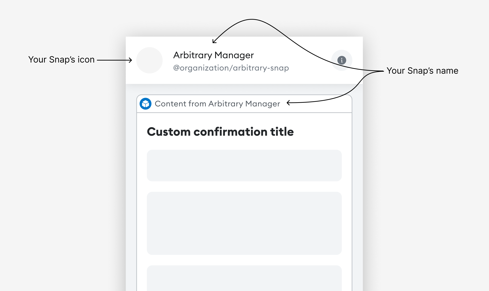

# Snaps design guidelines

This page outlines guiding principles for designers, developers, builders, and writers to create
Snap installation flows that are accessible to all users.
Use these guidelines when introducing your Snap within a companion dapp.

## Why this matters

The Snap installation process contains critical info about your Snap, including what it does, how it
enhances your application, and why it's beneficial for users.
It's important to provide this information in your companion dapp to help users understand the
purpose and benefits of the Snap before installing it.
Without this information, users may drop out during installation or install the Snap without fully
understanding its purpose.

## Guidelines at a glance

Ensure your Snap metadata follows these guidelines:

- Keep your Snap's name to **21 characters or fewer** (including spaces).
- Use a descriptive name&mdash;don't use "Snap" in the name.
- Use short and simple copy.
- Your Snap's icon should fit in a **32px circular frame, SVG format**.

**Before** asking for permission to install, provide users with clear and concise information about:

- _What_ the Snap does and _how_ it meets their needs.
- _How_ the Snap works.
- Any _security precautions_ they should know.

Write in active voice and use sentence case.
Avoid jargon&mdash;write in plain language that can be understood by all users.

## Think like your users, write like a human

Consider whether the details that interest you as a developer are relevant to the user's experience.
Often, content can be drastically reduced by cutting jargon and run-on sentences.
Read your content out loud to hear what stands out in your messaging.
If something is hard to say, it's probably hard to read.

- **Be clear.**
  When labeling buttons or actions, use descriptive action verbs instead of vague phrases.
  For example, "Install" is more clear than "Complete."

- **Be concise.**
  Use short, simple words and avoid jargon.
  Make every word earn its place on the screen.

- **Be consistent.**
  Identify synonyms and eliminate them.
  Each important object and action should have a single word to represent it.
  Inconsistency can blur the lines for users, creating uncertainty and confusion.

## Introduce your Snap

When you introduce your Snap, take this opportunity to highlight the benefits of your Snap with the
intended user.
If the user doesn't understand what they can gain from your Snap, they likely won't install it.

Consider introducing your Snap in your companion dapp using a modal, tooltip, or card.
This introduction should be impactful, clear, and direct, and can happen before or alongside the
installation prompt.

Important details to include when introducing your Snap:

- _What_ your Snap does, _why_ someone would use it, and _how_ it works.
- _Security precautions_ in plain language that anyone can understand.
- Descriptions of the features that make your Snap appealing to the intended users.

Use conversational language when describing your Snap.
If you need to use a technical term, briefly define it first.
For example:

| Don't do this                                                                                                                                                              | Do this instead                                                                  |
|----------------------------------------------------------------------------------------------------------------------------------------------------------------------------|----------------------------------------------------------------------------------|
| ❌ _Allow the Snap to perform actions that run periodically at fixed times, dates, or intervals. This can be used to trigger time-sensitive interactions or notifications._ | ✅ _Let this Snap schedule and run recurring tasks or notifications._             |
| ❌ _Allow this Snap to display notifications regarding your ENS expiration._                                                                                                | ✅ _Let this Snap notify you when your Ethereum Name Service is about to expire._ |

## Embed in existing flows

Introduce your Snap as a natural extension of existing elements on your screen, and suggest
installation when the time is right.
This can be a make or break moment for your Snap, so put yourself in the shoes of the intended user.

Don't ask the user to install your Snap before they do anything in the dapp, as they will probably decline.
Instead, **wait to prompt installation until a point when the Snap is required**.

In the following example, a key management Snap is suggested when the user is prompted to pick networks:

## Optimize your metadata

Your Snap's icon and name are among the first things a user sees when deciding whether to install
your Snap.
These are also a key part of your Snap's identity, so it's worth spending time on this step.

**Icon**

Your Snap's icon should fit in a **32px circular frame in SVG format**.
Avoid using images with small details, as they won't be impactful in the allotted space.
Use something bold, simple, and easily understood.

The icon must be a valid SVG. 
It should be clearly visible on both light and dark backgrounds. 
It should also be square, or else it will be stretched or cropped.

You can use [SVGviewer.dev](https://www.svgviewer.dev/) to validate and optimize your SVG.

**Name**

Your Snap's name should be short and easy to remember.
It should be **21 characters maximum** (including spaces) so it is easy to read and fits comfortably
on small screens.

Use a descriptive name to help users understand how they benefit from installing your Snap, and
increase the likelihood that they will install and use it.
Don't use the word "Snap" in your name—your name should be specific and memorable, differentiating
your Snap from others.
For example:

| Don't do this                | Do this instead     |
|------------------------------|---------------------|
| ❌ _Solana Snap_              | ✅ _Solana Manager_  |
| ❌ _Snap for Filecoin_        | ✅ _Filecoin Wallet_ |
| ❌ _Best manager for Bitcoin_ | ✅ _Bitcoin Helper_  |

**How metadata is displayed**

The following images demonstrate how your Snap's icon and name are displayed during installation,
transaction insights, and custom dialogs:

## Enhance your copy

At MetaMask, we use an in-depth style guide to inform our copywriting decisions.
Here are some ways to enhance your own copy so it feels more at home in the MetaMask ecosystem.

### Capitalization

With few exceptions, use sentence-style capitalization.
Not only is sentence case more casual and conversational, but it's also easier to scan than title case.

### Active voice

Write your copy in active voice.
There might be certain situations where passive voice is the better option, but most cases call for
active voice.
For example:

| Don't do this                         | Do this instead                     |
|---------------------------------------|-------------------------------------|
| ❌ _The problem is being investigated_ | ✅ _We're investigating the problem_ |

## Design for all users

Use accessible design to enable people of all abilities and in all locations to benefit from your Snap.
Important accessibility tips include the following:

- [Provide sufficient color contrast.](https://www.w3.org/WAI/tips/designing/#provide-sufficient-contrast-between-foreground-and-background)
  Ensure foreground text color has sufficient contrast with background colors.

- [Make interactive elements easy to identify.](https://www.w3.org/WAI/tips/designing/#ensure-that-interactive-elements-are-easy-to-identify)
  Provide distinct and consistent styles for interactive elements, such as links and buttons.

- [Write meaningful image alternative text.](https://www.w3.org/WAI/tips/writing/#write-meaningful-text-alternatives-for-images)
  Screen reader users rely on image alternative text, so ensure that it clearly describes the
  information or function of the image.

- [Provide clear instructions.](https://www.w3.org/WAI/tips/writing/#provide-clear-instructions)
  Ensure that instructions, error messages, and other copy are easy to understand even for
  non-native English speakers.

For more important tips, refer to W3C's guidelines on
[Designing for Web Accessibility](https://www.w3.org/WAI/tips/designing/) and
[Writing for Web Accessibility](https://www.w3.org/WAI/tips/writing/).
