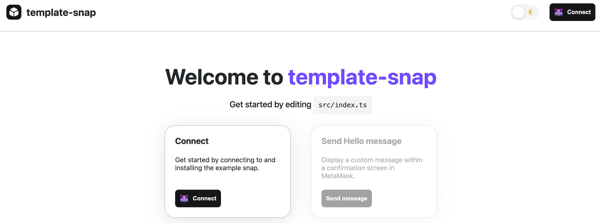
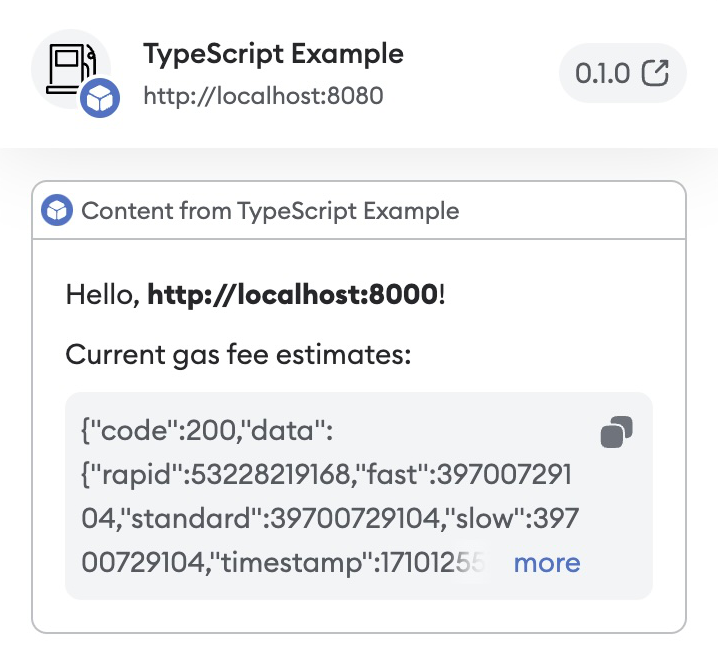

# Create a gas estimation snap

This tutorial walks you through creating a snap that estimates gas fees.
The snap uses the `fetch` API to request information from the internet, and displays custom
information in a confirmation dialog.

## Prerequisites

- [Snaps installed](../get-started/install-snaps.md)
- A text editor (for example, [VS Code](https://code.visualstudio.com/))
- [Yarn](https://yarnpkg.com/) version 3

## Steps

### 1. Set up the project

Create a new snap project using the [`@metamask/create-snap` CLI](https://github.com/MetaMask/snaps/tree/main/packages/create-snap) by running:

```bash
yarn create @metamask/snap gas-estimation-snap
```

or

```bash
npm create @metamask/snap gas-estimation-snap
```

Next, `cd` into the `gas-estimation-map` project directory and run:

```bash
yarn install
```

This will initialize your development environment with the required dependencies.

### 2. Set a custom icon

Open `/packages/snap/snap.manifest.json` in a text editor.
This file contains the main configuration details for your snap.
Edit the `npm` object (within the `location` object) and change the value for the `iconPath` key by giving the path `"images/gas.svg"` to your new icon:

```json title="snap.manifest.json"
"location": {
   "npm": {
      "filePath": "dist/bundle.js",
      "iconPath": "images/gas.svg",
      "packageName": "snap",
      "registry": "https://registry.npmjs.org/"
   }
}
```

Next, download [this free `gas.svg` icon file](https://raw.githubusercontent.com/Montoya/gas-fee-snap/main/packages/snap/images/gas.svg) into the `/packages/snap/images` folder.
This is a free icon, **Gas** by Mello from
[Noun Project](https://thenounproject.com/browse/icons/term/gas/).

### 3. Enable network access

To enable your snap to use the `fetch` API, make a request for the
[`endowment:network-access`](../reference/permissions.md#endowmentnetwork-access) permission by
adding `"endowment:network-access": {}` to the `initialPermissions` object in `snap.manifest.json`:

```json title="snap.manifest.json"
"initialPermissions": {
  "snap_dialog": {},
  "endowment:rpc": {
    "dapps": true,
    "snaps": false
  }, 
  "endowment:network-access": {}
},
"manifestVersion": "0.1"
...
```

### 4. Fetch gas fee estimates

Open `/packages/snap/src/index.ts`.
This is the main code file for your snap.
To get a gas fee estimate, use the public API endpoint provided by
[Open Source Ethereum Explorer](https://beaconcha.in/).
Add the following `getFees()` function to the top of the file:

```typescript title="index.ts"
import { OnRpcRequestHandler } from '@metamask/snaps-types';
import { panel, text } from '@metamask/snaps-ui';

async function getFees() {
  const response = await fetch('https://beaconcha.in/api/v1/execution/gasnow'); 
  return response.text();
}
```

Next, modify the snap RPC message handler that displays the confirmation window.
This handler uses a switch statement to handle various request methods, but in this case there is
only one method, `hello`.
For this method, the handler returns a call to MetaMask with the parameters to display a
confirmation window, and passes some static strings.

Since `getFees()` returns a promise, you must use `then()` to resolve it in your `hello` method.
Rewrite the `hello` method with the following code:

```typescript title="index.ts"
export const onRpcRequest: OnRpcRequestHandler = ({ origin, request }) => {
  switch (request.method) {
    case 'hello':
      return getFees().then(fees => {
        return snap.request({
          method: 'snap_dialog',
          params: {
            type: 'alert',
            content: panel([
              text(`Hello, **${origin}**!`),
              text(`Current gas fee estimates: ${fees}`),
            ]),
          }
        });
      });
    default:
      throw new Error('Method not found.');
  }
};
```

### 5. Build and test the snap

To build and test your snap:

1. Open `package.json` in the root directory of the project, and increase the `"version"` (if the `"version"` is
    `0.1.0`, increase it to `0.2.0`).

2. From the command line, run `yarn start`.
    On the Terminal, at the bottom of the message log, you will see the browser url address:

    ```bash
    You can now view site in the browser.
    
      http://localhost:8000/
    ```

3. Open [`localhost:8000`](http://localhost:8000/) in your browser (with MetaMask Flask installed).
    A page like the following displays:

    

    This is a boilerplate test dapp for installing and testing your snap.

4. Select **Connect** to connect Flask to the dapp.
    After connecting, you're prompted to install the snap with the following permissions:

    - **Allow websites to communicate directly with this snap.**
    - **Access the internet.**
    - **Display dialog windows in MetaMask.**

5. Select **Approve & install**.

6. After install, the **Send message** button on the page will be enabled. Click on this **Send message** button. A dialog prompt displays with the response from the gas fee API:

<p align="center">



</p>

Congratulations!
You've integrated a public API into MetaMask and displayed real-time gas fee estimates.

### 6. Next steps

Next, you can try:

- Parsing the JSON response from the remote API.
- Displaying the fees in a nicely formatted way.

You can also update the fields in `snap.manifest.json` to match your custom snap:

- `proposedName` - The name of your snap.
- `description` - The description of your snap.
- `repository` - The URL of your cloned GitHub repository.
- `source` - The `shasum` is set automatically when you build from the command line.
  If you decided to publish your snap to npm, update the `location` to its published location.

Similarly, you should update the `name`, `version`, `description`, and `repository` sections of
`/packages/snap/package.json` even if you do not plan to publish your snap to [`npm`](https://www.npmjs.com/).

:::tip
The `version` field in `snap.manifest.json` inherits the `version` field from `package.json`.
:::

Lastly, you can update the content of `/packages/site/src/pages/index.tsx`, such as changing the
name of the method for showing gas fee estimates.
If you change the method name, make sure to change the method name in `/packages/snap/src/index.ts`
to match.

After you have made all necessary changes, you can
[publish your snap to npm](../how-to/develop-a-snap.md#publish-your-snap).
