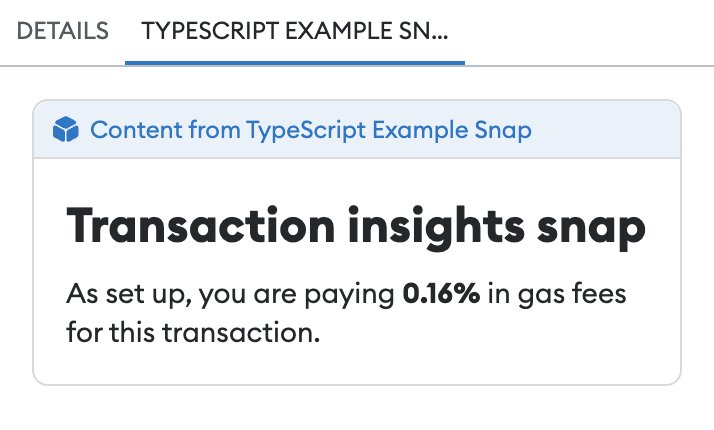

# Create a transaction insights snap

This tutorial walks you through creating a snap that calculates the percentage of gas fees that
a user would pay when creating a transaction.
The snap is based on the
[Snaps template](https://github.com/MetaMask/template-snap-monorepo), and it provides transaction
insights in the MetaMask transaction window.

## Prerequisites

- [Snaps installed](../get-started/install-snaps.md)

- An account on your MetaMask Flask instance with testnet ETH.
  For example, you can use Alchemy's [Goerli](https://goerlifaucet.com/) or
  [Sepolia](https://sepoliafaucet.com/) faucet to get testnet ETH.

- A text editor (for example, [VS Code](https://code.visualstudio.com/))

- [Yarn](https://yarnpkg.com/) version 3

## Steps

### 1. Set up the project

Use the Snaps template by
[creating a new repository from the template](https://github.com/MetaMask/template-snap-monorepo/generate).

Give your project a new name, such as `transaction-insights-snap`.

[Clone the repository](https://docs.github.com/en/repositories/creating-and-managing-repositories/cloning-a-repository)
using the command line:

```bash
git clone git@github.com:<your-username>/transaction-insights-snap.git
```

To initialize your development environment with the required dependencies, in your project
directory, enter the command `yarn`.

### 2. Enable transaction insights and the Ethereum provider

The template snap is set up to expose a JSON-RPC API with a simple hello command, which brings up a
dialog box.
In contrast, the snap you're creating in this tutorial doesn't expose any API.
Instead, it provides transaction insights directly in the MetaMask transaction window.

In particular, the snap shows the user the percentage of gas fees they would pay for their transaction.
It gets the current gas price by calling the
[`eth_gasPrice`](https://metamask.github.io/api-playground/api-documentation/#eth_gasPrice) RPC
method using the global Ethereum provider made available to snaps.

To enable your snap to provide transaction insights and use the global Ethereum provider, open
`/packages/snap/snap.manifest.json` in a text editor.
Request the
[`endowment:transaction-insight`](../reference/permissions.md#endowment--transaction-insight) and
[`endowment:ethereum-provider`](../reference/permissions.md#endowment--ethereum-provider)
permissions by modifying `initialPermissions`:

```json title="snap.manifest.json"
"initialPermissions": {
  "endowment:transaction-insight": {},
  "endowment:ethereum-provider": {}
}
```

### 3. Calculate and display the percentage of gas fees

To calculate and display the gas fees a user would pay as a percentage of their outgoing transaction,
replace the code in `/packages/snap/src/index.ts` with the following:

```typescript title="index.ts"
import { OnTransactionHandler } from '@metamask/snaps-types';
import { heading, panel, text } from '@metamask/snaps-ui';

// Handle outgoing transactions.
export const onTransaction: OnTransactionHandler = async ({ transaction }) => {

  // Use the window.ethereum global provider to fetch the gas price.
  const currentGasPrice = await window.ethereum.request({
    method: 'eth_gasPrice',
  });
  
  // Get fields from the transaction object.
  const transactionGas = parseInt(transaction.gas as string, 16);
  const currentGasPriceInWei = parseInt(currentGasPrice ?? '', 16);
  const maxFeePerGasInWei = parseInt(transaction.maxFeePerGas as string, 16);
  const maxPriorityFeePerGasInWei = parseInt(
    transaction.maxPriorityFeePerGas as string,
    16,
  );

  // Calculate gas fees the user would pay.
  const gasFees = Math.min(
    maxFeePerGasInWei * transactionGas,
    (currentGasPriceInWei + maxPriorityFeePerGasInWei) * transactionGas,
  );

  // Calculate gas fees as percentage of transaction.
  const transactionValueInWei = parseInt(transaction.value as string, 16);
  const gasFeesPercentage = (gasFees / (gasFees + transactionValueInWei)) * 100;

  // Display percentage of gas fees in the transaction insights UI.
  return {
    content: panel([
      heading('Transaction insights snap'),
      text(
        `As set up, you are paying **${gasFeesPercentage.toFixed(
          2,
        )}%** in gas fees for this transaction.`,
      ),
    ]),
  };
};
```

### 4. Build and test the snap

To build and test your snap:

1. From the command line, run `yarn start` in the root of your project.
    This starts two development servers: one for watching and compiling the snap, and another for the
    React site.
    The snap bundle is served from `localhost:8080`, and the site is served from `localhost:8000`.
    You should get a message that includes:

    ```bash
    You can now view site in the browser.
    
      http://localhost:8000/
    ```

2. Open [`localhost:8000`](http://localhost:8000) in your browser (with MetaMask Flask installed).

3. Select **Connect**, and accept the permission request.

4. After connecting, you're prompted to install the snap with the **Fetch and display transaction
    insights** and **Access the Ethereum provider** permissions.
    Select **Approve & install**.

5. From MetaMask Flask, create a new testnet ETH transfer.
    You can set up multiple accounts to transfer between your accounts.

6. On the confirmation window, switch to the tab named **TYPESCRIPT EXAMPLE SNAP**.
    Switching to the tab activates the [`onTransaction`](../reference/exports.md#ontransaction)
    export of your snap and displays the percentage of gas fees in the transaction insights UI:

<p align="center">



</p>

### 5. Display a different UI for contract interactions

The snap should only display a gas fee percentage if the user is doing a regular ETH transfer.
For contract interactions, it should display a UI that conveys that message.
Add the following code to the beginning of the `onTransaction` export:

```typescript
if (typeof transaction.data === 'string' && transaction.data !== '0x') {
  return {
    content: panel([
      heading('Percent Snap'),
      text(
        'This snap only provides transaction insights for simple ETH transfers.',
      ),
    ]),
  };
}
```

### 6. Next steps

The initial project has generic names in multiple places.
You can update the fields in `snap.manifest.json` to match your custom snap:

- `proposedName` - The name of your snap.
  This replaces **TYPESCRIPT EXAMPLE SNAP** in the transaction insights UI.
- `description` - The description of your snap.
- `repository` - The URL of your cloned GitHub repository.
- `source` - The `shasum` is set automatically when you build from the command line.
  If you decided to publish your snap to npm, update the `location` to its published location.

Similarly, you should update the `name`, `version`, `description`, and `repository` sections of
`/packages/snap/package.json` even if you don't plan to publish your snap to npm.

:::note
The `version` field in `snap.manifest.json` inherits the `version` field from `package.json`.
:::

Lastly, you can update the content of `/packages/site/src/pages/index.tsx`, such as removing the
template **Send Hello** button.

Once you've made all necessary changes, you can
[publish your snap to npm](../how-to/develop-a-snap.md#publish-your-snap).
