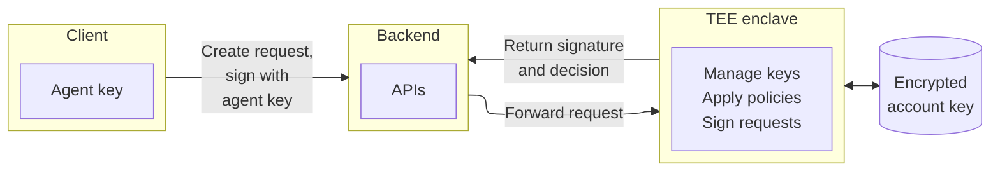

MetaMask has specialized in creating fast and secure non-custodial wallets across the web3 ecosystem.
With [ERC‑8004](https://eips.ethereum.org/EIPS/eip-8004) standardizing how AI agents express what they intend to do, there is a clear need for a fast, safe, multichain signing backend, more commonly known as a *server wallet*.
In the near future, even non-web3-native developers will require server wallets, so it's important to outline an ideal architecture.

This page describes a production‑oriented architecture you can adopt today and hints at where MetaMask is going next with a one-click ERC‑8004 server wallet experience.

## What is a server wallet?

A server wallet is a backend signer that manages private keys on behalf of an app or AI agent, while clients authenticate requests and receive signatures to submit onchain.
The signing key lives in a secure environment, so it is never exposed directly to the AI agent and is protected by certain policies set for its execution.

## Reference architecture

The following is a high-level server wallet architecture:

- The client holds an *agent key* used to authenticate who is asking to sign; this is separate from the onchain *account key* that controls funds.​
- The backend exposes minimal APIs that forward requests to a trusted execution environment (TEE) — for example, [AWS Nitro Enclaves](https://aws.amazon.com/ec2/nitro/nitro-enclaves/).
- The TEE enclave is the only environment allowed to verify agent keys, generate account keys, decrypt keys, apply policy, and produce signatures.
  It has no external networking and no persistent storage.
- The encrypted key and metadata live in a database outside the enclave, encrypted by the agent key.

This is an example request flow:

1. The client creates a request describing the action and signs it with the agent key to prove origin and integrity.
2. The backend passes the request into the enclave, which has no external networking, SSH, or persistent storage to reduce exposure.
3. The enclave verifies the signature, checks policy, signs the request if allowed, and returns only the signature and decision metadata to the backend.

## Core security operations

The following describes security operations related to managing and using keys:

### Generate an account key

1. The client sends a request with the agent key.
2. The account keypair is created inside the enclave and encrypted using the agent key.
3. The encrypted blob is stored in a database alongside the public address of the agent key​.

### Import the account key

1. The agent has the private key on the client side.
2. The SDK encrypts the private key with the agent key.
3. The import API is called with the encrypted blob which stores it in the database alongside the public address of the agent key.

### Sign a request

1. The client authenticates a request with the agent key.
2. The TEE validates the request, enforces policy, and signs the request.
3. The TEE returns a signature without exposing key material.​

### Export the account key

1. The client sends an export request with the agent key.
2. The TEE validates the request, enforces policy, and signs the request.
3. The TEE returns the encrypted blob stored in the database, which can be decrypted on the client side with the agent key.​

### Rotate the agent key

1. A new agent key is generated on the client side.
2. It is authenticated with the existing agent key by the enclave, enforcing the policies.
3. The encrypted blob decrypted is re-encrypted using the new agent key and stored against the new public address of the agent key.

### Reference TEE policies

The following are important TEE policies for security operations:

- **Spend limits** - Limit the value per transaction and per day.
- **Scope limits** - Limit the scope to allowlisted contracts, methods, and tokens.
- **Chain limits** - Allow only the networks you support.
- **Frequency limits** - Throttle bursts to reduce risk.
- **Simulation checks** - Sign only if a dry‑run looks safe.
- **Human approval** - Require a second click for unusual activity.

## Architectural questions

### Why use a trusted execution environment (TEE)?

Currently, [MetaMask Embedded Wallets](/embedded-wallets) give the signer direct access to the frontend/backend environment where the operations need to happen.
With a wallet secret present in the execution environment, able to access the TEE operations, both are equally secure.

However, with a TEE, you can add a policy engine, which can restrict certain operations.
This might not be useful for general user accounts, but an AI agent has a higher chance of hallucinating and behaving unpredictably.
A TEE policy engine can help resolve this issue.

### Why not TSS MPC?

The [MPC Core Kit SDKs](/embedded-wallets/infrastructure/mpc-architecture) offered with MetaMask Embedded Wallets are a great option for this — however, TSS signing speed becomes a bottleneck.
Even with a DKLS19 solution, it takes 4-5 seconds to sign with 5 nodes holding the key.
You can reduce the number of nodes and use a high quality server, but that still cannot match the speed of single key signing.
MPC's decentralization benefits are real, but for this product goal — fast server-side signing with tight policy and attestation — the latency and complexity tradeoffs are unnecessary.

## Server wallets and ERC-8004

With [ERC‑8004](https://eips.ethereum.org/EIPS/eip-8004) in action, every AI agent needs a signing identity that can register itself onchain and prove control of that identity when it interacts, so others can discover, trust, and audit the agent's actions across ecosystems.
In practice, this means pairing a signer with the ERC‑8004 identity registry entry and the agent's offchain registration file so requests are attributable and verifiable end to end.

Server wallets, by default, are an integral part of making AI agents with ERC-8004.

## Next steps

MetaMask is packaging the architecture described on this page into a one‑click server wallet experience, so teams can go from idea to production with attestation, policy, and secure signing out of the box, with optional ERC‑8004 alignment for interopability when you need it.
Watch this space for early access details as MetaMask finalizes SDKs, tutorials, and reference deployments.

### Use Node.js SDK from Embedded Wallets

While MetaMask finalizes a server wallet solution, you can leverage the [Embedded Wallets Node.js SDK](/embedded-wallets/sdk/node) as an immediate alternative for building AI agent backends.
This approach provides a practical path forward with several key advantages:

- **Direct signer access** - The Node.js SDK provides an EVM and Solana signer directly to your agent's backend environment, enabling seamless transaction signing without complex infrastructure setup.
- **Granular backend rules** - You can position and enforce fine-grained policy rules within your backend logic to control exactly what operations your AI agent can execute, providing a layer of programmatic safety before transactions are signed.
- **Non-custodial by default** - The solution maintains a non-custodial architecture, the key export can be disabled in the dashboard and the signer is only accessible once the authentication is complete.
- **No key management required** - By default, key management complexity is abstracted away, allowing you to focus on building your agent's core functionality rather than implementing secure key storage and rotation.
