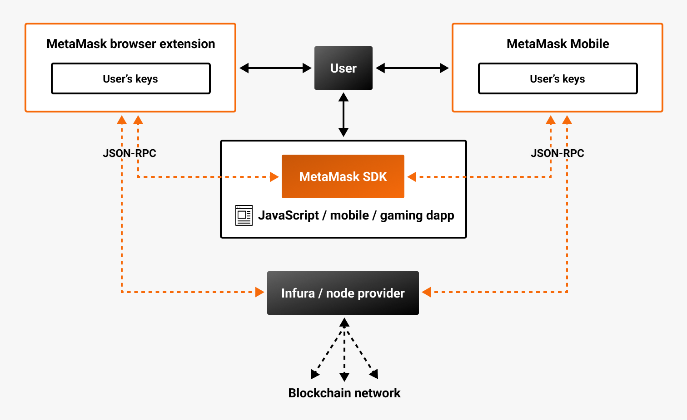

# Architecture

The following diagram outlines the high-level architecture of the MetaMask web3 stack.

Using [MetaMask SDK](../connect//metamask-sdk/index.md), dapps built on multiple platforms can connect to their users' Ethereum
accounts through the MetaMask browser extension and MetaMask Mobile.
Dapps can send [Wallet API](wallet-api.md) requests to the users' MetaMask wallet clients.
MetaMask then responds to these requests directly or uses [Infura](https://www.infura.io/) (or
another user-configured node provider) when the call requires access to information on a blockchain network.
