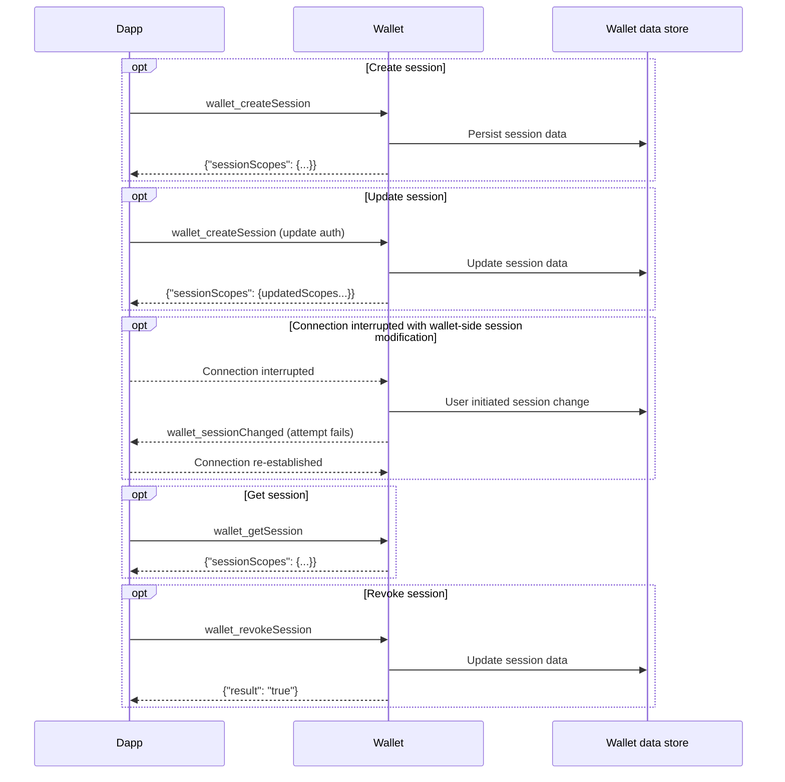
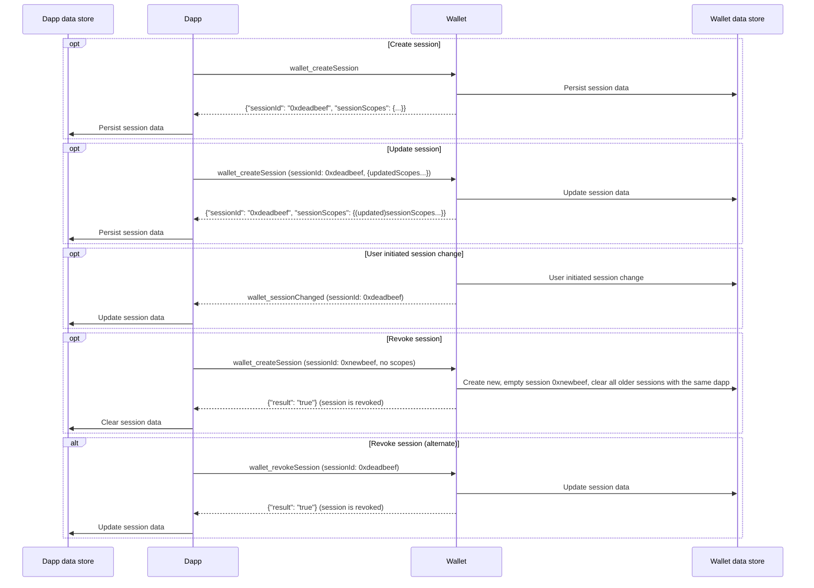

# About the Multichain API

:::warning Developer preview
This is a developer preview of the Multichain API.
It is only available in [MetaMask Flask](/snaps/get-started/install-flask).
:::

The Multichain API is a scalable, generalized web3 wallet API that supports simultaneous
interactions across multiple blockchain networks.
When integrated with [MetaMask Snaps](/snaps), it enables developers to interact with both popular
and emerging networks.
Key benefits include:

- **Seamless network interactions** - The Multichain API allows dapps to interact directly with
  multiple networks, without having to switch between single active networks.
  This enables smooth, integrated multichain user experience flows.

- **Scaling usage of non-EVM networks** - The Multichain API integrates with
  [interoperability Snaps](https://snaps.metamask.io/explore/), providing a standardized interface
  to encourage broader adoption of non-EVM networks.

- **Simplified integrations** - The Multichain API reduces the complexity associated with navigating
  different wallet APIs and SDKs, making it easier for dapps to integrate with wallets, discover
  capabilities, and negotiate interfaces.

## Technical overview

The Multichain API follows the [CAIP-25](https://github.com/ChainAgnostic/CAIPs/blob/main/CAIPs/caip-25.md)
standard for dapps to interface with multichain wallets.
The API includes a method [`wallet_createSession`](https://github.com/ChainAgnostic/CAIPs/blob/main/CAIPs/caip-25.md)
that dapps can call to create a multichain session with a wallet, with specified properties and
authorization scopes.
The session can be created with or without a `sessionId`, and can be updated using the same method
`wallet_createSession`.

Dapps can use the method [`wallet_invokeMethod`](https://github.com/ChainAgnostic/CAIPs/blob/main/CAIPs/caip-27.md)
to call a subset of the [Wallet JSON-RPC API methods](/wallet/reference/json-rpc-api) on a specified chain.
Dapps can use [`wallet_getSession`](https://github.com/ChainAgnostic/CAIPs/blob/main/CAIPs/caip-312.md)
to get the scope of the current session, and
[`wallet_revokeSession`](https://github.com/ChainAgnostic/CAIPs/blob/main/CAIPs/caip-285.md) to
revoke the current session.
The API also supports [events](../reference/multichain-api-events.md), allowing wallets to notify
dapps of changes to a session.

The following sequence diagrams illustrate the multichain session lifecycle without and with a `sessionId`.

### Lifecycle without a `sessionId`

### Lifecycle with a `sessionId`

