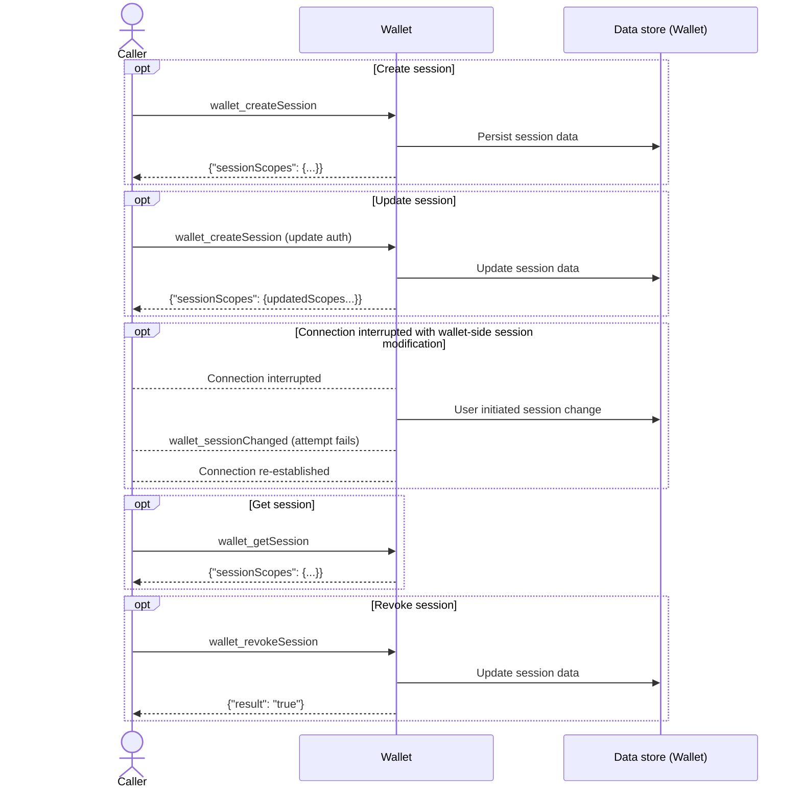
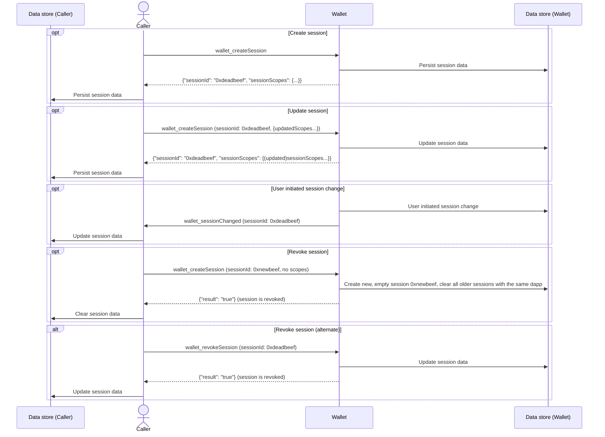

# About the Multichain API

The Multichain API offers a scalable, generalized web3 wallet API that supports simultaneous interactions across multiple chains.
When integrated with [MetaMask Snaps](/snaps), it enables developers to interact with both popular and emerging networks.
By adhering to open standards, the Multichain API encourages broad adoption and development of tooling higher up in the dev stack.

The Multichain API supports simultaneous multichain interactions, enabling dapps to create smoother, more integrated user experiences.
It addresses key issues, such as:

- **Network switching** - Current Ethereum wallet APIs are modeled around a single active network.
  Developers must switch between networks in order to make multichain calls, which can be unnecessarily complicated.
  The Multichain API eliminates switching by allowing direct interactions with different networks.
  Dapps can re-imagine their interfaces to optimize multichain UX flows.

- **Scaling usage of non-EVM networks** - Developers building protocol Snaps struggle to scale developer usage.
  The Multichain API integrates with Snaps and offers a more standardized interface to encourage broad adoption.

- **Error-prone integrations** - Developers are burdened with navigating different wallet APIs and SDKs.
  The Multichain API standardizes the interface, making it easier for dapps to integrate with wallets,
  discover their capabilities, and negotiate interfaces.

See the [Multichain API reference](../reference/multichain-api.md).

## Technical overview

The Multichain API follows the [CAIP-25](https://github.com/ChainAgnostic/CAIPs/blob/main/CAIPs/caip-25.md)
standard for dapps to interface with multichain wallets.

## Multichain session lifecycle

The following is a lifecycle overview of a multichain session without a `sessionId`:

The following is a lifecycle overview of a multichain session with a `sessionId`:

