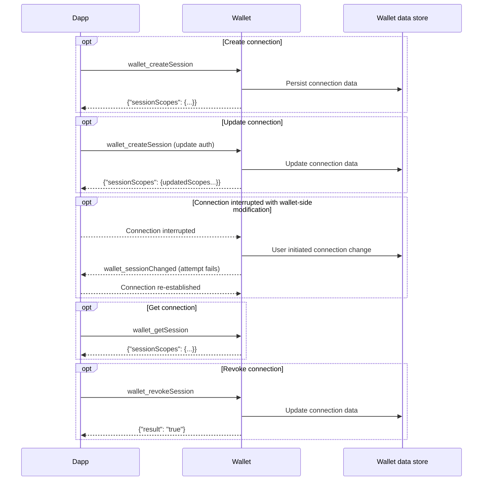

# About the Multichain API

:::tip Experimental
The Multichain API is an experimental feature.
:::

The Multichain API is a scalable, generalized web3 wallet API that supports simultaneous
interactions across multiple blockchain networks and ecosystems.
When integrated with [MetaMask Snaps](/snaps), it enables developers to interact with both popular
and emerging networks.
Key benefits include:

- **Elimination of chain switching** - The Multichain API allows dapps to interact with multiple networks without having to request chain switches.
  This feature reduces development overhead involved with ensuring the correct network is targeted for a given dapp-proposed transaction.

- **Extensibility** - The Multichain API can be integrated with
  [interoperability Snaps](https://snaps.metamask.io/explore/), providing a standards-based interface
  to connect wallets with dapps on non-EVM networks.

- **Seamless multichain UX** - The Multichain API offers improvements over EIP-1193 and [wallet-standard](https://github.com/wallet-standard/wallet-standard) interfaces.
  It allows dapps to create unified cross-ecosystem multichain wallet connection flows, trigger transactions across different networks more seamlessly, and clearly interpret chain-specific addresses.

[**Get started using the Multichain API.**](../how-to/manage-networks/use-multichain.md)

## Technical overview

The Multichain API follows the [CAIP-25](https://github.com/ChainAgnostic/CAIPs/blob/main/CAIPs/caip-25.md)
standard for dapps to interface with multichain wallets.
See [MIP-5](https://github.com/MetaMask/metamask-improvement-proposals/blob/main/MIPs/mip-5.md) and
[MIP-6](https://github.com/MetaMask/metamask-improvement-proposals/blob/main/MIPs/mip-6.md) for
detailed information about MetaMask's Multichain API implementation.

The API includes methods for dapps to manage multichain connections:

- [`wallet_createSession`](../reference/multichain-api.md#wallet_createsession) - Creates a multichain connection with a wallet, with specified properties and
authorization scopes.
Dapps can update the connection using the same method.
- [`wallet_invokeMethod`](../reference/multichain-api.md#wallet_invokemethod) - Calls a subset of the [Wallet JSON-RPC API methods](../reference/json-rpc-methods/index.md) on
a specified chain.
- [`wallet_getSession`](../reference/multichain-api.md#wallet_getsession) - Gets
the scopes and properties of the active connection.
- [`wallet_revokeSession`](../reference/multichain-api.md#wallet_revokesession) - Revokes the active connection.

The API also includes events that wallets can send to dapps:

- [`wallet_notify`](../reference/multichain-api.md#wallet_notify) - Notifies dapps of onchain events or state changes they previously subscribed to.
- [`wallet_sessionChanged`](../reference/multichain-api.md#wallet_sessionchanged) - Notifies dapps of changes to the multichain connection.

See the [Multichain API reference](../reference/multichain-api.md) for full details.

### Lifecycle diagram

The following sequence diagram illustrates the multichain connection lifecycle.

## Backwards compatibility

When using the Multichain API, your dapp can still interact with the existing
[Ethereum provider API](wallet-api.md#ethereum-provider-api).
However, the provider API is not optimized for multichain usage, and we recommend
[starting directly with the Multichain API](../how-to/manage-networks/use-multichain.md).
The Multichain API is backwards compatible mainly to support dapps that use third-party libraries
with dependencies on the legacy provider.

:::note
A multichain connection will overwrite a connection with the legacy EIP-1193 provider, and vice versa.
:::

## Get started

Get started with the Multichain API:

- Learn how to [use the Multichain API](../how-to/manage-networks/use-multichain.md).
- See the [Multichain API reference](../reference/multichain-api.md) for more details.
