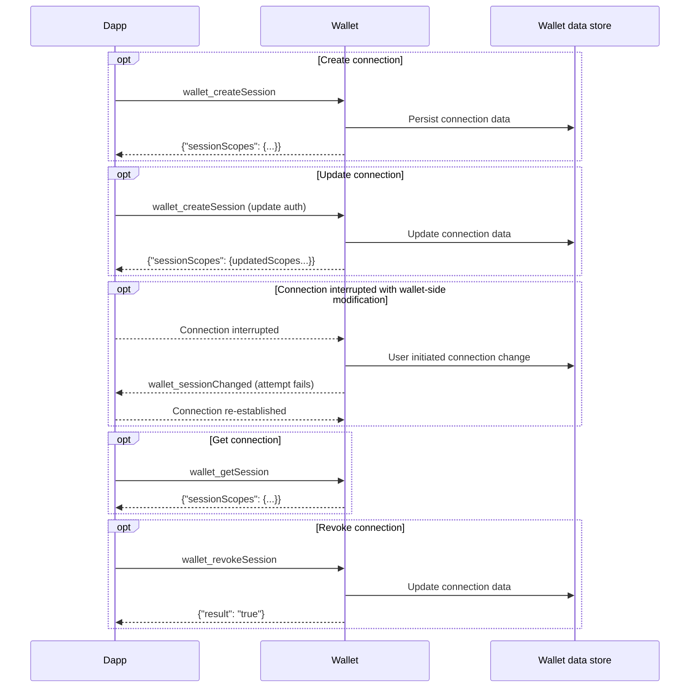

# About the Multichain API

:::flaskOnly
:::

The Multichain API is a scalable, generalized web3 wallet API that supports simultaneous
interactions across multiple blockchain networks.
When integrated with [MetaMask Snaps](/snaps), it enables developers to interact with both popular
and emerging networks.
Key benefits include:

- **Seamless network interactions** - The Multichain API allows dapps to interact directly with
  multiple networks, without having to switch between single active networks.
  This enables smooth, integrated multichain user experience flows.

- **Scaling usage of non-EVM networks** - The Multichain API integrates with
  [interoperability Snaps](https://snaps.metamask.io/explore/), providing a standardized interface
  to encourage broader adoption of non-EVM networks.

- **Simplified integrations** - The Multichain API reduces the complexity associated with navigating
  different wallet APIs and SDKs, making it easier for dapps to integrate with wallets, discover
  capabilities, and negotiate interfaces.

[**Get started using the Multichain API.**](../how-to/manage-networks/use-multichain.md)

## Technical overview

The Multichain API follows the [CAIP-25](https://github.com/ChainAgnostic/CAIPs/blob/main/CAIPs/caip-25.md)
standard for dapps to interface with multichain wallets.
The API includes a method [`wallet_createSession`](../reference/multichain-api.md#wallet_createsession)
that dapps can call to create a multichain connection with a wallet, with specified properties and
authorization scopes.
Dapps can update the connection using the same method `wallet_createSession`.

Dapps can use [`wallet_invokeMethod`](../reference/multichain-api.md#wallet_invokemethod) to
call a subset of the [Wallet JSON-RPC API methods](../reference/json-rpc-methods/index.md) on
a specified chain.
Dapps can use [`wallet_getSession`](../reference/multichain-api.md#wallet_getsession) to get
the scopes and properties of the active connection, and use
[`wallet_revokeSession`](../reference/multichain-api.md#wallet_revokesession) to revoke the connection.
The API also supports the following events:

- [`wallet_notify`](../reference/multichain-api.md#wallet_notify) notifies dapps of onchain events or state changes they previously subscribed to.
- [`wallet_sessionChanged`](../reference/multichain-api.md#wallet_sessionchanged) notifies dapps of changes to the multichain connection.

See the [Multichain API reference](../reference/multichain-api.md) for full details.

### Lifecycle diagram

The following sequence diagram illustrates the multichain connection lifecycle.

## Backwards compatibility

When using the Multichain API, your dapp can still interact with the existing
[Ethereum Provider API](wallet-api.md#ethereum-provider-api).
However, the Ethereum Provider API is not optimized for multichain usage, and we recommend
[starting directly with the Multichain API](../how-to/manage-networks/use-multichain.md) if possible.
The Multichain API is backwards compatible mainly to support dapps that use third-party libraries
with dependencies on the legacy provider.

## Get started

Get started with the Multichain API:

- Learn how to [use the Multichain API](../how-to/manage-networks/use-multichain.md).
- See the [Multichain API reference](../reference/multichain-api.md) for more details.
