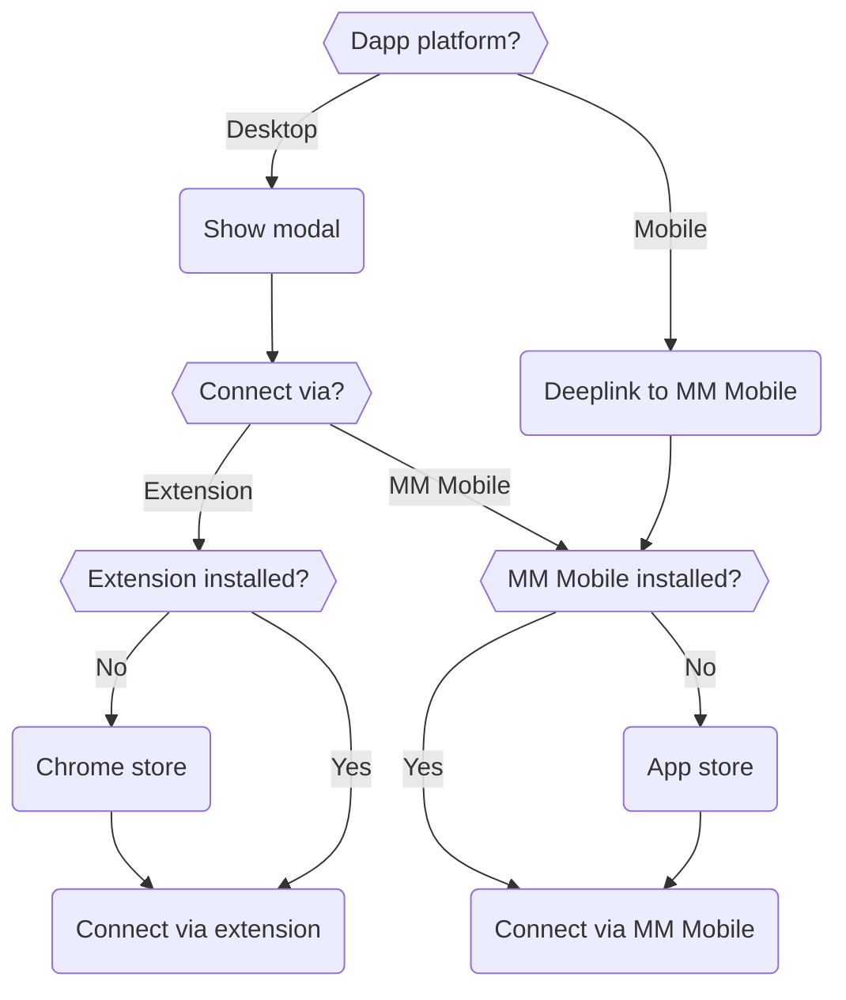
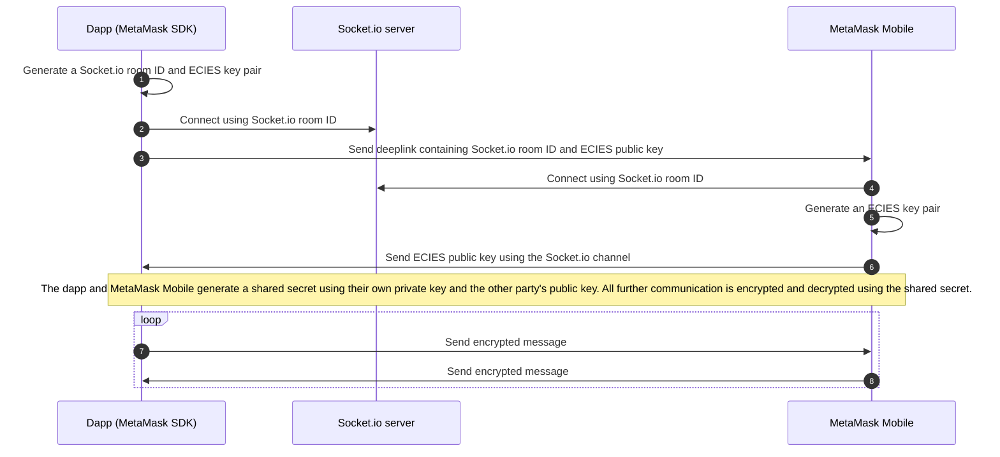

# MetaMask SDK connections

This page provides details on how a dapp with [MetaMask SDK](../connect/metamask-sdk/index.md) installed connects to a
user's MetaMask wallet.

## Initial connection flow

The following flowchart outlines the initial connection flow between a dapp and MetaMask:

The path first depends on whether the dapp is on a desktop or mobile platform:

- If the dapp is on a desktop platform (for example, a desktop web dapp), the dapp shows a modal
  asking the user to select if they want to connect to MetaMask using the browser extension or
  MetaMask Mobile.

  - If the user selects extension:
    - If the extension is not installed, the user is taken to the Chrome extension store to
      install it.
    - If the extension is installed, the user connects to their MetaMask extension.
  - If the user selects MetaMask Mobile:
    - If MetaMask Mobile is not installed, the user is taken to the app store to install it.
    - If MetaMask Mobile is installed, [an encrypted connection from the dapp to MetaMask
      Mobile](#metamask-mobile-connection) is established.

  :::note
  The choice between the extension and MetaMask Mobile persists until the user or dapp disconnects.
  At that point, the dapp displays the modal again.
  :::

- If the dapp is on a mobile platform (for example, a mobile web dapp or mobile dapp), the dapp
  deeplinks to MetaMask Mobile.

  - If MetaMask Mobile is not installed, the user is taken to the app store to install it.
  - If MetaMask Mobile is installed, [an encrypted connection from the dapp to MetaMask
    Mobile](#metamask-mobile-connection) is established.

## MetaMask Mobile connection

The SDK uses elliptic curve integrated encryption scheme (ECIES) to communicate with MetaMask Mobile.
The following sequence diagram outlines how a dapp establishes an encrypted connection with MetaMask Mobile:

The flow is as follows:

1. The dapp generates a UUID v4 ([Socket.io](https://socket.io/) room ID) and ECIES key pair.
2. The dapp connects to the Socket.io server using the room ID.
3. The dapp sends a deeplink to MetaMask Mobile (either directly, if on mobile, or through a QR
   code, if on desktop) containing its ECIES public key and the Socket.io room ID.
4. MetaMask Mobile opens the QR code or deeplink and connects to the Socket.io server using the room ID.
5. MetaMask Mobile generates an ECIES key pair.
6. MetaMask Mobile sends its ECIES public key to the dapp using the Socket.io channel, and the two
   parties generate a shared secret.
7. The dapp and MetaMask Mobile establish an encrypted connection to send JSON-RPC API methods.

:::note
For all platforms except Android, the SDK uses a Socket.io server to help establish the encrypted connection.
The [Android SDK](android-sdk.md) uses direct local communication.
:::

## Connection status

The connection between the SDK and MetaMask Mobile can [pause](#paused-connections) and
[clear](#cleared-connections).
You can also [close connections manually](#close-connections-manually).

### Paused connections

Connections pause after MetaMask Mobile is in background (minimized) for 20 seconds.
This is to accommodate OS restrictions.

When a connection pauses, all traffic to MetaMask Mobile pauses, and the SDK doesn't produce any
response until the user opens MetaMask Mobile again.
The SDK automatically deeplinks to MetaMask Mobile, so connections resume automatically.
If MetaMask Mobile is paused and the user completely closes MetaMask Mobile, the connection remains
paused and resumes when the user opens it again.

Because of this, polling data from MetaMask Mobile may not work for long periods of time.

:::info known issue
When MetaMask Mobile is running in the background, the connection may pause and fail to resume when the user reopens MetaMask.
The user must return to your dapp so the request is re-sent.
The SDK team is working on this issue, and is researching decentralized communication solutions that
hold state such as [Waku](https://waku.org/).
:::

### Cleared connections

Connections clear if the user closes or refreshes your dapp, since MetaMask doesn't persist
connections on the dapp side.
This is for simplicity and security purposes.

If the user completely closes MetaMask Mobile without [pausing the connection](#paused-connections)
first, MetaMask infers that the user isn't using the wallet and closes the connection.

### Close connections manually

To close connections manually from MetaMask Mobile, go to **Settings > Experimental**, and select
**Clear MetaMask SDK connections**.
