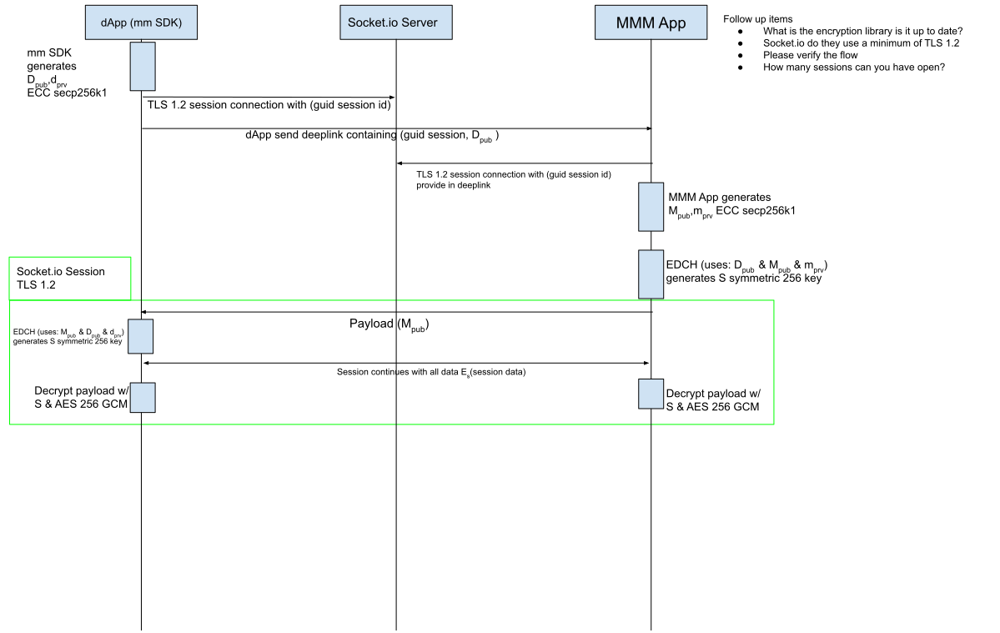

# MetaMask SDK connections

You can [use MetaMask SDK](../how-to/use-sdk/index.md) to enable users to easily connect from your
dapp to the MetaMask browser extension and MetaMask Mobile.
When connecting to MetaMask Mobile, the SDK uses a secure [communication layer](#communication-layer),
and it's important to understand the [status of the connection](#connection-status).

## Connection status

### Paused connections

Connections pause after MetaMask Mobile is in background (minimized) for 20 seconds.
This is to accommodate OS restrictions.

When a connection pauses, all traffic to MetaMask Mobile pauses, and the SDK doesn't produce any
response until the user opens MetaMask Mobile again.
The SDK automatically deeplinks to MetaMask Mobile, so connections resume automatically.
If MetaMask Mobile is paused and the user completely closes MetaMask Mobile, the connection remains
paused and resumes when the user opens it again.

Because of this, polling data from MetaMask Mobile may not work for long periods of time.

### Cleared connections

Connections clear if the user closes or refreshes your dapp, since MetaMask doesn't persist
connections on the dapp side.
This is for simplicity and security purposes.

If the user completely closes MetaMask Mobile without [pausing the connection](#paused-connections)
first, MetaMask infers that the user isn't using the wallet and closes the connection.

#### Close connections manually

To close connections manually from MetaMask Mobile, go to **Settings > Experimental**, and select
**Clear MetaMask SDK connections**.

## Communication layer

The SDK uses elliptic curve integrated encryption scheme (ECIES) to communicate with MetaMask Mobile.
ECIES is a hybrid encryption scheme that combines the benefits of both symmetric and asymmetric encryption.
It's a secure method of exchanging encrypted messages between two parties.

In ECIES, the sender (your dapp) generates a shared secret using the recipient's (MetaMask Mobile's)
public key and their own private key.
The shared secret is used to encrypt the message using a symmetric cipher (the SDK uses `AES-256-GCM`).
The encrypted message is then combined with a message authentication code (MAC) and sent to the recipient.

MetaMask Mobile uses its private key and the dapp's public key to recreate the shared secret and
decrypt the message.
The MAC is used to verify the authenticity of the message.

One of the main benefits of ECIES is that it allows the sender and recipient to exchange messages
without having to exchange a shared secret beforehand.
It also provides security against eavesdropping and tampering, since the shared secret is derived
from the sender's and recipient's private keys, which are both kept secret.

