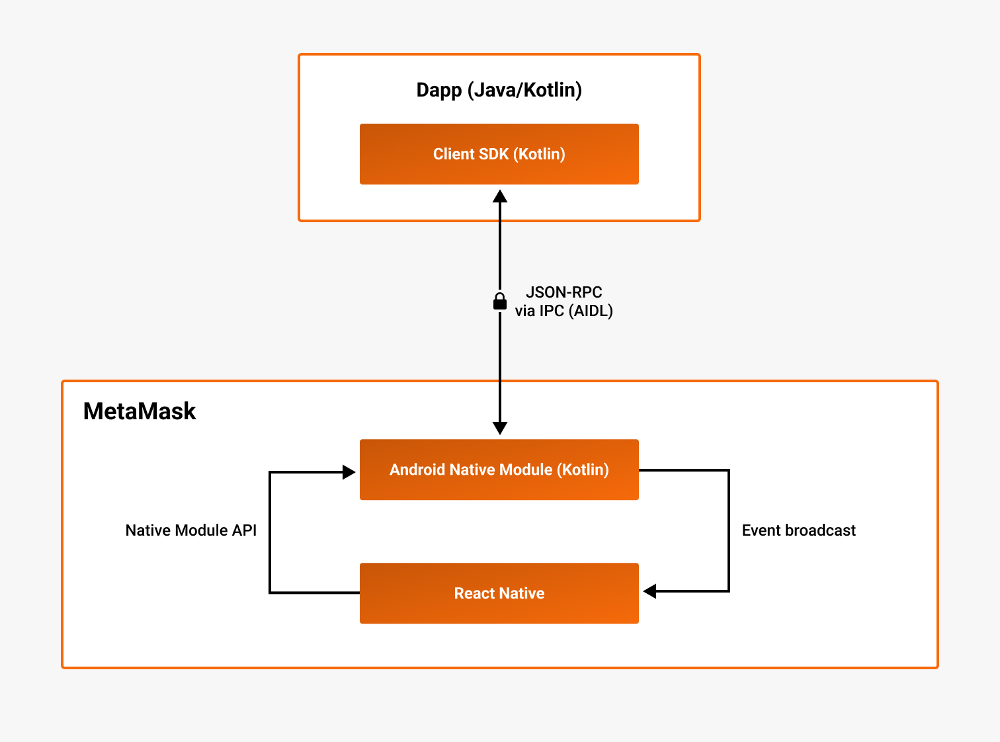
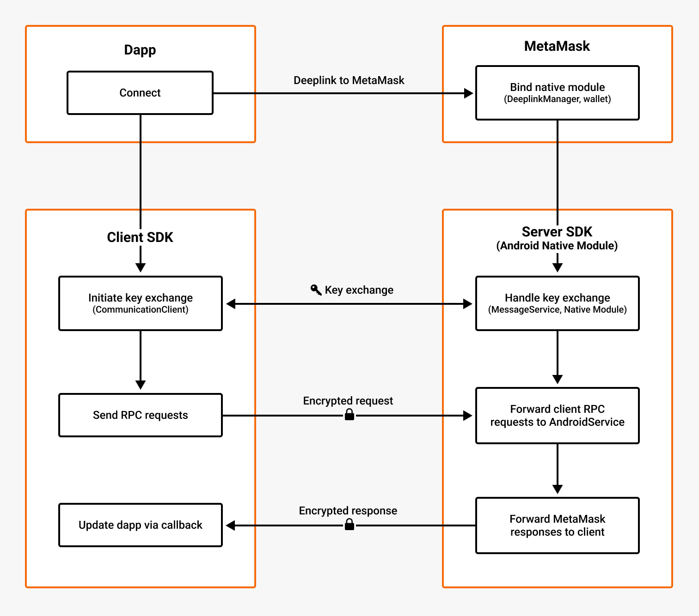

# Android SDK architecture

The Android version of [MetaMask SDK](index.md) enables your users to easily connect with their
MetaMask Mobile wallet.
The [architecture](#architecture) and [connection flow](#connection-flow) of
the Android SDK differs from the other SDK platforms.

:::tip Get started

- Get started by [setting up the SDK in your Android dapp](../../how-to/use-sdk/mobile/android.md).
- See the [example Android dapp](https://github.com/MetaMask/metamask-android-sdk/tree/main/app) in
  the Android SDK GitHub repository for advanced use cases.
  :::

## Architecture

The following diagram outlines the high-level architecture of the Android SDK:

The MetaMask Android SDK consists of two components:

- **The client SDK**, imported in the dapp
- **The server SDK**, an Android Native Module embedded in the MetaMask React Native wallet

The client SDK communicates with the server SDK using
[Interprocess communication (IPC)](https://developer.android.com/guide/components/processes-and-threads#IPC).
The JSON-RPC calls are implemented using the
[Android Interface Definition Language (AIDL)](https://developer.android.com/develop/background-work/services/aidl).
Communication over IPC is encrypted using elliptic curve integrated encryption scheme (ECIES).

Within MetaMask, the wallet (written in React Native) communicates with the Native Module (written
in Kotlin) using different mechanisms depending on the direction of communication:

- **Native Module &rarr; React Native** - The Native Module broadcasts messages as events that the wallet
  listens to and handles upon receipt.
- **React Native &rarr; Native Module** - The wallet calls the Native Module using the `NativeModules` API,
  which enables React Native code to call native Kotlin primitives.

## Connection flow

The following diagram outlines the communication flow between the Android client SDK and server SDK:

The flow is as follows:

1. The dapp, with the SDK installed, initiates communication when a user connects to MetaMask.
   The dapp deeplinks to MetaMask, and MetaMask sets up the Android Native Module to receive client requests.
2. The dapp generates an ECIES public/private key pair.
   The dapp and MetaMask exchange public keys over IPC.
3. The dapp and MetaMask perform end-to-end encrypted JSON-RPC calls.
