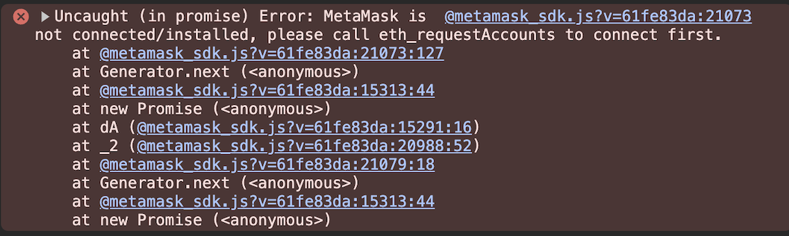

# Connect to MetaMask using Wagmi

[Wagmi](https://wagmi.sh/) is a powerful and efficient React Hooks library designed to streamline
dapp development by simplifying Ethereum interactions.

You can integrate MetaMask SDK into your dapp alongside Wagmi,
using the MetaMask connector with Wagmi, to enable your users to seamlessly and securely connect to
the MetaMask browser extension and MetaMask Mobile.

## Prerequisites

- Ensure you have a basic understanding of Ethereum smart contracts and React Hooks.
- Set up a project with [Wagmi](https://wagmi.sh/react/getting-started).
- Create an Infura API key and allowlist to [make read-only requests](../../how-to/make-read-only-requests.md).

## Steps

### 1. Configure MetaMask SDK

In your Wagmi project, configure MetaMask SDK with the proper [SDK options](../../reference/sdk-js-options.md).

- Set your API key in environment variables.
```env
VITE_INFURA_API_KEY=YOUR-API-KEY
```

- Configure the MetaMask connector with Wagmi.

```javascript
import { metaMask } from 'wagmi/connectors'

export const config = createConfig({
  chains: [mainnet, sepolia],
  connectors: [
    metaMask({
      infuraAPIKey: import.meta.env.VITE_INFURA_API_KEY,
    }),
  ],
  transports: {
    [mainnet.id]: http(),
    // You can also configure the transcripts to use INFURA_API_KEY directly into wagmi config to share with other providers.
    // [mainnet.id]: http('https://mainnet.infura.io/v3/...')
    [sepolia.id]: http(),
  },
})
```

#### Infura API key

In order to provide a better mobile user experience, you must specify the [`infuraAPIKey`](../../reference/sdk-js-options.md#infuraapikey)
 option to [make read-only requests](../../how-to/make-read-only-requests.md) using the Infura API.

## Benefits of using the Infura API with Wagmi

Mobile dApps can lose their continuous connection with MetaMask, causing read-only requests to fail. 
When the mobile wallet is disconnected, the dapp will need to deeplink into the wallet to "wake up" the connection.

Read-only requests are blockchain requests that do not require user wallet interaction. Without setting the `infuraAPIKey`, the dApp may experience issues on mobile environment:



To overcome this limitation in mobile dapps that rely on a continuous connection with MetaMask,
use the Infura API to make read-only requests.
You can do this by [configuring the SDK with an Infura API key](#2-configure-wagmi-with-the-metamask-connector).
This approach offloads the read operations to Infura's nodes, reducing the load on your own
infrastructure and ensuring high availability and reliability, independent of the user's wallet connection.

By using the Infura API, you can ensure:

- **Uninterrupted access:** Continuous network access for read-only requests, regardless of MetaMask's state.

- **Enhanced stability:** Stabilized dapp functionality by relying on Infura's robust infrastructure
  rather than the mobile environment's variable connectivity and background processing constraints.

In summary, using the Infura API compensates for Wagmi's lack of mobile optimization by providing a
stable network backend for read-only operations.
