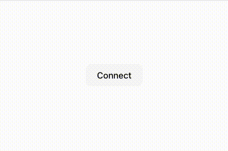

# Display custom modals

You can use [MetaMask SDK](../../connect/metamask-sdk/index.md) to display custom MetaMask modals.

When integrating a web dapp with MetaMask, you can enhance the user experience by customizing the
logic and user interface of the displayed modals, which initiate user interactions such as prompting
the user to install MetaMask.
This page describes how to create a custom modal in React, but you can adapt the implementation to
other web frameworks such as Vue.js or pure HTML/JavaScript.

## Prerequisites

MetaMask SDK set up in your JavaScript dapp.
This example uses the [MetaMask React SDK](../../connect/metamask-sdk/javascript/react/index.md).

## Steps

### 1. Create a custom modal component

Create a custom modal component that aligns with your dapp's design and functionality requirements.

```javascript title="App.js"
import React from "react"

const CustomModal = ({ onClose }) => (
  <div className="modal">
    <button onClick={onClose}>Close</button>
  </div>
)

export default CustomModal
```

### 2. Implement custom modal logic

When initializing [`MetaMaskProvider`](../../connect/metamask-sdk/javascript/react/index.md#3-wrap-your-project-with-metamaskprovider),
use the [`modals`](../../reference/sdk-js-options.md#modals) SDK option to set up custom behavior
for scenarios such as when MetaMask isn't installed.
For example:

```javascript title="index.js"
import { MetaMaskProvider } from "@metamask/sdk-react"
import CustomModal from "./CustomModal"
import ReactDOM from "react-dom"

const App = () => (
  <MetaMaskProvider
    sdkOptions={{
      modals: {
        install: ({ link }) => {
          let modalContainer = null

          return {
            mount: () => {
              modalContainer = document.createElement("div")
              document.body.appendChild(modalContainer)

              ReactDOM.render(
                <CustomModal
                  onClose={() => {
                    ReactDOM.unmountComponentAtNode(modalContainer)
                    modalContainer.remove()
                  }}
                />,
                modalContainer
              )
            },
            unmount: () => {
              if (modalContainer) {
                ReactDOM.unmountComponentAtNode(modalContainer)
                modalContainer.remove()
              }
            },
          }
        },
      },
    }}
  >
    {/* Other components */}
  </MetaMaskProvider>
)

export default App
```

### 3. Test your custom modal

Test your dapp to ensure the custom modal operates as intended, especially in scenarios such as when
MetaMask isn't installed.

<p align="center">



</p>

## Example

See the [example React dapp with a custom modal
implementation](https://github.com/MetaMask/metamask-sdk/tree/main/packages/examples/react-with-custom-modal).
This example can serve as a starting point for understanding the approach, which you can then adapt
to other web frameworks as needed.
