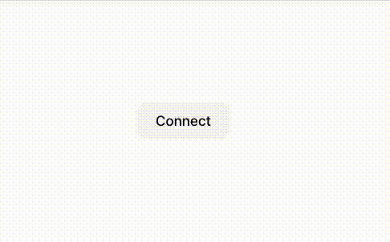

# Headless mode and display custom modals

You can use [MetaMask SDK](../../connect/metamask-sdk/index.md) to integrate MetaMask sdk modals to your design requirements.

When integrating a web dapp with MetaMask, you can enhance the user experience by customizing the
logic and user interface of the displayed modals, which initiate user interactions such as prompting
the user to install MetaMask.
This page describes how to create a custom modal in React, but you can adapt the implementation to
other web frameworks such as Vue.js or pure HTML/JavaScript.

## Prerequisites

MetaMask SDK set up in your JavaScript dapp.
This example uses the [MetaMask React SDK](../../connect/metamask-sdk/javascript/react/index.md).

## Steps

### 1. Create a custom modal component

Create a custom modal component that aligns with your dapp's design and functionality requirements.

```javascript title="App.js"
import { useEffect, useState } from 'react';
import encodeQR from '@paulmillr/qr';

interface QRModalProps {
  readonly uri: string;
  readonly onClose: () => void;
}

function QRModal({ uri, onClose }: QRModalProps) {
  const [imgSrc, setImgSrc] = useState<string>('');

  useEffect(() => {
    if (!uri) return;

    const svgString = encodeQR(uri, 'svg');
    const blob = new Blob([svgString], { type: 'image/svg+xml' });
    const url = URL.createObjectURL(blob);
    setImgSrc(url);

    return () => {
      URL.revokeObjectURL(url);
      setImgSrc('');
    };
  }, [uri]);

  if (!uri || !imgSrc) {
    return null;
  }

  return (
    <div style={{
      position: 'fixed',
      top: 0,
      left: 0,
      right: 0,
      bottom: 0,
      backgroundColor: 'rgba(0, 0, 0, 0.5)',
      display: 'flex',
      justifyContent: 'center',
      alignItems: 'center'
    }}>
      <div style={{
        backgroundColor: 'white',
        padding: '20px',
        borderRadius: '10px',
        textAlign: 'center'
      }}>
        
        <button onClick={onClose}>Close</button>
      </div>
    </div>
  );
}
```

### 2. Implement custom modal logic

```javascript title="index.js"
import { MetaMaskProvider, useSDK } from "@metamask/sdk-react"

const DappView = () => {
  const { connected, account, provider, sdk } = useSDK()
  const [qrUri, setQrUri] = useState<string>('')

  useEffect(() => {
    if (sdk) {
      sdk.on('display_uri', setQrUri)
    }

    return () => {
      if (sdk) {
        sdk.off('display_uri', setQrUri)
      }
    }
  }, [connected, sdk])

  if (!connected) {
    return (
      <div>
        <button onClick={async () => {
          console.log(`sdk`, sdk)
          const accounts = await sdk?.connect()
          console.log(`connected with `, accounts)
        }}>Connect</button>
        {qrUri && <QRModal uri={qrUri} onClose={() => setQrUri('')} />}
      </div>
    )
  }

  if(!sdk) {
    return <div>No SDK</div>
  }

  return (
    <>
      <div>
        Signed in as: {account}
      </div>
      <div>
        <p>Display URI: {qrUri}</p>
      </div>
      <div>
        <p>Personal Sign:</p>
        <button onClick={() => provider?.request({ method: 'personal_sign', params: ['Hello, world!', account] })}>Sign</button>
      </div>
      <button onClick={() => sdk?.disconnect()}>Disconnect</button>
    </>
  )
}

const App = () => (
  <MetaMaskProvider
    sdkOptions={{
      dappMetadata: {
        name: "Headless React Dapp",
      },
      headless: true,
    }}
  >
    <DappView />
  </MetaMaskProvider>
)

export default App
```

### 3. Test your custom modal

Test your dapp to ensure the custom modal operates as intended, especially in scenarios such as when
MetaMask isn't installed.

<p align="center">



</p>

## Example

See the [example React dapp with a custom modal
implementation](https://github.com/MetaMask/metamask-sdk/tree/main/packages/examples/react-with-custom-modal).
This example can serve as a starting point for understanding the approach, which you can then adapt
to other web frameworks as needed.
