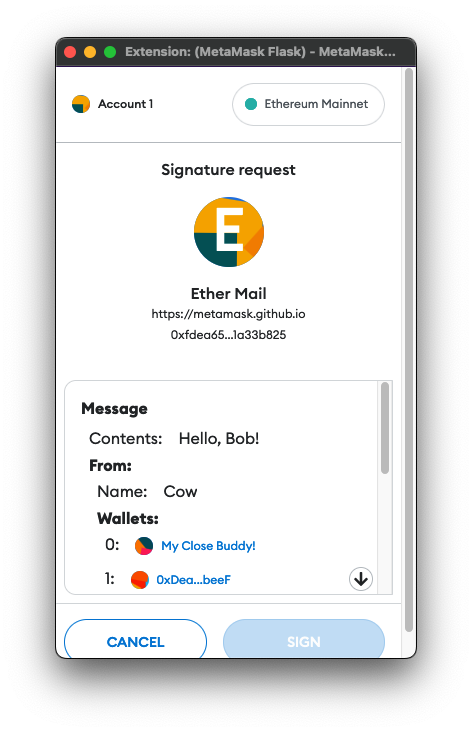
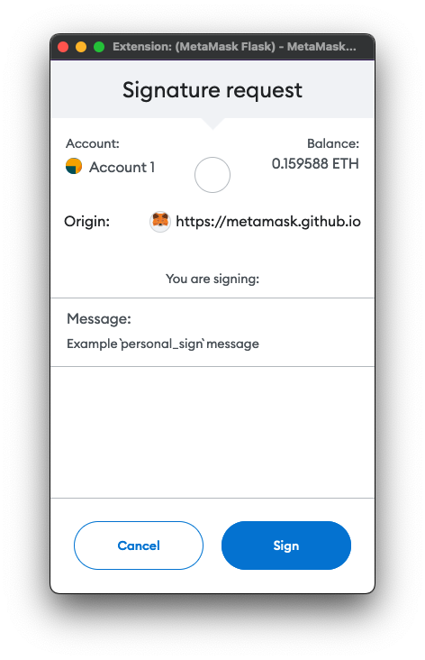

# Sign data

You can use the following RPC methods to request cryptographic signatures from users:

- [`eth_signTypedData_v4`](#use-eth_signtypeddata_v4) - Use this method to request the most human-readable
  signatures that are efficient to process on-chain.
  We recommend this for most use cases.
- [`personal_sign`](#use-personal_sign) - Use this method for the easiest way to request human-readable
  signatures that don't need to be efficiently processed on-chain.

:::caution
[`eth_sign`](../concepts/signing-methods.md#eth_sign) is deprecated.
:::

:::note
MetaMask supports signing transactions using Trezor and Ledger hardware wallets.
These wallets only support signing data using `personal_sign`.
If you can't log in to a dapp when using a Ledger or Trezor, the dapp might be requesting you to
sign data using an unsupported method, in which case we recommend using your standard MetaMask account.
:::

## Use eth_signTypedData_v4

[`eth_signTypedData_v4`](/wallet/reference/eth_signTypedData_v4)
provides the most human-readable signatures that are efficient to process on-chain.
It follows the [EIP-712](https://eips.ethereum.org/EIPS/eip-712) specification to allow users to sign
typed structured data that can be verified on-chain.
It renders the structured data as usefully as possible to the user (for example, displaying known
account names in place of addresses).

<p align="center">



</p>

An `eth_signTypedData_v4` payload uses a standard format of encoding structs, but has a different
format for the top-level struct that is signed, which includes some metadata about the verifying
contract to provide replay protection of these signatures between different contract instances.

We recommend using [`eth-sig-util`](https://github.com/MetaMask/eth-sig-util) to generate and
validate signatures.
You can use [`eip712-codegen`](https://github.com/danfinlay/eip712-codegen#readme) to generate most
of the Solidity required to verify these signatures on-chain.
It currently doesn't generate the top-level struct verification code, so you must write that part manually.
See
[this example implementation](https://github.com/delegatable/delegatable-sol/blob/fb34bb259890417285f7185bc6500fb0ab8bf86f/contracts/Delegatable.sol#L80).

:::caution
Since the top-level struct type's name and the `domain.name` are presented to the user prominently
in the confirmation, consider your contract name, the top-level struct name, and the struct keys to
be a user-facing security interface.
Ensure your contract is as readable as possible to the user.
:::

### Example

The following is an example of using `eth_signTypedData_v4` with MetaMask.
See the [live example](https://metamask.github.io/test-dapp/#signTypedDataV4) and
[test dapp source code](https://github.com/MetaMask/test-dapp).

<!--tabs-->

# JavaScript

```javascript
signTypedDataV4Button.addEventListener('click', async function (event) {
  event.preventDefault();

  // eth_signTypedData_v4 parameters. All of these parameters affect the resulting signature.
  const msgParams = JSON.stringify({
    domain: {
      // This defines the network, in this case, Mainnet.
      chainId: 1,
      // Give a user-friendly name to the specific contract you're signing for.
      name: 'Ether Mail',
      // Add a verifying contract to make sure you're establishing contracts with the proper entity.
      verifyingContract: '0xCcCCccccCCCCcCCCCCCcCcCccCcCCCcCcccccccC',
      // This identifies the latest version.
      version: '1',
    },

    // This defines the message you're proposing the user to sign, is dapp-specific, and contains
    // anything you want. There are no required fields. Be as explicit as possible when building out
    // the message schema.
    message: {
      contents: 'Hello, Bob!',
      attachedMoneyInEth: 4.2,
      from: {
        name: 'Cow',
        wallets: [
          '0xCD2a3d9F938E13CD947Ec05AbC7FE734Df8DD826',
          '0xDeaDbeefdEAdbeefdEadbEEFdeadbeEFdEaDbeeF',
        ],
      },
      to: [
        {
          name: 'Bob',
          wallets: [
            '0xbBbBBBBbbBBBbbbBbbBbbbbBBbBbbbbBbBbbBBbB',
            '0xB0BdaBea57B0BDABeA57b0bdABEA57b0BDabEa57',
            '0xB0B0b0b0b0b0B000000000000000000000000000',
          ],
        },
      ],
    },
    // This refers to the keys of the following types object.
    primaryType: 'Mail',
    types: {
      // This refers to the domain the contract is hosted on.
      EIP712Domain: [
        { name: 'name', type: 'string' },
        { name: 'version', type: 'string' },
        { name: 'chainId', type: 'uint256' },
        { name: 'verifyingContract', type: 'address' },
      ],
      // Not an EIP712Domain definition.
      Group: [
        { name: 'name', type: 'string' },
        { name: 'members', type: 'Person[]' },
      ],
      // Refer to primaryType.
      Mail: [
        { name: 'from', type: 'Person' },
        { name: 'to', type: 'Person[]' },
        { name: 'contents', type: 'string' },
      ],
      // Not an EIP712Domain definition.
      Person: [
        { name: 'name', type: 'string' },
        { name: 'wallets', type: 'address[]' },
      ],
    },
  });

  var from = await web3.eth.getAccounts();

  var params = [from[0], msgParams];
  var method = 'eth_signTypedData_v4';

  web3.currentProvider.sendAsync(
    {
      method,
      params,
      from: from[0],
    },
    function (err, result) {
      if (err) return console.dir(err);
      if (result.error) {
        alert(result.error.message);
      }
      if (result.error) return console.error('ERROR', result);
      console.log('TYPED SIGNED:' + JSON.stringify(result.result));

      const recovered = sigUtil.recoverTypedSignature_v4({
        data: JSON.parse(msgParams),
        sig: result.result,
      });

      if (
        ethUtil.toChecksumAddress(recovered) === ethUtil.toChecksumAddress(from)
      ) {
        alert('Successfully recovered signer as ' + from);
      } else {
        alert(
          'Failed to verify signer when comparing ' + result + ' to ' + from
        );
      }
    }
  );
});
```

# HTML

```html
<h3>Sign typed data v4</h3>
<button type="button" id="signTypedDataV4Button">eth_signTypedData_v4</button>
```

<!--/tabs-->

## Use personal_sign

[`personal_sign`](/wallet/reference/personal_sign) is the
easiest way to request human-readable signatures that don't need to be efficiently processed on-chain.
It's often used for signature challenges that are authenticated on a web server, such as
[Sign-In with Ethereum](use-siwe.md).

<p align="center">



</p>

Some other signers implement `personal_sign` as `eth_sign`, because the Go Ethereum client changed
the behavior of their `eth_sign` method.
Because MetaMask supports existing applications, MetaMask implements both `personal_sign` and `eth_sign`.
You might need to check what method your supported signers use for a given implementation.

:::caution important
- Don't use this method to display binary data, because the user wouldn't be able to understand what
  they're agreeing to.
- If using this method for a signature challenge, think about what would prevent a phisher from
  reusing the same challenge and impersonating your site.
  Add text referring to your domain, or the current time, so the user can easily verify if this
  challenge is legitimate.
:::

### Example

The following is an example of using `personal_sign` with MetaMask.
See the [live example](https://metamask.github.io/test-dapp/#personalSign) and
[test dapp source code](https://github.com/MetaMask/test-dapp).

<!--tabs-->

# JavaScript

```javascript
personalSignButton.addEventListener('click', async function (event) {
  event.preventDefault();
  const exampleMessage = 'Example `personal_sign` message.';
  try {
    const from = accounts[0];
    // For historical reasons, you must submit the message to sign in hex-encoded UTF-8.
    // This uses a Node.js-style buffer shim in the browser.
    const msg = `0x${Buffer.from(exampleMessage, 'utf8').toString('hex')}`;
    const sign = await ethereum.request({
      method: 'personal_sign',
      params: [msg, from],
    });
    personalSignResult.innerHTML = sign;
    personalSignVerify.disabled = false;
  } catch (err) {
    console.error(err);
    personalSign.innerHTML = `Error: ${err.message}`;
  }
});
```

# HTML

```html
<h3>Personal sign</h3>
<button type="button" id="personalSignButton">personal_sign</button>
```

<!--/tabs-->

`personal_sign` prepends the message with `\x19Ethereum Signed Message:\n<length of message>` before
hashing and signing it.
