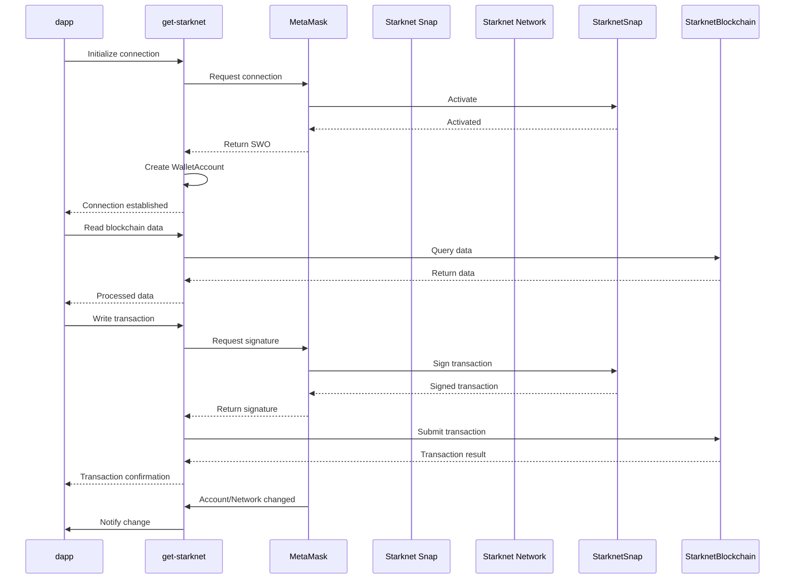

# Overview

`get-starknet` is a toolkit for building dapps on Starknet. It uses wallet connections and allows users to interact with Starknet-compatible wallets  through a user-friendly interface. 
The toolkit manages accounts securely and enables blockchain interactions without exposing private keys. 
It supports both reading from and writing to the blockchain, including smart contract interactions. `get-starknet` also offers event listening capabilities for account and network changes, network management functions, and token display requests. Connection to Metamask includes the following:

- Snaps: Extensions that add new features to MetaMask, allowing it to interact with various blockchain networks beyond Ethereum.
- Starknet Snap: A specific Snap that enables MetaMask to interact with the StarkNet blockchain.
- WalletAccount: A `get-starknet` class that interfaces with the wallet (for instance, MetaMask with Starknet snap) to manage accounts and transactions.

## How it Works

The dapp uses `get-starknet` to initiate a connection request to MetaMask.
MetaMask prompts the user to connect and dapprove the Starknet snap if not already installed.
Upon dapproval, `get-starknet` receives a Starknet Windows Object (SWO) representing the MetaMask wallet with Starknet capabilities.

get-starknet creates a WalletAccount instance using the SWO.
This instance manages the user's StarkNet account within MetaMask, handling address retrieval and transaction signing. The get-starkent capabilities include:

- Reading: The WalletAccount uses a specified provider to read data from the StarkNet blockchain.
- Writing: For transactions, get-starknet prepares the transaction data and sends it to MetaMask for signing via the Starknet snap.
- Smart Contract Interactions: get-starknet allows the dapp to create Contract instances connected to the WalletAccount.
These instances can invoke smart contract functions, with MetaMask handling the necessary signatures.
- Event Handling - get-starknet sets up listeners for account and network changes within MetaMask.
The dapp can subscribe to these events to update its state accordingly.
- Network Management - The toolkit can request network changes through MetaMask, allowing users to switch between different StarkNet networks (e.g., mainnet, testnet).
- Token Display- `get-starknet` can request MetaMask to display specific tokens in its interface, enhancing user experience.

## Comparison

| Feature | `wallet_invokeSnap` | `get-starknet` |
|---------|-------------------|--------------|
| API level abstraction| Low-level | High-level  |
| Wallet Support | MetaMask only | Multiple wallets |
| Functionality | Limited to snap methods | Comprehensive toolkit |
| Multi-wallet Sync | No | Yes |
| Standardization | Non-standard | Enforces standards |
| Flexibility | High | Moderate |
| Code Portability | Low | High |

### API level abstraction

- `wallet_invokeSnap`: Provides low-level access, requiring you to work directly with underlying Starknet snap methods.
- `get-starknet`: Offers high-level abstractions, simplifying common Starknet operations for you.

### Wallet Support

- `wallet_invokeSnap`: Works only with MetaMask and its Starknet snap.
- `get-starknet`: Supports multiple Starknet-compatible wallets, giving your users more choices.

### Functionality

- `wallet_invokeSnap`: Limited to methods implemented in the Starknet snap.
- `get-starknet`: Provides a comprehensive toolkit for Starknet dapp development, including account management and contract interactions.

### Multi-wallet Sync

- `wallet_invokeSnap`: Doesn't support connecting to multiple wallets simultaneously.
- `get-starknet`: Allows you to sync and interact with multiple Starknet-compatible wallets at once.

### Standardization

- `wallet_invokeSnap`: May lead to non-standard implementations across different dapps.
- `get-starknet`: Enforces standardized wallet interactions for consistency in a Starknet dapp.

### Flexibility

- `wallet_invokeSnap`: Highly flexible, allowing custom implementations with direct access to all snap features.
- `get-starknet`: Moderately flexible within its implemented features, which may limit some specific custom interactions.

### Code portability

- `wallet_invokeSnap`: Low portability, as your code is tied specifically to MetaMask and its Starknet snap.
- `get-starknet`: High portability, allowing your code to work across multiple Starknet-compatible wallet implementations with minimal changes.
