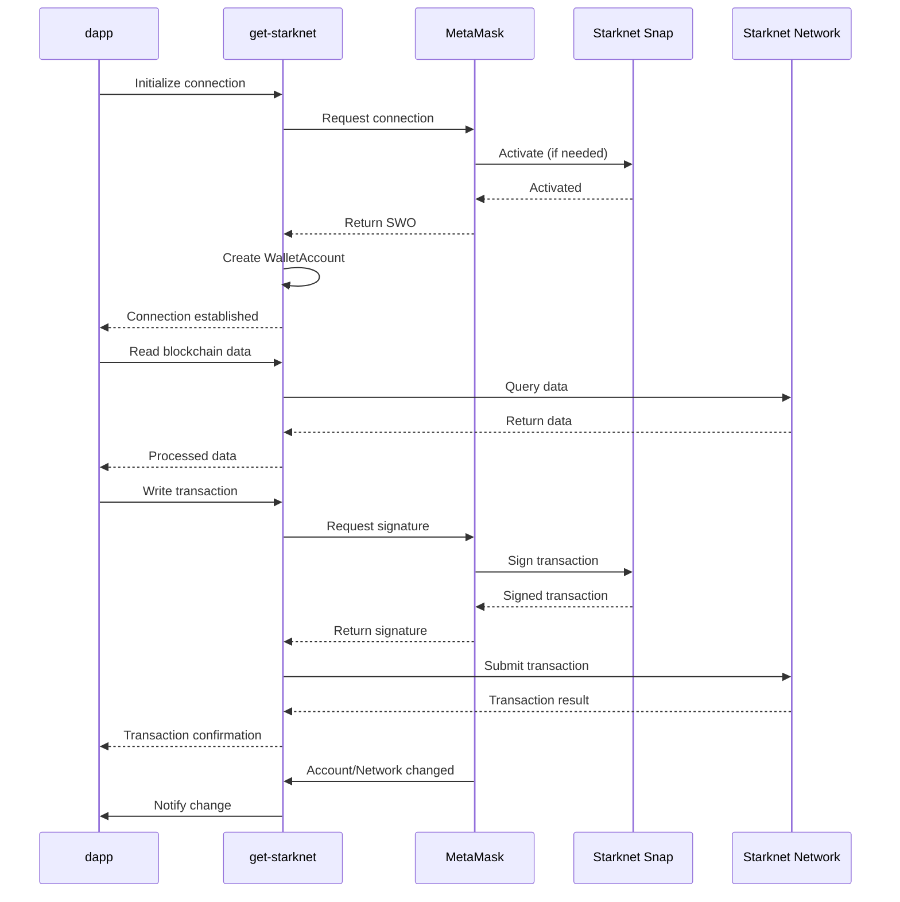

# Build with Starknet

Starknet is a Layer 2 network built on Ethereum. It processes transactions off the main Ethereum chain to increase speed and reduce costs, while still benefiting from Ethereum's security.

One major aspect of Starknet development is integrating with user wallets. There are two primary approaches to achieve this integration:

- [Using direct Snap invocation with `wallet_invokeSnap](#use-wallet_invokesnap-directly)
- [Using the `get-starknet` integration](#use-the-get-starknet-integration)

Both methods enable developers to connect Starknet dapps with wallet solutions. 
The choice between them depends on the specific needs of the project, the desired level of control, and familiarity with Starknet and Snap technologies.

## About `get-starknet`

`get-starknet` simplifies Starknet network interactions by extending MetaMask functionality. It eliminates the need for custom wallet logic and allows you to connect to Starknet and perform transactions through the MetaMask interface.
The `get-starknet` toolkit works with the Starknet Snap to enable interaction between dapps and the Starknet network through MetaMask. 
Starknet Snap is a MetaMask extension designed specifically to allow users to manage Starknet accounts and perform transactions on the Starknet network. 
When you integrate `get-starknet` into your dapp, it creates a `WalletAccount` object. `WalletAccount` acts as a connection between dapps and MetaMask and provides a structured way to manage Starknet-specific interactions. 
This allows users to send transactions, sign messages, and manage accounts within the MetaMask interface and it can be extended to multiple wallets, with Starknet capabilities added on.

### How `get-starknet` and MetaMask interact

The app uses `get-starknet` to request a connection to MetaMask. If the Starknet Snap isn't installed, MetaMask prompts the user to connect and approve the installation. 
After it is approved, `get-starknet` receives a Starknet Windows Object (SWO), which represents the MetaMask wallet with Starknet functionality.
After receiving the SWO, `get-starknet` creates a WalletAccount instance. 
This instance manages the Starknet account within MetaMask. With this setup, `get-starknet` enables the app to use Starknet features through MetaMask with the following capabilities:

- `WalletAccount` uses a specified provider to read data from the Starknet network.
- For transactions, `get-starknet` prepares the transaction data and sends it to MetaMask for signing through the Starknet Snap.
- `get-starknet` allows the dapp to create contract instances connected to the `WalletAccount`. These instances can invoke smart contract functions, with MetaMask handling the necessary signatures.
- `get-starknet` sets up listeners for account and network changes within MetaMask.
The dapp can subscribe to these events to update its state accordingly.
- `get-starknet` can request network changes through MetaMask, and allows users to switch between different Starknet networks (for example Mainnet, testnet).
- `get-starknet` can request MetaMask to display specific tokens in its interface, enhancing user experience.





## Compare wallet integration methods for Starknet

You can use `wallet_invokeSnap` or `get-starknet` to integrate with Starknet dapps.
The choice depends on your specific use case and development preferences. 

| Feature | `wallet_invokeSnap` | `get-starknet` |
|---------|---------------------|----------------|
| API Level | Low-level access to Starknet Snap methods | High-level abstractions for Starknet operations |
| Wallet Support | MetaMask only | Multiple Starknet-compatible wallets |
| Functionality | Limited to Snap-implemented methods | Comprehensive toolkit for Starknet dapp development |
| Multi-wallet Sync | No | Yes |
| Standardization | Might lead to non-standard implementations | Enforces standardized wallet interactions |
| Flexibility | High, with direct access to all Snap features | Moderate, within implemented features |
| Code Portability | Low, tied to MetaMask | High, works across multiple wallet implementations |


### Use `wallet_invokeSnap` directly

When using `wallet_invokeSnap` directly to interact with the Starknet Snap, you typically follow the following steps:

1. Ensure the Starknet Snap is installed.
2. Construct the appropriate parameters for the Starknet operation you want to perform.
3. Call `wallet_invokeSnap` with the specified parameters.

Example for sending a transaction:

```javascript title="title="starknetSnapInteraction.js"
const SnapId = 'npm:@starknet/Snap';

async function interactWithStarknetSnap() {
  try {
    // Ensure the Snap is installed and connected
    await window.ethereum.request({
      method: 'wallet_enable',
      params: [{
        wallet_Snap: { [SnapId]: {} },
      }]
    });

    // Use wallet_invokeSnap to call a Starknet method
    const result = await window.ethereum.request({
      method: 'wallet_invokeSnap',
      params: [
        SnapId,
        {
          method: 'starknet_signAndSendTransaction',
          params: {
            calls: [{
              contractAddress: '0x123...',
              entrypoint: 'transfer',
              calldata: ['0x456...', '1000']
            }]
          }
        }
      ]
    });

    console.log('Transaction hash:', result);
  } catch (error) {
    console.error('Error:', error);
  }
}
```

With `wallet_invokeSnap`, you must know the exact method names and parameter structures for interacting with the Starknet Snap. Additionally, you must handle both MetaMask-specific and Starknet-specific errors. Since `wallet_invokeSnap` is designed specifically for MetaMask, it operates within the framework of MetaMask interactions.

### Use the `get-starknet` integration

With `get-starknet`, the process is simplified:

1. Connect to a wallet using `get-starknet`.
2. Use the provided high-level methods to perform Starknet operations.

Example for sending the same transaction:

```javascript "title="starknetSnapInteraction.js""
import { connect } from 'get-starknet';

async function sendTransaction() {
  try {
    const starknet = await connect();
    if (!starknet) throw new Error('Failed to connect to wallet');

    const result = await starknet.account.execute({
      contractAddress: '0x123...',
      entrypoint: 'transfer',
      calldata: ['0x456...', '1000']
    });
    console.log('Transaction hash:', result.transaction_hash);
  } catch (error) {
    console.error('Error:', error);
  }
}
```

`get-starknet` provides a high-level, intuitive API that abstracts complex operations and manages wallet connections. 
It offers multi-wallet support, standardized error handling, and more readable code compared to direct Snap invocation so you are not required to manage lower-level Starknet interactions.
