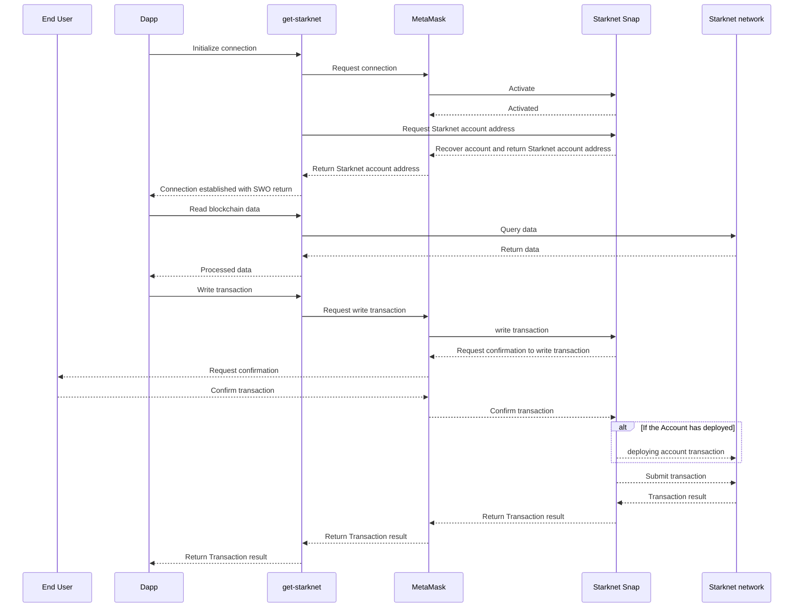

# About `get-starknet`

[`get-starknet`](https://github.com/starknet-io/get-starknet) is a library that simplifies Starknet
network interactions.
It works with the [Starknet Snap](https://snaps.metamask.io/snap/npm/consensys/starknet-snap/) to
enable dapps to interact with users' Starknet accounts in MetaMask.

When you integrate `get-starknet` into your dapp, it creates a [Starknet
Windows Object (SWO)](https://github.com/starknet-io/get-starknet/blob/get-starknet-core%403.3.0/packages/core/src/StarknetWindowObject.ts), which acts as
the connection between the dapp and MetaMask, and manages Starknet interactions.
This allows users to send Starknet transactions, sign Starknet messages, and manage Starknet
accounts within MetaMask, and this functionality can be extended to multiple wallets in the Starknet
ecosystem.

## How `get-starknet` and MetaMask interact

A dapp with `get-starknet` installed interacts with MetaMask as follows:

1. The dapp uses `get-starknet` to request the user connect to MetaMask.
   MetaMask automatically requests the user to add the Starknet Snap, if it's not already present.

1. After the dapp is connected to MetaMask and the Starknet Snap, `get-starknet` receives a Starknet
   Windows Object (SWO), which represents the MetaMask wallet with Starknet functionality.

1. The dapp uses `swo.account` to retrieve an [Account object](https://starknetjs.com/docs/API/#account) from the SWO.
   This Account object enables the dapp to manage Starknet interactions within MetaMask.

The `get-starknet` library offers several features that improve how dapps interact with the Starknet
network through MetaMask:

- The `AccountInterface` uses a specified provider to access data from the Starknet network.
- For transactions, `get-starknet` prepares the data and sends it to MetaMask for signing through
  the Starknet Snap.
- `get-starknet` enables the dapp to create contract instances connected to the `AccountInterface`,
  allowing smart contract functions to be invoked, with MetaMask handling the signatures.
- `get-starknet` sets up listeners for account and network changes in MetaMask, so the dapp can
  subscribe and update its state accordingly.
- `get-starknet` can request network changes through MetaMask, allowing users to switch between
  Starknet networks, such as Mainnet and Sepolia testnet.
- `get-starknet` can also request MetaMask to display specific tokens, improving the user experience.
