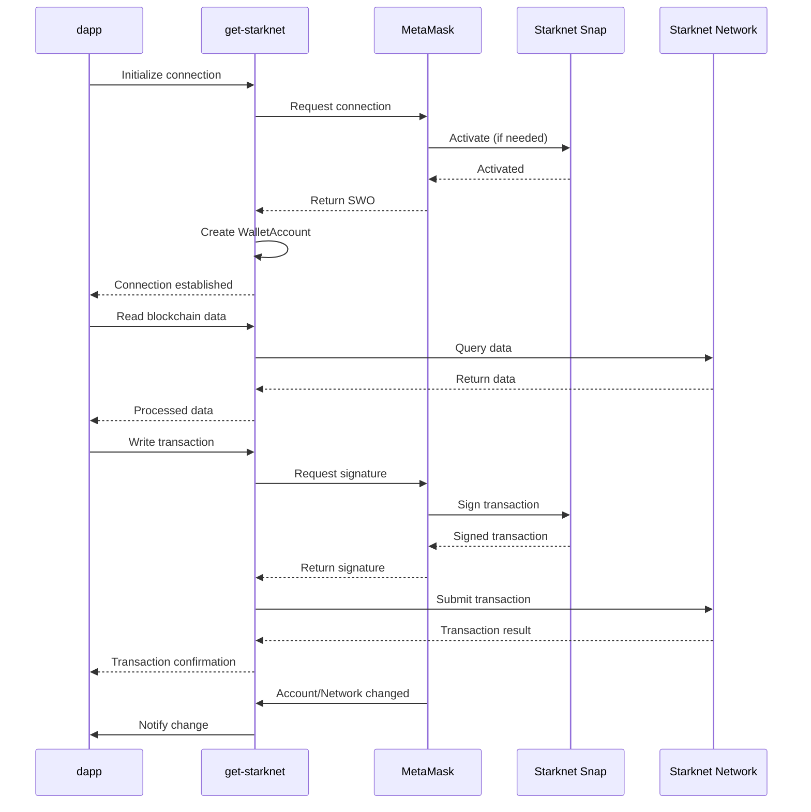

# Use Starknet

Starknet is a Layer 2 network built on Ethereum. To interact with Starknet accounts in MetaMask, which is a non-EVM network, you need to use the Starknet Snap.

You can use `wallet_invokeSnap` or `get-starknet` to integrate with Starknet dapps.
The choice depends on your specific use case and development preferences. 

| Feature | `wallet_invokeSnap` | `get-starknet` |
|---------|---------------------|----------------|
| API Level | Low-level access to Starknet Snap methods | High-level abstractions for Starknet operations |
| Wallet Support | MetaMask only | Multiple Starknet-compatible wallets |
| Functionality | Limited to Snap-implemented methods | Comprehensive toolkit for Starknet dapp development |
| Multi-wallet Sync | No | Yes |
| Code Portability | Low, tied to MetaMask | High, works across multiple wallet implementations |

Both methods enable developers to connect Starknet dapps with wallet solutions, but the key differences are the following:

- With `wallet_invokeSnap`, you must know the exact method names and parameter structures for interacting with the Starknet Snap. Additionally, you must handle both MetaMask-specific and Starknet-specific errors. Since `wallet_invokeSnap` is designed specifically for MetaMask, it operates within the framework of MetaMask interactions.

- `get-starknet` provides a high-level, intuitive API that abstracts complex operations and manages wallet connections. It offers multi-wallet support, standardized error handling, and more readable code compared to direct Snap invocation so you are not required to manage lower-level Starknet interactions.

The choice between the two connection methods depends on the specific needs of the project, the desired level of control, and familiarity with Starknet and Snap technologies.

## About `get-starknet`

`get-starknet` is a library that simplifies Starknet network interactions.
`get-starknet` works with the Starknet Snap to extend the functionality of MetaMask and enable dapps to interact with users' Starknet accounts in MetaMask.
When you integrate `get-starknet` into your dapp, it creates a `WalletAccount` object. `WalletAccount` acts as a connection between dapps and MetaMask and provides a structured way to manage Starknet interactions.
This allows users to send Starknet transactions, sign Starknet messages, and manage Starknet accounts within MetaMask, and this functionality can be extended to multiple wallets.

### How `get-starknet` and MetaMask interact

A dapp with `get-starknet` installed interacts with MetaMask as follows:

1. The dapp uses `get-starknet` to request the user connect to MetaMask. If the user doesn't have the Starknet Snap installed, MetaMask prompts the user to connect and approve the installation.

1. After the dapp is connected to MetaMask and the Starknet Snap, `get-starknet` receives a Starknet Windows Object (SWO), which represents the MetaMask wallet with Starknet functionality.

1. `get-starknet` creates a `WalletAccount` instance.

    This instance manages the Starknet account within MetaMask.
   
    With this setup, `get-starknet` enables the dapp to use Starknet features through MetaMask with the following capabilities:

    - `WalletAccount` uses a specified provider to read data from the Starknet network.
    - For transactions, `get-starknet` prepares the transaction data and sends it to MetaMask for signing through the Starknet Snap.
    - `get-starknet` allows the dapp to create contract instances connected to the `WalletAccount`. These instances can invoke smart contract functions, with MetaMask handling the necessary signatures.
    - `get-starknet` sets up listeners for account and network changes within MetaMask.
    The dapp can subscribe to these events to update its state accordingly.
    - `get-starknet` can request network changes through MetaMask, and allows users to switch between different Starknet networks (for example Mainnet, testnet).
    - `get-starknet` can request MetaMask to display specific tokens in its interface, enhancing user experience.

