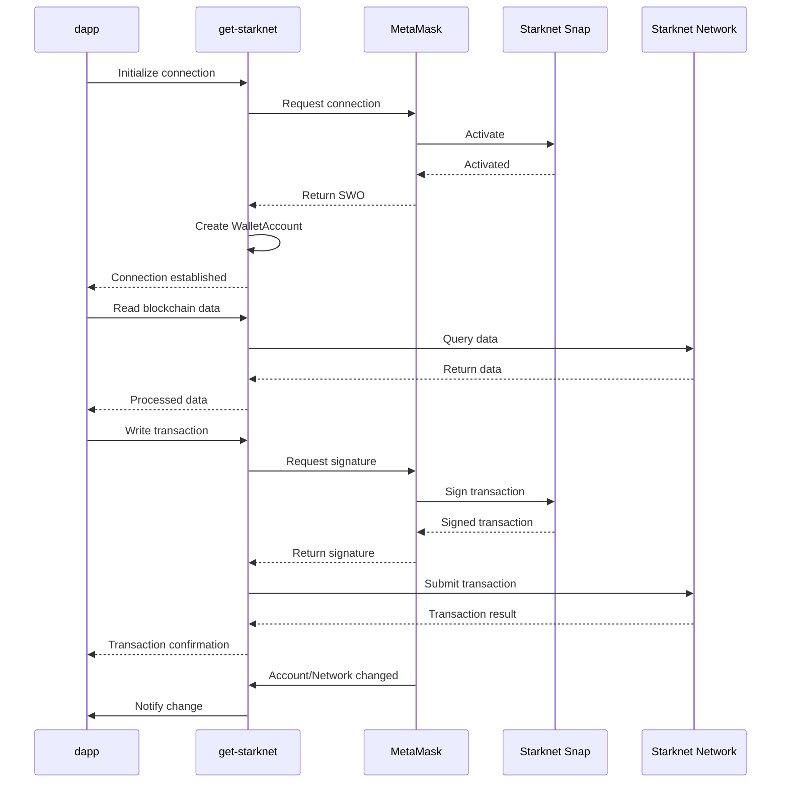

# Use Starknet

Starknet is a Layer 2 network built on Ethereum. To interact with Starknet accounts in MetaMask, which is a non-EVM network, you need to use the Starknet Snap.

You can use `wallet_invokeSnap` or `get-starknet` to integrate with Starknet dapps.
The choice depends on your specific use case and development preferences. 

Both methods enable developers to connect Starknet dapps with wallet solutions. 

`wallet_invokeSnap`:
- Requires precise method names and parameter structures.
- Handles both MetaMask-specific and Starknet-specific errors.
- Designed for operating within the MetaMask framework.
- Manages lower-level StarkNet interactions directly.
- Results are in more detailed, lower-level code.

`get-starknet`:
- Provides a high-level API that abstracts complex operations.
- Offers standardized error handling.
- Supports multiple wallets, not limited to MetaMask.
- Manages wallet connections and Starknet interactions.
- Results are in more readable code.

:::note

The `get-starknet` method is recommended for simplified integration with the non-EVM Starknet network.

:::

The choice between the two connection methods depends on the specific needs of the project, the desired level of control, and familiarity with Starknet and Snaps.

## About `get-starknet`

`get-starknet` is a library that simplifies Starknet network interactions.
It works with the Starknet Snap to extend the functionality of MetaMask and enable dapps to interact with users' Starknet accounts in MetaMask.

When you integrate `get-starknet` into your dapp, it creates a `WalletAccount` object. `WalletAccount` acts as a connection between dapps and MetaMask and provides a way to manage Starknet interactions.

This allows users to send Starknet transactions, sign Starknet messages, and manage Starknet accounts within MetaMask, and this functionality can be extended to multiple wallets.

### How `get-starknet` and MetaMask interact

A dapp with `get-starknet` installed interacts with MetaMask as follows:

1. The dapp uses `get-starknet` to request the user connect to MetaMask. If the user doesn't have the Starknet Snap installed, MetaMask prompts the user to connect and approve the installation.

1. After the dapp is connected to MetaMask and the Starknet Snap, `get-starknet` receives a Starknet Windows Object (SWO), which represents the MetaMask wallet with Starknet functionality.

1. `get-starknet` creates a [`WalletAccount`](http://starknetjs.com/docs/guides/walletAccount/) instance. This instance manages the Starknet account within MetaMask.

The `get-starknet` library offers several key features that streamline how dapps interact with the StarkNet network through MetaMask."

- The `WalletAccount` uses a specified provider to access data from the StarkNet network.
- For transactions, `get-starknet` prepares the data and sends it to MetaMask for signing via StarkNet Snap.
- `get-starknet` enables the dapp to create contract instances connected to the `WalletAccount`, allowing smart contract functions to be invoked, with MetaMask handling the signatures.
- It sets up listeners for account and network changes in MetaMask, so the dapp can subscribe and update its state accordingly.
- `get-starknet` can request network changes through MetaMask, allowing users to switch between StarkNet networks, such as Mainnet or Sepolia testnet.
- It can also request MetaMask to display specific tokens, improving the user experience.