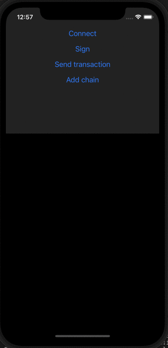

# Use MetaMask SDK with React Native

You can import MetaMask SDK into your React Native dapp to enable your users to easily connect
with their MetaMask Mobile wallet.

## How it works

When a user accesses your mobile React Native dapp, the SDK automatically deeplinks to MetaMask
Mobile (or if the user doesn't already have it, prompts them to install it).
Once the user accepts the connection, they're automatically redirected back to your dapp.
This happens for all actions that need user approval.

<p align="center">



</p>

You can download the
[React Native example](https://c0f4f41c-2f55-4863-921b-sdk-docs.github.io/downloads/reactNativeApp_v0.1.0.zip).
Install the example using `yarn setup` and run it using `yarn ios` or `yarn android`.

## Prerequisites

- A React Native project set up
- [MetaMask Mobile](https://github.com/MetaMask/metamask-mobile) v5.8.1 or above
- [Yarn](https://yarnpkg.com/getting-started/install) or
  [npm](https://docs.npmjs.com/downloading-and-installing-node-js-and-npm)

## Install the SDK

:::tip Coming soon
A `metamask-react-native-sdk` package that simplifies the installation of the SDK for React Native
dapps is coming soon.
:::

Use [`rn-nodeify`](https://github.com/tradle/rn-nodeify) to install the SDK.
In your project directory, install `rn-nodeify`:

```bash
yarn add --dev rn-nodeify
or
npm i --dev rn-nodeify
```

Install the `rn-nodeify` libraries:

```bash
yarn add react-native-crypto
yarn add react-native-randombytes
yarn add crypto
yarn add process
yarn add stream
yarn add events
```

In your project's `package.json` file, insert the `rn-nodeify` command into the postinstall script:

```json title="package.json"
"scripts": {
  ...,
  "postinstall": "rn-nodeify --install 'crypto,process,stream,events' --hack"
}
```

`rn-nodeify` creates a `shim.js` file in your project root directory.
Import it in the root file of your application:

```bash
import './shim'
```

Install `react-native-background-timer`:

```bash
yarn add react-native-background-timer

cd ios && pod install && cd ..
```

Install MetaMask SDK:

```bash
yarn add @metamask/sdk
```

Run the postinstall script after everything is installed:

```bash
yarn postinstall
```

Finally, install the necessary pods that come with the libraries:

```bash
cd ios && pod install && cd ..
```

## Use the SDK

Import, instantiate, and use the SDK by adding something similar to the following to your project script:

```javascript
import MetaMaskSDK from '@metamask/sdk';
import { Linking } from 'react-native';
import BackgroundTimer from 'react-native-background-timer';

const MMSDK = new MetaMaskSDK({
  openDeeplink: (link) => {
    Linking.openURL(link); // Use React Native Linking method or another way of opening deeplinks.
  },
  timer: BackgroundTimer, // To keep the dapp alive once it goes to background.
  dappMetadata: {
    name: 'My dapp', // The name of your dapp.
    url: 'https://mydapp.com', // The URL of your website.
  },
});

const ethereum = MMSDK.getProvider();

const accounts = await ethereum.request({ method: 'eth_requestAccounts' });
```

You can configure the SDK using any [options](../../reference/sdk-js-options.md) and call any
[provider API methods](../../reference/provider-api.md).
Always call [`eth_requestAccounts`](../../reference/rpc-api.md#eth_requestaccounts) using
[`ethereum.request()`](../../reference/provider-api.md#windowethereumrequestargs) first, since it
prompts the installation or connection popup to appear.

You can use [EthersJS](https://docs.ethers.io/v5/getting-started/) with your React Native app:

```javascript
const provider = new ethers.providers.Web3Provider(ethereum);

// Get the balance of an account (by address or ENS name, if supported by network).
const balance = await provider.getBalance(ethereum.selectedAddress);

// Often you need to format the output to something more user-friendly,
// such as in ether (instead of wei).
const balanceInETH = ethers.utils.formatEther(balance);
// '0.182826475815887608'
```
