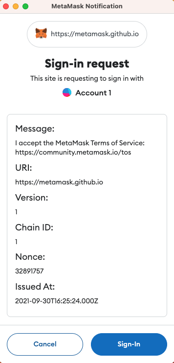

# Use Sign-In with Ethereum

You can integrate the [Sign-In with Ethereum (SIWE)](https://docs.login.xyz/) feature into your dapp to enable
users to log into your dapp by authenticating with their MetaMask wallet account.

Following the SIWE standard allows MetaMask to parse that message and give the user a friendly
interface prompting them to sign in:

