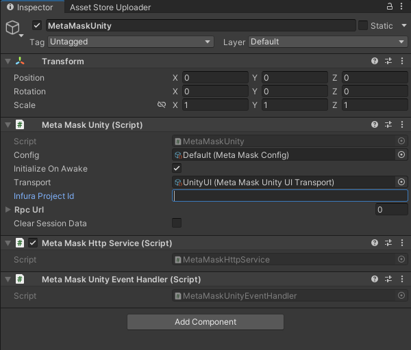

# Set up Infura in Unity

You can set up MetaMask SDK with [Infura](https://docs.infura.io/) in
your Unity game.

## Prerequisites

- An Infura API key.
  Create one by following the first two steps in the
  [Infura getting started guide](https://docs.infura.io/getting-started).

- [An allowlist configured for your API key.](https://docs.infura.io/networks/ethereum/how-to/secure-a-project/use-an-allowlist)

  :::caution important
  Your API key, when used with the SDK, is vulnerable to exposure.
  If someone inspects your dapp's code, they can potentially retrieve your API key and submit
  requests to Infura, impersonating your account.

  Use [allowlists](https://docs.infura.io/networks/ethereum/how-to/secure-a-project/use-an-allowlist)
  to protect against this vulnerability.
  You can restrict interactions with your API key to specific addresses, origins, user agents, and request methods.
  We recommend using all allowlist options to maximize the security of your API key and dapp.
  :::

- [MetaMask SDK set up](../../connect/metamask-sdk/gaming/unity.md) in your Unity game.

## Steps

1. Open your Unity project with the SDK installed.

2. Navigate to the game object in your scene (or the Prefab instance) that currently stores the
   `MetaMask Unity` script.
   In the `Demo` scene, this is the `MetaMaskUnitySDK` game object.

3. Select the `MetaMaskUnitySDK` Prefab to view its properties in the **Inspector** window.

4. In the **MetaMask Unity (Script)** section, enter your Infura API key into the **Infura Project
   Id** field.

5. Save your changes.
   This automatically configures all RPC URLs that Infura supports.
