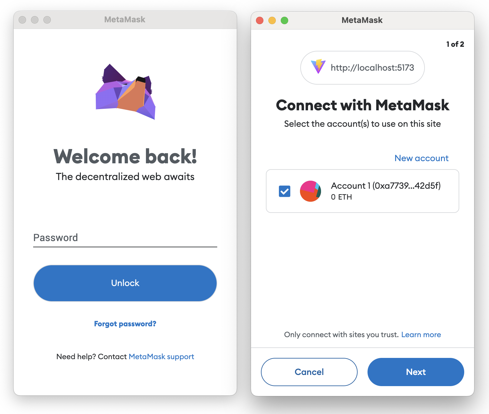

# Create a simple dapp

This tutorial walks you through creating a simple JavaScript dapp and integrating it with MetaMask.
It demonstrates the basics of connecting to MetaMask: detecting the MetaMask provider, detecting the user's network, and accessing the user's accounts.

:::caution Learning tutorial
This tutorial is for educational purposes and connects to MetaMask using the legacy provider object, `window.ethereum`, for the sake of simplicity.
For deployment in a production environment, we recommend [connecting to MetaMask using EIP-6963](../how-to/connect.md) instead.

[EIP-6963](https://eips.ethereum.org/EIPS/eip-6963) introduces an alternative wallet detection mechanism to the `window.ethereum` provider, and enables dapps to support [wallet interoperability](../concepts/wallet-interoperability.md).

For a full end-to-end tutorial that can be used in production, see the
[Create a simple React dapp](../tutorials/react-dapp-local-state.md) tutorial.
:::

## Prerequisites

- [Node.js](https://nodejs.org/en/) version 20+
- [npm](https://docs.npmjs.com/downloading-and-installing-node-js-and-npm) version 9+
- A text editor of your choice, such as [VS Code](https://code.visualstudio.com/).
- [MetaMask](https://metamask.io/) installed in the browser of your choice on your development machine.

## Steps

### 1. Set up the project

Create a new project using [Vite](https://vitejs.dev/guide/):

```bash
npm create vite@latest simple-dapp -- --template vanilla
```

Change into your project directory:

```bash
cd simple-dapp
```

Install the dependencies listed in the project's `package.json`:

```bash
npm install
```

### 2. Create the dapp structure

In your project directory, create a `main.js` file:

```bash
touch main.js
```

In `main.js`, add the following:

```js title="main.js"
import "./style.css"

document.querySelector("#app").innerHTML = `
  <button class="enableEthereumButton">Enable Ethereum</button>
  <h2>Account: <span class="showAccount"></span></h2>`
```

Update `index.html` to include the script:

```html title="index.html"
<!doctype html>
<html lang="en">
  <head>
    <meta charset="UTF-8" />
    <link rel="icon" type="image/svg+xml" href="/vite.svg" />
    <meta name="viewport" content="width=device-width, initial-scale=1.0" />
    <title>Simple dapp</title>
  </head>
  <body>
    <div id="app"></div>
    <script type="module" src="/main.js"></script>
  </body>
</html>
```

### 3. Detect MetaMask

:::caution
The `@metamask/detect-provider` module is deprecated, and is only used here for educational purposes.
In production environments, we recommend [connecting to MetaMask using EIP-6963](../how-to/connect.md).
:::

Install the `@metamask/detect-provider` module in your project directory:

```bash
npm i @metamask/detect-provider
```

Create a `src` directory and create a new file `detect.js`:

```bash
mkdir src && touch src/detect.js
```

In a text editor, add the following code to `src/detect.js` to detect the MetaMask provider using `@metamask/detect-provider`:

```js title="detect.js"
import detectEthereumProvider from "@metamask/detect-provider"

async function setup() {
  const provider = await detectEthereumProvider()

  if (provider && provider === window.ethereum) {
    console.log("MetaMask is available!")
    startApp(provider) // Initialize your dapp with MetaMask.
  } else {
    console.log("Please install MetaMask!")
  }
}

function startApp(provider) {
  if (provider !== window.ethereum) {
    console.error("Do you have multiple wallets installed?")
  }
}

window.addEventListener("load", setup)
```

### 4. Detect a user's network

[Detect the user's network](../how-to/manage-networks/detect-network.md) to ensure all RPC requests
are submitted to the currently connected network.
Add the following code to `src/detect.js`, which uses the [`eth_chainId`](/wallet/reference/json-rpc-methods/eth_chainid)
RPC method to detect the chain ID of the user's current network, and listens to the
[`chainChanged`](/wallet/reference/provider-api/#chainchanged) provider event to detect when the
user changes networks:

```js title="detect.js"
const chainId = await window.ethereum.request({ method: "eth_chainId" })

window.ethereum.on("chainChanged", handleChainChanged)

function handleChainChanged(chainId) {
  // We recommend reloading the page, unless you must do otherwise.
  window.location.reload()
}
```

### 5. Access a user's accounts

To interact with Ethereum on the user's behalf, such as sending transactions or requesting balances,
your dapp needs to [access the user's accounts](../how-to/access-accounts.md) by calling
[`eth_requestAccounts`](/wallet/reference/json-rpc-methods/eth_requestaccounts).

Add the following code to `src/detect.js`, which creates a button to allow users to connect to
MetaMask from your dapp.
Selecting the button activates the call to `eth_requestAccounts`, allowing you to access the user's accounts.

```jsx title="detect.js"
// You should only attempt to request the user's account in response to user interaction, such as
// selecting a button. Otherwise, you risk spamming the user. If you fail to retrieve
// the user's account, you should encourage the user to initiate the attempt.
const ethereumButton = document.querySelector(".enableEthereumButton")
const showAccount = document.querySelector(".showAccount")

ethereumButton.addEventListener("click", () => {
  getAccount()
})

// While awaiting the call to eth_requestAccounts, you should disable any buttons the user can
// select to initiate the request. MetaMask rejects any additional requests while the first is still
// pending.
async function getAccount() {
  const accounts = await window.ethereum
    .request({ method: "eth_requestAccounts" })
    .catch((err) => {
      if (err.code === 4001) {
        // EIP-1193 userRejectedRequest error.
        // If this happens, the user rejected the connection request.
        console.log("Please connect to MetaMask.")
      } else {
        console.error(err)
      }
    })
  const account = accounts[0]
  showAccount.innerHTML = account
}
```

Update `index.html` with the following HTML code, which displays the button and the current account:

```html title="index.html"
<!doctype html>
<html lang="en">
  <head>
    <meta charset="UTF-8" />
    <link rel="icon" type="image/svg+xml" href="/vite.svg" />
    <meta name="viewport" content="width=device-width, initial-scale=1.0" />
    <title>Simple dapp</title>
    <script type="module" src="/main.js"></script>
    <script type="module" src="src/detect.js"></script>
  </head>
  <body>
    <!-- Display a connect button and the current account -->
    <button class="enableEthereumButton">Enable Ethereum</button>
    <h2>Account: <span class="showAccount"></span></h2>
  </body>
</html>
```

Save your changes and run the following command in your project directory to start a local
development server:

```bash
npm run dev
```

Navigate to the local server URL to view the live dapp.
Something like the following displays:

<p align="center">

</p>

When you select the **Enable Ethereum** button, you are prompted to connect to MetaMask.



After connecting, your connected account displays:

<p align="center">

</p>

## Example

The following code samples contain the full simple dapp JavaScript and HTML code that this tutorial walks through.
You can copy the following full examples to get started quickly.

### JavaScript

```jsx title="detect.js"
/*****************************************/
/* Detect the MetaMask Ethereum provider */
/*****************************************/

import detectEthereumProvider from "@metamask/detect-provider"

async function setup() {
  const provider = await detectEthereumProvider()

  if (provider && provider === window.ethereum) {
    console.log("MetaMask is available!")
    startApp(provider)
  } else {
    console.log("Please install MetaMask!")
  }
}

function startApp(provider) {
  if (provider !== window.ethereum) {
    console.error("Do you have multiple wallets installed?")
  }
}

window.addEventListener("load", setup)

/**********************************************************/
/* Handle chain (network) and chainChanged (per EIP-1193) */
/**********************************************************/

const chainId = await window.ethereum.request({ method: "eth_chainId" })

window.ethereum.on("chainChanged", handleChainChanged)

function handleChainChanged(chainId) {
  window.location.reload()
}

/*********************************************/
/* Access the user's accounts (per EIP-1102) */
/*********************************************/

const ethereumButton = document.querySelector(".enableEthereumButton")
const showAccount = document.querySelector(".showAccount")

ethereumButton.addEventListener("click", () => {
  getAccount()
})

async function getAccount() {
  const accounts = await window.ethereum
    .request({ method: "eth_requestAccounts" })
    .catch((err) => {
      if (err.code === 4001) {
        console.log("Please connect to MetaMask.")
      } else {
        console.error(err)
      }
    })
  const account = accounts[0]
  showAccount.innerHTML = account
}
```

### HTML

```html title="index.html"
<!doctype html>
<html lang="en">
  <head>
    <meta charset="UTF-8" />
    <link rel="icon" type="image/svg+xml" href="/vite.svg" />
    <meta name="viewport" content="width=device-width, initial-scale=1.0" />
    <title>Simple dapp</title>
    <script type="module" src="/main.js"></script>
    <script type="module" src="src/detect.js"></script>
  </head>
  <body>
    <button class="enableEthereumButton">Enable Ethereum</button>
    <h2>Account: <span class="showAccount"></span></h2>
  </body>
</html>
```

## Next steps

You've successfully created a simple dapp and connected it to MetaMask using JavaScript, Vite, and the `window.ethereum` provider.
With this setup, your dapp can interact with MetaMask and allow users to securely access accounts and send transactions on the Ethereum blockchain.

As a next step, you can create a [React dapp with local state](react-dapp-local-state.md).
This follow-up tutorial walks you through integrating a simple React dapp with MetaMask using a
single JSX component for managing local state, and the Vite build tool with React and TypeScript to create the dapp.
