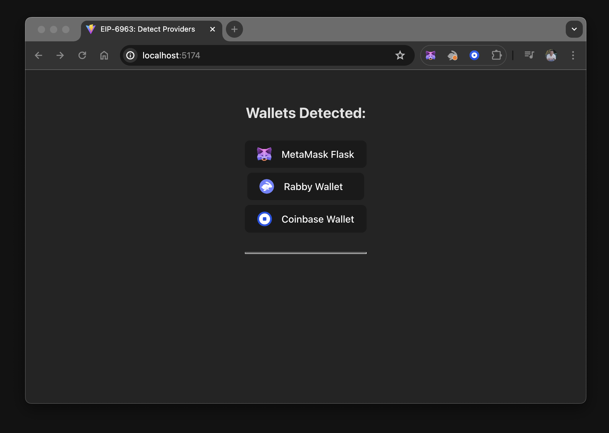

import Tabs from '@theme/Tabs';
import TabItem from '@theme/TabItem';

# Create a React dapp with global state

This tutorial walks you through integrating a React dapp with MetaMask.
The dapp has multiple components and requires managing the state globally.
You'll use the [Vite](https://v3.vitejs.dev/guide) build tool with React and TypeScript to create
the dapp.

:::tip
We recommend starting with [creating a React dapp with local state](react-dapp-local-state.md), which introduces [EIP-6963](https://eips.ethereum.org/EIPS/eip-6963). The tutorial demonstrates how to iterate over all discovered providers, connect to the selected wallet, and remember the selection within a single component. 

If you skip the tutorial, consider reviewing [wallet interoperability](../concepts/wallet-interoperability/) to understand how multiple injected wallet providers work.
:::

In real-world use cases, a dapp shares state across many components. 
This tutorial is more complex than the tutorial to create a dapp in a local state because it addresses real-world scenarios. 
The dapp you create using this tutorial will look similar to the following:


In this tutorial, the state is put into a [React Context](https://react.dev/reference/react/useContext) component, creating a [global state](https://react.dev/learn/reusing-logic-with-custom-hooks#custom-hooks-sharing-logic-between-components)
that allows other components and UI elements to benefit from its data and functions. 

You'll also use `localStorage` to persist the selected wallet, ensuring the last connected wallet state remains intact even after a page refresh.

This tutorial addresses the edge case where a browser wallet may be disabled or uninstalled between refreshes or visits to the dapp. A disconnect function is added to reset the state and you can use [`wallet_revokePermissions`](/wallet/reference/wallet_revokePermissions) to properly disconnect from MetaMask.

:::info Project source code
You can view the [dapp source code on GitHub](https://github.com/MetaMask/vite-react-global-tutorial).
:::

## Prerequisites

- [Node.js](https://nodejs.org/) version 18+
- [npm](https://docs.npmjs.com/downloading-and-installing-node-js-and-npm) version 9+
- A text editor (for example, [VS Code](https://code.visualstudio.com/))
- The [MetaMask extension](https://metamask.io/download) installed
- Basic knowledge of TypeScript, React, React Context, and React Hooks
- You have completed the [Creating a React dapp with local state](react-dapp-local-state.md) tutorial

## Steps

### 1. Set up the project

This project introduces a new structure, independent of previous tutorials. Instead of reusing code or states, this tutorial guides you through breaking down the single-component structure into multiple components.

Create a new ViteJS project and add the necessary directory structure:

```bash
npm create vite@latest vite-react-global-state -- --template react-ts
```

Install the node module dependencies:

```bash
cd vite-react-global-state && npm install
```

Launch the development server:

```bash
npm run dev
```

The terminal displays a `localhost` URL, which you can use to view the dapp in your browser.

:::note tip
If you are using VS Code, you can run the `code .` command to open the project.

If the development server stops, you can use the `npx vite` or
`npm run dev` command to re-run your project. 
:::

After you open the ViteJS React project in your editor of choice, add three directories within the `src` directory. 

Create a `src/components`, `src/hooks` and `src/utils` directory in the root of the project using the following commands:

```bash
mkdir src/components && mkdir src/hooks && mkdir src/utils
```

Create components for listing installed wallets, displaying connected wallet information, and handling errors. Additionally, create a CSS module for each component:

Create the following files in `src/components`:

- `SelectedWallet.module.css`
- `SelectedWallet.tsx`
- `WalletError.module.css`
- `WalletError.tsx`
- `WalletList.module.css`
- `WalletList.tsx`

Create the following files in `src/hooks`:

- `Eip6963Provider.tsx`
- `useEip6963Provider.tsx`

Create the following file in `src/utils`:

- `index.ts`

#### Styling

Add the following CSS code to `SelectedWallet.module.css`:

```css title="SelectedWallet.module.css"
.selectedWallet {
  display: flex;
  flex-flow: row nowrap;
  justify-content: flex-start;

  padding: 0.6em 1.2em;
  margin-bottom: 0.5em;

  font-family: inherit;
  font-size: 1em;
  font-weight: 500;
}
.selectedWallet > img {
  width: 2em;
  height: 1.5em;
  margin-right: 1em;
}

.providers {
  display: flex;
  flex-flow: column wrap;
  justify-content: center;
  align-items: center;
  align-content: center;

  padding: 0.6em 1.2em;
}
```

Add the following CSS code to `WalletError.module.css`:

```css title="WalletError.module.css"
.walletError {
  margin-top: 1em;
  border-radius: 0.5em;
  height: 36px;
  padding: 16px;
  color: #EFEFEF;
  background-color: transparent;
  user-select: none;
}
```

Add the following CSS code to `WalletList.module.css`:

```css title="WalletList.module.css"
.walletList {
  display: flex;
  flex-direction: column;
  align-items: center;
}
```

Append the following code to the end of `src/index.css`:

```css title="index.css"
/* added css */
:root {
  text-align: left;
}

hr {
  margin-top: 2em;
  height: 1px;
}

button {
  min-width: 12em;
  display: flex;
  flex-flow: row nowrap;
  justify-content: flex-start;

  align-items: center;
  border-radius: 0.5em;
  margin-bottom: 0.5em;
  border: 1px solid transparent;
}

button > img {
  width: 1.5em;
  height: 1.5em;
  margin-right: 1em;
}

button:hover {
  border-color: #75079d;
}

button:first-child {
  margin-top: 0.5em;
}
button:last-child {
  margin-bottom: 0;
}
```

#### Project structure

You now have some basic global and component-level styling for your application.
The directory structure in the dapp's `/src` directory should look similar to the following:

```text
├── src
│   ├── assets
│   ├── components
│   │   ├──  SelectedWallet.module.css
│   │   ├──  SelectedWallet.tsx
│   │   ├──  WalletError.module.css
│   │   ├──  WalletError.tsx
│   │   ├──  WalletList.module.css
│   │   └──  WalletList.tsx
│   ├── hooks
│   │   ├── WalletProvider.tsx
│   │   └── useWalletProvider.tsx
│   ├── utils
│   │   └── index.tsx
├── App.css
├── App.tsx
├── index.css
├── main.tsx
├── vite-env.d.ts
```

### 2. Import EIP-6963 interfaces

The dapp connects to MetaMask using EIP-6963.

:::info Why EIP-6963?
[EIP-6963](https://eips.ethereum.org/EIPS/eip-6963) introduces an alternative wallet detection
mechanism to the `window.ethereum` injected provider.
This alternative mechanism enables dapps to support
[wallet interoperability](../concepts/wallet-interoperability.md) by discovering multiple injected
wallet providers in a user's browser.
:::

Update the Vite environment variable file, `src/vite-env.d.ts`, with the types and interfaces
needed for [EIP-6963](https://eips.ethereum.org/EIPS/eip-6963) and
[EIP-1193](https://eips.ethereum.org/EIPS/eip-1193):

```tsx title="vite-env.d.ts"
/// <reference types="vite/client" />

interface EIP1193Provider {
  isStatus?: boolean
  host?: string
  path?: string
  sendAsync?: (request: { method: string, params?: Array<unknown> }, callback: (error: Error | null, response: unknown) => void) => void
  send?: (request: { method: string, params?: Array<unknown> }, callback: (error: Error | null, response: unknown) => void) => void
  request: (request: { method: string, params?: Array<unknown> }) => Promise<unknown>
}

interface EIP6963ProviderInfo {
  rdns: string
  uuid: string
  name: string
  icon: string
}

interface EIP6963ProviderDetail {
  info: EIP6963ProviderInfo
  provider: EIP1193Provider
}

type EIP6963AnnounceProviderEvent = {
  detail:{
    info: EIP6963ProviderInfo,
    provider: Readonly<EIP1193Provider>
 }
}

interface WalletError {
  code?: string
  message?: string
}
```

This also adds an interface for `WalletError`.

### 3. Build the context provider

This section of the tutorial explains how to create the React Context component using various types, interfaces, functions, hooks, events, effects, and RPC calls. 
The React Context component wraps your application, providing all components access to the state and functions required to modify the state and manage connections to discovered wallets.

To do this, you must first import the necessary context. Then, define a type alias for a record where the keys are wallet identifiers and the values are account addresses or null.

Next, define the context interface for the EIP-6963 provider. The interface includes the following:

* A list of wallets, represented as a record of wallets by `runs`.
* The selected wallet, of type `EIP6963ProviderDetail`.
* The chosen account address, represented as a string.
* An error message, also represented as a string.
* Functions to connect and disconnect wallets.

Add the following code to `src/hooks/WalletProvider` to import the context, define the type aliase, and define the interface :

```ts title="WalletProvider" showLineNumbers
import { PropsWithChildren, createContext, useCallback, useEffect, useState } from 'react'
type SelectedAccountByWallet = Record<string, string | null>
interface WalletProviderContext {
  wallets: Record<string, EIP6963ProviderDetail>
  selectedWallet: EIP6963ProviderDetail | null
  selectedAccount: string | null
  errorMessage: string | null
  connectWallet: (walletUuid: string) => Promise<void>
  disconnectWallet: () => void
  clearError: () => void
}
```

Add the following code to `src/hooks/WalletProvider` to extend the global `WindowEventMap` interface with the custom `eip6963:announceProvider` event:

```ts title="WalletProvider"
declare global{
  interface WindowEventMap {
    'eip6963:announceProvider': CustomEvent
 }
}
```

Explicitly declaring the custom `eip6963:announceProvider` event prevents type errors, enables proper type checking, and supports autocompletion in TypeScript.

Create a React Context for the EIP-6963 WalletProvider with the defined interface `WalletProviderContext` with a default of `null`, then define the `WalletProvider` component. `The WalletProvider` component wraps all other components in the dapp, providing them with the necessary data and functions related to wallets.

Add the following code to `src/hooks/WalletProvider` to create the React Context with the defined interface:

```ts title="WalletProvider" showLineNumbers
export const WalletProviderContext = createContext<WalletProviderContext>(null)

export const WalletProvider: React.FC<PropsWithChildren> = ({ children }) => {
  const [wallets, setWallets] = useState<Record<string, EIP6963ProviderDetail>>({})
  const [selectedWalletRdns, setSelectedWalletRdns] = useState<string | null>(null)
  const [selectedAccountByWalletRdns, setSelectedAccountByWalletRdns] = useState<SelectedAccountByWallet>({})

  const [errorMessage, setErrorMessage] = useState('')
  const clearError = () => setErrorMessage('')
  const setError = (error: string) => setErrorMessage(error)

  useEffect(() => {
    const savedSelectedWalletRdns = localStorage.getItem('selectedWalletRdns')
    const savedSelectedAccountByWalletRdns = localStorage.getItem('selectedAccountByWalletRdns')

    if (savedSelectedAccountByWalletRdns) {
      setSelectedAccountByWalletRdns(JSON.parse(savedSelectedAccountByWalletRdns))
    }

    function onAnnouncement(event: EIP6963AnnounceProviderEvent){
      setWallets(currentWallets => ({
        ...currentWallets,
        [event.detail.info.rdns]: event.detail
      }))

      if (savedSelectedWalletRdns && event.detail.info.rdns === savedSelectedWalletRdns) {
        setSelectedWalletRdns(savedSelectedWalletRdns)
      }
    }

    window.addEventListener('eip6963:announceProvider', onAnnouncement)
    window.dispatchEvent(new Event('eip6963:requestProvider'))
    
    return () => window.removeEventListener('eip6963:announceProvider', onAnnouncement)
  }, [])
```
In the above code sample, lines 4-10 are state definitions: 

- `wallets`: State to hold detected wallets. 
- `selectedWalletRdns`: State to hold the RDNS of the selected wallet. 
- `selectedAccountByWalletRdns`: State to hold accounts associated with each wallet.
- `errorMessage`: State to hold the error message when a wallet errors on connection.
- `clearError`: Function to clear the state in `errorMessage`.
- `setError`: Function to set the state in `errorMessage` (with a `string`)

In the above code sample, line 12 is the `useEffect` hook and it handles:

- Local storage retrieval: On mount, retrieves the saved selected wallet and accounts from local storage.
- Event listener: Adds an event listener for the custom `eip6963:announceProvider` event. 
- `OnAnnouncement`: When the provider announces itself, update the state.
- Provider request: Dispatches an event to request existing providers.
- Cleanup: A `return` statement in a `useEffect` is used for cleanup, in our case it removes the event listener on unmount.

Add the following code to `src/hooks/WalletProvider` to connect a wallet and update the component's state:

```ts title="WalletProvider" showLineNumbers
  const connectWallet = useCallback(async (walletRdns: string) => {
    try {
      const wallet = wallets[walletRdns]
      const accounts = await wallet.provider.request({method:'eth_requestAccounts'}) as string[]

      if(accounts?.[0]) {
        setSelectedWalletRdns(wallet.info.rdns)
        setSelectedAccountByWalletRdns((currentAccounts) => ({
          ...currentAccounts,
          [wallet.info.rdns]: accounts[0],
        }))

        localStorage.setItem('selectedWalletRdns', wallet.info.rdns)
        localStorage.setItem('selectedAccountByWalletRdns', JSON.stringify({
          ...selectedAccountByWalletRdns,
          [wallet.info.rdns]: accounts[0],
        }))
      }
    } catch (error) {
      console.error('Failed to connect to provider:', error)
      const walletError: WalletError = error as WalletError
      setError(`Code: ${walletError.code} \nError Message: ${walletError.message}`)
    }
  }, [wallets, selectedAccountByWalletRdns])
```

The code uses the `walletRdns` parameter to identify the wallet's Reverse Domain Name System (RDNS) for connecting.

The function performs an asynchronous operation to request accounts from the wallet provider using the Ethereum JSON-RPC method `eth_requestAccounts`.

Add the following code to `src/hooks/WalletProvider`:

```ts title="WalletProvider"
  const disconnectWallet = useCallback(async () => {
    if (selectedWalletRdns) {
      setSelectedAccountByWalletRdns((currentAccounts) => ({
        ...currentAccounts,
        [selectedWalletRdns]: null,
      }))

      const wallet = wallets[selectedWalletRdns];
      setSelectedWalletRdns(null)
      localStorage.removeItem('selectedWalletRdns')

      try {
        await wallet.provider.request({
          method: 'wallet_revokePermissions',
          params: [{ 'eth_accounts': {} }]
        });
      } catch (error) {
        console.error('Failed to revoke permissions:', error);
      }
    }
  }, [selectedWalletRdns, wallets])
```

:::caution important
[`wallet_revokePermission`](/wallet/reference/wallet_revokePermissions) is an experimental RPC method that may only work with MetaMask. Configuring the revocation in a try/catch block and separating it from the rest of the cleanup ensures that if a wallet does not support this feature, the rest of the disconnect functionality will still execute.
:::

:::note
Both of the previous functions use `useCallback`. It is used to memoize the `connectWallet` function, optimize performance, and prevent unnecessary re-renders. It ensures the function instance remains consistent between renders if its dependencies are changed. 

For example, when using `disconnectWallet`, each time the `WalletProvider` component re-renders without `useCallback`, a new instance of `disconnectWallet` is created. This can cause unnecessary re-renders of child components that depend on this function. By memoizing it with `useCallback`, React keeps the function instance consistent between renders, as long as its dependencies (wallets and `selectedWalletRdns`) haven't changed, preventing unnecessary re-renders of child components.

Although `useCallback` is not strictly necessary, it demonstrates best practices. Predicting how a context provider will be used or how the dapp might change or scale is difficult. Using `useCallback` can improve performance in some cases by reducing unnecessary re-renders.
:::

Add the following code to `src/hooks/WalletProvider` to bundle the state and functions using `contextValue`:

```ts title="WalletProvider" showLineNumbers
  const contextValue: WalletProviderContext = {
    wallets,
    selectedWallet: selectedWalletRdns === null ? null : wallets[selectedWalletRdns],
    selectedAccount: selectedWalletRdns === null ? null : selectedAccountByWalletRdns[selectedWalletRdns],
    errorMessage,
    connectWallet,
    disconnectWallet,
    clearError,
 }

  return (
   <WalletProviderContext.Provider value={contextValue}>
     {children}
   </WalletProviderContext.Provider>
 )
```

:::note
If `selectedWalletRdns` is null, set `selectedWallet` to null. Otherwise, retrieve the wallet details from the wallet state using the `runs` identifier.

If `selectedWalletRdns` is null, set `selectedAccount` to null. Otherwise, retrieve the account address from the `selectedAccountByWalletRdns` state using the `rdns` identifier.
:::

Within the component's return statement, the `contextValue` object is constructed with all necessary state and functions related to wallet management. It is passed to the `WalletProviderContext.Provider`, making wallet-related data and functions available to all descendant components. 

The return statement wraps the children components with the context provider, allowing them to access the context values.

Add the following code to `src/hooks/WalletProvider`:

```tsx title="useWalletProvider.tsx"
import { useContext } from 'react'
import { WalletProviderContext } from './WalletProvider'

export const useWalletProvider = () => useContext(WalletProviderContext)
```

The `useWalletProvider.tsx` file provides a custom hook that simplifies the process of consuming the `WalletProviderContext`.

In the code, the `useWalletProvider` hook is exported, which leverages the `useContext` hook to consume the `WalletProviderContext`.

The benefit of this separate file exporting the hook is that components can directly call `useWalletProvider() ` instead of `useContext(WalletProviderContext)`, making the code cleaner and more readable.

With `WalletProvider.tsx` and `useWalletProvider.tsx`, the dapp can manage and access wallet-related state and functionality across various components. You can now wrap the entire application (the part that requires wallet connection and data) with a `<WalletProvider></WalletProvider>` component.

Add the following code to `src/utils/index.ts` to wrap the app in the component:

```tsx title="useWalletProvider.tsx"
export const formatBalance = (rawBalance: string) => {
  const balance = (parseInt(rawBalance) / 1000000000000000000).toFixed(2)
  return balance
}

export const formatChainAsNum = (chainIdHex: string) => {
  const chainIdNum = parseInt(chainIdHex)
  return chainIdNum
}

export const formatAddress = (addr: string) => {
  const upperAfterLastTwo = addr.slice(0,2) + addr.slice(2)
  return `${upperAfterLastTwo.substring(0, 5)}...${upperAfterLastTwo.substring(39)}`
}
```

Although `formatAddress` is the only function used, `formatBalance` and `formatChainAsNum` were added as useful utility functions. Explore [Viem Formatters](https://viem.sh/docs/chains/formatters) or other libraries for additional formatting options.

### 4. Wrap components with the context provider

Replace the code in the file `src/App.tsx` with the following:

```tsx title="App.tsx"
import './App.css'
import { WalletProvider } from '~/hooks/WalletProvider'
// import { WalletList } from './components/WalletList'
// import { SelectedWallet } from './components/SelectedWallet'
// import { WalletError } from './components/WalletError'

function App() {
  return (
    <WalletProvider>
    {/* 
      <WalletList />
      <hr />
      <SelectedWallet />
      <WalletError /> 
    */}
    </WalletProvider>
 )
}

export default App
```
The child components are currently commented out, but as you create each of these components, you'll uncomment the specific lines. 

Create each of the components you've defined and add the logic and UI needed to accomplish your goals:

- Discover injected providers (browser-installed wallets).
- Save those providers and selected wallet in global state (context provider).
- Supply a list of wallet providers to child components.
- Include a component map the providers to a button with icon and name.
  - Have a `connectWallet` function for each of those buttons.
- Include a component that displays the selected wallet and info.
- Include a UI component to show errors.

### 5. Create the UI components

Create the components in the order that you've listed them in the `App.tsx` file. 
Start with `WalletList.tsx`.

Add the following code to `src/components/WalletList.tsx`:

```tsx title="WalletList.tsx"
import { useWalletProvider } from '~/hooks/useWalletProvider'
import styles from './WalletList.module.css'

export const WalletList = () => {
  const { wallets, connectWallet } = useWalletProvider()
  return (
    <>
      <h2>Wallets Detected:</h2>
      <div className={styles.walletList}>
        {
          Object.keys(wallets).length > 0 
            ? Object.values(wallets).map((provider: EIP6963ProviderDetail) => (
              <button key={provider.info.uuid} onClick={() => connectWallet(provider.info.rdns)}>
                
                <div>{provider.info.name}</div>
              </button>
            )) 
            : <div>there are no Announced Providers</div>
        }
      </div>
    </>
 )
}
```

You've imported the `wallets` data and the `connectWallet` function from the `useWalletProvider` hook.

The component checks if there are any detected wallets using `Object.keys(wallets).length > 0`. This check ensures that if no wallets are found, a message: "No wallets detected", is displayed instead of an empty list.


If wallets are detected, `Object.values(wallets).map(wallet => (...))` iterates over them and renders a button for each one.

- `Object.keys(wallets)` returns an array of the wallet keys (`rdns` values). It is used here to check the length.
- `Object.values(wallets)` returns an array of the wallet objects. This is needed to map and render.
- Using `wallet.info.rdns` as the key ensures that each wallet button is uniquely identified.

Uncomment the `WalletList` component in `src/App.tsx` and run the dapp. The following is displayed:



### 6. Display MetaMask data

Import the `selectedWallet` and `selectedAccount` functions, and the `disconnectWallet` function from the `useWalletProvider` hook.

Add the following code to `src/components/SelectedWallet.tsx`:

```tsx title="SelectedWallet.tsx" showLineNumbers
import { useWalletProvider } from '~/hooks/useWalletProvider'
import { formatAddress } from '~/utils'
import styles from './SelectedWallet.module.css'

export const SelectedWallet = () => {
  const { selectedWallet, selectedAccount, disconnectWallet } = useWalletProvider()

  return (
    <>
      <h2 className={styles.userAccount}>{selectedAccount ? '' : 'No '}Wallet Selected</h2>
      {selectedAccount &&
        <>
          <div className={styles.selectedWallet}>
            
            <div>{selectedWallet.info.name}</div>
            <div>({formatAddress(selectedAccount)})</div>
            <div><strong>uuid:</strong> {selectedWallet.info.uuid}</div>
            <div><strong>rdns:</strong> {selectedWallet.info.rdns}</div>
          </div>
          <button onClick={disconnectWallet}>Disconnect Wallet</button>
        </>
      }
    </>
 )
}
```

The code in lines 11-22 have conditional rendering for `{selectedAccount && (...)}`. 
This conditional rendering ensures that the content inside is only displayed if `selectedAccount` is true. 
This ensures that detailed information about the selected wallet is only displayed when an active wallet is connected. 
You can then display information about the wallet, and conditionally render anything related to the following:

- Wallet address
- Wallet balance
- Chain ID or name
- or render other components that first need a connected wallet to work

If you uncomment the `SelectedWallet` component in `src/App.tsx`, run the dapp and connect to MetaMask, the following is displayed:


### 7. Show wallet connection errors

Add the following code to `src/components/WalletError.tsx`:

```tsx title="WalletError.tsx"
import { useWalletProvider } from '~/hooks/useWalletProvider'
import styles from './WalletError.module.css'

export const WalletError = () => {
  const { errorMessage, clearError } = useWalletProvider()
  const isError = !!errorMessage

  return (
    <div className={styles.walletError} style={isError ? { backgroundColor: 'brown' } : {}}>
      {isError &&
        <div onClick={clearError}>
          <strong>Error:</strong> {errorMessage}
        </div>
      }
    </div>
 )
}
```

A `div` with the error message renders only if `errorMessage` contains data.

After clicking `div`, reset `errorMessage` to an empty string, which hides the content.

This method demonstrates how to display specific content, such as a modal or notification, in response to connection errors when connecting to a wallet.

To see the error handling, uncomment the `WalletError` component in `src/App.tsx`.
Run the dApp, disconnect from MetaMask, reconnect, and reject or cancel the connection. The following is displayed:


### 8. Run the final state of the dapp

Uncomment the code in `App.tsx`

```tsx title="App.tsx"
import './App.css'
import { WalletProvider } from '~/hooks/WalletProvider'
import { WalletList } from './components/WalletList'
import { SelectedWallet } from './components/SelectedWallet'
import { WalletError } from './components/WalletError'

function App() {
  return (
    <WalletProvider>
      <WalletList />
      <hr />
      <SelectedWallet />
      <WalletError />
    </WalletProvider>
 )
}

export default App
```

Run `npm run dev` to view the wallet list and select a wallet to connect to. The final state of the dapp when connected to a MetaMask wallet will look similar to the following:


### 9. Test the dapp features

You can conduct user tests to evaluate the functionality and features demonstrated in this tutorial:

1. Test the ability to connect and disconnect from multiple wallets installed in your browser.
2. After selecting a wallet, refresh the page and ensure that the selected wallet persists without reverting to **No Wallet Selected**.
3. Select a wallet, disable it, refresh the page, then re-enable the wallet and refresh the page again. Observe the behavior of the decentralized application (dapp).
4. When connecting to a wallet, deliberately cancel the connection or close the wallet prompt. This action should trigger the WalletError component, which can be dismissed by clicking on it.

## Conclusion

This tutorial guided you through applying your knowledge of EIP-6963 to connect to wallets, specifically MetaMask. This method also works with any wallet that [complies with EIP-6963](https://github.com/WalletConnect/EIP6963/blob/master/src/utils/constants.ts) and supports multi-injected provider discovery. In this tutorial, you addressed edge cases and created a context provider that facilitates data sharing, manages functions for connecting and disconnecting from wallets, and handles errors. You can view the [project source code](https://github.com/MetaMask/vite-react-global-tutorial)
for the final state of this dapp tutorial on GitHub.
