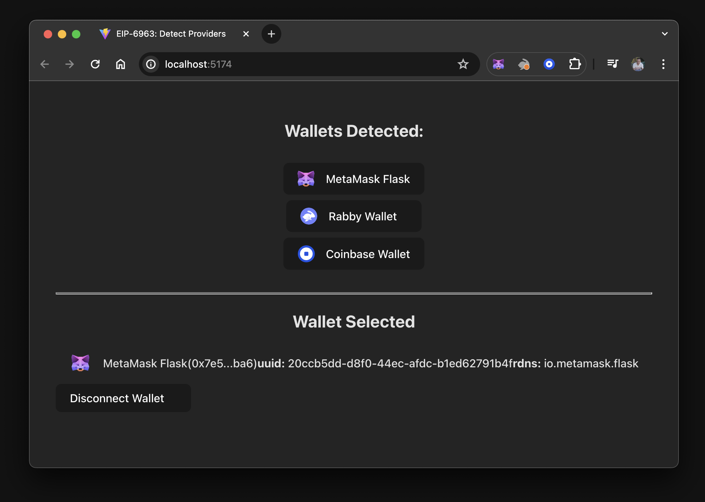
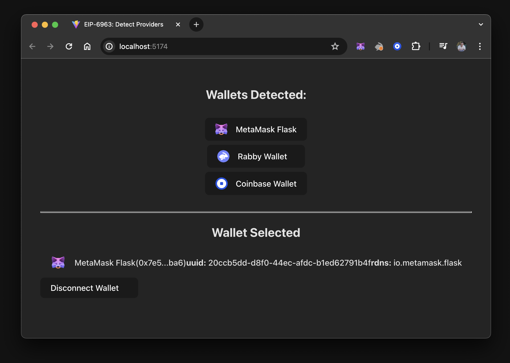
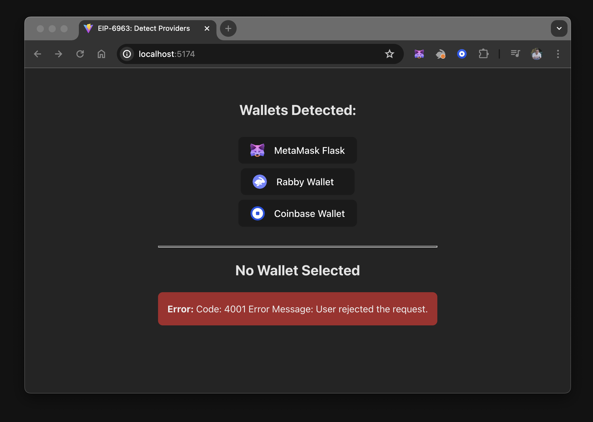

import Tabs from '@theme/Tabs';
import TabItem from '@theme/TabItem';

# Create a React dapp with global state

This tutorial walks you through integrating a React dapp with MetaMask.
The dapp has multiple components and requires managing the state globally, which can be helpful for
real-world use cases.
You'll use the [Vite](https://v3.vitejs.dev/guide) build tool with React and TypeScript to create
the dapp.

The final state of the dapp will look like the following:



In this tutorial, you'll put the state into a [React
Context](https://react.dev/reference/react/useContext) component, creating a [global
state](https://react.dev/learn/reusing-logic-with-custom-hooks#custom-hooks-sharing-logic-between-components)
that allows other components and UI elements to benefit from its data and functions.
You'll use `localStorage` to persist the selected wallet, ensuring the last connected wallet state
remains intact even after a page refresh.

This tutorial addresses the edge case where a browser wallet might be disabled or uninstalled
between refreshes or visits to the dapp.
You'll add a disconnect function to reset the state, and use
[`wallet_revokePermissions`](/wallet/reference/wallet_revokePermissions) to properly disconnect from MetaMask.

:::info Project source code
You can view the [dapp source code on GitHub](https://github.com/MetaMask/vite-react-global-tutorial).
:::

## Prerequisites

- [Node.js](https://nodejs.org/) version 18+
- [npm](https://docs.npmjs.com/downloading-and-installing-node-js-and-npm) version 9+
- A text editor (for example, [VS Code](https://code.visualstudio.com/))
- The [MetaMask extension](https://metamask.io/download) installed
- Basic knowledge of TypeScript, React, React Context, and React Hooks

:::tip
We recommend following the [Create a React dapp with local state](react-dapp-local-state.md)
tutorial first, which introduces [EIP-6963](https://eips.ethereum.org/EIPS/eip-6963).
The tutorial demonstrates how to iterate over all discovered providers, connect to the selected
wallet, and remember the selection within a single component.

If you skip the tutorial, consider reviewing [wallet
interoperability](../concepts/wallet-interoperability.md) to understand how multiple injected wallet
providers work.
:::

## Steps

### 1. Set up the project

This project introduces a new structure, independent of previous tutorials.
Instead of reusing code or states, this tutorial guides you through breaking down the
single-component structure into multiple components.

Set up a new project using Vite, React, and TypeScript by running the following command:

```bash
npm create vite@latest vite-react-global-state -- --template react-ts
```

Install the node module dependencies:

```bash
cd vite-react-global-state && npm install
```

Launch the development server:

```bash
npm run dev
```

This displays a `localhost` URL in your terminal, where you can view the dapp in your browser.

:::note
If you use VS Code, you can run the command `code .` to open the project.
If the development server has stopped, you can run the command `npx vite` or `npm run dev` to
restart your project.
:::

Open the project in your editor.
Create three directories, `src/components`, `src/hooks`, and `src/utils`, in the root of the project
using the following commands:

```bash
mkdir src/components && mkdir src/hooks && mkdir src/utils
```

Create the following files in `src/components`, which will be used to create components for listing
installed wallets, displaying connected wallet information, and handling errors:

- `WalletList.tsx`
- `WalletList.module.css`
- `SelectedWallet.tsx`
- `SelectedWallet.module.css`
- `WalletError.tsx`
- `WalletError.module.css`

Create the following files in `src/hooks`:

- `Eip6963Provider.tsx`
- `useEip6963Provider.tsx`

Create the following file in `src/utils`:

- `index.ts`

#### 1.1. Style the components

Add the following CSS code to `SelectedWallet.module.css`:

```css title="SelectedWallet.module.css"
.selectedWallet {
  display: flex;
  flex-flow: row nowrap;
  justify-content: flex-start;

  padding: 0.6em 1.2em;
  margin-bottom: 0.5em;

  font-family: inherit;
  font-size: 1em;
  font-weight: 500;
}
.selectedWallet > img {
  width: 2em;
  height: 1.5em;
  margin-right: 1em;
}

.providers {
  display: flex;
  flex-flow: column wrap;
  justify-content: center;
  align-items: center;
  align-content: center;

  padding: 0.6em 1.2em;
}
```

Add the following CSS code to `WalletError.module.css`:

```css title="WalletError.module.css"
.walletError {
  margin-top: 1em;
  border-radius: 0.5em;
  height: 36px;
  padding: 16px;
  color: #efefef;
  background-color: transparent;
  user-select: none;
}
```

Add the following CSS code to `WalletList.module.css`:

```css title="WalletList.module.css"
.walletList {
  display: flex;
  flex-direction: column;
  align-items: center;
}
```

Append the following code to the end of `src/index.css`:

```css title="index.css"
/* Added CSS */
:root {
  text-align: left;
}

hr {
  margin-top: 2em;
  height: 1px;
}

button {
  min-width: 12em;
  display: flex;
  flex-flow: row nowrap;
  justify-content: flex-start;

  align-items: center;
  border-radius: 0.5em;
  margin-bottom: 0.5em;
  border: 1px solid transparent;
}

button > img {
  width: 1.5em;
  height: 1.5em;
  margin-right: 1em;
}

button:hover {
  border-color: #75079d;
}

button:first-child {
  margin-top: 0.5em;
}
button:last-child {
  margin-bottom: 0;
}
```

#### 1.2. Project structure

You now have some basic global and component-level styling for your dapp.
The directory structure in the dapp's `/src` directory should look like the following:

```text
├── src
│   ├── assets
│   ├── components
│   │   ├──  SelectedWallet.module.css
│   │   ├──  SelectedWallet.tsx
│   │   ├──  WalletError.module.css
│   │   ├──  WalletError.tsx
│   │   ├──  WalletList.module.css
│   │   └──  WalletList.tsx
│   ├── hooks
│   │   ├── WalletProvider.tsx
│   │   └── useWalletProvider.tsx
│   ├── utils
│   │   └── index.tsx
├── App.css
├── App.tsx
├── index.css
├── main.tsx
├── vite-env.d.ts
```

### 2. Import EIP-6963 interfaces

The dapp will connect to MetaMask using the mechanism introduced by
[EIP-6963](https://eips.ethereum.org/EIPS/eip-6963).

:::info Why EIP-6963?
[EIP-6963](https://eips.ethereum.org/EIPS/eip-6963) introduces an alternative wallet detection
mechanism to the `window.ethereum` injected provider.
This alternative mechanism enables dapps to support
[wallet interoperability](../concepts/wallet-interoperability.md) by discovering multiple injected
wallet providers in a user's browser.
:::

Update the Vite environment variable file, `src/vite-env.d.ts`, with the types and interfaces
needed for [EIP-6963](https://eips.ethereum.org/EIPS/eip-6963) and
[EIP-1193](https://eips.ethereum.org/EIPS/eip-1193):

```tsx title="vite-env.d.ts"
/// <reference types="vite/client" />

// Describes metadata related to a provider based on EIP-6963.
interface EIP6963ProviderInfo {
  rdns: string
  uuid: string
  name: string
  icon: string
}

// Represents the structure of a provider based on EIP-1193.
interface EIP1193Provider {
  isStatus?: boolean
  host?: string
  path?: string
  sendAsync?: (
    request: { method: string; params?: Array<unknown> },
    callback: (error: Error | null, response: unknown) => void
  ) => void
  send?: (
    request: { method: string; params?: Array<unknown> },
    callback: (error: Error | null, response: unknown) => void
  ) => void
  request: (request: {
    method: string
    params?: Array<unknown>
  }) => Promise<unknown>
}

// Combines the provider's metadata with an actual provider object, creating a complete picture of a
// wallet provider at a glance.
interface EIP6963ProviderDetail {
  info: EIP6963ProviderInfo
  provider: EIP1193Provider
}

// Represents the structure of an event dispatched by a wallet to announce its presence based on EIP-6963.
type EIP6963AnnounceProviderEvent = {
  detail: {
    info: EIP6963ProviderInfo
    provider: Readonly<EIP1193Provider>
  }
}

// An error object with optional properties, commonly encountered when handling eth_requestAccounts errors.
interface WalletError {
  code?: string
  message?: string
}
```

### 3. Build the context provider

In this step, you'll create the React Context component, which wraps the dapp and provides all
components access to the state and functions required to modify the state and manage connections to
discovered wallets.

Add the following code to `src/hooks/WalletProvider.tsx` to import the context, define the
type alias, and define the context interface for the EIP-6963 provider:

```tsx title="WalletProvider.tsx"
import {
  PropsWithChildren,
  createContext,
  useCallback,
  useEffect,
  useState,
} from "react"

// Type alias for a record where the keys are wallet identifiers and the values are account
// addresses or null.
type SelectedAccountByWallet = Record<string, string | null>

// Context interface for the EIP-6963 provider.
interface WalletProviderContext {
  wallets: Record<string, EIP6963ProviderDetail> // A list of wallets.
  selectedWallet: EIP6963ProviderDetail | null // The selected wallet.
  selectedAccount: string | null // The selected account address.
  errorMessage: string | null // An error message.
  connectWallet: (walletUuid: string) => Promise<void> // Function to connect wallets.
  disconnectWallet: () => void // Function to disconnect wallets.
  clearError: () => void
}
```

Add the following code to `src/hooks/WalletProvider.tsx` to extend the global `WindowEventMap`
interface with the custom `eip6963:announceProvider` event:

```tsx title="WalletProvider.tsx"
declare global {
  interface WindowEventMap {
    "eip6963:announceProvider": CustomEvent
  }
}
```

Explicitly declaring the custom `eip6963:announceProvider` event prevents type errors, enables
proper type checking, and supports autocompletion in TypeScript.

Add the following code to `src/hooks/WalletProvider.tsx` to create the React Context for the
EIP-6963 provider with the defined interface `WalletProviderContext`, and define the
`WalletProvider` component:

```tsx title="WalletProvider.tsx" showLineNumbers {6-12,14}
export const WalletProviderContext = createContext<WalletProviderContext>(null)

// The WalletProvider component wraps all other components in the dapp, providing them with the
// necessary data and functions related to wallets.
export const WalletProvider: React.FC<PropsWithChildren> = ({ children }) => {
  const [wallets, setWallets] = useState<Record<string, EIP6963ProviderDetail>>({})
  const [selectedWalletRdns, setSelectedWalletRdns] = useState<string | null>(null)
  const [selectedAccountByWalletRdns, setSelectedAccountByWalletRdns] = useState<SelectedAccountByWallet>({})

  const [errorMessage, setErrorMessage] = useState("")
  const clearError = () => setErrorMessage("")
  const setError = (error: string) => setErrorMessage(error)

  useEffect(() => {
    const savedSelectedWalletRdns = localStorage.getItem("selectedWalletRdns")
    const savedSelectedAccountByWalletRdns = localStorage.getItem("selectedAccountByWalletRdns")

    if (savedSelectedAccountByWalletRdns) {
      setSelectedAccountByWalletRdns(JSON.parse(savedSelectedAccountByWalletRdns))
    }

    function onAnnouncement(event: EIP6963AnnounceProviderEvent){
      setWallets(currentWallets => ({
        ...currentWallets,
        [event.detail.info.rdns]: event.detail
      }))

      if (savedSelectedWalletRdns && event.detail.info.rdns === savedSelectedWalletRdns) {
        setSelectedWalletRdns(savedSelectedWalletRdns)
      }
    }

    window.addEventListener("eip6963:announceProvider", onAnnouncement)
    window.dispatchEvent(new Event("eip6963:requestProvider"))

    return () => window.removeEventListener("eip6963:announceProvider", onAnnouncement)
  }, [])
```

In this code sample, lines 6–12 are state definitions:

- `wallets` - State to hold detected wallets.
- `selectedWalletRdns` - State to hold the Reverse Domain Name System (RDNS) of the selected wallet.
- `selectedAccountByWalletRdns` - State to hold accounts associated with each wallet.
- `errorMessage` - State to hold the error message when a wallet throws an error on connection.
- `clearError` - Function to clear the state in `errorMessage`.
- `setError` - Function to set the state in `errorMessage`.

Line 14 is the `useEffect` hook and it handles the following:

- Local storage retrieval - On mount, it retrieves the saved selected wallet and accounts from local storage.
- Event listener - It adds an event listener for the custom `eip6963:announceProvider` event.
- State update - When the provider announces itself, it updates the state.
- Provider request - It dispatches an event to request existing providers.
- Cleanup - It removes the event listener on unmount.

Add the following code to `src/hooks/WalletProvider.tsx` to connect a wallet and update the component's state:

```tsx title="WalletProvider.tsx"
const connectWallet = useCallback(
  async (walletRdns: string) => {
    try {
      const wallet = wallets[walletRdns]
      const accounts = (await wallet.provider.request({
        method: "eth_requestAccounts",
      })) as string[]

      if (accounts?.[0]) {
        setSelectedWalletRdns(wallet.info.rdns)
        setSelectedAccountByWalletRdns((currentAccounts) => ({
          ...currentAccounts,
          [wallet.info.rdns]: accounts[0],
        }))

        localStorage.setItem("selectedWalletRdns", wallet.info.rdns)
        localStorage.setItem(
          "selectedAccountByWalletRdns",
          JSON.stringify({
            ...selectedAccountByWalletRdns,
            [wallet.info.rdns]: accounts[0],
          })
        )
      }
    } catch (error) {
      console.error("Failed to connect to provider:", error)
      const walletError: WalletError = error as WalletError
      setError(
        `Code: ${walletError.code} \nError Message: ${walletError.message}`
      )
    }
  },
  [wallets, selectedAccountByWalletRdns]
)
```

This code uses the `walletRdns` parameter to identify the wallet's RDNS for connecting.
It performs an asynchronous operation to request accounts from the wallet provider using the
[`eth_requestAccounts`](/wallet/reference/eth_requestaccounts) RPC method.

Add the following code to `src/hooks/WalletProvider.tsx` to disconnect from a wallet:

```tsx title="WalletProvider.tsx"
const disconnectWallet = useCallback(async () => {
  if (selectedWalletRdns) {
    setSelectedAccountByWalletRdns((currentAccounts) => ({
      ...currentAccounts,
      [selectedWalletRdns]: null,
    }))

    const wallet = wallets[selectedWalletRdns]
    setSelectedWalletRdns(null)
    localStorage.removeItem("selectedWalletRdns")

    try {
      await wallet.provider.request({
        method: "wallet_revokePermissions",
        params: [{ eth_accounts: {} }],
      })
    } catch (error) {
      console.error("Failed to revoke permissions:", error)
    }
  }
}, [selectedWalletRdns, wallets])
```

:::caution important
[`wallet_revokePermission`](/wallet/reference/wallet_revokePermissions) is an experimental RPC
method that might only work with MetaMask.
Configuring the revocation in a try/catch block and separating it from the rest of the cleanup
ensures that if a wallet does not support this feature, the rest of the disconnect functionality
will still execute.
:::

<details>
<summary><b>Use of `useCallback`</b></summary>
<p>
Both of the previous functions use `useCallback`.
It is used to memoize the `connectWallet` function, optimize performance, and prevent unnecessary re-renders.
It ensures the function instance remains consistent between renders if its dependencies are changed.

For example, when using `disconnectWallet`, each time the `WalletProvider` component re-renders
without `useCallback`, a new instance of `disconnectWallet` is created.
This can cause unnecessary re-renders of child components that depend on this function.
By memoizing it with `useCallback`, React keeps the function instance consistent between renders, as
long as its dependencies (wallets and `selectedWalletRdns`) haven't changed, preventing unnecessary
re-renders of child components.

Although `useCallback` is not strictly necessary, it demonstrates best practices.
Predicting how a context provider will be used or how the dapp might change or scale is difficult.
Using `useCallback` can improve performance in some cases by reducing unnecessary re-renders.

</p>
</details>

Add the following code to `src/hooks/WalletProvider.tsx` to bundle the state and functions using `contextValue`:

```tsx title="WalletProvider.tsx"
const contextValue: WalletProviderContext = {
  wallets,
  selectedWallet:
    selectedWalletRdns === null ? null : wallets[selectedWalletRdns],
  selectedAccount:
    selectedWalletRdns === null
      ? null
      : selectedAccountByWalletRdns[selectedWalletRdns],
  errorMessage,
  connectWallet,
  disconnectWallet,
  clearError,
}

return (
  <WalletProviderContext.Provider value={contextValue}>
    {children}
  </WalletProviderContext.Provider>
)
```

In the return statement, the `contextValue` object is constructed with all necessary state and
functions related to wallet management.
It is passed to the `WalletProviderContext.Provider`, making wallet-related data and functions
available to all descendant components.
The context provider wraps the children components, allowing them to access the context values.

Add the following code to `src/hooks/useWalletProvider.tsx` to provide a custom hook that simplifies
the process of consuming the `WalletProviderContext`:

```tsx title="useWalletProvider.tsx"
import { useContext } from "react"
import { WalletProviderContext } from "./WalletProvider"

export const useWalletProvider = () => useContext(WalletProviderContext)
```

The benefit of this separate file exporting the hook is that components can directly call
`useWalletProvider()` instead of `useContext(WalletProviderContext)`, making the code cleaner and
more readable.

### 4. Update the utility file

Add the following code to `src/utils/index.ts`:

```ts title="index.ts"
export const formatBalance = (rawBalance: string) => {
  const balance = (parseInt(rawBalance) / 1000000000000000000).toFixed(2)
  return balance
}

export const formatChainAsNum = (chainIdHex: string) => {
  const chainIdNum = parseInt(chainIdHex)
  return chainIdNum
}

export const formatAddress = (addr: string) => {
  const upperAfterLastTwo = addr.slice(0, 2) + addr.slice(2)
  return `${upperAfterLastTwo.substring(0, 5)}...${upperAfterLastTwo.substring(39)}`
}
```

Although `formatAddress` is the only function used, `formatBalance` and `formatChainAsNum` are
added as useful utility functions.
Explore [Viem formatters](https://viem.sh/docs/chains/formatters) or other libraries for additional
formatting options.

### 5. Wrap components with the context provider

With `WalletProvider.tsx` and `useWalletProvider.tsx`, the dapp can manage and access wallet-related
state and functionality across various components.
You can now wrap the entire dapp (the part that requires wallet connection and data) with a
`WalletProvider` component.

Replace the code in `src/App.tsx` with the following:

```tsx title="App.tsx"
import "./App.css"
import { WalletProvider } from "~/hooks/WalletProvider"
// import { WalletList } from "./components/WalletList"
// import { SelectedWallet } from "./components/SelectedWallet"
// import { WalletError } from "./components/WalletError"

function App() {
  return (
    <WalletProvider>
      {/* 
      <WalletList />
      <hr />
      <SelectedWallet />
      <WalletError /> 
    */}
    </WalletProvider>
  )
}

export default App
```

The child components are currently commented out, but as you create each of these components, you'll
uncomment the specific lines.

### 6. Display detected wallets

Add the following code to `src/components/WalletList.tsx` to display detected wallets:

```tsx title="WalletList.tsx"
import { useWalletProvider } from "~/hooks/useWalletProvider"
import styles from "./WalletList.module.css"

export const WalletList = () => {
  const { wallets, connectWallet } = useWalletProvider()
  return (
    <>
      <h2>Wallets Detected:</h2>
      <div className={styles.walletList}>
        {Object.keys(wallets).length > 0 ? (
          Object.values(wallets).map((provider: EIP6963ProviderDetail) => (
            <button
              key={provider.info.uuid}
              onClick={() => connectWallet(provider.info.rdns)}
            >
              
              <div>{provider.info.name}</div>
            </button>
          ))
        ) : (
          <div>there are no Announced Providers</div>
        )}
      </div>
    </>
  )
}
```

This component checks if there are any detected wallets.
If wallets are detected, it iterates over them and renders a button for each one.

- `Object.keys(wallets)` returns an array of the wallet keys (`rdns` values).
  It is used to check the length.
- `Object.values(wallets)` returns an array of the wallet objects.
  It is used to map and render.
- `wallet.info.rdns` is used as the key to ensure that each wallet button is uniquely identified.

Uncomment the `WalletList` component in `src/App.tsx` and run the dapp.
Something like the following displays:


### 7. Display wallet data

Add the following code to `src/components/SelectedWallet.tsx` to display data for the selected wallet:

```tsx title="SelectedWallet.tsx" showLineNumbers {11-22}
import { useWalletProvider } from "~/hooks/useWalletProvider"
import { formatAddress } from "~/utils"
import styles from "./SelectedWallet.module.css"

export const SelectedWallet = () => {
  const { selectedWallet, selectedAccount, disconnectWallet } =
    useWalletProvider()

  return (
    <>
      <h2 className={styles.userAccount}>
        {selectedAccount ? "" : "No "}Wallet Selected
      </h2>
      {selectedAccount && (
        <>
          <div className={styles.selectedWallet}>
            
            <div>{selectedWallet.info.name}</div>
            <div>({formatAddress(selectedAccount)})</div>
            <div>
              <strong>uuid:</strong> {selectedWallet.info.uuid}
            </div>
            <div>
              <strong>rdns:</strong> {selectedWallet.info.rdns}
            </div>
          </div>
          <button onClick={disconnectWallet}>Disconnect Wallet</button>
        </>
      )}
    </>
  )
}
```

The code in lines 11-22 have conditional rendering, ensuring that the content inside is only
displayed if `selectedAccount` is true. This ensures that detailed information about the selected wallet is only displayed when an active
wallet is connected.

You can display information about the wallet, and conditionally render anything related to the following:

- Wallet address
- Wallet balance
- Chain ID or name
- Other components that first need a connected wallet to work

Uncomment the `SelectedWallet` component in `src/App.tsx` and run the dapp.
When you connect to MetaMask, something like the following displays:



### 8. Display wallet connection errors

Add the following code to `src/components/WalletError.tsx` to handle wallet connection errors:

```tsx title="WalletError.tsx"
import { useWalletProvider } from "~/hooks/useWalletProvider"
import styles from "./WalletError.module.css"

export const WalletError = () => {
  const { errorMessage, clearError } = useWalletProvider()
  const isError = !!errorMessage

  return (
    <div
      className={styles.walletError}
      style={isError ? { backgroundColor: "brown" } : {}}
    >
      {isError && (
        <div onClick={clearError}>
          <strong>Error:</strong> {errorMessage}
        </div>
      )}
    </div>
  )
}
```

An error message renders only if `errorMessage` contains data.
After the error is selected, `errorMessage` resets to an empty string, which hides the content.

This method demonstrates how to display specific content, such as a modal or notification, in
response to connection errors when connecting to a wallet.

Uncomment the `WalletError` component in `src/App.tsx` and run the dapp.
Disconnect from MetaMask, reconnect, and reject or cancel the connection.
Something like the following displays:



### 9. Run the final state of the dapp

Make sure all code in `App.tsx` is uncommented:

```tsx title="App.tsx"
import "./App.css"
import { WalletProvider } from "~/hooks/WalletProvider"
import { WalletList } from "./components/WalletList"
import { SelectedWallet } from "./components/SelectedWallet"
import { WalletError } from "./components/WalletError"

function App() {
  return (
    <WalletProvider>
      <WalletList />
      <hr />
      <SelectedWallet />
      <WalletError />
    </WalletProvider>
  )
}

export default App
```

Run the dapp to view the wallet list and select a wallet to connect to.
The final state of the dapp when connected to MetaMask looks like the following:


### 10. Test the dapp features

You can conduct user tests to evaluate the functionality and features demonstrated in this tutorial:

1. Test the ability to connect and disconnect from multiple wallets installed in your browser.
2. After selecting a wallet, refresh the page and ensure that the selected wallet persists without
   reverting to **No Wallet Selected**.
3. Select a wallet, disable it, refresh the page, then re-enable the wallet and refresh the page again.
   Observe the behavior of the dapp.
4. When connecting to a wallet, deliberately cancel the connection or close the wallet prompt.
   This action should trigger the `WalletError` component, which you can dismiss by selecting it.

## Conclusion

This tutorial guided you through applying EIP-6963 to connect to MetaMask.
This method also works with any wallet that [complies with
EIP-6963](https://github.com/WalletConnect/EIP6963/blob/master/src/utils/constants.ts) and supports
multi-injected provider discovery.

In this tutorial, you addressed edge cases and created a context provider that facilitates data
sharing, manages functions for connecting and disconnecting from wallets, and handles errors.
You can view the [project source code on GitHub](https://github.com/MetaMask/vite-react-global-tutorial).
