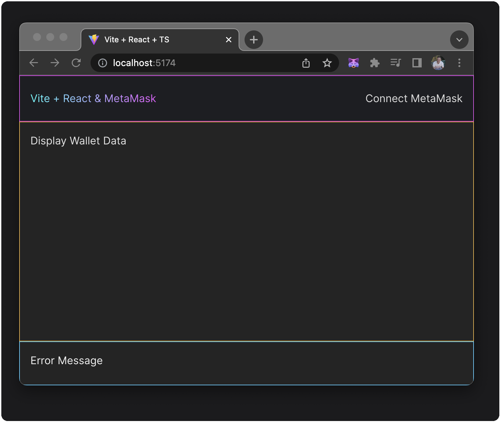
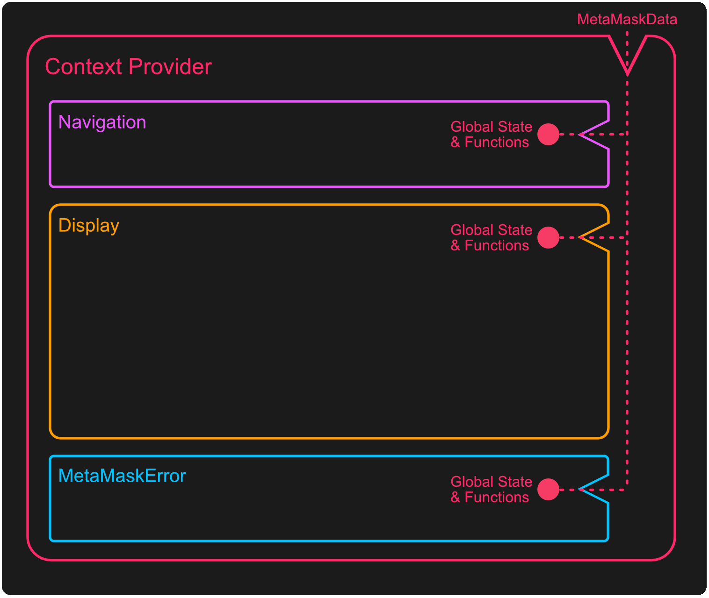
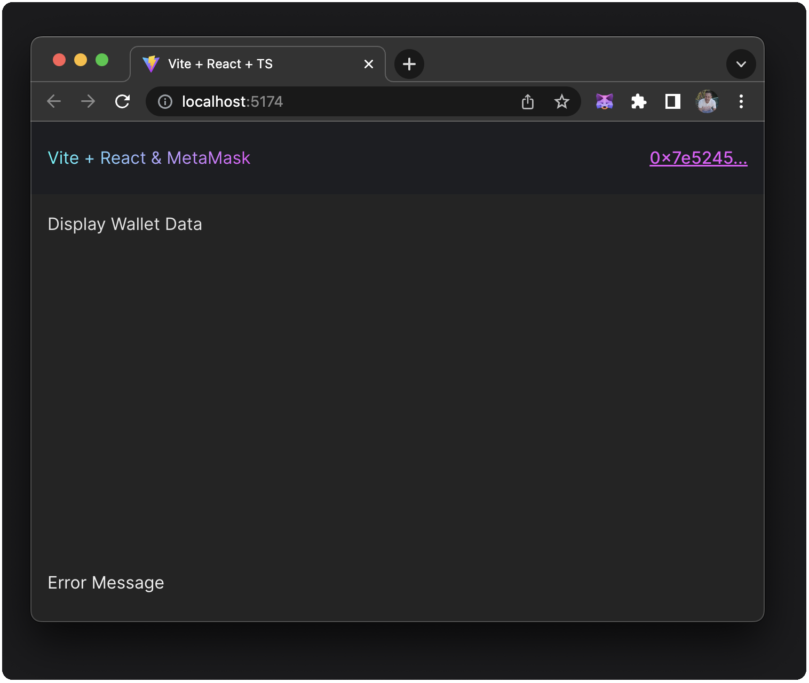
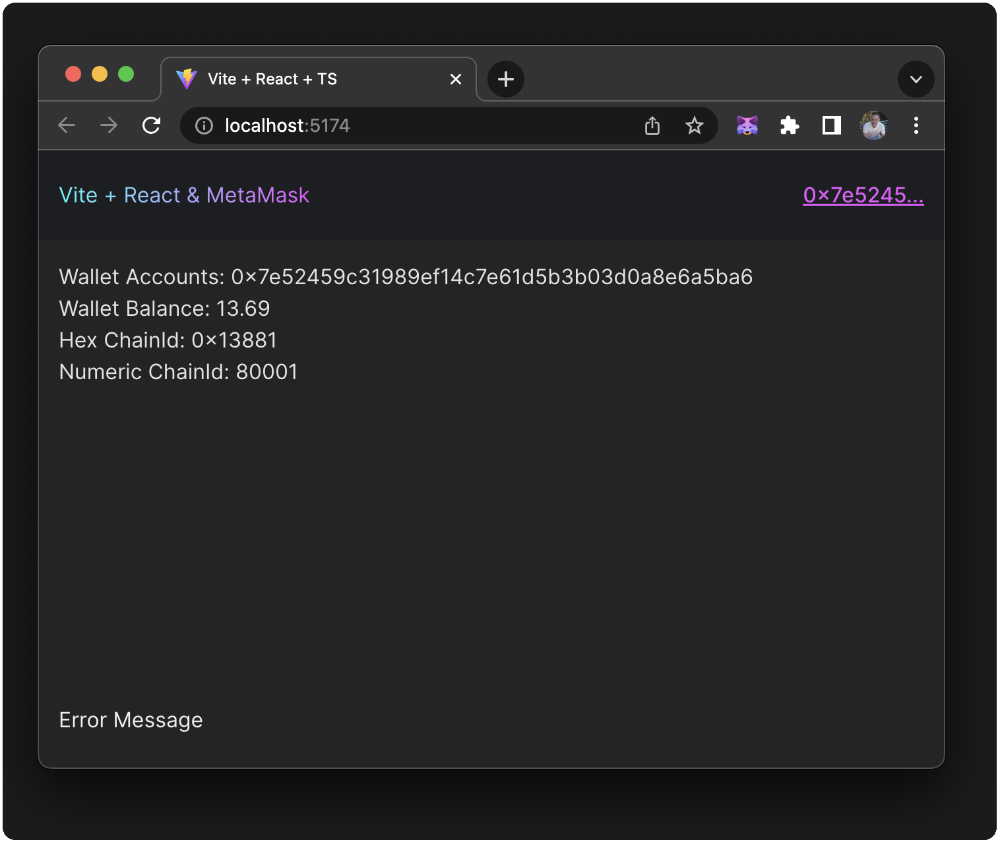
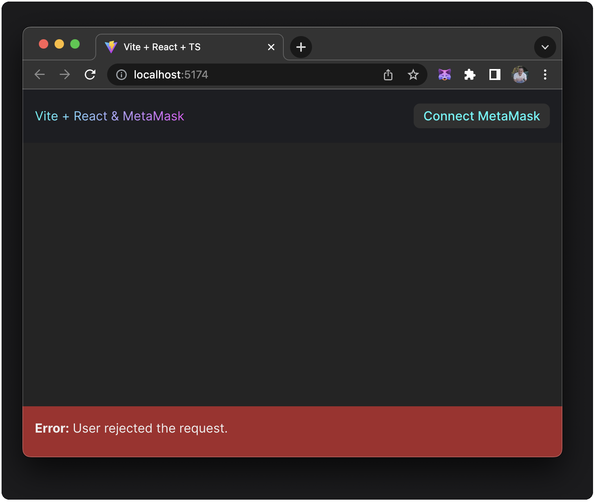

# Create a Simple React Dapp with Global State

This tutorial picks up where the [previous tutorial](./react-dapp-local-state.md) left off. We will be starting our work from the [global-state-start](https://github.com/MetaMask/react-dapp-tutorial/tree/global-state-start) branch of the [react-dapp-tutorial](https://github.com/MetaMask/react-dapp-tutorial) source code repository.

We will also utilize TypeScript and a few best practices to ensure a clean code base as we now have multiple components and a slightly more complex file structure in our [Vite](https://v3.vitejs.dev/guide/) + React project.

:::info The purpose of utilizing Global State?
Our previous tutorial approached connecting to MetaMask and keeping the changes of account, balance and chainId in sync with a single component. Sooner or later, you must respond to some state change in a different component. In this tutorial, we will move that state and its relevant functions into React Context and make it global so that other components and UI can be aware of changes in the wallet state.
:::

## Prerequisites

- [Node.js](https://nodejs.org/) version 18+
- [npm](https://docs.npmjs.com/downloading-and-installing-node-js-and-npm) version 9+
- A text editor (for example, [VS Code](https://code.visualstudio.com/))
- The [MetaMask extension](https://metamask.io/download) installed
- Basic knowledge of TypeScript, React and React Hooks

## Steps

### 1. Clone React Dapp Repository

Our first step is to clone the [react-dapp-tutorial](https://github.com/MetaMask/react-dapp-tutorial) source code repository on GitHub and check out the `global-state-start` branch and install our node module dependencies.

```bash
git clone https://github.com/MetaMask/react-dapp-tutorial.git \
&& cd react-dapp-tutorial && git checkout local-state-start \
&& npm install
```

We have a working React app at this point, but we have wiped out the code we wrote in our previous branches [App.tsx file](https://github.com/MetaMask/react-dapp-tutorial/blob/local-state-final/src/App.tsx).

We will review this new structure. But first, let's run our App using `npx vite` and make sure that our starting point looks like the following:



Here we have three components, each with static text consisting of a logo, navigation, main content "Display" area, and footer area that we will utilize to show MetaMask errors.

Before we get started, let's comment or remove the `border` selector line of code in each style sheet.

```css  title="Display.module.css | MetaMaskError.module.css | Navigation.module.css"
// border: 1px solid rgb(...);
```

This code was only there to show the three different components as a visual aid distinctly, and you can remove it from the following files:

- `Display.module.css`
- `MetaMaskError.module.css`
- `Navigation.module.css`

#### Styling Strategy

Not specific to MetaMask, but we wanted our new App to have a more structured and appealing layout and use some standard best practices around styling.

Vite's typical `App.css` and `index.css` have been removed, and we are opting for a modular approach to CSS.

In the `/src` directory, we have `App.global.css`, who's styles are specific to the entire application (not related to a single component) or have styles we might want to reuse (like buttons).

In the `/src` directory, we have `App.module.css`. Since our `App.tsx` is the container component for our application, `App.module.css` relates to it and its `appContainer` class which utilizes [Flexbox](https://css-tricks.com/snippets/css/a-guide-to-flexbox) to define the `display` type (`flex`) and the `flex-direction` (`column`). Using Flexbox here ensures that any child `div`s are laid out in a single-column layout (vertically).

Finally, we have a `/src/components` directory with a folder for `Display`, `Navigation`, and `MetaMaskError`. Inside those folders are the component file and corresponding modular CSS files specific to that component. Each of these three components are [flex-items](https://css-tricks.com/snippets/css/a-guide-to-flexbox/#aa-basics-and-terminology) within a [flex-container](https://css-tricks.com/snippets/css/a-guide-to-flexbox/#aa-flexbox-properties), stacked in a vertical column with the top (`Navigation`) and Footer (`MetaMaskError`) being of fixed height and the middle component (`Display`) taking up the remaining vertical space.

#### Optional: Linting with ESLint

This project utilizes a standard ESLint configuration to keep the code consistent. If you want to use ESLint, two options are available:

1. Run `npm run lint` or `npm run lint:fix` from the command line. The former will display all the linting errors, and the latter will update your code to fix linting errors where possible
2. Setup your IDE to show linting errors and automatically fix them on save. For example in VSCode, you can create or update the file at `.vscode/settings.json` in the root of the project with the following settings:

    ```json
    {
      "eslint.format.enable": true,
      "eslint.packageManager": "npm",
      "editor.codeActionsOnSave": {
        "source.fixAll.eslint": true
      },
      "eslint.codeActionsOnSave.mode": "all"
    }
    ```

#### Project Structure

Below is a tree representation of our App `/src` directory.

```
├── src
│   ├── assets
│   ├── components
│   │   └── Display
│   │   |   └── index.tsx
│   │   |   └── Display.module.css
│   │   |   └── Display.tsx
│   │   ├── MetaMaskError
│   │   |   └── index.tsx
│   │   |   └── MetaMaskError.module.css
│   │   |   └── MetaMaskError.tsx
│   │   ├─── Navigation
│   │   |   └── index.tsx
│   │   |   └── Navigation.module.css
│   │   |   └── Navigation.tsx
│   ├── hooks
│   │   ├── useMetaMask.tsx
│   ├── utils
│   │   └── index.tsx
├── App.global.css
├── App.module.css
├── App.tsx
├── main.tsx
├── vite-env.d.ts
```

Rather than building our page with a single component, we have added the `src/components` directory and distributed our prior UI and functionality into multiple components. We also have a directory named `hooks` where we will modify our state and make it available to the rest of the App using a Context Provider. This provider will sit in our `src/App.tsx` file and wrap the three children components. 

Those child components will have access to the state and the functions that modify the global state, thereby ensuring that any change to our `wallet` (`address`, `balance`, and `chainId`), `hasProvider`, `error`, `errorMessage`, and `isConnecting`  state and their modifiers. That state will get refreshed by rerendering those child components when any part of it changes.



The graphic above demonstrates how this Context Provider wraps its child components, providing access to the state modifier functions and the actual state itself. Since React uses a one-way data flow, any change to the data gets rerendered in those components automatically.

### 2. Building Our Context Provider

We have provided a file `/src/hooks/useMetaMask` which we will create this Context and Provider component named `MetaMaskContextProvider`. This provider component will utilize similar `useState` and `useEffect` hooks with some changes from our previous tutorial's local state component to make it more DRY. It will also have similar `updateWallet`, `connectMetaMask`, and `clearError` functions, all of which do their part to connect to MetaMask or update our MetaMask state.

`MetaMaskContext` will return a `MetaMaskContext.Provider`, which takes a value of type `MetaMaskData`, supplying that to its `{children}`.

Next, we will export a React Hook called `useMetaMask`, which uses our `MetaMaskContext`.

Update the `/src/hooks/useMetaMask.tsx` file with the following code:

```tsx title="useMetaMask.tsx"
/* eslint-disable @typescript-eslint/no-explicit-any */
import { useState, useEffect, createContext, PropsWithChildren, useContext, useCallback } from 'react'

import detectEthereumProvider from '@metamask/detect-provider'
import { formatBalance } from '~/utils'

interface WalletState {
  accounts: any[]
  balance: string
  chainId: string
}

interface MetaMaskContextData {
  wallet: WalletState
  hasProvider: boolean | null
  error: boolean
  errorMessage: string
  isConnecting: boolean
  connectMetaMask: () => void
  clearError: () => void
}

const disconnectedState: WalletState = { accounts: [], balance: '', chainId: '' }

const MetaMaskContext = createContext<MetaMaskContextData>({} as MetaMaskContextData)

export const MetaMaskContextProvider = ({ children }: PropsWithChildren) => {
  const [hasProvider, setHasProvider] = useState<boolean | null>(null)

  const [isConnecting, setIsConnecting] = useState(false)

  const [errorMessage, setErrorMessage] = useState('')
  const clearError = () => setErrorMessage('')

  const [wallet, setWallet] = useState(disconnectedState)
  // useCallback ensures that we don't uselessly re-create the _updateWallet function on every render
  const _updateWallet = useCallback(async (providedAccounts?: any) => {
    const accounts = providedAccounts || await window.ethereum.request(
      { method: 'eth_accounts' },
    )

    if (accounts.length === 0) {
      // If there are no accounts, then the user is disconnected
      setWallet(disconnectedState)
      return
    }

    const balance = formatBalance(await window.ethereum.request({
      method: 'eth_getBalance',
      params: [accounts[0], 'latest'],
    }))
    const chainId = await window.ethereum.request({
      method: 'eth_chainId',
    })

    setWallet({ accounts, balance, chainId })
  }, [])

  const updateWalletAndAccounts = useCallback(() => _updateWallet(), [_updateWallet])
  const updateWallet = useCallback((accounts: any) => _updateWallet(accounts), [_updateWallet])

  /**
   * This logic checks if MetaMask is installed. If it is, then we setup some
   * event handlers to update the wallet state when MetaMask changes. The function
   * returned from useEffect is used as a "clean-up": in there, we remove the event
   * handlers whenever the MetaMaskProvider is unmounted.
   */
  useEffect(() => {
    const getProvider = async () => {
      const provider = await detectEthereumProvider({ silent: true })
      setHasProvider(Boolean(provider))

      if (provider) {
        updateWalletAndAccounts()
        window.ethereum.on('accountsChanged', updateWallet)
        window.ethereum.on('chainChanged', updateWalletAndAccounts)
      }
    }

    getProvider()

    return () => {
      window.ethereum?.removeListener('accountsChanged', updateWallet)
      window.ethereum?.removeListener('chainChanged', updateWalletAndAccounts)
    }
  }, [updateWallet, updateWalletAndAccounts])

  const connectMetaMask = async () => {
    setIsConnecting(true)

    try {
      const accounts = await window.ethereum.request({
        method: 'eth_requestAccounts',
      })
      clearError()
      updateWallet(accounts)
    } catch(err: any) {
      setErrorMessage(err.message)
    }
    setIsConnecting(false)
  }

  return (
    <MetaMaskContext.Provider
      value={{
        wallet,
        hasProvider,
        error: !!errorMessage,
        errorMessage,
        isConnecting,
        connectMetaMask,
        clearError,
      }}
    >
      {children}
    </MetaMaskContext.Provider>
  )
}

export const useMetaMask = () => {
  const context = useContext(MetaMaskContext)
  if (context === undefined) {
    throw new Error('useMetaMask must be used within a "MetaMaskContextProvider"')
  }
  return context
}
```

:::note Why we are using TS Config Paths
One configuration change we have made to this application is the use of `vite-tsconfig-paths`, which lets us load modules whose location is specified in the paths section of our project's `tsconfig.json` file.

We import `tsconfigPaths` from `vite-tsconfig-paths` in our `vite.config.ts` and add it to the `plugins` array. 

We have also updated the `tsconfig.json` to add a path corresponding to the `./src/*` directory using the `~/*` symbol to represent it. Finally, we add a `reference` in the `./tsconfig.node.json`.

You can find additional information at [vite-tsconfig-paths](https://github.com/aleclarson/vite-tsconfig-paths).
:::

First, notice the use of our paths `"~/utils"` to import our utility functions.

Nothing special outside of the creation of the Context Provider is happening in this file that we have not previously done is some form in our previous tutorial.

With this Context Provider in place, we can now update our `/src/App.tsx` file to include that provider and wrap it around those three components.

### 3. Wrap Components with Context Provider

Let's open the `/src/App.tsx` file, import our `MetaMaskContextProvider` and wrap that component around the existing `Display`, `Navigation`, and `MetaMaskError` components.

Update the code in `/src/App.tsx`:

```tsx  title="App.tsx"
import './App.global.css'
import styles from './App.module.css'

import { Navigation } from './components/Navigation'
import { Display } from './components/Display'
import { MetaMaskError } from './components/MetaMaskError'
import { MetaMaskContextProvider } from './hooks/useMetaMask'

export const App = () => {

  return (
    <MetaMaskContextProvider>
      <div className={styles.appContainer}>
        <Navigation />
        <Display />
        <MetaMaskError />
      </div>
    </MetaMaskContextProvider>
  )
}
```

With our `App.tsx` file updated, we can move on to updating our `Display`, `Navigation`, and `MetaMaskError` components which will each in some form utilize our `useMetaMask` hooks to invoke our functions that modify state or use the state itself.

### 4. Connect to MetaMask in Navigation

In our previous tutorial, we connected to MetaMask, displaying `address`, `balance`, and `chainId` information in one component. But now, we want to split that up among our various components. 

Navigation will connect to MetaMask, use conditional rendering to show an **"Install MetaMask"** or **"Connect MetaMask"** button or, once connected, display our wallet address in a hypertext link that connects to [Etherescan](https://etherscan.io).

In the `/src/components/Navigation/Navigation.tsx` file, add the following code:

```tsx  title="Navigation.tsx"
import { useMetaMask } from '~/hooks/useMetaMask'
import { formatAddress } from '~/utils'
import styles from './Navigation.module.css'

export const Navigation = () => {

  const { wallet, hasProvider, isConnecting, connectMetaMask } = useMetaMask()

  return (
    <div className={styles.navigation}>
      <div className={styles.flexContainer}>
        <div className={styles.leftNav}>Vite + React & MetaMask</div>
        <div className={styles.rightNav}>
          {!hasProvider &&
            <a href="https://metamask.io" target="_blank">
              Install MetaMask
            </a>
          }
          {window.ethereum?.isMetaMask && wallet.accounts.length < 1 &&
            <button disabled={isConnecting} onClick={connectMetaMask}>
              Connect MetaMask
            </button>
          }
          {hasProvider && wallet.accounts.length > 0 &&
            <a
              className="text_link tooltip-bottom"
              href={`https://etherscan.io/address/${wallet}`}
              target="_blank"
              data-tooltip= "Open in Block Explorer"
            >
              {formatAddress(wallet.accounts[0])}
            </a>
          }
        </div>
      </div>
    </div>
  )
}
```

Notice how we use `useMetaMask` and destructure its return value to get the `MetaMaskData` state and functions we need.

```ts
const { wallet, hasProvider, isConnecting, connectMetaMask } = useMetaMask()
```

Also, we are using a function to format our wallet address for display purposes:

```ts
{formatAddress(wallet.accounts[0])}
```

This `formatAddress` function doesn't exist in that `@utils` file yet, let's add it. 

Update `/src/utils/index.tsx` with the following code:

```ts title="utils/index.ts"
export const formatBalance = (rawBalance: string) => {
  const balance = (parseInt(rawBalance) / 1000000000000000000).toFixed(2)
  return balance
}

export const formatChainAsNum = (chainIdHex: string) => {
  const chainIdNum = parseInt(chainIdHex)
  return chainIdNum
}

export const formatAddress = (addr: string) => {
  return `${addr.substring(0, 8)}...`
}
```

That should address any build errors in our `Navigation` component.

Other than using our new styling practice, the only thing we are doing differently from our previous tutorial is displaying the user's `address` formatted inside of a link once they are connected.



### 5. Display MetaMaskData in Display

In our `Display` component, we will not call any functions that modify state; we will read from our `MetaMaskData`, which will be an effortless update.

Update the `/src/components/Display/Display.tsx` file with the following code:

```tsx title="Display.tsx"
import { useMetaMask } from '~/hooks/useMetaMask'
import { formatChainAsNum } from '~/utils'
import styles from './Display.module.css'

export const Display = () => {

  const { wallet } = useMetaMask()

  return (
    <div className={styles.display}>
      {wallet.accounts.length > 0 &&
        <>
          <div>Wallet Accounts: {wallet.accounts[0]}</div>
          <div>Wallet Balance: {wallet.balance}</div>
          <div>Hex ChainId: {wallet.chainId}</div>
          <div>Numeric ChainId: {formatChainAsNum(wallet.chainId)}</div>
        </>
      }
    </div>
  )
}
```

Notice how we now use `useMetaMask` and destructuring its return value to get only the `{ wallet }` data.

```ts
const { wallet } = useMetaMask()
```

At this point, we will be able to display `account`, `balance`, and `chainId` in our `Display` component:



### 5. Show and Hide Errors in MetaMaskError

We're rounding the bases and close to finalizing our demo, but we want to ensure that if MetaMask errors or the user rejects a connection, we have a component to display that error. 

If a user clicks on that error, we will dismiss the error, which will again hide that information, and we do this using the `clearError` function that we set up in the `useMetaMask` hook.

In the `/src/components/MetaMaskError/MetaMaskError.tsx` file, add the following code:

```tsx title="MetaMaskError.tsx"
import { useMetaMask } from '~/hooks/useMetaMask'
import styles from './MetaMaskError.module.css'

export const MetaMaskError = () => {
  const { error, errorMessage, clearError } = useMetaMask()
  return (
    <div className={styles.metaMaskError} style={
      error ? { backgroundColor: 'brown' } : {}
    }>
      { error && (
        <div onClick={clearError}>
          <strong>Error:</strong> {errorMessage}
        </div>
      )
      }
    </div>
  )
}
```

Notice how we are now using `useMetaMask` and destructuring its return value to get only the `{ error, errorMessage, clearError }` data and a function that will modify the error state.

```ts
const { error, errorMessage, clearError } = useMetaMask()
```

When we generate an error by cancelling the connection to MetaMask, this will show up in the footer component; it will temporarily make its background a dark red color:



Upon clicking on that red area, the error will be dismissed. In a real-world application, the best UI/UX for this would be a component that displays in a modal or overlay; for the sake of simplicity, we have just utilized our footer area for this, but the logic we have can be applied to any situation.

You can see the final state of our `global-state` App by checking out the [global-state-final](https://github.com/MetaMask/react-dapp-tutorial/tree/global-state-final) branch of the source code.

## Conclusion

We've successfully converted an app using a simple local component state to one that utilizes React Context and Provider to have a global state that we can modify through functions and data that, when used anywhere in our application, will show up-to-date data associated with our MetaMask wallet. 👊😉👍