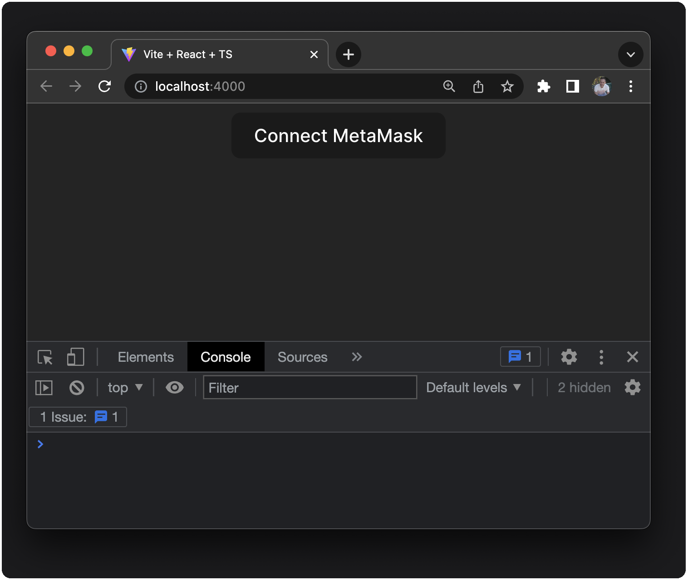
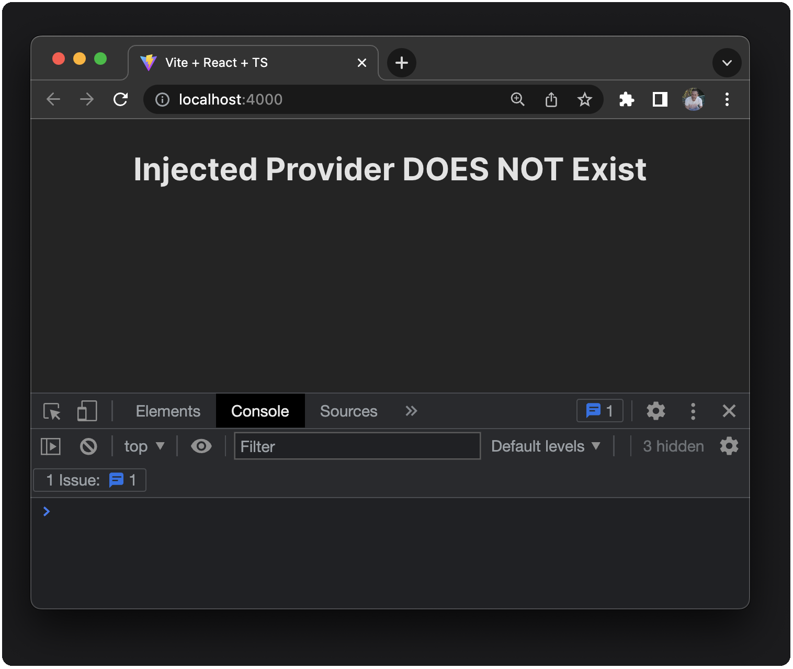
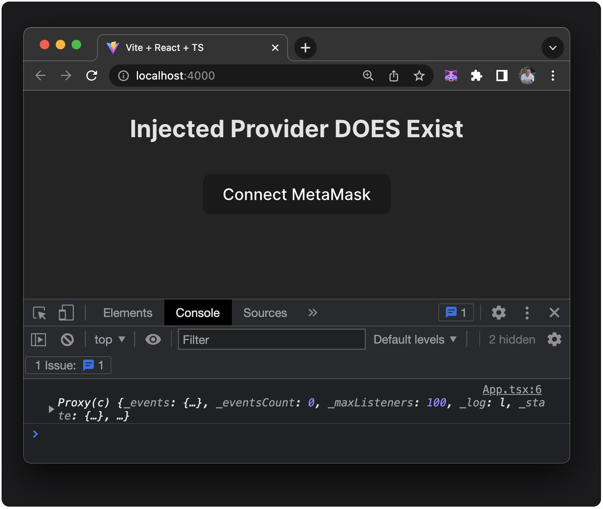
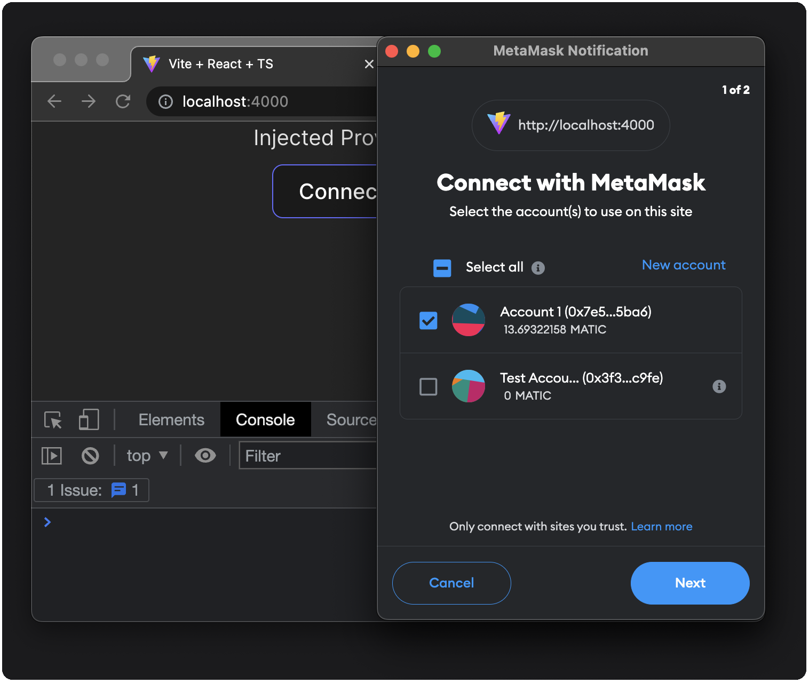
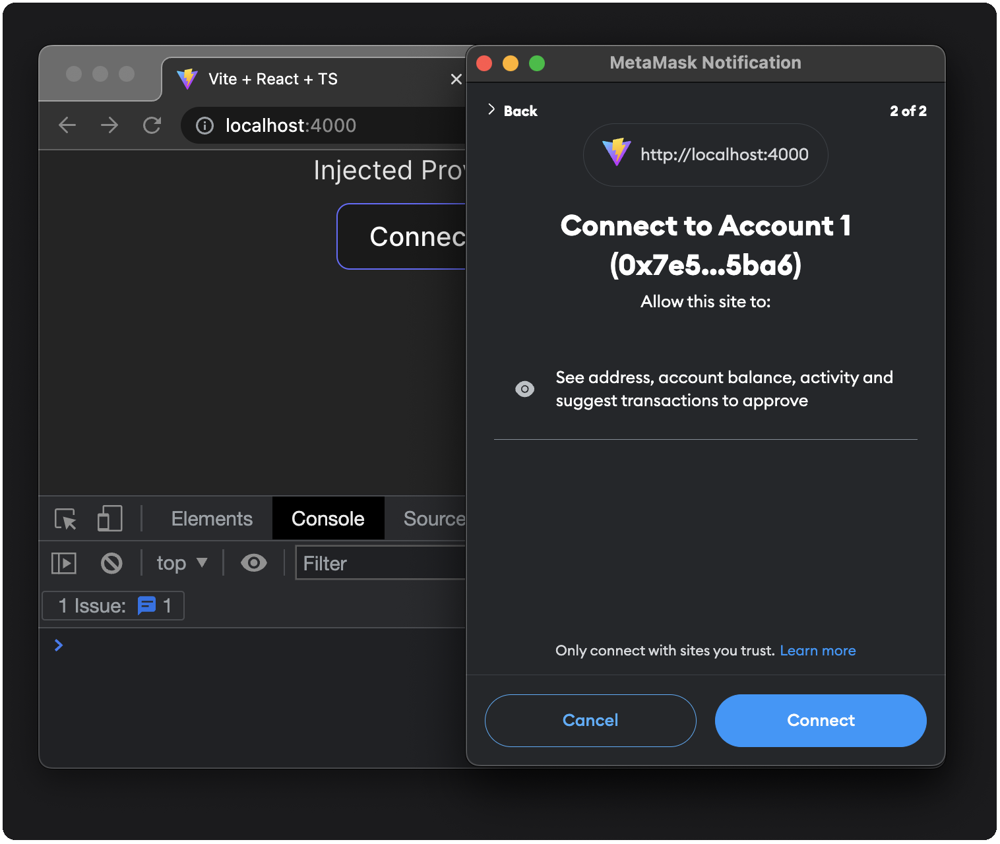
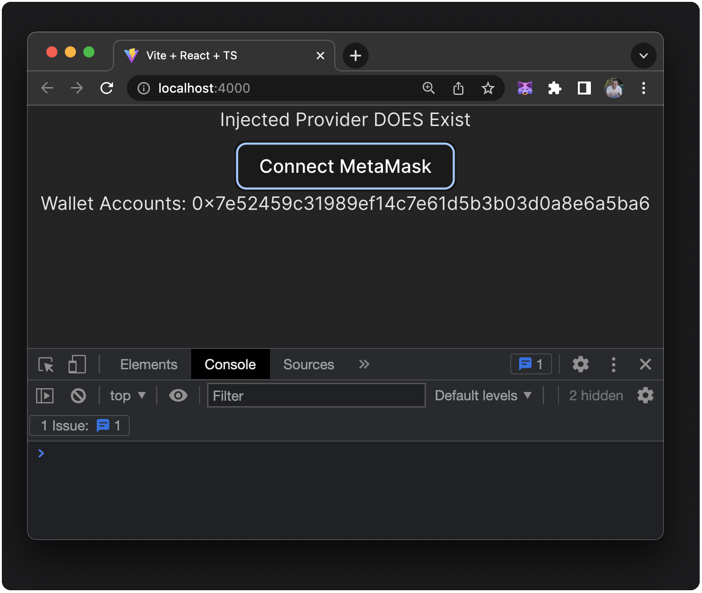
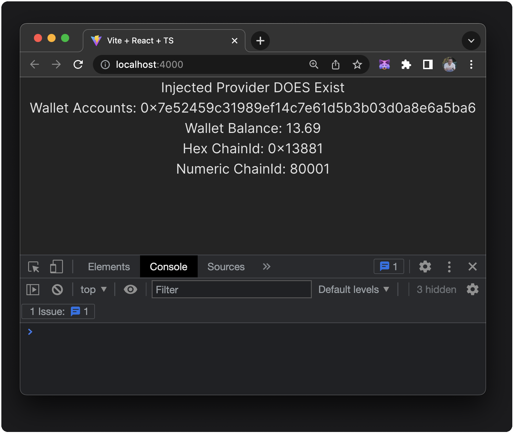
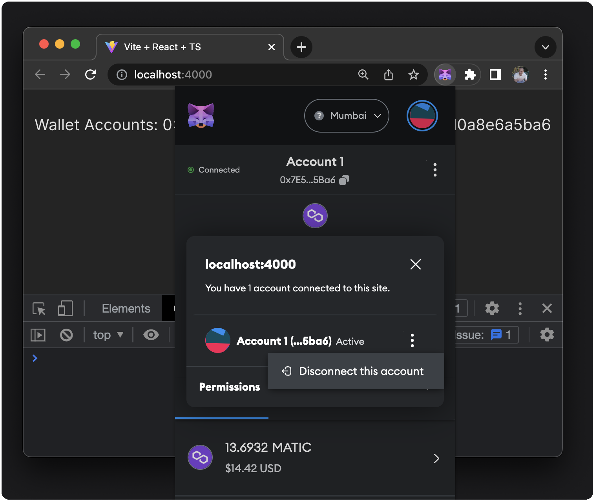
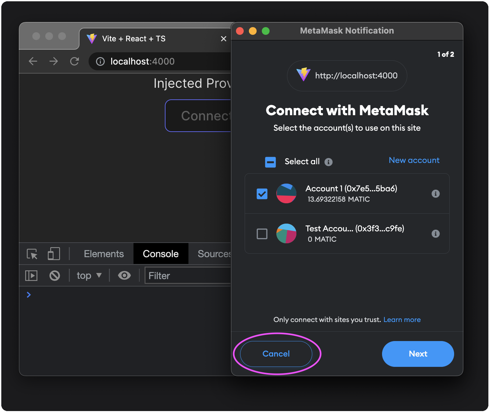
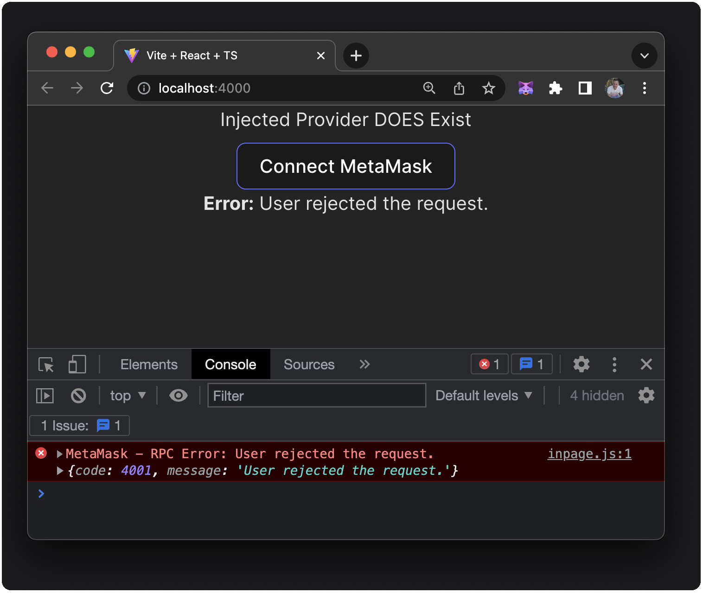

# Create a Simple React Dapp with Local State

This tutorial walks you through integrating a simple React dapp with MetaMask.
You'll use the [Vite](https://v3.vitejs.dev/guide) build tool with React and TypeScript to create
the dapp.

This tutorial builds up your knowledge of working with MetaMask incrementally; this means you won't
implement the best solution at first, but you'll experiment with the MetaMask API and continually
work towards better solutions.

:::info Why React?
React is familiar to most web developers, and it makes it easy to work with state management and
build with components that need updating.
:::

## Prerequisites

- [Node.js](https://nodejs.org/) version 18+
- [npm](https://docs.npmjs.com/downloading-and-installing-node-js-and-npm) version 9+
- A text editor (for example, [VS Code](https://code.visualstudio.com/))
- The [MetaMask extension](https://metamask.io/download) installed
- Basic knowledge of JavaScript and React

## Steps

You can see the [source code](https://github.com/MetaMask/react-dapp-tutorial/tree/local-state-start) repository on GitHub for the starting point of the dapp or check out the final state in the [local-state-final](https://github.com/MetaMask/react-dapp-tutorial/tree/local-state-start) branch.

### 1. Set up the project

Set up a new project using Vite, React, and TypeScript, by running the following command:

```bash
npm create vite@latest mm-dapp-react -- --template react-ts
```

Install the dependencies:

```bash
cd mm-dapp-react && npm install
```

:::note
You can use the `npx vite` or `npm run dev` command to run your project at any time if the
development server has been stopped.
:::

Open the project in a text editor.
To start with a blank slate, replace the code in `src/App.tsx` with the following:

```tsx title="App.tsx"
import './App.css'

const App = () => {

  return (
    <div className="App">
      <button>Connect MetaMask</button>
    </div>
  )
}

export default App
```

You'll need to get around type-checking by defining the `window.ethereum` object as `any`.
Update `src/vite-env.d.ts` to the following:

```tsx title="vite-env.d.ts"
/// <reference types="vite/client" />

interface Window {
  ethereum: any;
}
```

Also, update `src/App.css` to the following:

```css title="App.css"
.App {
  display: flex;
  flex-direction: column;
  place-items: center;
  min-width: 100vw;
  min-height: 100vh;
}
button {
  margin-top: 0.5em;
}
```

At this point, you have a working React app, some basic styling, and a button
that you'll use to connect to MetaMask.  



### 2. Detect MetaMask

Next, detect the injected provider that browser extension wallets use.

Add code to conditionally render a **Connect MetaMask** button in your component, by updating
`src/App.tsx` to the following:

```tsx title="App.tsx"
import './App.css'
let injectedProvider = false

if (typeof window.ethereum !== 'undefined') {
  injectedProvider = true
  console.log(window.ethereum)
}

const isMetaMask = injectedProvider ? window.ethereum.isMetaMask : false

const App = () => {

  return (
    <div className="App">
      <h2>Injected Provider { injectedProvider ? 'DOES' : 'DOES NOT'} Exist</h2>
      { isMetaMask && 
        <button>Connect MetaMask</button>
      }
    </div>
  )
}

export default App
```

If MetaMask isn't installed, you won't see a **Connect MetaMask** button, and the text displays
**Injected Provider DOES NOT Exist**.



If MetaMask is installed, you'll see the **Connect MetaMask** button, and the text displays
**Injected Provider DOES Exist**.
You'll also see the provider being printed in the console.



You can toggle back and forth between these two states by enabling and disabling the MetaMask
extension from your browser's **Manage Extensions** menu.

#### Use @metamask/detect-provider

Developers often use the previous approach when tasked with detecting an injected provider (wallet extension).
However, MetaMask provides the [@metamask/detect-provider](https://github.com/MetaMask/detect-provider)
module to detect the MetaMask Ethereum provider or any provider injected at `window.ethereum` on any
platform or browser.

:::caution important
We recommend [using `@metamask/detect-provider`](../get-started/detect-metamask.md#use-metamaskdetect-provider)
instead of manually detecting the provider yourself.
:::

In your project directory, install the module using the following command:

```bash
npm install @metamask/detect-provider
```

Update `src/App.tsx` to the following:

```tsx title="App.tsx"
import './App.css'
import { useState, useEffect } from 'react'
import detectEthereumProvider from '@metamask/detect-provider'

const App = () => {
  const [hasProvider, setHasProvider] = useState<boolean | null>(null)

  useEffect(() => {
    const getProvider = async () => {
      const provider = await detectEthereumProvider({ silent: true })
      console.log(provider)
      setHasProvider(Boolean(provider)) // transform provider to true or false
    }

    getProvider()
  }, [])

  return (
    <div className="App">
      <div>Injected Provider {hasProvider ? 'DOES' : 'DOES NOT'} Exist</div>
      { hasProvider &&
        <button>Connect MetaMask</button>
      }
    </div>
  )
}

export default App
```

This code creates a piece of local state called `hasProvider` of type `boolean` or `null` value,
initialized with a `null` value.

Next, it creates a `useEffect` with zero dependencies (it only runs once in your component lifecycle).
React's `useEffect` hook allows components to run code when a component is mounted or when some
property's state changes.
This hook also allows cleaning up when the component is unmounted.
If you explicitly declare no dependencies by passing in an empty array, then `useEffect` only runs
once before the component mounts.

Inside `useEffect`, there's an `async` function called `getProvider`.
This function awaits the `detectEthereumProvider` and uses an option (`silent: true`) to silence any
console errors related to the provider not being available.
You can choose to not use that option if you prefer.
The setter function within `useEffect` transforms the provider's detection to a `boolean` value.

If you run the code now, you'll see the same result in your dapp, but you're using 
`@metamask/detect-provider` instead of your own code.

### 3. Connect to MetaMask

To connect your dapp to MetaMask, you'll create another `useState` named `wallet`, which keeps your
dapp up to date with various MetaMask wallet properties such as `accounts`, `balance`, and  `chainId`.
These are important properties to sync with your dapp constantly.
You'll first add a state for `accounts` and slowly build up your state over the following few
tutorial sections.
You'll also set up a button to connect to the MetaMask wallet.

Update the `src/App.tsx` to the following:

```tsx title="App.tsx" {7-8,19-21,23-28,34-36,38-40} showLineNumbers
import './App.css'
import { useState, useEffect } from 'react'
import detectEthereumProvider from '@metamask/detect-provider'

const App = () => {
  const [hasProvider, setHasProvider] = useState<boolean | null>(null)
  const initialState = { accounts: [] }               /* New */
  const [wallet, setWallet] = useState(initialState)  /* New */

  useEffect(() => {
    const getProvider = async () => {
      const provider = await detectEthereumProvider({ silent: true })
      setHasProvider(Boolean(provider))
    }

    getProvider()
  }, [])

  const updateWallet = async (accounts:any) => {     /* New */
    setWallet({ accounts })                          /* New */
  }                                                  /* New */

  const handleConnect = async () => {                /* New */
    let accounts = await window.ethereum.request({   /* New */
      method: "eth_requestAccounts",                 /* New */
    })                                               /* New */
    updateWallet(accounts)                           /* New */
  }                                                  /* New */

  return (
    <div className="App">
      <div>Injected Provider {hasProvider ? 'DOES' : 'DOES NOT'} Exist</div>

      { hasProvider &&                               /* Updated */
        <button onClick={handleConnect}>Connect MetaMask</button>
      }
      
      { wallet.accounts.length > 0 &&                /* New */
        <div>Wallet Accounts: { wallet.accounts[0] }</div>
      }
    </div>
  )
}

export default App
```

The comments in the code snippet indicate any new or updated lines of code.
The changes include:

- **Lines 7-8:** Create an object representing the initial empty state and a new `useState` hook to
  reflect your MetaMask wallet state.

- **Lines 19-21:** Add an `updateWallet` function that sets your new wallet state when you connect.
  This will also be called when you add code later that refreshes our wallet state.
  This function will come in handy as you start syncing the `balance` and `chainId`.

- **Lines 23-28:** Add a `handleConnect` function that the UI calls to connect to MetaMask using
  `window.ethereum.request` and the `eth_requestAccounts` RPC method.
  Your dapp stores the result from this RPC call in a variable named `accounts` and passes it to
  the `updateWallet` function.

- **Lines 34-36:** On click, the **Connect MetaMask** button calls `handleConnect`, from which an RPC
  call of `eth_requestAccounts` is awaited and the user is prompted to connect to MetaMask:

    

  

 - **Lines 38-40:** Once connected, you'll see your account address displayed in your dapp:

  

### 4. Handle state change

With the current code, your dapp loses the account data if you refresh the page.
When you connect using the button, the dapp sets `accounts` in its state, but in the case of a
browser refresh, you need something in `useEffect` to check if you've already connected and update
the wallet state.

Thinking ahead, once you track more than just `accounts`, you also need a mechanism to get the
`balance` and `chainId` and update their state.

Update `src/App.tsx` with some added logic to `useEffect`:

```tsx title="App.tsx" {11-18,24-30,34-36,54} showLineNumbers
import './App.css'
import { useState, useEffect } from 'react'
import detectEthereumProvider from '@metamask/detect-provider'

const App = () => {
  const [hasProvider, setHasProvider] = useState<boolean | null>(null)
  const initialState = { accounts: [] }
  const [wallet, setWallet] = useState(initialState)

  useEffect(() => {
    const refreshAccounts = (accounts: any) => {                /* New */
      if (accounts.length > 0) {                                /* New */
        updateWallet(accounts)                                  /* New */
      } else {                                                  /* New */
        // if length 0, user is disconnected                    /* New */
        setWallet(initialState)                                 /* New */
      }                                                         /* New */
    }                                                           /* New */

    const getProvider = async () => {
      const provider = await detectEthereumProvider({ silent: true })
      setHasProvider(Boolean(provider))

      if (provider) {                                           /* New */
        const accounts = await window.ethereum.request(         /* New */
          { method: 'eth_accounts' }                            /* New */
        )                                                       /* New */
        refreshAccounts(accounts)                               /* New */
        window.ethereum.on('accountsChanged', refreshAccounts)  /* New */
      }                                                         /* New */
    }

    getProvider()
    return () => {                                              /* New */
      window.ethereum?.removeListener('accountsChanged', refreshAccounts)
    }                                                           /* New */
  }, [])

  const updateWallet = async (accounts:any) => {
    setWallet({ accounts })
  }

  const handleConnect = async () => {
    let accounts = await window.ethereum.request({
      method: "eth_requestAccounts",
    })
    updateWallet(accounts)
  }

  return (
    <div className="App">
      <div>Injected Provider {hasProvider ? 'DOES' : 'DOES NOT'} Exist</div>

      { window.ethereum?.isMetaMask && wallet.accounts.length < 1 &&  /* Updated */
        <button onClick={handleConnect}>Connect MetaMask</button>
      }

      { wallet.accounts.length > 0 &&
        <div>Wallet Accounts: { wallet.accounts[0] }</div>
      }
    </div>
  )
}

export default App
```

Note that `useEffect` is a side effect; you use the hooks for fetching data, reading and writing to
local storage, and setting up event listeners or subscriptions.
The side effect occurs on the first render only, since you have nothing in your dependency array.
You also need to clean up those listeners upon unmount of your component.

You can now test your dapp and see that when you refresh the page, you retain the display of the
user's address.
You've synced with a source outside your dapp, and you're managing the state in a single component.
The logic is in place to add more properties to your state object.

:::info Connection summary
In learning how to connect to MetaMask from a React application, you've learned how to track some
essential state of your wallet, precisely, which account is selected and active in the MetaMask wallet.
Your dapp syncs this state locally using React's `useState` and the React `useEffect` hooks.
The dapp ensures that if a user manually disconnects, changes the account, or refreshes the page,
the component is aware of any state change.
:::

### 5. Manage more MetaMask state

Next, you'll add `balance` and `chainId` to your state.

Before editing `src/App.tsx`, you need a few utility functions to format `balance` and `chainId`.
Create a new file at `src/utils/index.tsx` with the following code:

```tsx title="index.tsx"
export const formatBalance = (rawBalance: string) => {
  const balance = (parseInt(rawBalance) / 1000000000000000000).toFixed(2)
  return balance
}

export const formatChainAsNum = (chainIdHex: string) => {
  const chainIdNum = parseInt(chainIdHex)
  return chainIdNum
}
```

With those functions exported, you can import them into your component and use them to get
human-readable balance and chain information.

#### Watch user balance and chain

To display the connected address's balance and the current chain ID, you need to update the
`initialState` object in your component.
Since your dapp already uses `eth_requestAccounts` to determine the accounts, you need to add a
dependent call to `eth_getBalance` once you have that account information.

Finally, you need to parse the returned value of the balance and format it into a human-readable string.
You'll create a function called `formatBalance` as well.

Update `src/App.tsx` to the following:

```tsx title="App.tsx" {3,8,21-23,35,43,48-55,74,76-78} showLineNumbers
import './App.css'
import { useState, useEffect } from 'react'
import { formatBalance, formatChainAsNum } from './utils'  /* New */
import detectEthereumProvider from '@metamask/detect-provider'

const App = () => {
  const [hasProvider, setHasProvider] = useState<boolean | null>(null)
  const initialState = { accounts: [], balance: "", chainId: "" }  /* Updated */
  const [wallet, setWallet] = useState(initialState)

  useEffect(() => {
    const refreshAccounts = (accounts: any) => {
      if (accounts.length > 0) {
        updateWallet(accounts)
      } else {
        // if length 0, user is disconnected
        setWallet(initialState)
      }
    }

    const refreshChain = (chainId: any) => {               /* New */
      setWallet((wallet) => ({ ...wallet, chainId }))      /* New */
    }                                                      /* New */

    const getProvider = async () => {
      const provider = await detectEthereumProvider({ silent: true })
      setHasProvider(Boolean(provider))

      if (provider) {                                           
        const accounts = await window.ethereum.request(
          { method: 'eth_accounts' }
        )
        refreshAccounts(accounts)
        window.ethereum.on('accountsChanged', refreshAccounts)
        window.ethereum.on("chainChanged", refreshChain)  /* New */
      }
    }

    getProvider()

    return () => {
      window.ethereum?.removeListener('accountsChanged', refreshAccounts)
      window.ethereum?.removeListener("chainChanged", refreshChain)  /* New */
    }
  }, [])

  const updateWallet = async (accounts:any) => {
    const balance = formatBalance(await window.ethereum!.request({   /* New */
      method: "eth_getBalance",                                      /* New */
      params: [accounts[0], "latest"],                               /* New */ 
    }))                                                              /* New */
    const chainId = await window.ethereum!.request({                 /* New */ 
      method: "eth_chainId",                                         /* New */ 
    })                                                               /* New */ 
    setWallet({ accounts, balance, chainId })                        /* Updated */ 
  }

  const handleConnect = async () => {
    let accounts = await window.ethereum.request({
      method: "eth_requestAccounts",
    })
    updateWallet(accounts)
  }

  return (
    <div className="App">
      <div>Injected Provider {hasProvider ? 'DOES' : 'DOES NOT'} Exist</div>

      { window.ethereum?.isMetaMask && wallet.accounts.length < 1 &&
        <button onClick={handleConnect}>Connect MetaMask</button>
      }

      { wallet.accounts.length > 0 &&
        <>                                                               {/* New */}
          <div>Wallet Accounts: {wallet.accounts[0]}</div>
          <div>Wallet Balance: {wallet.balance}</div>                    {/* New */}
          <div>Hex ChainId: {wallet.chainId}</div>                       {/* New */}
          <div>Numeric ChainId: {formatChainAsNum(wallet.chainId)}</div> {/* New */}
        </>
      }
    </div>
  )
}

export default App
```

The changes here are minimal because you only need to update or duplicate existing functionality and
add a few utility functions.
Your dapp now displays `account`, `balance`, and `chainId`, represented as hex values and numbers.



Your dapp detects any changes to `balance` or `chain`, and the utility functions format hex strings
to be human-readable for display.
For chain IDs, you use the hex version in RPC calls and the numeric version for display.
To get the human-readable number of the chain, you use `parseInt`.

:::caution important
For this tutorial, your dapp only needs to display information about your wallet.
For a real web3 dapp, you might add more functionality for switching chains programmatically or
initiating transactions.

You might need to:

- Have a list of chain IDs that your dapp supports.
- Create UI that shows information on the supported networks.
- Present a button that allows users to connect to a supported network.

[Detecting a user's network](../get-started/detect-network.md) is crucial in almost every web3 dapp.
:::

### 6. Handle errors

Now that you have a working dapp, you should set up error handling.
You can approach this in several ways; the following is a basic suggestion for handling an error or
rejection when the user connects their wallet using the `handleConnect` function.

You'll add `useState` to track `isConnecting`, `error`, and `errorMessage`.

When a user is in the middle of connecting, you'll disable the **Connect MetaMask** button.
If you receive an error, you'll update `error` to `true` and set the `errorMessage` for display.
You'll also set `isConnecting` back to `false` once either the user has connected or you've caught
the error, and set `error` back to `false` once the message is resolved.

Update `src/App.tsx` to the following:

```tsx title="App.tsx" {11-13,62-64,67-75,97-102} showLineNumbers
import './App.css'
import { useState, useEffect } from 'react'
import { formatBalance, formatChainAsNum } from './utils'
import detectEthereumProvider from '@metamask/detect-provider'

const App = () => {
  const [hasProvider, setHasProvider] = useState<boolean | null>(null)
  const initialState = { accounts: [], balance: "", chainId: "" }
  const [wallet, setWallet] = useState(initialState)

  const [isConnecting, setIsConnecting] = useState(false)  /* New */
  const [error, setError] = useState(false)                /* New */
  const [errorMessage, setErrorMessage] = useState("")     /* New */

  useEffect(() => {
    const refreshAccounts = (accounts: any) => {
      if (accounts.length > 0) {
        updateWallet(accounts)
      } else {
        // if length 0, user is disconnected
        setWallet(initialState)
      }
    }

    const refreshChain = (chainId: any) => {
      setWallet((wallet) => ({ ...wallet, chainId }))
    }

    const getProvider = async () => {
      const provider = await detectEthereumProvider({ silent: true })
      setHasProvider(Boolean(provider))

      if (provider) {
        const accounts = await window.ethereum.request(
          { method: 'eth_accounts' }
        )
        refreshAccounts(accounts)
        window.ethereum.on('accountsChanged', refreshAccounts)
        window.ethereum.on("chainChanged", refreshChain)
      }
    }

    getProvider()

    return () => {
      window.ethereum?.removeListener('accountsChanged', refreshAccounts)
      window.ethereum?.removeListener("chainChanged", refreshChain)
    }
  }, [])

  const updateWallet = async (accounts: any) => {
    const balance = formatBalance(await window.ethereum!.request({
      method: "eth_getBalance",
      params: [accounts[0], "latest"],
    }))
    const chainId = await window.ethereum!.request({
      method: "eth_chainId",
    })
    setWallet({ accounts, balance, chainId })
  }

  const handleConnect = async () => {                   /* Updated */
    setIsConnecting(true)                               /* New */
    await window.ethereum.request({                     /* Updated */
      method: "eth_requestAccounts",
    })
    .then((accounts:[]) => {                            /* New */
      setError(false)                                   /* New */
      updateWallet(accounts)                            /* New */
    })                                                  /* New */
    .catch((err:any) => {                               /* New */
      setError(true)                                    /* New */
      setErrorMessage(err.message)                      /* New */
    })                                                  /* New */
    setIsConnecting(false)                              /* New */
  }

  const disableConnect = Boolean(wallet) && isConnecting

  return (
    <div className="App">
      <div>Injected Provider {hasProvider ? 'DOES' : 'DOES NOT'} Exist</div>

      {window.ethereum?.isMetaMask && wallet.accounts.length < 1 &&
                /* Updated */
        <button disabled={disableConnect} onClick={handleConnect}>Connect MetaMask</button>
      }

      {wallet.accounts.length > 0 &&
        <>
          <div>Wallet Accounts: {wallet.accounts[0]}</div>
          <div>Wallet Balance: {wallet.balance}</div>
          <div>Hex ChainId: {wallet.chainId}</div>
          <div>Numeric ChainId: {formatChainAsNum(wallet.chainId)}</div>
        </>
      }
      { error && (                                        /* New code block */
          <div onClick={() => setError(false)}>
            <strong>Error:</strong> {errorMessage}
          </div>
        )
      }
    </div>
  )
}

export default App
```

To test the error handling, disconnect from your accounts in MetaMask:



Attempt to connect again and choose to cancel the connection:



You'll see the error message displayed on the dapp and in the console:



## Conclusion

This tutorial walked you through creating a single component dapp using Vite, some basics of
interacting with MetaMask and its API, and managing state locally.
You can see the [source code](https://github.com/MetaMask/react-dapp-tutorial/tree/local-state-final)
for the final state of this dapp tutorial.

To bring this functionality to a dapp with more than one component subscribing to its state, you
must use [React's Context API](https://react.dev/reference/react/useContext) to manage the state
globally and ensure that any component in your dapp can be aware and conditionally render or display
information about your MetaMask wallet.
The sequel to this tutorial, which is coming soon, will walk you through this.
