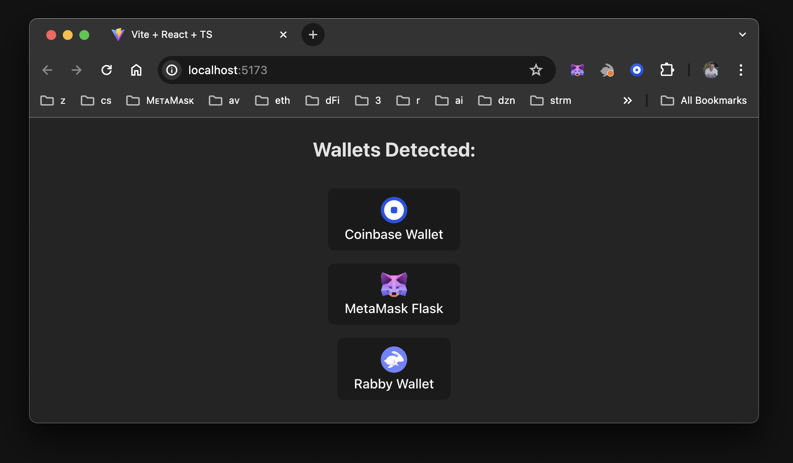
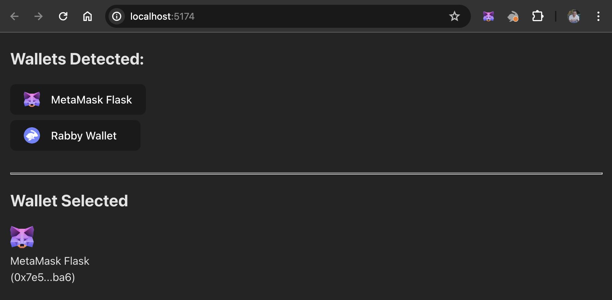

# Create a React dapp with local state

This tutorial walks you through integrating a simple React dapp with MetaMask.
The dapp has a single JSX component, which is used for managing local state.
You'll use the [Vite](https://v3.vitejs.dev/guide) build tool with React and TypeScript to create
the dapp.

:::tip Why React?
React is familiar to most web developers and is standard in web3.
It makes it easy to work with state management, build components that use a one-way data flow, and
re-render those components upon state changes.
:::

:::info Project source code
You can view the [dapp source code on GitHub](https://github.com/MetaMask/vite-react-local-tutorial).
:::

## Prerequisites

- [Node.js](https://nodejs.org/) version 18+
- [npm](https://docs.npmjs.com/downloading-and-installing-node-js-and-npm) version 9+
- A text editor (for example, [VS Code](https://code.visualstudio.com/))
- The [MetaMask extension](https://metamask.io/download) installed
- Basic knowledge of TypeScript and React

## Steps

### 1. Set up the project

Set up a new project using Vite, React, and TypeScript by running the following command:

```bash
npm create vite@latest vite-react-local-state -- --template react-ts
```

Install the node module dependencies:

```bash
cd vite-react-local-state && npm install
```

Launch the development server:

```bash
npm run dev
```

This displays a `localhost` URL in your terminal, where you can view the dapp in your browser.

:::note
If you use VS Code, you can run the command `code .` to open the project.
If the development server has stopped, you can run the command `npx vite` or `npm run dev` to
restart your project.
:::

Open the project in your editor.
To start with a blank slate, replace the code in `src/App.tsx` with the following:

```tsx title="App.tsx"
import "./App.css"

const App = () => {
  return (
    <div className="App">
      <h2>Wallets Detected:</h2>
    </div>
  )
}

export default App
```

### 2. Import EIP-6963 interfaces

The dapp will connect to MetaMask using the mechanism introduced by
[EIP-6963](https://eips.ethereum.org/EIPS/eip-6963).

:::info Why EIP-6963?
[EIP-6963](https://eips.ethereum.org/EIPS/eip-6963) introduces an alternative wallet detection
mechanism to the `window.ethereum` injected provider.
This alternative mechanism enables dapps to support
[wallet interoperability](../concepts/wallet-interoperability.md) by discovering multiple injected
wallet providers in a user's browser.
:::

Update the Vite environment variable file, `src/vite-env.d.ts`, with the types and interfaces
needed for [EIP-6963](https://eips.ethereum.org/EIPS/eip-6963) and
[EIP-1193](https://eips.ethereum.org/EIPS/eip-1193):

```tsx title="vite-env.d.ts"
/// <reference types="vite/client" />

// Describes metadata related to a provider based on EIP-6963.
interface EIP6963ProviderInfo {
  walletId: string
  uuid: string
  name: string
  icon: string
}

// Represents the structure of a provider based on EIP-1193.
interface EIP1193Provider {
  isStatus?: boolean
  host?: string
  path?: string
  sendAsync?: (
    request: { method: string; params?: Array<unknown> },
    callback: (error: Error | null, response: unknown) => void
  ) => void
  send?: (
    request: { method: string; params?: Array<unknown> },
    callback: (error: Error | null, response: unknown) => void
  ) => void
  request: (request: {
    method: string
    params?: Array<unknown>
  }) => Promise<unknown>
}

// Combines the provider's metadata with an actual provider object, creating a complete picture of a
// wallet provider at a glance.
interface EIP6963ProviderDetail {
  info: EIP6963ProviderInfo
  provider: EIP1193Provider
}

// Represents the structure of an event dispatched by a wallet to announce its presence based on EIP-6963.
type EIP6963AnnounceProviderEvent = {
  detail: {
    info: EIP6963ProviderInfo
    provider: EIP1193Provider
  }
}

// An error object with optional properties, commonly encountered when handling eth_requestAccounts errors.
interface MMError {
  code?: string
  message?: string
}
```

### 3. Create store file

Create a store file to manage the state of the detected wallet providers.
This file provides a centralized place to store and synchronize the detected wallet providers,
ensuring that your dapp always has access to the latest provider information.

Create a `src/hooks` directory, and create a file `store.ts` in that directory with the following code:

```ts title="store.ts"
// Extends WindowEventMap interface, including a custom event eip6963:announceProvider.
declare global {
  interface WindowEventMap {
    "eip6963:announceProvider": CustomEvent
  }
}

// Array that stores detected wallet providers and their details.
let providers: EIP6963ProviderDetail[] = []

// Object containing two methods. The store holds the state of detected Ethereum wallet providers.
// It's implemented as an external store, making it available for subscription and synchronization
// across the dapp.
export const store = {
  // Returns the current state of providers.
  value: () => providers,
  // Subscribes to provider announcements and updates the store accordingly.
  // Takes a callback function to be invoked on each store update, returning a function to
  // unsubscribe from the event.
  subscribe: (callback: () => void) => {
    function onAnnouncement(event: EIP6963AnnounceProviderEvent) {
      if (providers.map((p) => p.info.uuid).includes(event.detail.info.uuid))
        return
      providers = [...providers, event.detail]
      callback()
    }
    window.addEventListener("eip6963:announceProvider", onAnnouncement)
    window.dispatchEvent(new Event("eip6963:requestProvider"))

    return () =>
      window.removeEventListener("eip6963:announceProvider", onAnnouncement)
  },
}
```

### 4. Sync provider state with React component

With the store in place, create a custom hook that synchronizes the provider state with the React component.
Use the [`useSyncExternalStore`](https://react.dev/reference/react/useSyncExternalStore) React hook
to subscribe to changes in the provider store, and to ensure the component re-renders whenever
the store updates.

Create a file `useSyncProviders.ts` in the `hooks` directory with the following code:

```tsx title="useSyncProviders.ts"
import { useSyncExternalStore } from "react"
import { store } from "./store"

export const useSyncProviders = () =>
  useSyncExternalStore(store.subscribe, store.value, store.value)
```

`useSyncExternalStore` takes three arguments:

- A subscription function to listen for changes in the external store (`store.subscribe`).
- A function to get the current value of the store (`store.value`).
- An initial value for the store (`store.value`).

:::note
As an alternative to `useSyncExternalStore`, you can use the `useState` React hook to manage the
provider state, and the `useEffect` React hook to subscribe to changes in the store.
When the React component mounts, you can subscribe to changes in the store, set the initial state
using the current value from the store, and return a cleanup function to unsubscribe from the store
when the component unmounts.
:::

### 5. Create connect buttons

Create an array of buttons that the user can select to connect to the EIP-6963 wallet providers that
you detect.

Update `src/App.tsx` to the following:

```tsx title="App.tsx"
import { useSyncProviders } from "./hooks/useSyncProviders"
import "./App.css"

const App = () => {
  const providers = useSyncProviders()

  const handleConnect = async (providerWithInfo: EIP6963ProviderDetail) => {
    try {
      const accounts = (await providerWithInfo.provider.request({
        method: "eth_requestAccounts",
      })) as string[]
    } catch (error) {
      console.error(error)
    }
  }

  return (
    <div className="App">
      <h2>Wallets Detected:</h2>
      <div className="providers">
        {providers.length > 0 ? (
          providers?.map((provider: EIP6963ProviderDetail) => (
            <button
              key={provider.info.uuid}
              onClick={() => handleConnect(provider)}
            >
              
              <div>{provider.info.name}</div>
            </button>
          ))
        ) : (
          <div>No Announced Wallet Providers</div>
        )}
      </div>
    </div>
  )
}

export default App
```

To style the buttons, update `src/App.css` to the following:

```css title="App.css"
.App {
  min-width: 100vw;
  min-height: 100vh;
  text-align: center;
}

.providers {
  display: flex;
  flex-flow: column wrap;
  justify-content: space-between;
  align-items: center;
  align-content: center;
  gap: 1em;

  padding: 0.6em 1.2em;
}

.providers button {
  width: 12em;
}

.providers button img {
  width: 2em;
}
```

Run `npm run dev` to test the dapp.
Make sure you're signed in to MetaMask and that it's not currently connected to your dapp.
If you have multiple EIP-6963 wallets installed in your browser, something like the following should display:

<p align="center">



</p>

### 6. Show connected wallet address

Indicate when a wallet has been connected to by displaying the user's address on the page.

Update everything above the `return` statement in `src/App.tsx` to the following, which
adds code to format and display user addresses, and handle errors:

```tsx title="App.tsx"
import { useState } from "react"
import { useSyncProviders } from "./hooks/useSyncProviders"
import "./App.css"

const App = () => {
  const [selectedWallet, setSelectedWallet] = useState<EIP6963ProviderDetail>()
  const [userAccount, setUserAccount] = useState<string>("")
  const providers = useSyncProviders()

  const [errorMessage, setErrorMessage] = useState("")
  const clearError = () => setErrorMessage("")
  const setError = (error: string) => setErrorMessage(error)
  const isError = !!errorMessage

  // Display a readable user address.
  const formatAddress = (addr: string) => {
    const upperAfterLastTwo = addr.slice(0, 2) + addr.slice(2)
    return `${upperAfterLastTwo.substring(0, 5)}...${upperAfterLastTwo.substring(39)}`
  }

  const handleConnect = async (providerWithInfo: EIP6963ProviderDetail) => {
    try {
      const accounts = await providerWithInfo.provider.request({
        method: "eth_requestAccounts"
      }) as string[]

      setSelectedWallet(providerWithInfo)
      setUserAccount(accounts?.[0])
    } catch (error) {
      console.error(error)
      const mmError: MMError = error as MMError
      setError(`Code: ${mmError.code} \nError Message: ${mmError.message}`)
    }
  }
  ...
```

Below the `return` statement in `src/App.tsx`, update the `div` with the class of `.App` to the
following:

```tsx title="App.tsx"
  ...
  return (
    <div className="App">
      <h2>Wallets Detected:</h2>
      <div className="providers">
        {
          providers.length > 0 ? providers?.map((provider: EIP6963ProviderDetail) => (
            <button key={provider.info.uuid} onClick={() => handleConnect(provider)} >
              
              <div>{provider.info.name}</div>
            </button>
          )) :
            <div>
              No Announced Wallet Providers
            </div>
        }
      </div>
      <hr />
      <h2>{userAccount ? "" : "No"} Wallet Selected</h2>
      {userAccount &&
        <div className="selectedWallet">
          
          <div>{selectedWallet?.info.name}</div>
          <div>({formatAddress(userAccount)})</div>
        </div>
      }
      <div className="mmError" style={isError ? { backgroundColor: "brown" } : {}}>
        {isError &&
          <div onClick={clearError}>
            <strong>Error:</strong> {errorMessage}
          </div>
        }
      </div>
    </div>
  )
```

Add the following CSS to `src/App.css` to style the error message:

```css title="App.css"
.mmError {
  height: 36px;
  padding: 16px;
  color: #efefef;
  background-color: transparent;
}
```

Your dapp should look similar to the following:

<p align="center">



</p>

## Troubleshoot

#### Doesn't look right?

This tutorial creates `className`s for each section's parent `div` in the JSX (HTML).
If your dapp does not look the same but functions properly, check the naming of your classes and
their corresponding CSS.

#### Doesn't function properly?

Try the following:

- Check the code examples against your own.
- Place `console` statements in key areas such as `handleConnect` and `store`.
- Clone the
  [GitHub repository containing the project source code](https://github.com/MetaMask/vite-react-local-tutorial)
  and run it.

If you find inconsistencies or erroneous code, feel free to create an issue on the repository.

## Next steps

This tutorial walked you through creating a single component dapp using Vite, detecting wallet
providers using EIP-6963, and managing the state in React locally.
You can view the [project source code on GitHub](https://github.com/MetaMask/vite-react-local-tutorial).

As a next step, you can [create a React dapp with global state](react-dapp-global-state.md).
This follow-up tutorial walks you through adding multiple components that use a global state.
You'll use [React's Context API](https://react.dev/reference/react/useContext) to manage the state
globally and move away from using the `useSyncExternalStore`.
This is a more realistic (but also more complex) approach for building a real-world dapp.
